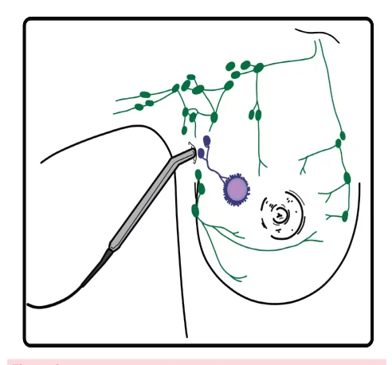
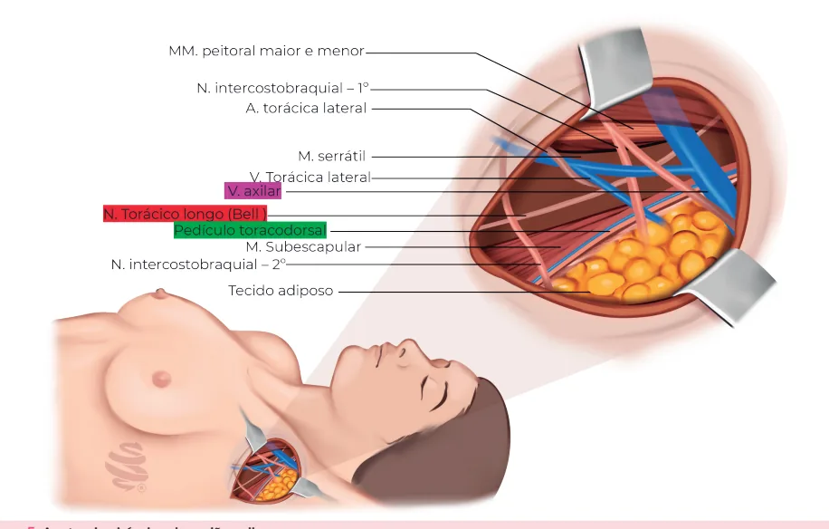
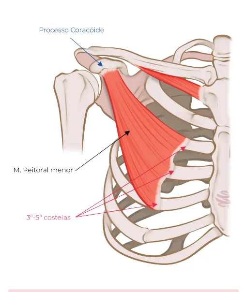
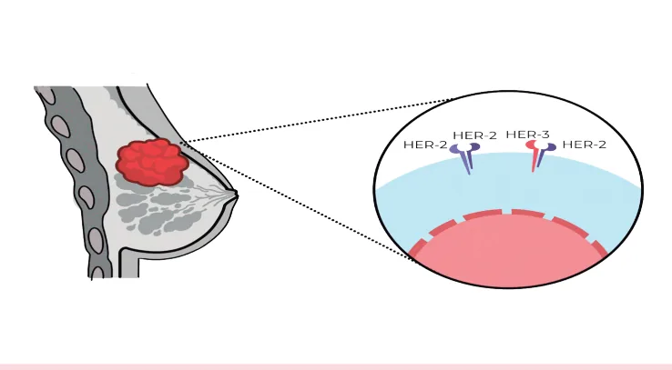
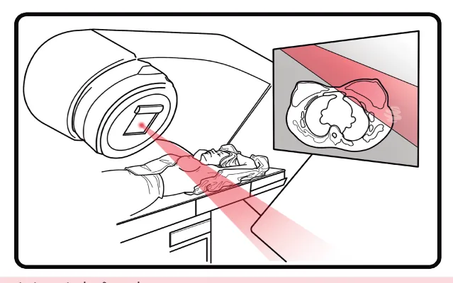

# Câncer de Mama - Doença Invasiva

<!-- page:1 -->

Câncer de mama Câncer de mama invasivo

- Classificação histopatológica:

- M = metástases; Câncer invasivo sem outras especificações

- M0 → Ausência de metástases a distância;

(também chamado de carcinoma ductal invasivo

- M1 → Metástase à distância.

- CDI) - mais comum; Tratamento Câncer lobular invasivo - multicêntrico e bilateral

- Cirurgia: Mama (setor X mastectomia) e

(pedir ressonância magnética). Axila (biópsia de linfonodo sentinela - BLS x

- Classificação imuno-histoquímica: dissecção axilar); Luminal A (RH +, HER2 -, KI67 < 14%);

- Abordagem axilar: Luminal B (RH +, HER2 -, KI67 > 14%); | Clinicamente N0 → biópsia de linfonodo HER 2 (RH -, HER2 +); sentinela: negativo = término da cirurgia; positivo Luminal híbrido (RH +, HER2 +); = dissecção axilar / Amaros Z0011; Triplo negativo (RH -, HER2 -). | Clinicamente N + → dissecção axilar.

Estadiamento (TNM)

- Tratamento Sistêmico (neo ou adjuvante):

- T = tamanho do tumor; | Luminais: hormonioterapia sempre (tamoxifeno

- Tis → Carcinoma ductal in situ; ou Inibidores de aromatase), quimioterapia

- T1 → Tumor ≤ 2 cm; (QT) nos mais avançados (painéis multigênicos

- T2 → Tumor 2-5 cm; ajudam a diminuir indicação QT).

- T3 → Tumor > 5 cm;

- HER 2+:

- T4a → Extensão para parede torácica; | anti HER2 sempre (ex:

- T4b → Edema, ulceração e/ou nódulos cutâneos trastuzumabe/ pertuzumabe);

da pele da mama / Pele em “casca de laranja” | QT (neoadjuvante: se ≥ T2 ou N+; adjuvante: se (“peau d’orange”) que não preenche critério para T1 e N0);

carcinoma inflamatório; | Se ausência de RPC após cirurgia → TDM1.

- T4c → T4a + T4b;

- Triplo Negativo:

- T4d → Carcinoma inflamatório (“casca de laranja”em | Se < 1 cm e N0: cirurgia → QT;

> 1/3 da pele da mama). | Se >1-2cm ou N+: QT neo → cirurgia →

- N = acometimento linfonodal; capecitabina (se ausência RPC);

- N0 → Ausência de metástases em Ln axilar; | OBS: pembrolizumabe neo (estadio II/III).

- N1 → Ln(s) axilar ipsilateral móvel;

- Radioterapia: após setorectomia sempre; após

- N2 → Ln(s) axilar ipsilateral fixo ou coalescentes / mastectomia se T3/T4 ou > linfonodos positivos.

Ln(s) mamário interno ipsilateral (na ausência de acometimento axilar);

- N3 → Ln(s) supra ou infraclavicular ipsilateral /Ln(s) mamário interno ipsilateral + Ln(s) axilar.

## CLASSIFICAÇÃO

- Clássico → menos metástase linfonodal e mais metástase à distância para locais não usuais: TGI,

HISTOPATOLÓGICA ginecológico, leptomeninges e ossos. Carcinoma invasivo sem outras especificações (SOE) Carcinoma tubular (antes chamado de carcinoma ductal invasivo)

- 2% dos casos;

- Tipo histológico mais comum (até 75%);

- Grupo etário mais velho;

- Na maioria das vezes se apresenta como

- Excelente prognóstico.

nódulo espiculado; Carcinoma com achados medulares

- Prognóstico está relacionado com: Grau histológico;

- 1% dos casos;

Tamanho; Linfonodos acometidos; Positividade para

- Circunscrito → pode confundir com tumor benigno;

RH (receptor hormonal) e HER2.

- Receptores hormonais negativos / HER2Carcinoma lobular invasivo (triplo negativo);

- 5% dos casos;

- Melhor prognóstico que SOE.

- Multicentralidade e bilateralidade; Carcinoma mucinoso

- Massa tumoral mal delimitada, irregular;

- 2% dos casos;

- 70-95% → RH+ e HER2-;

- Pacientes mais velhas;

- Clássico X Pleomórfico;

- Maioria receptores de estrogênio positivos;

- Bom prognóstico.

---

<!-- page:2 -->

Tabela 1: Estadiamento do câncer de mama pelo tamanho (T) Tis Carcinoma ductal in situ T1 Tumor ≤ 2 cm T2 T T3 T Extensão T4a indepe Edema, ulceraçã p T4b Pele em “casca que não preenche cr T4c Carcinoma T4d laranja”em Carcinoma metaplásico L

- < 1 % dos casos;

- Metástase via hematogênica;

- Receptores hormonais negativos / HER2 - ;

- Prognóstico ruim.

IMUNO-HISTOQUÍMICA Luminal A

- Muito sensível à hormonioterapia; T

- Melhor prognóstico;

- Mais comum (40%);

- Receptores de estrogênio (RE) / Receptores de progesterona (RP) positivo; H

- HER2: negativo;

- Ki67 < 14%.

Luminal B

- RE positivo;

- RP positivo ou negativo;

- HER2: negativo; C

- Ki67 > 14%.

Tabela 2: Estadiamento do câncer de mama pelo acometimento linfo N0 Ausência de N1 Linfono Linfonodo N2 Linfonodo mamário interno i Linfonodo su N3 Linfonodo mam Tabela 3: Estadiamento do câncer de mama pela presença de metást M0 Ausên M1 Tumor 2-5 cm Tumor > 5 cm o para parede torácica, endente do tamanho ão e/ou nódulos cutâneos da pele da mama de laranja” (“peau d’orange”)

ritério para carcinoma inflamatório T4a + T4b a inflamatório (“casca de m > 1/3 da pele da mama) Luminal híbrido

- RE e RP positivo;

- HER2: positivo Ki67: qualquer (não utilizado para classificar esse grupo).

OBS: sempre que tem “luminal” no nome, é porque o tumor possui receptor hormonal positivo. Triplo negativo

- RE / RP negativo ; HER2 negativo;

- • Ki67 qualquer (não utilizado para classificar esse grupo).

HER2 +:

- RE / RP negativo ; HER2 positivo ;

- •Ki67 qualquer (não utilizado para classificar esse grupo).

## ESTADIAMENTO

## CLASSIFICAÇÃO TNM

- Tamanho (do tumor);

- Linfonodos (acometidos);

- Metástase;

- Verificar Tabelas 1,2 e 3 onodal (N) e metástases em linfonodo axilar odo axilar ipsilateral MÓVEL o axilar ipsilateral FIXO ou Lns ipsilateral (na ausência de acometimento axilar) upra ou infraclavicular ipsilateral mário interno ipsilateral + Linfonodo axilar tase (M) ncia de metástases a distância

Descrição COALESCENTES; Descrição Metástase a distância

---

<!-- page:3 -->

Os sítios de acometimento mais comuns de CIRURGIA AXILAR metástases da mama são o pulmão, os ossos, o fígado

- Inicialmente o tratamento cirúrgico da axila e o sistema nervoso central (SNC). sempre incluía a retirada de todos os Ln axilares, visando tratamento + avaliação prognóstica + guiar

ESTADIAMENTO PROGNÓSTICO decisão terapêutica;

- Leva em consideração o TNM e os seguintes fatores:

- Atualmente em muitos casos isso pode ser obtido Grau histológico; somente com a biópsia do linfonodo sentinela (BLS); Positividade ou não para receptores hormonais (RE

- Linfonodo sentinela (LS) → primeiro linfonodo a drenar e RP) e hiperexpressão de HER2; o fluxo linfático da região tumoral, determinado Resultados de painéis multigênicos. por radioisótopo (tecnécio) ou injeção de corante

(azul patente); PAINÉIS MULTIGÊNICOS | Se o LS estiver acometido, não há garantia de

- Apenas para câncer de mama precoce: que os demais linfonodos não estejam, sendo T1-T2 N0 M0; necessária a dissecção axilar. RH positivo;

- O estudo Amaros/Z0011 advoga sobre não Her2 negativo. fazer a dissecção axilar em LS positivo em

- Downstaging de tumores de biologia favorável; casos selecionados.

- Testes: Oncotype Dx (nível I); Outros: Mammaprint, BCI e EndoPredict.

- Realizados no câncer de mama RH positivo

HER-2 negativo;

## TRATAMENTO

- Baseado em 3 pilares principais:

## | Cirurgia

| Tratamento sistêmico; | Radioterapia.

Tratamento locorregional

- Objetivo: Erradicar localmente as células-tronco iniciadoras do câncer; Fornecer informação complementar para o Figura 2: Pesquisa de linfonodo sentinela para biópsia.

prognóstico, através da peça cirúrgica.

- A cirurgia se divide em abordagem na mama e Abordagem axilar abordagem na axila;

- Clinicamente N0 → biópsia de linfonodo sentinela:

- Abordagem da mama pode ser: negativo = término da cirurgia; positivo = dissecção Conservadora → setorectomia; axilar / Amaros Z0011; Mastectomia clássica: retira tecido glandular, pele e

- Clinicamente N + → dissecção axilar. Mastectomia preservadora de pele: retira tecido glandular e CAP, porém preserva pele, ajudando Clinicamente N0 Clinicamente N+ nas reconstruções; Adenectomia (cirurgia preservadora de CAP): retira apenas o tecido glandular - preserva a pele e o complexo areolopapilar. Biópsia LS Dissecção axilar

complexo areolopapilar (CAP); .

- Abordagem axilar: Biópsia do linfonodo sentinela (BLS); Dissecção axilar preservadora de pele cirurgia axilar

Serectomia Masectomia Amaros/Z0011 Biópsia de LS Masectomia Dissecção axilar Término da Dissecção Adenectomia .

Figura 1: Tratamento cirúrgico do câncer de mama Figura 3: Abordagem axilar no câncer de mama.

---

<!-- page:4 -->

NÍVEIS DE DISSECÇÃO AXILAR Escápula alada

- Peitoral Menor → situa-se profundamente ao m.

- Lesão do nervo torácico longo (nervo de Bell);

peitoral maior;

- Quadro clínico: dor, fraqueza, desconforto, diminuição

- Referência para dividir a axila em 3 níveis de Berg: da mobilidade do ombro ou podem, eventualmente, Nível I: Linfonodos laterais à borda lateral do ser assintomáticos. Nível II: Linfonodos posteriores ao peitoral menor; Nível III: Linfonodos mediais à borda medial do peitoral menor.

peitoral menor;

- 3-5ª costela → processo coracóide da escápula.

Figura 4: Níveis de dissecção axilar. Figura 6: Escápula alada. Figura 5: Anatomia cirúrgica da região axilar.

---

<!-- page:5 -->

Figura 7: Terapia alvo anti Her-2.

## TRATAMENTO SISTÊMICO

- Nos tumores T1a/bN0 (iniciais) podem começar com a cirurgia upfront, seguida de terapia adjuvante (terapia

- Quimioterapia; anti-HER2 associada à QT);

- Hormonioterapia;

- Nos tumores ≥ T2 e/ou N+: Começa com QT neo

- Terapia anti Her-2; + anti-HER2 (o Trastuzumabe associado ou não

- Outros (ex. Imunoterapia). ao Pertuzumabe);

Neoadjuvante | Quando Trastuzumabe e Pertuzumabe estão

- Redução do volume tumoral; associados, chama-se duplo bloqueio.

- Resposta tumoral in vivo; Posteriormente, realiza-se cirurgia e análise da

- Aumentar a chance de cirurgia conservadora; peça cirúrgica;

- Tratamento de micrometástases subclínicas; | Se houver doença residual, relata-se que não foi

- Guiar a adjuvância. obtida uma Resposta Patológica Completa (RPC);

Adjuvante | Na ausência de RPC, pode-se associar o TDM1 (14

- Sua vantagem está na possibilidade de controlar ciclos), adjuvante.

doença microscópica circulante e diminuir recidiva

- As drogas anti-HER2 mudam positivamente o local e a distância. desfecho, mas a desigualdade de acesso às opções terapêuticas ainda é um problema que impacta no

TUMORES LUMINAIS prognóstico, infelizmente.

- Quimioterapia (QT): painéis multigênicos podem

- Verificar Figura 7 reduzir indicação de QT;

- Hormonioterapia (HT): sempre indicada no tratamento TUMOR TRIPLO NEGATIVO de tumores luminais. Pode ser realizado a partir de:

- Maior incidência em: Inibidor de aromatase (Anastrozol, Letrozol | < 40 anos; Tamoxifeno → utilizado na pré ou pós-menopausa. | BRCA 1 ou 2 positivo.

e Exemestano) → utilizados apenas na | Pré-menopausa; pós-menopausa; | Ascendência africana;

- Opções mais recentes:

- Piores desfechos; Olaparib (estudo OlympiA) → mutação BRCA e

- Quimioterapia (basicamente a única opção alto risco; terapêutica a oferecer): Abemaciclibe (estudo monarchE) → pacientes de | < 1 cm → cirurgia seguida de QT adjuvante;

alto risco. Tumores HER2+ (17% dos tumores). | > 1 - 2 cm → começa com QT neoadjuvante (opção mais recente é associar pembrolizumabe à QT TUMORES HER-2 POSITIVOS em regime neoadjuvante em tumores estádio II/

- Quimioterapia; III - não disponível no SUS) → em seguida, realiza-se

- Terapia anti-HER2 (todos recebem independente a cirurgia. Ausência de RPC: Iniciar Capecitabina do estadiamento): (estudo CREATE-X), quando disponível, em regime Trastuzumabe; adjuvante; (costuma não estar disponível no SUS Pertuzumabe; com essa finalidade). Se BRCA → iniciar Olaparibe T-DM1; (OlympiA) em regime adjuvante (não disponível TDx; no SUS). Lapatinibe; Tucatinibe.

---

<!-- page:6 -->

Figura 8: Radioterapia no tratamento do câncer de mama RADIOTERAPIA (RT)

- Indicações: A Sempre indicada após cirurgia conservadora; Após mastectomia → T3/T4 ou > Ln positivo; R Metastático: alívio de sintomas, controle de C progressão de doença local ou oligometastática.

- Verificar Figura 8 A

## REFERÊNCIAS

Figura 1: Tratamento cirúrgico do câncer de mama Acervo de imagens Medcof. Figura 2: Pesquisa de linfonodo sentinela para biópsia.

Acervo de imagens Medcof. Figura 3: Abordagem axilar no câncer de mama. Acervo de imagens Medcof. Figura 4: Níveis de dissecção axilar.

Acervo de imagens Medcof. Figura 5: Anatomia cirúrgica da região axilar. Acervo de imagens Medcof. Figura 6: Escápula alada.

REVISTA BRASILEIRA DE CANCEROLOGIA. 2009. Revista Brasileira de Cancerologia, v. 55, n. 4, p. 397-404, 2009.

Figura 7: Terapia alvo anti Her-2. Acervo de imagens Medcof. Figura 8: Radioterapia no tratamento do câncer de mama.

Acervo de imagens Medcof. Tabela 1: Estadiamento do câncer de mama pelo tamanho (T). Tabela 2: Estadiamento do câncer de mama pelo acometimento linfonodal (N).

Tabela 3: Estadiamento do câncer de mama pela presença de metástase (M).

