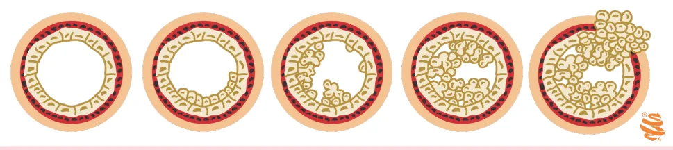
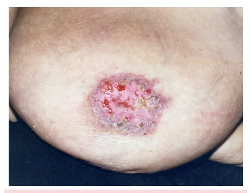

# Câncer de Mama - Fatores de Risco e CDIS

<!-- page:1 -->

## CÂNCER DE MAMA - FATORES DE

## RISCO E CDIS

Carcinoma ductal in situ da mama Carcinoma lobular in situ da m

## FATORES DE RISCO

- Idade, sexo feminino;

- Menarca precoce, menopausa tardia, nuliparidade ou 1° parto após os 35 anos, ausência de lactação e uso de terapia hormonal (TH);

- Familiar 1° grau com câncer de mama, câncer de mama na pré-menopausa, casos de câncer de mama no sexo masculino e câncer de ovário;

- Origem judaica Asquenazi;

- Lesões proliferativas de alto risco (HDA, HLA,

CLIS, CDIS);

- Síndrome metabólica, obesidade, sedentarismo e ingestão de álcool.

## CARCINOMA DUCTAL IN SITU (CDIS)

- Proliferação de células neoplásicas dentro dos ductos sem que haja ruptura da membrana basal;

- Tratamento: Cirurgia (setorectomia ou mastectomia) → biópsia de linfonodo sentinela (BLS) só se mastectomia: considerar se lesão palpável, maior do que 4 cm ou comedonecrose;

## SEXO E IDADE

- Sexo feminino é o principal fator de risco;

- Idade → o aumento da idade está associado a um aumento do risco de câncer de mama.

## FATORES HORMONAIS

- Menarca precoce;

- Menopausa tardia;

- Nuliparidade ou primeiro parto após os 35 anos;

- Ausência de lactação;

- Terapia hormonal (TH).

## HEREDITARIEDADE

- Mãe ou irmã com câncer de mama, isto é, principalmente parentes de primeiro grau;

- Câncer de mama na pré-menopausa;

- Casos de câncer de mama em familiares do sexo masculino;

- Câncer de ovário.

## OUTROS

- Origem judaica Asquenazi;

- Lesões proliferativas de alto risco (lesões precursoras);

- Síndrome Metabólica e Obesidade;

- Sedentarismo (atividade física regular diminui o risco de câncer de mama);

- Ingestão alcoólica. mama Radioterapia (se setorectomia); Hormonioterapia (se houver receptores hormonais positivos): tamoxifeno ou inibidores de aromatase (anastrozol ou letrozol) por 5 anos.

## PAGET

- Quadro clínico: prurido, eczema e crosta ou ulceração no mamilo;

- Está muito associado a carcinoma ductal in situ

(CDIS) ou carcinoma invasor (82-94%);

- Maior tendência a GH elevado, receptores hormonais (RH) negativos e HER2 +;

- Diagnóstico: Biópsia com estudo anatomopatológico (punch ou core biopsy); Mamografia (MMG) + ultrassonografia (USG).

- Tratamento: Exérese da lesão com margem → setor central ou mastectomia; Terapia adjuvante → depende da associação r com carcinoma ductal in situ ou invasivo.

Tabela 1: Lesões proliferativas de alto risco para câncer de mama RR Hiperplasia ductal atípica 4 - 5x Hiperplasia lobular atípica 4 - 5x Carcinoma lobular in situ 8 - 10x

## CARCINOMA DUCTAL IN SITU

## (CDIS)

- Proliferação de células neoplásicas dentro dos ductos, sem ruptura da membrana basal;

- Faz parte das lesões precursoras do câncer de mama;

- Alteração histológica semelhante a da hiperplasia ductal atípica, porém em maior extensão.

POR QUE TRATAR?

- É uma lesão precursora → 14-46% evoluem para câncer de mama em 10 anos, se não tratados;

- Tem risco de subestimação de até 20% (na biópsia era CDIS, mas após retirada da lesão na realidade era

; um carcinoma invasivo);

- Risco de recidiva local, sendo que em 30-50% das recidivas são na forma de tumores invasores.

---

<!-- page:2 -->

Figura 1: Progressão das lesões proliferativas levando ao carcinoma in DIAGNÓSTICO

- Maioria diagnosticada nos exames de rastreamento;

- A principal apresentação é na forma de microcalcificações irregulares.

Preditores de lesão invasora

- Comedonecrose;

- Lesão palpável;

- Microcalcificações extensas (maiores do que 4 cm).

## TRATAMENTO

Cirurgia

- Setorectomia ou mastectomia: Margem ≥ 2mm.

- Biópsia do linfonodo sentinela: Não é recomendada de rotina; Considerar nas pacientes de alto risco de subestimação (não é consenso); Realizar nas pacientes submetidas a mastectomia.

Radioterapia

- Reduz em 50% as recidivas locais;

- Realizada após a cirurgia apenas nas pacientes D submetidas a setorectomia; não é necessária nas pacientes submetidas a mastectomia.

Hormonioterapia

- Para casos com receptor de estrogênio ou progesterona positivo; T

- Tamoxifeno ou inibidores de aromatase;

- Tratamento padrão de 5 anos;

- Reduz recidiva local e contralateral;

- Verificar Figura 1 .

## DOENÇA DE PAGET

- Representa 1-3% das neoplasias malignas de mama.

## QUADRO CLÍNICO

- Prurido e eczema no mamilo; A

- Crosta → ulceração; [ b

- Fluxo mamilar;

- Associado a carcinoma invasor e CDIS em 82-94%;

A nvasor.

- Maior tendência de ter grau histológico elevado, se receptor hormonal negativo e HER2 positivo;

- Pode ter nódulo associado em mais de 50% dos casos.

Figura 2: Lesão em mama sugestiva de doença de Paget. DIAGNÓSTICO

- Biópsia com estudo anatomopatológico (punch ou core biopsy);

- Mamografia + ultrassonografia de mamas.

- Retirada da lesão com margem (setor central ou mastectomia);

- Terapia adjuvante: depende da associação com carcinoma ductal invasivo (CDI) ou carcinoma ductal in situ (CDIS).

## REFERÊNCIAS

Figura 1: Progressão das lesões proliferativas levando ao carcinoma invasor. Adaptado de RSNA. Interpretação de imagem: aula RSNA 2017.

[S.l.]: BBCS, 2017. Disponível em: https://bbcs.org.br/uploads/aulas/ ba95712f03017f09d9ea976f6867e3b1.pdf.

Figura 2: Lesão em mama sugestiva de doença de Paget. Acervo próprio da autoria.

