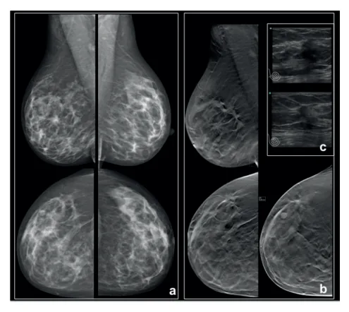

# Câncer de Mama - Rastreamento

<!-- page:1 -->

Screening população geral para câncer de mama População geral

- CBR, SBM, FEBRASGO: Mulheres > 40 anos → MMG anual; Término → expectativa de vida < 7 anos.

- Ministério da Saúde e INCA Mulheres entre 50 – 74 anos → MMG a cada 2 anos (pode iniciar com 40 anos, se necessário).

População de alto risco

- Quem são? Alto risco histopatológico (H. ductal atípica, H. Portadoras da mutação BRCA 1 ou 2, TP53 e suas parentes de 1° grau não testadas; Risco vitalício de câncer de mama ≥ 20%;

lobular atípica, CLIS, CDIS);

## RASTREAMENTO

## CÂNCER DE MAMA

- Tumor que possui maior incidência e a maior mortalidade na população feminina em todo o mundo;

- O tamanho do tumor e as condições dos linfonodos regionais são fatores prognósticos de grande importância;

- O diagnóstico precoce aumenta as chances de cirurgia conservadora e reduz a necessidade de QT e dissecção axilar.

## MÉTODOS DE RASTREAMENTO

Autoexame

- Não é recomendado como forma de rastreamento, pois não é capaz de promover o diagnóstico precoce e reduzir a mortalidade por câncer de mama.

Mamografia

- Método de escolha para rastreamento (associação com a tomossíntese, quando disponível); Na tomossíntese a mama também fica comprimida entre as placas do aparelho, assim como na MMG.

Porém, ao contrário da MMG em que obtemos apenas uma imagem para cada incidência, na tomossíntese múltiplas imagens em várias angulações são obtidas em uma única compressão da mama;

- A mortalidade por câncer de mama pode ser reduzida pela utilização de programas com rastreamento mamográfico.

- Verificar Figura 1 na próxima página

QUANDO INICIAR O RASTREAMENTO NA POPULAÇÃO GERAL?

- No Brasil, temos 2 recomendações sobre quando devemos iniciar o rastreamento para o câncer de mama na população geral: Início aos 40 anos (recomendação da SBM, Início aos 50 anos (Ministério da saúde): passou a permitir iniciar aos 40 anos, se necessário. | Irradiação do tórax entre 10 – 30 anos; Mutações dos genes PTEN, CDH1, ATM, CHEK2.

FEBRASGO e CBR); Medidas redutoras de risco

- Quimioprevenção: Tamoxifeno, Raloxifeno, Anastrozol ou Exemestano; Indicações: Pacientes de alto risco, Antecedente de lesão de alto risco (hiperplasia com atipia, CLIS) .

- Mastectomia redutora de risco: Principalmente BRCA1, BRCA2, TP53 (nas outras mutações considerar história familiar).

- Salpingooforectomia redutora de risco: BRCA1 e BRCA2.

Tabela 1: Prós e contras da idade de início do rastreamento. “Prós” “Contras” ;

- O início do rastreamento aos 40 anos reduz em positivo de 4,8% para 7%)

25% a mortalidade em Falso Positivos 10 anos por câncer (aumenta o falsode mama;

- No Brasil, 41,1%

- Sobrediagnóstico das mulheres com

- “Risco da radiação diagnóstico de câncer ionizante” da mama têm menos de 50 anos (Estudo e

AMAZONA) Mulheres < 40 anos

- Não é recomendado o rastreamento de rotina câncer de mama com mamografia;

- Incidência do câncer de mama em mulheres em < 40 anos → 7% dos casos, no Brasil 17% (AMAZONA III);

- Avaliação do risco de câncer de mama para todas as s mulheres acima de 30 anos (modelos matemáticos) → estratificação do risco → rastreamento diferenciado se alto risco.

RECOMENDAÇÕES PARA O RASTREAMENTO NO BRASIL (COLÉGIO BRASILEIRO DE RADIOLOGIA E DIAGNÓSTICO POR IMAGEM, DA SOCIEDADE BRASILEIRA DE MASTOLOGIA E

## DA FEBRASGO 2023)

Mulheres 40 - 74 anos

- Mamografia (MMG) - todas as mulheres, com periodicidade anual;

- Ultrassonografia (USG) - não recomendada para rastreamento;

- Ressonância magnética de mama (RNM) - Mulheres com alto risco para câncer de mama.

---

<!-- page:2 -->

Mulheres < 40 anos Tabela 2: Rastreamento de câncer de mama

- Mamografia (MMG) - não é recomendada a realização de rastreamento de rotina;

Entidade Início Intervalo Término

- Ressonância magnética de mamas (RNM) - Mulheres com alto risco para câncer de mama. CBR; SBM;

Expectativa com alto risco para câncer de mama. Quando parar o rastreamento?

- A partir dos 75 anos, recomenda-se continuar o rastreamento se não houver comorbidades que reduzam a expectativa de vida e que essa seja de pelo menos sete anos.

Ultrassonografia

- Não se recomenda a USG como rastreamento suplementar ou como método isolado para mulheres com risco habitual;

- O uso da US é considerado em situações específicas de maior risco (mamas densas, risco intermediário e alto risco).

Ampola de Raios-X Raios-X Placa de Compressão Mama Detector p d o m

- Figura 1: Tomossíntese mamária.

## RECOMENDAÇÕES PARA O RASTREAMENTO

NO BRASIL (MINISTÉRIO DA SAÚDE E INCA) A Mulheres < 49 anos L

- Não rastrear de rotina, só se demanda ou maior risco.

- Mulheres 50-74 anos

- Mamografia a cada 2 anos. L

Mulheres > 74 anos

- Não recomenda rastreamento. CBR; SBM; 40 anos Anual de vida de 7 anos deve ser individualizada limite expectativa de vida

FEBRASGO 50 anos Entre 40-49 UPSTF anos decisão Bienal 74 anos Sem data ACR; SBI 40 anos Anual Considerar 75 anos;

Anual ou após decisão ACOG 40 anos Bienal deve ser compartilhada < 54 anos 45 anos (pode Anual Expectativa ACS começar ≥ 55 de vida de 10 aos 40 anos) anos - anos Bienal ou anual Siglas presentes na tabela:

CBR: Colégio Brasileiro de Radiologia e diagnóstico por imagem; SBM: Sociedade Brasileira de Mastologia;

FEBRASGO: Federação Brasileira das Associações de Ginecologia e Obstetrícia; UPSTF: United States Preventive Services Task Force; ACR: American College of Radiology; SBI: Society of Breast Imaging; ACOG:

American College of Obstetricians and Gynecologists e ACS: American Cancer society. Tabela adaptada de: Frasson, AL et al. Doenças da mama: guia de bolso baseado em evidências. 2 ed. Rio de Janeiro: Atheneu, 2018.

## POPULAÇÃO DE ALTO RISCO

- 75-80% dos cânceres de mama ocorrem em mulheres sem fator de risco;

- 10% dos tumores são hereditários;

- 10-15% possuem história familiar positiva (familiar).

ALTO RISCO HISTOPATOLÓGICO Lesões precursoras do câncer de mama

- Associadas com a transformação local para carcinoma.

Lesões marcadoras de alto risco

- Associada à probabilidade aumentada de surgimento de câncer no mesmo órgão ou contralateral.

---

<!-- page:3 -->

Tabela 3: Aumento do risco de câncer associado Familiares a lesões precursoras.

- Alertar os membros da família para realizar o teste.

RR

## EM QUEM PESQUISARSÍNDROMES GENÉTICAS?

Pacientes com câncer Hiperplasia ductal atípica 4-5x Hiperplasia lobular 4-5x atípica Carcinoma lobular in situ 8-10x ALTO RISCO FAMILIAR

- 75-80% dos cânceres de mama ocorrem em mulheres sem fator de risco;

- 10% dos tumores são hereditários;

- 10-15% possuem história familiar positiva;

- Portadoras de mutação BRCA 1 ou 2 e suas parentes de primeiro grau não testadas;

- Risco de câncer de mama ≥ 20%;

- Antecedente de irradiação do tórax entre 10-30 anos;

- Portadoras de síndromes genéticas.

- Verificar Tabela 4

POR QUE PESQUISAR SÍNDROMES GENÉTICAS? Pacientes assintomáticos

- Modifica o rastreamento;

- Permite opções para redução de risco de câncer.

Pacientes com câncer

- Possibilita discutir as opções de cirurgias e tratamento;

- Redução de risco de outros cânceres.

Tabela 4: Síndromes genéticas associadas ao câncer de mama. SÍNDROME GENE RISC HBOC BRCA1 HBOC BRCA2 Li-Fraumeni p53 Cowden PTEN Peutz-Jeghers STK11/LKB1 Carcinoma gástrico CDH10 difuso hereditário Ataxia-telengectasia ATM Variante Li-Fraumeni CHEK2 Pacientes com câncer

- Idade < 50 anos;

- Qualquer idade se: Triplo negativo; Múltiplos tumores na mama; Para ajudar tratamento sistêmico (iPARP/Olaparib); Masculino; Câncer de mama lobular + história pessoal ou familiar de Ca gástrico difuso Ancestralidade judaica Ashkenazi; História familiar: 1 ou + familiares (até 3o grau) com câncer de mama → 50 anos OU câncer de mama masculino OU ovário OU próstata (metastático, alto ou muito alto risco) OU 3 ou + familiares com câncer de mama ou próstata.

Pessoas com história pessoal de câncer de mama ou com história familiar de câncer de mama em parente de 1o ou 20 grau com qualquer um dos critérios abaixo:

- 1 ou + parentes de 1°, 2° ou 3° grau do mesmo lado da Câncer de mama ≤ 50 anos ou; Câncer de mama no sexo masculino ou; Câncer de ovário ou; Câncer de pâncreas ou; Câncer de próstata metastático ou grupo de alto ou muito alto risco.

? família com: CO AOS 70 ANOS TUMORES ASSOCIADOS 55% Ovário e pâncreas 47% Ovário, próstata e pâncreas Sarcoma de partes moles,

> 90% osteossarcoma, SNC, adrenal, leucemia e cólon cordões sexuais

25-50% Tireóide, endométrio e genitourinário Intestino, útero, testículo, 45-54% 39% CLI e carcinoma gástrico difuso RR: 3-4X não definido RR: 2X não definido

---

<!-- page:4 -->

## RASTREAMENTO NA POPULAÇÃO DE ALTO RISCO

Tabela 5: Rastreamento de alto risco. Fator de Risco MMG RNM Risco < 15%: MMG ≥ 40a Risco < 15%: Risco 15-20%: MMG ≥ 40a (+ USG) Risco 15-20%: HDA, HLA, CLIS Risco ≥ 20% : MMG no diagnóstico Risco ≥ 20% : RNM no diagnóstico ( ≥ 30 anos) ( ≥ 25 anos)

RDT tórax (< 30 após 8 anos da RDT (> 30 anos) após 8 anos da RDT (> 25 anos) anos) 10 anos após o parente mais jovem 10 anos após o parente mais jovem Risco ≥ 20% (> 30 anos) (> 30 anos)

BRCA1* MMG no diagnóstico ( ≥ 30-35 anos) RNM no diagnóstico ( ≥ 25 anos) TP53* MMG no diagnóstico ( ≥ 30 anos) RNM no diagnóstico ( ≥ 20 anos)

BRCA2 e outros MMG no diagnóstico ( ≥ 30 anos) RNM no diagnóstico ( ≥ 30 anos) genes* História pessoal de HLA, CLIS ou HDA testadas mas com parentes de 1° grau portadoras

- Calcular o risco para câncer de mama: → MMG a partir do diagnóstico da mutação (não Risco < 15% (risco habitual) - rastreamento com antes dos 30 anos); Risco 15-20% (risco intermediário): MMG anual antes da idade do diagnóstico do parente mais a partir dos 40 anos. Considerar USG como jovem (não antes dos 30 anos).

MMG a partir dos 40 anos; | Mulheres com risco ≥ 20% → MMG iniciando 10 anos adjunta a MMG;

- RNM anual; Risco > 20% (alto risco) -MMG anual a partir do | Mutação do gene BRCA 1 ou não testadas mas com diagnóstico (não antes dos 30 anos) + RNM anual parentes de 1° grau portadoras→ RNM a partir do Mutação gene TP53 ou não testadas mas com

(não antes dos 25 anos). diagnóstico da mutação (não antes dos 25 anos); Risco ≥ 20%: alto risco (MMG + RNM) parentes de 1° grau portadoras, →RNM a partir do Risco 15-20%: risco intermediário diagnóstico da mutação (não antes dos 20 anos);

Risco < 15%: risco habitual | Mutação patogênica BRCA2 ou outros genes de moderado ou alto risco para câncer de mama, além História pessoal de radioterapia torácica das não testadas mas com parentes de 1° grau

- Mamografia anual; portadoras → RNM anual a partir do diagnóstico da Mulheres com história de irradiação no tórax antes mutação (não antes dos 30 anos);

dos 30 anos → MMG anual a partir do 8° ano após o | Mulheres com risco ≥ 20% → RNM anual iniciando tratamento (não antes dos 30 anos). 10 anos antes da idade do diagnóstico do parente

- RNM anual; mais jovem (não antes dos 30 anos). Mulheres com história de irradiação no tórax antes Rastreamento no BRCA dos 30 anos → RNM anual a partir do 8° ano após o

- Autoexame da mama a partir de 18 anos, mensalmente;

tratamento (não antes dos 25 anos).

- Exame clínico da mama a cada 6 a 12 meses, de início história familiar de câncer de mama (risco ≥ 20%)

Mulheres portadoras de mutação genética ou com forte aos 25 anos;

- RNM das mamas entre as idades de 25 a 75 anos;

- Mamografia anual;

- MMG anual a partir dos 30 anos; Mutação do gene BRCA 1 ou não testadas mas com

- Avaliação de quimioprevenção e mastectomia parentes de 1° grau portadoras → MMG a partir do redutora de risco;

diagnóstico da mutação (não antes dos 35 anos);

- Salpingooforectomia redutora de risco idealmente Mutação do gene TP53 ou não testadas mas com entre 35 e 40 anos (BRCA1) e entre 40 e 45 anos parentes de 1° grau portadoras, → MMG a partir do (BRCA 2) e quando tem prole constituída; (vigilância diagnóstico da mutação (não antes dos 30 anos); câncer de ovário: considerar USG transvaginal Mutação BRCA 2 ou outros genes de moderado e CA-125, a partir dos 30 anos enquanto não ou alto risco para câncer de mama, além das não fizer cirurgia.)

---

<!-- page:5 -->

## MEDIDAS REDUTORAS DE RISCO

## QUIMIOPREVENÇÃO

- Antecedente de lesão de alto risco (hiperplasia com

- Tamoxifeno; atipia, CLIS);

- Raloxifeno (pós-menopausa);

- BRCA controverso.

- Raloxifeno (pós-menopausa);

- Anastrozol ou Exemestano (pós-menopausa).

Indicações

- Pacientes de alto risco;

Tabela 6: Recomendação para cirurgias redutoras de risco. SD GENÉT

## RISCO VITALÍCIO PARA

## GENE NEOPLASIAS

AS Genes de A BRCA1 60% * 70% ovário, p ovário, pr BRCA2 55% - 70% m CDH1 40% - 55% Gás Anemia Fanc PALB2 35% - 60% PTEN 50% - 85% S TP53 54% - 90% Sd STK11 45% - 50% Sd P Genes de Mod ATM 25% - 40% Sd Ataxia CHECK2 27% - 35%

## REFERÊNCIAS

Figura 1: Tomossíntese mamária. VILAVERDE, M. et al. Tomossíntese mamária: o que o radiologista deve saber. Acta Radiológica Portuguesa, [S.l.], 2016.

Tabela 1: Prós e contras da idade de início do rastreamento. Tabela 2: Rastreamento de câncer de mama. Tabela adaptada de: Frasson, AL et al. Doenças da mama: guia de bolso baseado em evidências. 2 ed. Rio de Janeiro: Atheneu, 2018. - BRCA controverso.

## CIRURGIAS REDUTORAS DE RISCO

- Mastectomia redutora de risco (MBRR);

- Salpingooforectomia (SOB) redutora de risco (no BRCA).

TICAS OU OUTRAS S MAIS FREQUENTES RECOMENDAÇÃO DE CIRURGIA SSOCIADAS Alta Penetrância próstata, pâncreas Considerar MBRR e SOB róstata, pâncreas, Considerar MBRR e SOB melanoma Evidências insuficientes, strico difuso basear na HF coni, tumores sólidos, Evidências insuficientes, leucemia basear na HF Evidências insuficientes, Sd Cowden basear na HF Li-Fraumeni Considerar MBRR Evidências insuficientes, Peutz-Jeghers basear na HF derada Penetrância Evidências insuficientes, a-teleangiectasia basear na HF Evidências insuficientes, basear na HF Tabela 3: Aumento do risco de câncer associado a lesões precursoras.

Tabela 4: Síndromes genéticas associadas ao câncer de mama. Tabela 5: Rastreamento de alto risco. Tabela 6: Recomendação para cirurgias redutoras de risco.
