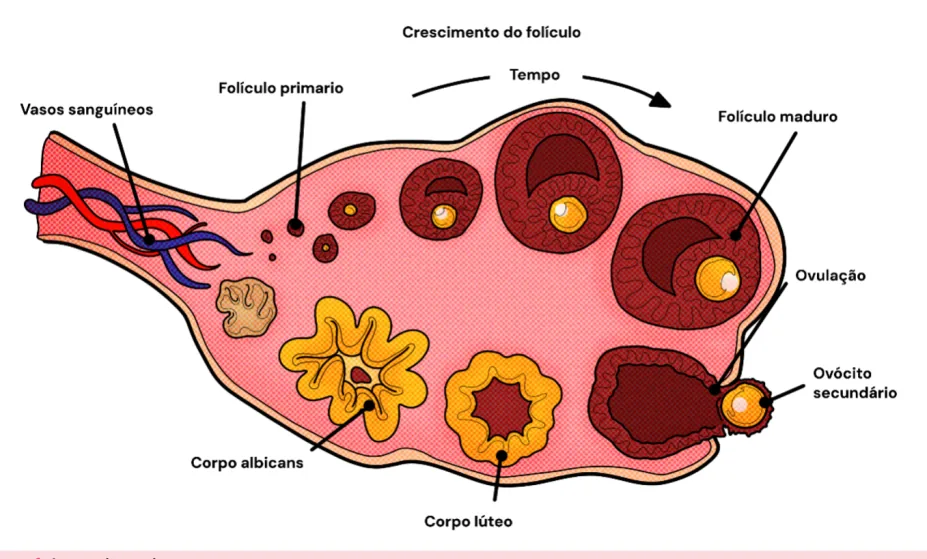
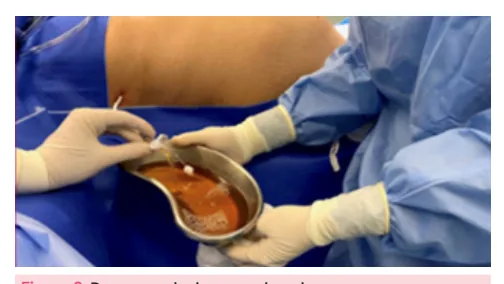
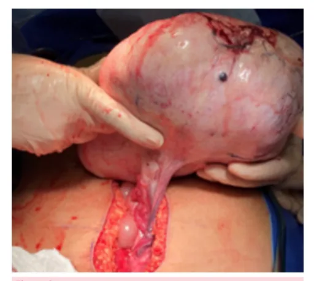
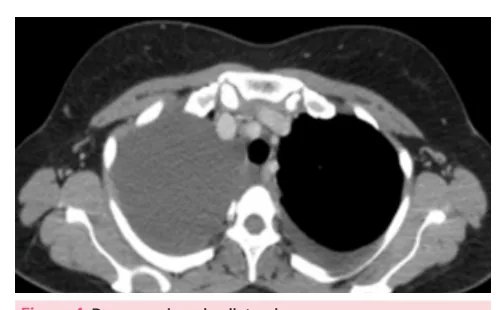
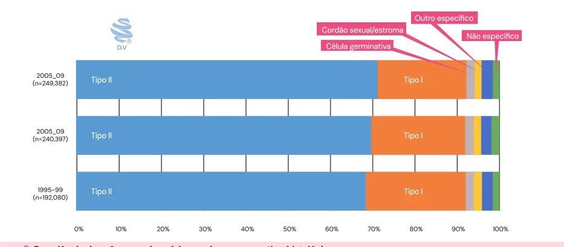
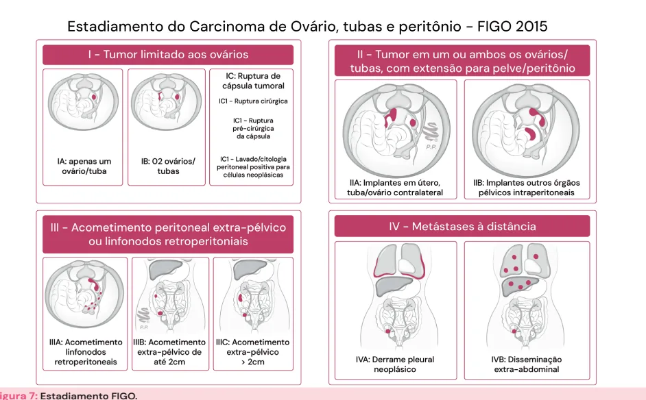

# Câncer de Ovário

<!-- page:1 -->

- Tipo histológico mais comum: Adenocarcinoma

- Tratamento: cirurgia primária se doença seroso de alto grau; ressecável e status performance bom →

- Adolescentes/mulheres jovens: Disgerminoma; quimioterapia adjuvante;

- Doença oligossintomática – diagnóstico tardio na

- Quimioterapia neoadjuvante se doença extramaioria dos casos; abdominal, metastática ou paciente não tolerar

- Não existe rastreamento de rotina; cirurgia primária.

- Estadiamento é cirúrgico;

Figura 1: Anatomia ovariana.

## INTRODUÇÃO

- Exame físico: abdome volumoso, massa anexial palpável, fixa, endurecida, bilateral, ascite,

- O ovário apresenta três linhagens celulares: palpação de nódulos em fundo de saco posterior epitelial; (carcinomatose peritoneal) estromal;

- Origem: tubas e peritônio. germinativa. Síndrome de Meigs

- As lesões ovarianas podem se originar do epitélio,

- Parece, mas não é câncer! estroma ou de células germinativas e podem se

- Quadro clínico: Benigno: não provocam metástases; | Derrame pleural; Borderline: proliferação epitelial atípica (maior | Tumor ovariano sólido benigno (fibroma).

comportar de forma benigna, borderline ou maligna: | Ascite; que nos tumores benignos), mas sem destruição estromal invasiva;

| Maligno baixo ou alto grau.

- Verificar Figura 1

## SINTOMAS

- Diagnóstico tardio – oligossintomático;

- Queixas: sintomas gastrointestinais (sensação de plenitude gástrica, dispepsia, constipação intestinal), aumento do volume abdominal, perda de peso, dispneia, edema de membros inferiores; Figura 2: Drenagem de derrame pleural

---

<!-- page:2 -->

- Maior incidência de malignidade: pré-menarca e pós-menopausa;

- A estimulação ovariana tem relação com tumores borderline (aumenta risco).

- - - D benigno.

Figura 3: Tumoração retirada durante cirurgia, de aspecto

- M

- Figura 4: Derrame pleural unilateral.

- - - - - C

- Figura 5: Tumor ovariano sólido em exame de imagem.

## FATORES DE RISCO

- História familiar ou pessoal de neoplasia de mama ou ovário: Mutações dos genes BRCA 1 e/ou BRCA2; Neoplasia de cólon hereditária não polipoide (Sd de

- Lynch) - autossômica dominante.

- Endometriose: estado inflamatório crônico + infertilidade: Endometriose tem mais relação com o tumor de células claras e o adenocarcinoma endometrioide O do ovário; c Obesidade, tabagismo, nuliparidade, TRH (terapia de reposição hormonal), idade avançada.

## FATORES DE PROTEÇÃO

- Amamentação;

- Métodos anovulatórios - ACO combinado reduz risco em 50%;

- Salpingooforectomia profilática - mutação de

BRCA 1 ou 2;

- Laqueadura tubária - reduz fluxo sanguíneo ovariano e evita migração de fatores carcinogênicos pelas tubas até o peritôneo.

## DIAGNÓSTICO

Como qualquer câncer: histopatológico.

- Exames de imagem: RNM e TC de pelve, abdome superior e tórax; Avaliam toda a cavidade abdominal; Pré-operatório de massas sugestivas de malignidade; RNM para complementar USG - maior precisão.

## MARCADORES TUMORAIS

- CA 125: tumores epiteliais → adenocarcinoma seroso de alto grau;

- CEA: tumores epiteliais mucinosos, tumores do trato gastrointestinal.

- CA 19-9: tumores epiteliais mucinosos, tumores do trato gastrointestinal → mucinosos;

- CA 15.3: tumores de mama;

- AFP: teratoma imaturo, tumores de células de SertoliLeydig, tumor de saco vitelínico;

- Beta-HCG: disgerminoma, coriocarcinoma;

- DHL: disgerminoma, teratoma imaturo;

- Estradiol: tumores de células da granulosa.

## CA 125

- Aumentado em 80% dos tumores epiteliais → adenocarcinoma seroso de alto grau;

- Útil para seguimento pós-tratamento (em quem tinha

CA 125 elevado, por exemplo);

- Inespecífico;

- Menstruação, endometriose, CA pulmão e mama, TB, doenças da pleura/peritônio;

- Mais sensível e específico na pós menopausa;

- Nunca deve ser avaliado isoladamente.

## TIPOS HISTOLÓGICOS

- Verificar Figura 6 na próxima página câncer de ovário:

O estudo CONCORD-2 avaliou 779000 mulheres com

- Epitelial tipo 2 (AdenoCA seroso alto grau) - 69.9%;

- Epitelial tipo I (AdenoCA seroso baixo grau) - 22.4%;

- Tumor de células germinativas; Estroma do cordão sexual e outros (8%).

---

<!-- page:3 -->

Figura 6: Prevalência dos cânceres de ovário com base em seu tip

## EPITELIAIS (90%)

- Seroso (mais comum);

- Mucinoso;

- Endometrioide (endometriose);

- Células claras (pior prognóstico);

- Carcinossarcoma.

## CÉLULAS GERMINATIVAS - RARO

- Disgerminoma (disgenesia gonadal - cariótipo);

- Teratoma cístico imaturo (tecidos embrionários e fetais).

## CORDÃO SEXUAL (ESTROMA)

- Tumor da Granulosa (estrogênio);

- Tumor de Sertoli-Leydig (androgênio).

## NEOPLASIAS METASTÁTICAS

- Tumores de Krukenberg (tumores gastrointestinais);

- Mama;

- Endométrio;

- Linfoma.

Tumores da linhagem epitelial

- Serosos;

- Mucinosos;

- Endometrioides;

- Células claras;

- Células transicionais (Brenner;

- Carcionossarcomas;

- Tumores epiteliais mistos;

- Carcinomas indiferenciados.

Tumores da linhagem germinativa

- Teratomas;

- Disgerminomas;

- Placenta-like;

- Saco gestacional;

- Mistos. po histológico.

## DISSEMINAÇÃO

- Peritoneal;

- Disseminação para pelve;

- Linfática: linfonodos para-aórticos e pélvicos;

- Metástases: fígado, pulmão, cérebro.

## ESTADIAMENTO

- O estadiamento é cirúrgico;

- Exames de imagem servem para programar a cirurgia;

## CIRURGIA DE ESTADIAMENTO

- Citologia/lavado peritoneal;

- Avaliação visual do abdome superior (incluindo toda a superfície peritoneal, fígado e baço), mesentério, intestino delgado e grosso;

- Pan-histerectomia;

- Linfadenectomia pélvica e para-aórtica;

- Omentectomia infracólica.

Quando congelar?

- Quando não houver diagnóstico histológico antes da cirurgia e existir suspeita de malignidade. Então, retira-se o anexo, enviando-o para congelação intraoperatória. Se vier maligno, são feitos todos esses procedimentos para estadiar.

- Verificar Ta bela 1 na próxima página

- Verificar Figura 7 na próxima página

## TRATAMENTO

- Cirúrgico (se possível);

## CRITÉRIOS PARA CITORREDUÇÃO

- Posso operar? Devo operar? Avaliar exames de imagem ou Laparoscopia para inventário de cavidade, se necessário;

- Aplicar Fagotti score ou PCI (peritoneal cancer index)

→ auxiliam na tomada de decisão.

## QUIMIOTERAPIA NEOADJUVANTE

- Indicada quando há doença extra-abdominal avançada ou paciente sem status-performance.

---

<!-- page:4 -->

Tabela 1: Estadiamento FIGO. I Tumor limitado aos ovários ou às trompas de Falópio. Tumor limitado a um ovário (cápsula intacta) ou superfície da trompa de Falópio;

•IA nenhuma célula maligna no líquido ascético. Tumor limitado a ambos os ovários (cápsula intacta) ou trompas de Falópio;

•IB nenhum tumor na superfície externa do ovário ou trompa de Falópio; e nenhuma célula maligna no líquido ascítico ou nos lavados peritoneais.

•IC Tumor limitado a um ou ambos os ovários ou às trompas de Falópio, mais qualquer um dos seguintes.

IC1 Extravasamento cirúrgico. IC2 Cápsula rompida antes da cirurgia ou tumor na superfície do ovário ou trompa de Falópio.

IC3 Células malignas no líquido ascítico ou em lavados peritoneais. II Extensão pélvica (abaixo da borda pélvica) ou câncer peritoneal primário.

•IIA Útero, trompas de Falópio e/ou ovários •IIB Outros tecidos intraperitoneais pélvicos. Câncer peritoneal primário com metástases peritoneais confirmadas microscopicamente III fora da pelve e/ou metástase nos linfonodos retroperitoneais.

•IIIA Linfonodos retroperitoneais positivos. IIIA1 Somente linfonodos retroperitoneais positivos (comprovados histologicamente).

IIIA1 (I) Metástases ≤ 10 mm na maior dimensão. IIIA1 (II) Metástase > 10 mm na maior dimensão. Envolvimento peritoneal microscópico extrapélvico (para além da borda pélvica), com ou IIIA2 sem linfonodos retroperitoneais positivos.

Metástases peritoneais macroscópicas que se estendem para além da pelve e têm ≤ 2 cm de diâmetro •IIIB na maior dimensão, com ou sem linfonodos retroperitoneais positivos.

Metástases peritoneais macroscópicas que se estendem para além da pelve e •IIIC têm > 2 cm na maior dimensão.

IV metástases à distância •IVA Derrame pleural com citologia positiva. Metástase parenquimatosa hepáticas ou esplênicas e/ou metástases em •IVB órgãos extra-abdominais (incluindo linfonodos inguinais e linfonodos fora da cavidade abdominal) e/ou envolvimento transmural do intestino.

Figura 7: Estadiamento FIGO.

---

<!-- page:5 -->

## REFERÊNCIAS

Figura 6: Prevalência dos cânceres de ovário com base em seu tipo histológico. Figura 2: Drenagem de derrame pleural Adaptado de ALLEMANI, C.; COLEMAN, M. P.; CONCORD WORKING GROUP. Cancer survival: [corrected] the CONCORD-2 study - Authors’ Acervo pessoal - Dra. Marília Bertolazzi reply. Lancet, v. 386, n. 9992, p. 429-430, 1 ago. 2015. doi: 10.1016/S0140Figura 3: Tumoração retirada durante cirurgia, de aspecto benigno.

Acervo pessoal - Dra. Marília Bertolazzi Figura 4: Derrame pleural unilateral. Acervo pessoal - Dra. Marília Bertolazzi Figura 5: Tumor ovariano sólido em exame de imagem.

Acervo pessoal - Dra. Marília Bertolazzi 6736(15)61443-X. Erratum in: Lancet, v. 386, n. 9995, p. 742, 22 ago. 2015.

PMID: 26251387. Figura 7: Esquema simplificado do estadiamento. PRAT, J. FIGO’s staging classification for cancer of the ovary, fallopian tube, and peritoneum: 2014 update. International Journal of Gynecology & Obstetrics, v. 128, n. 1, p. [informar as páginas], 2015.
