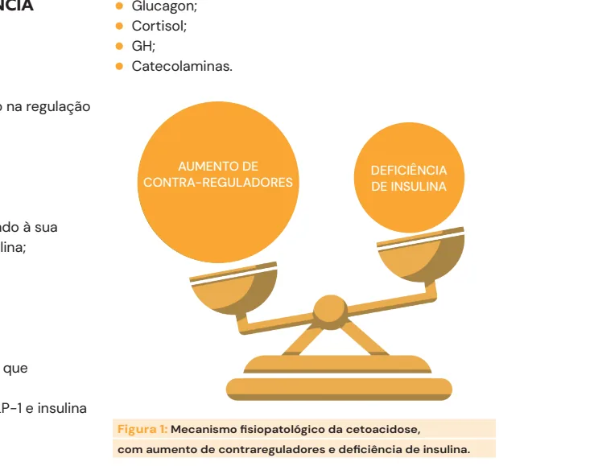
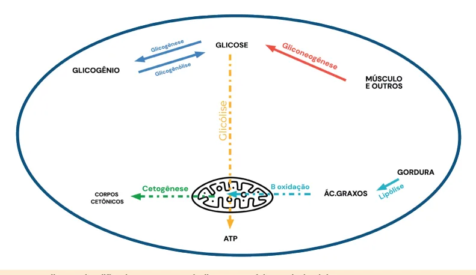
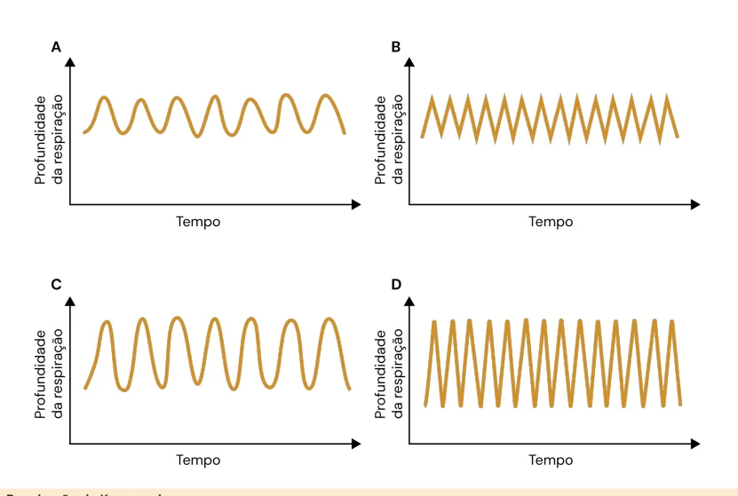

# Cetoacidose diabética na Pediatria

<!-- page:1 -->

## CETOACIDOSE DIABÉTICA (CAD)

Cetoacidose diabética (PED) Quadro clínico

- Náuseas e vômitos, dor abdominal;

- Taquipneia, respiração de kussmaul;

- Sintomas do diabetes mellitus (DM) precedem o quadro atual: polifagia, poliúria e polidipsia, perda de peso.

Diagnóstico

- Ceto: Cetonemia (beta-hidroxibutirato ≥3mmol/L) ou Moderada cetonúria (≥2+);

- Acidose: pH venoso <7,3 ou Bicarbonato <18mEq/L;

- Diabética: Hiperglicemia (>200mg/dL).

Tratamento na primeira hora Estabilização hemodinâmica - restaurar perfusão:

- Soro fisiológico 10-20mL/kg em 20-30min (rápido se choque);

- Pode repetir até estabilização hemodinâmica.

Não iniciar insulina!

## FISIOPATOLOGIA

## DIABETES MELLITUS (DM) NA INFÂNCIA

- As Ilhotas pancreáticas são compostas principalmente por: Células beta (produtoras de insulina); Células alfa (produtoras de glucagon).

- Insulina e glucagon têm papel antagônico na regulação da glicemia: Insulina reduz a glicemia; Glucagon aumenta a glicemia.

## DM TIPO 1

- Autoimunidade contra células beta, levando à sua destruição e defeito de secreção de insulina;

- Tratamento: reposição de insulina.

## DM TIPO 2

- Resistência à insulina; Muito relacionada a obesidade;

- Progressão e complicações mais rápidas que no adulto;

- Tratamento: metformina, agonistas de GLP-1 e insulina se necessário.

## MECANISMO DA CETOACIDOSE

A cetoacidose diabética (CAD) ocorre mediante deficiência de insulina e aumento de hormônios contrarreguladores.

Deficiência de insulina

- Absoluta: primodescompensação ou omissão de doses;

- Relativa: infecção, trauma, puberdade e uso de medicamentos (como corticoides). Tratamento após a primeira hora

- Insulina regular EV 0,05 a 0,1UI/kg/hora (exceto se hipocalemia);

- Potássio (exceto se K>5,5mEq/L e sem diurese);

- Continuar hidratação;

- Glicose se queda da glicemia >100mg/dL/h ou se glicemia <250-300mg/dL.

Potássio - particularidades Regra: Repor K.

- A insulina e a melhora da acidose fazem o shift de K para o intracelular: queda no K sérico.

Exceções:

- Se hipercalemia (K>5,5mEq/L): postergar reposição de K até documentar diurese;

- Se hipocalemia (K<3,0mEq/L): postergar início da insulina e fazer bôlus de K já na primeira hora.

Complicação mais grave: edema cerebral Aumento de contra reguladores Situações de estresse:

- Glucagon;

- Cortisol;

- GH;

- Catecolaminas.

AUMENTO DE DEFICIÊNCIA CONTRA-REGULADORES DE INSULINA Figura 1: Mecanismo fisiopatológico da cetoacidose, com aumento de contrareguladores e deficiência de insulina.

## METABOLISMO ENERGÉTICO CELULAR

- Objetivo principal: glicose gerar ATP.

- Pós-prandial: ação de insulina: Captação de glicose pela célula; Lipogênese (estoque de energia em forma de gordura).

; | Glicogênese (estoque de energia em forma de glicogênio);

---

<!-- page:2 -->

- Jejum: ação de contrareguladores: | O limite de reabsorção tubular de glicose nos néfrons Glicogenólise (glicogênio é quebrado em glicose); é atingido em média quando a glicemia atinge 180 mg/ Gliconeogênese (síntese de glicose a partir de dl; acima desta glicemia, ocorre glicosúria.

outros substratos);

- A cetonemia causa acidose, taquipneia, vômitos e dor Lipólise (quebra de gordura em ácidos graxos, abdominal (contribuindo para a desidratação e perda Lipólise (quebra de gordura em ácidos graxos, os quais sofrem beta-oxidação na mitocôndria gerando ATP e corpos cetônicos).

- Cetoacidose diabética: ausência de insulina, excesso de contrareguladores: Ocorre um “jejum” do ponto de vista celular na célula); Ocorre lipólise intensa, com cetogênese importante; Corpos cetônicos suprem a demanda energética em tecidos periféricos e possibilitam a priorização do uso da glicose pelas células do sistema nervoso central;

(apesar da hiperglicemia, a glicose não entra

- Verificar Figura 2

## EFEITOS DA CETOACIDOSE

- A hiperglicemia causa diurese osmótica, a qual causa desidratação e perda de eletrólitos:

Figura 2: Esquema que ilustra simplificadamente o metabolismo ener ↑ Gliconeogênese Hiperglice ↓ Captação de glicose ↑ Lipólise Cetonem Figura 3: Efeitos da Cetoacidose. abdominal (contribuindo para a desidratação e perda de eletrólitos);

- Verificar Figura 3 .

## QUADRO CLÍNICO

- Náuseas e vômitos, dor abdominal;

- Taquipneia, respiração de kussmaul Hiperventilação alveolar para compensar a acidose metabólica, com respiração ampla e rápida.

- Hálito cetônico;

- Confusão mental, rebaixamento de nível de consciência;

- Sintomas do DM precedem o quadro atual: polifagia, poliúria e polidipsia, perda de peso;

- Verificar Figura 4 na próxima página.

rgético a nível celular. Diurese osmótica emia Desidratação e perda de eletrólitos Vômitos e dor abdominal mia Acidose e taquipneia

---

<!-- page:3 -->

Figura 4: Respiração de Kussmaul. A: Normal; B: Taquipneia; C: Hiperpneia; D: Kussmaul.

## DIAGNÓSTICO TRATAMENTO

## CETO OBJETIVOS

Procura de corpos cetônicos:

- Corrigir:

- Cetonemia → beta-hidroxibutirato ≥3; | Desidratação;

- Cetonúria → Moderada cetonúria (≥2+). | Acidose; Cetose;

ACIDOSE | Osmolaridade;

- pH venoso <7,3; | Glicemia;

- Bicarbonato (bic) < 18 mEq/L: | Precipitante da descompensação. Atualização ISPAD 2022. Antes o valor era

- Evitar: Complicações do tratamento (iatrogenia).

de 15mEq/L. | Complicações da doença;

## DIABÉTICA

- Hiperglicemia (>200mg/dL): PRIMEIRA HORA Cetoacidose euglicêmica: baixo consumo de

- Estabilização hemodinâmica:

carboidratos, ou uso de inibidores de SGLT-2 | Monitorizar, obter 2 acessos venosos; (devido a glicosúria importante). | Manter via aérea pérvia, fornecer FiO2 100%;

| Avaliar nível de consciência. EXAMES COMPLEMENTARES

- Restaurar perfusão:

- Exames para o diagnóstico: | Soro fisiológico 10-20mL/kg em 20-30min (infusão Gasometria: pH e bicarbonato; rápida se choque); Glicemia; | Pode repetir até estabilizar hemodinâmica. Cetonemia ou cetonúria;

- Outros exames importantes: Não iniciar a insulina!

- Eletrólitos;

- Eletrocardiograma; INSULINA

- Ureia e creatinina;

- Iniciar insulina somente após a primeira hora do início

- Hemoglobina e hematócrito. da reposição volêmica:

Classificação | A reposição volêmica iniciará redução da glicemia.

- Leve: pH<7,3 ou bic<18;

- Insulina regular EV 0,05-0,1UI/kg/hora;

- Moderada: pH<7,2 ou bic<10;

- Não iniciar se hipocalemia (K < 3,5mEq/L)! Primeiro

- Grave: pH< 7,1 ou bic <5. corrigir o potássio.

Manter insulinoterapia até resolução da acidose.

---

<!-- page:4 -->

## POTÁSSIO BICARBONATO

- Déficit majoritariamente intracelular:

- Não recomendado de rotina; Shift no intracelular para o extracelular (como

- A acidose é corrigida com fluidos e insulina: Perdas urinárias e nos vômitos; | Melhora da perfusão irá levar à excreção dos ácidos Perdas urinárias e nos vômitos; Hiperaldosteronismo secundário à desidratação; No geral, há déficit total de 3-6 mEq/kg.

tentativa de tamponamento da acidose); | Cetoácidos são metabolizados em bicarbonato;

- Regra: repor o potássio: A insulina e a melhora da acidose fazem o shift para o intracelular, e o potássio sérico cai; Concentração máxima: 20-40mEq/L; Velocidade máxima: 0,5mEq/kg/h.

- Exceções: Se hipercalemia (K>5,5mEq/L): postergar reposição até documentar diurese; C Se hipocalemia (K<3,0mEq/L): postergar início da insulina e fazer bôlus de K já na primeira hora; Dica: procurar no ECG sinais de hipocalemia

(ex: presença de onda U) ou de hipercalemia (ex: onda T apiculada).

- HIDRATAÇÃO

- Continuar hidratação nas horas seguintes;

- Incluir fluido de manutenção;

- Calcular o déficit estimado para repor em 24- 48h: Em geral, a perda é de 5% do peso na CAD leve, 7% na moderada e 10% na grave; Utilizar Na entre 0,45% e 0,9%. E

- GLICEMIA

- O objetivo é reduzir a glicemia 50-100 mg/dL/hora: A queda abrupta de glicemia aumenta risco de edema celular no sistema nervoso. F

- Se queda <50mg/dl/h: aumentar insulina para 0,15ui/kg/h;

- Queda >100mg/dl/h: reduzir insulina ou aumentar infusão de glicose;

- Glicemia <250-300 mg/dL: adicionar glicose na solução (G5%-12,5%) para evitar hipoglicemia: Não parar insulina. A glicemia irá normalizar antes S do paciente sair da acidose, portanto a insulina deve ser mantida.

- OUTROS ELETRÓLITOS

- Sódio: Hiponatremia dilucional por alta osmolaridade; M Calcular o sódio corrigido (o exame mostra um sódio menor que a natremia real do paciente); Sódio corrigido: Na + 1,6x([glicemia-100]/100); Com o tratamento, ocorre elevação gradual da natremia.

- Fósforo: Cai após início da insulina (entra nas células); Considerar repor diante de sinais de gravidade:

convulsões, anemia hemolítica, insuficiência cardíaca, fraqueza muscular, insuficiência respiratória, disfagia ou fosfatemia <1mg/dL. | Melhora da perfusão irá levar à excreção dos ácidos orgânicos pela urina.

- O uso bicarbonato aumenta risco de edema cerebral;

- Indicação de reposição: Hipercalemia grave; pH<6,9 com comprometimento de contratilidade cardíaca.

## CRITÉRIOS DE RESOLUÇÃO DA CAD

Critérios de resolução:

- pH>7,30;

- Bicarbonato>18 mEq/L;

- Cetonemia <1 mmol/L: Cetonúria demora negativar, logo, não é considerada para determinar resolução.

- Liberar líquidos via oral quando houver melhora clínica importante;

- Após a resolução, iniciar insulina rápida via subcutânea

30 min antes de desligar a bomba.

## COMPLICAÇÕES

## EDEMA CEREBRAL

- Principal causa de mortalidade! Incidência de 0,5-0,9% na CAD, e mortalidade de 21- 24%.

- Geralmente ocorre nas primeiras 12h de tratamento.

Fatores de risco

- Idade <5 anos;

- Primodescompensação, quadro prolongado;

- Ureia elevada;

- Hipocapnia grave (pCO2<21mmHg);

- Uso de bicarbonato;

- Insulina na primeira hora.

Sintomas

- Cefaleia intensa;

- Sinais focais, paralisia de nervos cranianos;

- Bradicardia (ou redução inapropriada da FC);

- Rebaixamento do nível de consciência;

- Vômitos após início do tratamento.

Manejo

- Emergência: via aérea, respiração, hemodinâmica, déficits focais e exposição;

- Manter oxigenação e ventilação normais, PA adequada, cabeceira elevada a 30º e cabeça em posição neutra;

- Evitar febre e hipoglicemia;

- Se sinais de herniação: Manitol 0,5-1g/kg; Salina hipertônica 3%, 2,5-5ml/kg em 10-15min.

- Tomografia após estabilização: Encontrar diagnósticos diferenciais que mudam a conduta: hemorragia intracraniana que requer neurocirurgia; trombose que requer anticoagulação.

---

<!-- page:5 -->

## OUTRAS COMPLICAÇÕES

- Tromboses (em sistema nervoso, venosa profunda,

- Hipocalemia; tromboembolismo pulmonar).

- Acidose hiperclorêmica;

## REFERÊNCIAS

- Hipoglicemia; Se aceitação oral: 15g carboidrato VO; Sem aceitação oral: Glicose 25% 2ml/kg EV; Figura 4: A: Normal; B: Taquipneia; C: Hiperpneia; D: Kussmaul. Se RN: Glicose 10% 2ml/kg EV. Adaptado de: Moraes, Alice Gallo, and Salim Surani. “Effects of diabetic

- Lesão renal aguda; ketoacidosis in the respiratory system.” World journal of diabetes

10.1 (2019): 16.
