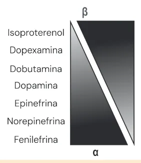

# Choque e Drogas Vasoativas

<!-- page:1 -->

Choque Drogas Vasoativas Fisiologia hemodinâmica

- PA = PPP = DC x RVP : DC = FC x VS/RVP = volemia x raio do vaso.

- Oferta de O2 = DC x CaO2 : CaO2 = 1,34 x Hb x SatO2 + 0,03 x PaO2 .

Choque = oferta < demanda

- Classificações do choque:

1. Pela gravidade: compensado (PA adequada) x

hipotensivo (PA < p5 = 70+ 2x idade) x irreversível (disfunção de múltiplos órgãos e sistemas) ;

2. Pela clínica: frio (disfunção cardíaca e

vasoconstrição) x quente (vasoplegia e aumento do débito cardíaco) ;

3. Pela causa: hipovolêmico (hemorrágico, não

hemorrágico) x obstrutivo (tamponamento cardíaco, TEP, pneumotórax hipertensivo,

## CHOQUE

FISIOLOGIA HEMODINÂMICA Volume sistólico Débito cardíaco Frequência cardíaca Pressão arterial Pressão de perfusão Volemia Resistência vascular periférica Raio do vaso Lei de Poiseuille:

R = 8×n×L pi×r4 Figura 1: Componentes da pressão arterial, que corresponde à pressão de perfusão periférica.

OBS.: o volume sistólico é influenciado pela pré-carga, contratilidade e pós-carga. A volemia sofre interferência da viscosidade sanguínea.

A lei de Poiseuille define que a resistência do vaso é inversamente proporcional à quarta potência do raio do tubo/vaso; quanto menor o raio, muito maior será a resistência à passagem de fluxo.

- Observe a Figura 2: Curva A – paciente com demanda metabólica normal: é possível reduzir as funções metabólicas até certo limite esperado, no qual ocorre redução da distribuição de oxigênio; cardiopatia congênita, etc.) x cardiogênico distributivo (sepse, anafilaxia, neurogênico) x dissociativo (intoxicações).

(IC direita, IC esquerda, disfunção global) x

1. Tratar a causa ;

2. Otimizar oferta (volume, DVA, Hb e O2) ;

3. Reduzir demanda (IOT, sedação e analgesia,

controle de temperatura) ;

4. Ajuste metabólico: controle de glicemia e cálcio.

Drogas vasoativas:

- Inotrópicas: adrenalina, dopamina, dobutamina, milrinone, levosimendan;

- Vasoconstritoras: noradrenalina, vasopressina ;

- Vasodilatadoras: nitroprussiato, nitroglicerina, prostaglandina. Curva B – paciente com demanda metabólica elevada: a redução das funções ocorre antes do esperado.

oinêgixo ed omusnoC B Aumento do metabolismo A Metabolismo habitual Oferta crítica Figura 2: Oferta de Oxigênio vs. Consumo de oxigênio no choque

- A oferta (distribuição) tecidual de oxigênio (DO²) é calculada por: Débito Cardíaco (DC) x Conteúdo arterial de O2 (CaO2);

DO² = DC X CaO2

- DC = frequência cardíaca (FC) x volume sistólico (VS);

- CaO2 = (Hb x 1,34 x SatO²) + 0,03 x PaO²: 0,03 x PaO² = praticamente zero; A porção efetiva do oxigênio transportado aos tecidos encontra-se ligada à hemoglobina.

## FISIOPATOLOGIA DO CHOQUE

- O choque é caracterizado por um aumento da demanda metabólica não suprida ou pela redução da oferta. Assim, cursa com sinais de hipoperfusão;

- Na tentativa de compensar o quadro, o organismo é sustentado inicialmente pelo metabolismo anaeróbico, com alta produção e liberação plasmática de ácidos, evoluindo com aumento dos níveis de lactato;

---

<!-- page:2 -->

- O ambiente acidótico (que gera disfunção enzimática)

- IC esquerda:

e a inadequação da oferta de oxigênio e nutrientes aos | Congestão pulmonar. tecidos culminam em falência de órgãos e sistemas;

- Disfunção global.

- De tal modo, definir o tipo de choque é prioridade: Hipovolêmico: Avaliação clínica + anamnese;

- Hemorrágico - perda de sangue total; Exames complementares – especialmente

- Não hemorrágico - perda de volume hídrico (diarreia, o ecocardiograma POCUS, que nos permite vômitos, poliúria, etc.).

avaliar com mais detalhes a função cardíaca e Distributivo: direcionar o tratamento.

- Séptico;

- Anafilático;

## TIPOS DE CHOQUE

- Neurogênico.

Pela Gravidade: Dissociativo:

- Choque compensado: pressão arterial adequada; com

- Intoxicações: por cianeto ou metahemoglobinemia:

sinais de hipoperfusão; | As hemácias não conseguem liberar oxigênio (O2)

- Choque hipotensivo ou descompensado: pressão adequadamente aos tecidos.

arterial sistólica < p5 (p5 = 70 + 2x idade); sinais de hipoperfusão; TRATAMENTO DO CHOQUE

- Choque irreversível: falha dos mecanismos de

- Tratar a causa;

compensação e falência orgânica, estágio final e

- Otimizar a oferta:

irreversível do choque. | Aumentar o débito cardíaco (DC = VS x FC): Pela Clínica: aumentar o volume sistólico (cristaloides) e/ou Choque frio aumentar a frequência e contratilidade cardíaca

- Mais comum na criança; (drogas vasoativas);

- Redução do débito cardíaco: | Aumentar a oferta de O2: aumentar a fração Saturação venosa central (SVC) < 70%/ inspirada de O2 (FiO2) e/ou aumentar o número de Índice cardíaco baixo (a criança já vive com demanda

Gap CO2 > 6; hemácias (transfusão).

- Reduzir a demanda:

cardíaca aumentada devido alta frequência cardíaca | Sedação e analgesia; e não tem muito como aumentar o débito cardíaco | Intubação orotraqueal, suporte nutricional, controle em situações críticas, sendo portanto o primeiro de temperatura.

ponto de descompensação no choque pediátrico).

- Otimizar metabolismo: correção de distúrbios

- Vasoconstrição secundária: como tentativa de metabólicos associados (glicose e cálcio).

compensar o baixo débito:

## DROGAS VASOATIVAS

| Extremidades frias, palidez, pele moteada, tempo de enchimento lento, pulsos finos. Choque quente CATECOLAMINAS

- Vasodilatação/vasoplegia: mecanismo inicial do Considerações gerais choque no paciente adolescente e adulto, por reação

- Sua ação ocorre através da conexão da catecolamina inflamatória sistêmica ou secundário a alguma ao receptor adrenérgico (ligado à proteína G) desregulação, como um dano neurológico grave, dano promovendo a quebra de ATP (= gasto energético), ao metabolismo hepático ou intoxicações: aumentando a produção intracelular de GMPc e AMPc Extremidades quentes, TEC em flush, pulsos amplos, (partes efetoras).

PA divergente - pressão de pulso elevada (diferença Tipos de receptores adrenérgicos: entre pressão sistólica e diastólica).

- Alfa – localizado em vasos sanguíneos,

- Aumento secundário do débito cardíaco: saturação estimulam a vasoconstrição;

venosa central > 70%, índice cardíaco alto.

- Beta 1 (B1) – localizados no coração, estimulam o

Pela Causa: inotropismo (aumento da força de contração) e Obstrutivo: impedimento ao fluxo habitual do sangue cronotropismo (aumenta frequência de contratilidade);

- Tamponamento cardíaco;

- Beta 2 (B2) – localizados em vasos

- Tromboembolismo pulmonar (TEP); sanguíneos e brônquios, promovem

- Pneumotórax hipertensivo; vasodilatação e broncodilatação.

- Obstrução da via de saída do ventrículo Dopamina esquerdo (VSVE).

- Ampola: 5 mg/ml;

Cardiogênico: falha primária da bomba cardíaca

- Ação é dose-dependente:

- Insuficiência cardíaca (IC) direita: | 3 – 5 mcg/kg/min → ação dopaminérgica: atua Hepatomegalia; edema de membros; B3 nos receptores D1 (circulação esplâncnica) e D2 um ventrículo ainda cheio de sangue, que não renal, sistema nervoso central (SNC) e coronariana.

(desaceleração da coluna de sangue contra (hipófise), promovendo vasodilatação esplâncnica, se esvaziou adequadamente no ciclo anterior - Também tem efeito natriurético;

clássico de provas);

---

<!-- page:3 -->

| 5 – 10 mcg/kg/min → ação beta-agonista INIBIDOR DA FOSFODIESTERASE-3: MILRINONE (B1 > B2): aumenta a contratilidade e a FC, com

- É um inibidor da fosfodiesterase 3 (para lembrar, faça alguma vasodilatação periférica; um 3 com os dedos e inverta sua mão, fazendo um M; 10 – 20 mcg/kg/min → ação alfa-agonista > B1: o sildenafil ou Viagra inibe a fosfodiesterase 5 = V em promove vasoconstrição periférica com algum números romanos);

inotropismo e cronotropismo.

- Impede a degradação do AMPc e GMPc, favorecendo o

- Atualmente, é mais utilizada na neonatologia com aumento dos níveis de cálcio (anteriormente reduzidos objetivo de melhorar a perfusão renal e otimizar a pela ação da fosfodiesterase);

diurese e o balanço hídrico;

- Ampola: 1 mg/ml:

- Desvantagem: risco de imunoparalisia, arritmias e | Dose: 0,25 – 0,75 mcg/kg/min → apresenta efeito inibição hipotalâmica. inotrópico e lusitrópico, com vasodilatação

Adrenalina/epinefrina sistêmica e pulmonar.

- Ampola: 1 mg/ml;

- Indicações: choque cardiogênico; pacientes

- Ação é dose-dependente: cardiopatas com disfunção miocárdica ou 0,03 – 0,05 – 0,3 mcg/kg/min → ação beta agonista hipertensão pulmonar;

(B1 > B2): aumenta a contratilidade e frequência

- Desvantagens: associado a quadros de arritmias e cardíaca. Alguma vasodilatação sistêmica: hipotensão. Causa plaquetopenia; Utilizam-se doses mais baixas nos pacientes

- Tem início de ação mais lento (em torno de 30 cardiopatas. Nos pacientes em geral, considera-se minutos) e meia-vida mais longa. Dose > 0,3 mcg/kg/min → ação alfa SENSIBILIZADOR DE CÁLCIO (LEVOSIMENDAN agonista + B1: favorece vasoconstrição, “SINDAX”) cronotropismo e inotropismo.

dose beta 0,05 - 0,3 mcg/kg/min.

- Ação específica na troponina C, causando aumento da

- Indicada no tratamento de choque séptico, contratilidade. Também atua nos canais de potássio principalmente na presença de disfunção cardíaca nos vasos periféricos, favorecendo a vasodilatação;

(choque frio);

- Ampola: 2,5 mg/ml:

- É associada ao aumento dos níveis de | Dose 0,1 – 0,2 mcg/kg/min → atua como inotrópico lactato e acidose. e vasodilatador sistêmico.

Noradrenalina/norepinefrina

- Indicações: choque cardiogênico refratário; pode

- Ampola: 1 mg/ml: ser útil como ponte para ECMO ou como saída de Dose > 0,1 mcg/kg/min → ação a-agonista tal terapia;

> B1: vasoconstrição, com pouco

- Desvantagem: alto custo! cronotropismo e inotropismo.

- Tem início de ação lento (48 horas) e longa meia-vida

- Indicada no tratamento de: choque séptico em (7-10 dias).

adolescentes e adultos (choque quente); choque neurogênico/TCE; choque hipovolêmico/hemorrágico; VASOPRESSINA (HORMÔNIO ANTIDIURÉTICO)

pacientes hepatopatas (vasodilatados); Atua em receptores específicos

- É associada a necrose de extremidades em

- V1a (vasos) → vasoconstrição;

doses altas.

- V1b (hipófise) → liberação de ACTH;

Dobutamina

- V2 (rim) → ação antidiurética;

- Ampola: 12,5 mg/ml:

- Ampola: 20 UI/ml: Dose 5 – 20 mcg/kg/min → beta agonista (B1 > B2): | Dose: 0,0002 – 0,003 UI/kg/min.

aumenta a contratilidade e FC, com vasodilatação

- Indicações: choque (quente) refratário;

sistêmica importante.

- Desvantagem: alto risco de necrose de extremidades,

- Indicação: choque cardiogênico, pacientes cardiopatas abstinência e dificuldade de manejo hídrico.

com disfunção miocárdica;

- Costuma associar-se a quadros de taquicardias extremas, arritmias e hipotensão.

Outras catecolaminas

- Fenilefrina: apresenta ação alfa-agonista seletiva → vasoconstritor;

- Isoproterenol: ação beta agonista seletiva sendo pouco vasodilatador;

(B1 > B2) → efeito inotrópico e cronotrópico,

- Verificar Figura 3 .

Figura 3: Esquema: drogas vasoativas alfa e beta agonistas.

---

<!-- page:4 -->

## NITRATOS VASODILATADORES 1° passo

Nitroprussiato (“Nipride”)

- 0,1 x 5 kg x 24h x 60 min = 720 mcg = 0,72 mg.

- Apresenta ação direta na parede dos vasos → 2° passo:

aumenta a liberação de óxido nítrico, estimulando a

- Ampola de adrenalina: apresentação 1 mg/ml;

vasodilatação sistêmica;

- 0,72 mg = 0,72 ml da ampola.

vasodilatação sistêmica;

- Ampola: 25 mg/ml: 3 Dose: 1 – 5 mcg/kg/min.

- Indicação: emergências hipertensivas;

- Desvantagem: tem risco de hipotensão, intoxicação por cianeto, metahemoglobinemia.

Nitroglicerina (“Tridil”)

- É convertida em óxido nítrico, causando vasodilatação sistêmica e coronariana;

- Não é usada em UTI pediátrica;

- Indicação: emergências hipertensivas; E

- Risco de hipotensão, taquicardia e cefaleia.

- PROSTAGLANDINA (“ALPROSTADIL”/ “PROSTIN”)

- Prostaglandina E1 → subproduto de qualquer reação 1 inflamatória, favorecendo vasodilatação local;

- Ampola: 0,5 mg/mL: 2 Dose: 0,05 – 0,4 mcg/kg/min → efeito inotrópico e vasodilatador sistêmico.

- Indicação: cardiopatias com dependência do 3 canal arterial;

- Desvantagem: risco de hemorragias – pela antiagregação plaquetária, apneia (em recém-nascidos < 2 kg), hipotensão, hiperplasia de antro gástrico, hipocalemia.

- PRESCRIÇÃO DE DVAS

Como prescrever droga vasoativa? 1° passo: multiplicar os seguintes fatores E

- Dose desejada por minuto;

- Peso da criança;

- Tempo a ser infundido em minutos (Ex: 24h X 60 min).

- 2° passo

- Com a dose total do dia em microgramas ou micro ou UI (de acordo com a apresentação da ampola 3 da medicação): X Checar a concentração da ampola, 5 transformar em mL. Y

UI, obtida no 1° passo, converter para miligrama 2 3° passo Y

- Escolher o volume total da solução e descontar o Y volume da DVA: Deve-se diluir obrigatoriamente em SG 5% noradrenalina e nipride; As demais podem ser diluídas em soro fisiológico ou soro glicosado. A s

Exemplos p Exemplo 1:

- Criança de 6 meses, 5 kg, com quadro de choque séptico. Prescrever Adrenalina 0,1 mcg/kg/min em 24h. A h - 0,72 mg = 0,72 ml da ampola.

3° passo:

- Volume total escolhido: 12 ml (vai correr a 0,5 mL/h em 24h = 0,1 mcg/kg/min);

- 12 – 0,72 mL = 11,28 mL de soro fisiológico para completar os 12 ml (escolhidos por mim);

- Prescrição: Adrenalina 1 mg/ml - 0,72 ml; SF 0,9% 11,28 ml; EV em BIC; correr a 0,5 mL/h ou ACM.

Exemplo 2:

- Criança de 13 anos, 53 kg, com quadro de choque cardiogênico. Prescrever Dobutamina

5 mcg/kg/min em 12h. 1° passo:

- 5 x 53 kg x 12h x 60 min = 190.800 mcg.

2° passo:

- Ampola de Dobutamina: apresentação 12,5 mg/mL;

- 190,800 mcg = 15,2 mL da ampola.

3° passo:

- Volume total escolhido: 60 mL (vai correr a 2,5 mL/h =

5 mcg/kg/min);

- 60 – 15,2 = 44,8 ml;

- Prescrição: Dobutamina 12,5 mg/ml - 15,2ml; SF 0,9% 44,8 ml; EV em BIC; correr a 2,5 mL/h ou ACM.

Exemplo 3: como ler a prescrição

- Criança de 10 anos, 30 kg, com quadro de choque hemorrágico;;

- Recebe: noradrenalina 4,5 mg + SG 5% 24ml QSP a 3 mL/h ou ACM.

(QSP = volume total da solução); EV em BIC, correr 24 ml da solução = 4,5 mg de nora (4500 mcg) 3 ml ------------X X = 562,5 mcg 562,5 mcg está correndo em 1h = 60 min Y -----------------------em 1 min Y = 9,4 mcg/min Y = 9,4 mcg/min pelo peso (30 kg)= 0,3 mcg/kg/min

## REFERÊNCIAS

Figura 2: Oferta de Oxigênio vs. Consumo de Oxigênio no choque. Adaptado de C. Riley; R. Basu; N. Kissoon; DS. Wheeler. Pediatric Sepsis:

preparing for the future against a global scourge, 2012. DOI:10.1007/ s11908012-0281-5 Figura 3: Esquema: Drogas vasoativas alfa e beta agonistas.

Adaptado de Steven M. Hollenberg, Vasopressor Support in Septic Shock, Chest, Volume 132, Issue 5, 2007, Pages 1678-1687, ISSN 0012-3692, https://doi.org/10.1378/chest.07-0291.
