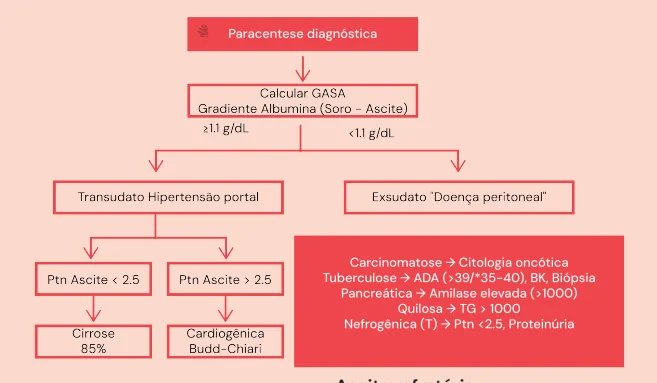
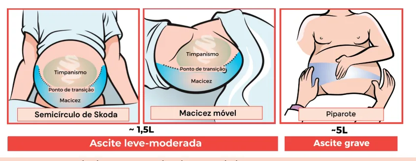
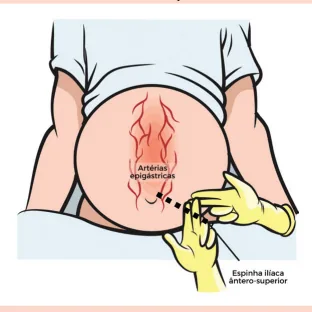
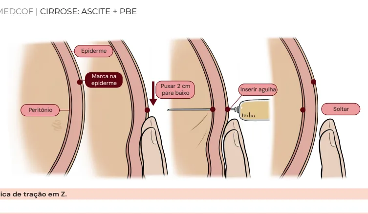
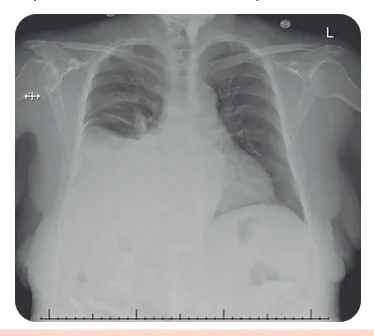

# Cirrose: Ascite + PBE

<!-- page:1 -->

## Ascite

A **ascite** é caracterizada pelo acúmulo de líquido na cavidade peritoneal.

### Semiologia

Em alguns casos a identificação é facilmente realizada pelo exame físico:
- **Semicírculo de Skoda** (~1,5 L): à percussão do abdome, em decúbito dorsal, forma-se um semicírculo imaginário, mediante localização do líquido;
- **Macicez móvel** (~1,5 L): ao posicionar o paciente em decúbito lateral, pela movimentação do líquido na cavidade peritoneal, percebe-se que a macicez na percussão se move ao lado escolhido;
- **Piparote** (~5 L): positivo quando fazemos uma percussão no abdome do paciente de um lado e notamos a propagação de uma onda do líquido no lado contralateral;
- **Toque retal** (~300 mL): menos utilizado, ascite de menor volume.

*Verificar Figura 1.*

Em outros casos, a ascite, especialmente se em pequeno volume, é melhor evidenciada através de exames de imagem, como ultrassonografia (USG), tomografia (TC) ou ressonância (RNM) de abdome.

De qualquer forma, em todo quadro novo de ascite deve-se proceder com **paracentese diagnóstica**.

*Figura 1: Semicírculo de Skoda (esquerda), Macicez Móvel (meio) e Piparote (direita) em paciente com ascite.*

*Figura 2: Ponto ideal para realização de paracentese às cegas.*

> **Atenção**: nem todo quadro de ascite é hipertensão portal!

### Tratamento da Ascite

- Dieta hipossódica, restrição hídrica (apenas se hiponatremia grave), cessar etilismo, evitar drogas hepatotóxicas;
- **Espironolactona + furosemida** (proporção 100 mg + 40 mg);
- Média ideal de perda de peso: 0,5-1 kg/dia até "peso seco".

---

<!-- page:2 -->

## Paracentese Diagnóstica

- É o procedimento para punção do líquido ascítico. Pode ser tanto diagnóstico quanto terapêutico (geralmente com retirada de > 5 L);
- Pode ser realizado às cegas ou guiado por ultrassonografia (USG);
- Não há contraindicações absolutas ao procedimento;
- **Contraindicações relativas**: gestação, distúrbios importantes de coagulação (CIVD, hiperfibrinólise — lembre-se que o paciente cirrótico avançado terá um INR alargado), distensão abdominal importante, infecção/hematoma/cicatriz local (trocar o local de punção), abdome agudo.

### Técnica (às cegas)

- Posicionar o paciente – posição supina e cabeceira levemente elevada (30-45°);
- Traçar uma linha imaginária da cicatriz umbilical até a espinha ilíaca ântero-superior esquerda;
- Dividir a linha entre 3 porções;
- **Ponto de punção ideal**: entre terço médio e distal — há menor vascularização, logo, há menor risco de acidente de punção;
- Realizar a punção sempre aspirando; caso não haja retorno de sangue, prosseguir com botão anestésico;
- Lembrar sempre de realizar a técnica de tração em dois planos ("técnica em Z"), na tentativa de tamponamento dos tecidos.

*Verificar Figura 3 na próxima página.*

---

<!-- page:3 -->

*Figura 3: Técnica de tração em Z (marca na epiderme, puxar, inserir agulha, soltar).*

### Análise do Líquido Ascítico

- Rotineiramente, analisamos três parâmetros principais e outros em casos específicos, sempre tentando parear as coletas (ascite e sangue):
  - Celularidade total e diferencial (leucócitos e polimorfonucleares (PMF)/neutrófilos);
  - Bioquímica (albumina e proteínas totais);
  - Microbiologia (bacterioscopia, cultura, BAAR, PCR).
- Assim como em outros fluidos biológicos, separamos em transudato e exsudato. Isso é feito através da dosagem de albumina.

**GASA – Gradiente de Albumina Soro-Ascite**

GASA = Albumina Sérica − Albumina do Líquido Ascítico

- **GASA ≥ 1,1 g/dL**: transudato = hipertensão portal (85% dos casos):
  - Proteína do líq. ascítico < 2,5 g/dL: cirrose;
  - Proteína do líq. ascítico > 2,5 g/dL: causa cardiogênica.
- **GASA < 1,1 g/dL**: exsudato — carcinomatose peritoneal é a 2ª principal causa ("doença peritoneal").

#### Tabela 1: GASA e possíveis etiologias de ascite

> ⚠️ Tabela reconstruída a partir de OCR — confira contra a fonte original.

| GASA | Etiologia | Complementar |
|---|---|---|
| ≥ 1,1 g/dL | Cirrose | Investigar etiologias |
| ≥ 1,1 g/dL | ICC | EcoTT, NT-proBNP |
| ≥ 1,1 g/dL | Hepatite Alcoólica | TGO/TGP > 2 |
| ≥ 1,1 g/dL | Insuficiência Hepática | INR, Albumina, Bilirrubina |
| ≥ 1,1 g/dL | Budd-Chiari | USG Doppler de abdome |
| ≥ 1,1 g/dL | Dç. Venoclusiva | USG Doppler de abdome |
| < 1,1 g/dL | Carcinomatose peritoneal | Citologia oncótica |
| < 1,1 g/dL | Tuberculose (líq. ascítico) | ADA, BAAR, TB-TRM |
| < 1,1 g/dL | Pancreática¹ (líq. ascítico) | Amilase (> 1.000 UI) |
| < 1,1 g/dL | Quilosa² (líq. ascítico) | Triglicerídeos (> 1.000 UI) |
| < 1,1 g/dL | Sd. Nefrótica (líq. ascítico) | Proteínas totais (< 2,5), proteinúria nefrótica |
| < 1,1 g/dL | LES | Comemorativos clínicos e laboratoriais (C3/C4 consumidos) |

¹ **Ascite pancreática**: ocorre, principalmente, em quadros de pancreatite crônica de etiologia alcoólica, com lesão de ducto pancreático e consequente liberação de secreções pancreáticas para o peritônio.

² **Ascite quilosa**: ocorre por obstrução de ductos linfáticos. Pode ocorrer em quadros de linfoma, trauma, tuberculose.

- **Tuberculose**: ADA, pesquisa direta de BK, biópsia;
- **Pancreática**: amilase elevada (> 1.000 UI);
- **Quilosa**: TG > 1.000;
- **Nefrogênica**: proteína < 2,5, proteinúria.

*Verificar Tabela 1.*

## Tratamento da Ascite

### Não Farmacológico

**Dieta**
- Dieta hipossódica (sódio 2 g/dia = 80 a 120 mmol/dia ou 4,6 a 6,9 g de sal/dia). Checar adesão através do sódio urinário (NaU): se > 78 mmol/24h e não perde peso: má adesão (vide interpretação em ascite refratária, a seguir);
- Restrição hídrica – apenas se hiponatremia grave (Na < 120–125 mEq/L).

**Outros**
- Cessar etilismo;
- Evitar drogas hepatotóxicas (AINEs).

---

<!-- page:4 -->

## Farmacológico

### Diureticoterapia

- **Espironolactona + furosemida** (proporção geral: 100 mg + 40 mg);
- Titular a dose a cada 3-5 dias. A depleção acelerada de líquido apresenta risco potencial para disfunção renal e encefalopatia hepática;
- Média ideal de perda de peso: 0,5-1 kg/dia até "peso seco".

*Figura 4: Representação de TIPS.*

## Ascite Refratária

Quadro que não responde à dose máxima de diuréticos (espironolactona 400 mg + furosemida 160 mg) OU não tolera o aumento da dose (por efeitos adversos), desde que dieta hipossódica aderente (sódio urinário < 78 mEq/dia).

### Interpretação do Sódio Urinário (NaU)

Objetivamos uma excreção de sódio acima de 78 mEq/24h, já que queremos retirar volume (líquido ascítico) do paciente. Lembre-se: 1 mEq Na = 1 mmol Na.

- **NaU ≥ 78 mEq/dia e perda de peso**: sensível a diuréticos e aderente à dieta hipossódica. Nesse contexto de perda ponderal, pouco importa o resultado do sódio urinário — não precisaria nem ter sido dosado;
- **NaU ≥ 78 mEq/dia e mínima ou nenhuma perda de peso (ou ganho de peso)**: sensível a diuréticos, mas não aderente à restrição de sódio;
- **NaU < 78 mEq/dia e mínima ou nenhuma perda de peso (ou ganho de peso)**: resistente aos diuréticos nas doses atuais.

### Tratamento da Ascite Refratária

- **Paracenteses de alívio (1ª linha)**: se a retirada > 5 L, proceder com reposição de albumina, 6-8 g/litro retirado. O frasco da ampola padrão de albumina 20% possui 50 mL — logo, há 10 g de albumina em cada frasco. Em pacientes com instabilidade hemodinâmica (PAS < 90), hiponatremia (< 130 mEq/L) e/ou injúria renal aguda, albumina deve ser considerada mesmo em paracenteses de menor volume;
- **TIPS** (Transjugular Intrahepatic Portosystemic Shunt): é posicionado por rádio-intervenção. Conecta, não cirurgicamente, um ramo de veia porta sinusoidal (pré-hepático) com ramo supra-hepático; assim, reduz a hipertensão portal.
  - Complicações: encefalopatia hepática (EH) e trombose do TIPS;
  - Contraindicações: hipertensão pulmonar; insuficiência cardíaca; insuficiência tricúspide grave; doença policística hepática; infecção sistêmica ativa.
- **Cirurgia** – derivação portossistêmica;
- **Transplante hepático**.

## Peritonite Bacteriana Espontânea (PBE)

A cirrose é fator de risco para translocação bacteriana, que pode ocasionar infecção do líquido ascítico — complicação relativamente comum na população cirrótica. Em geral, os principais microrganismos associados são Gram-negativos: **E. coli**; **Klebsiella**.

Utilizamos a celularidade e o restante da bioquímica do líquido ascítico para avaliarmos principalmente a presença de infecção.

- **Glicose**: tipicamente semelhante à glicemia, exceto em neoplasias e infecções, quando encontra-se consumida;
- **Lactato desidrogenase (LDH)**: aumentado também em situações infecciosas;
- **Celularidade**: contagem de polimorfonucleares (PMF)/neutrófilos, que estando acima de **250 células/mm³** denuncia um processo infeccioso — quadro mais comum. A Peritonite Bacteriana Espontânea (PBE) é o quadro clínico mais comum.

### Quadro Clínico

Suspeitar na presença de manifestações clínicas ou qualquer outro sinal de descompensação da cirrose (EH, disfunção renal, HDA, etc.):
- Febre;
- Dor abdominal;
- Diarreia.

### Diagnóstico

- Paracentese diagnóstica: dosagem de celularidade (valor absoluto ≥ 250 polimorfonucleares); cultura;
- Portanto, na prática, quando obtemos uma celularidade com > 250 polimorfonucleares/mm³ já estamos autorizados a iniciar o tratamento (diante da alta morbimortalidade) — lembrar que a cultura demora a sair o resultado.

---

<!-- page:5 -->

### Tabela 2: PBE e seus diagnósticos diferenciais

> ⚠️ Tabela reconstruída a partir de OCR — confira contra a fonte original.

| Nomenclatura | PMF/mm³ | Cultura |
|---|---|---|
| Peritonite Bacteriana Espontânea (PBE) | ≥ 250 | Geralmente 1 organismo (E. coli) |
| Peritonite Bacteriana Secundária (PBS)¹ | ≥ 250 | Polimicrobiana |
| Ascite neutrocítica | ≥ 250 | Negativa |
| Bacteriascite | < 250 | 1 organismo |
| Bacteriascite polimicrobiana | < 250 | Polimicrobiana |

¹ Além dos PMF, a PBS deve ser suspeitada principalmente em abdome agudo perfurativo, glicose do líquido ascítico < 50 mg/dL, proteína total > 1 g/dL e LDH acima do limite superior da normalidade (LSN) sérico.

### Tratamento

**Antibioticoterapia**
- Cefalosporina de 3ª geração: Ceftriaxona (2 g/dia) ou Cefotaxima (2 g 8/8h), por 5 dias;
- Se paciente internado, com uso de antibiótico recente ou instável: Cefepime, piperacilina + tazobactam ou carbapenêmicos.

**Profilaxia de síndrome hepatorrenal (SHR)**
- AASLD – indicação: Cr > 1 mg/dL OU Ur > 60 mg/dL OU Bilirrubina total > 4 mg/dL;
- Na prática, indicamos para todo paciente (muitas vezes os critérios AASLD já estão contemplados);
- Esquema: D1 – Albumina 1,5 g/kg + D3 – Albumina 1 g/kg.

**Profilaxia Primária**
- Paciente cirrótico com ascite, sem evolução prévia para PBE, porém com alto risco;
- **HDA varicosa**: Ceftriaxona 1 g/dia (preferencial) ou norfloxacino (se VO disponível), por 7 dias; OU
- **Proteína do líquido ascítico < 1,5 g/dL** com disfunção renal (Cr ≥ 1,2 mg/dL ou Na ≤ 130 mEq/L) OU insuficiência hepática (Child ≥ 9 e BbT ≥ 3 mg/dL): Norfloxacino 400 mg/dia (ou sulfametoxazol/TMP, ciprofloxacino ou rifaximina).

**Profilaxia Secundária**
- Indicada para novos episódios de PBE;
- As taxas de recorrência de peritonite dentro de um ano podem ser próximas a 70%;
- Deve ser, portanto, indicada para todo e qualquer paciente após o primeiro episódio de PBE;
- Esquema: Norfloxacino (ou sulfametoxazol/TMP; ciprofloxacino; rifaximina) ad eternum.

## Peritonite Bacteriana Secundária (PBS)

- O diagnóstico diferencial mais importante da PBE é a peritonite bacteriana secundária, por perfurações intestinais e outras causas clássicas (apendicite, diverticulite complicada, etc.);
- Geralmente o quadro clínico é muito mais florido, assim como o líquido ascítico;
- **Agentes etiológicos**: polibacteriana; fungos; Enterococcus.

### Características no Líquido Ascítico

- Proteína total > 1 g/dL;
- DHL > limite da normalidade sérico;
- Glicose < 50 mg/dL;
- Outros: CEA > 5 ng/mL; FALC > 240 U/L.

- Antibioticoterapia empírica também deve cobrir anaeróbios;
- Solicitar exame de imagem (tomografia computadorizada, de preferência) e avaliação da cirurgia geral.

## Hidrotórax

- Ocorre por defeito diafragmático, sendo mais prevalente à direita;
- Alguns pacientes não têm ascite aparente.

*Figura 5: Radiografia de tórax evidenciando hidrotórax à direita.*

### Tratamento

- Medidas gerais para ascite: restrição de sódio; uso de diuréticos;
- **Toracocentese de alívio**: o uso de dreno torácico deve ser evitado, em virtude da depleção proteica e de eletrólitos, bem como pela possibilidade de infecção e disfunção renal;
- Pleurodese;
- TIPS;
- **Transplante hepático**: tratamento definitivo.

## Referência

Figura 5: Radiografia de tórax evidenciando hidrotórax à direita. Arquivo Pessoal.

