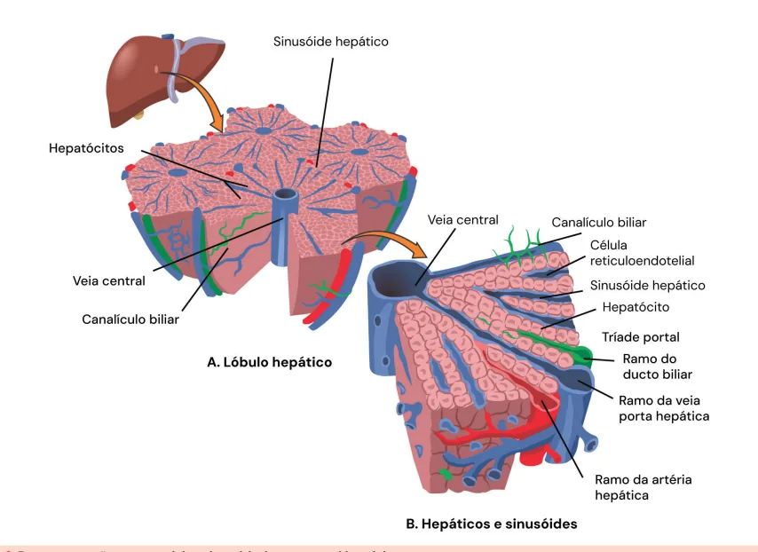
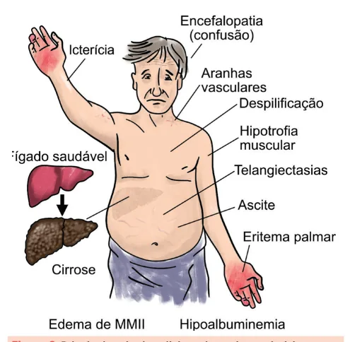
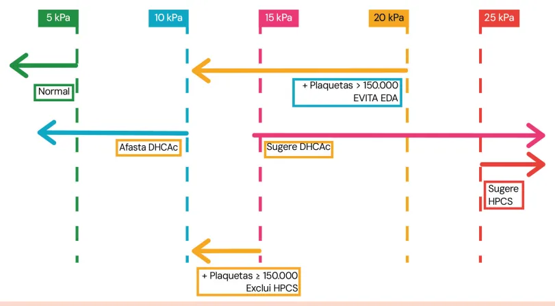
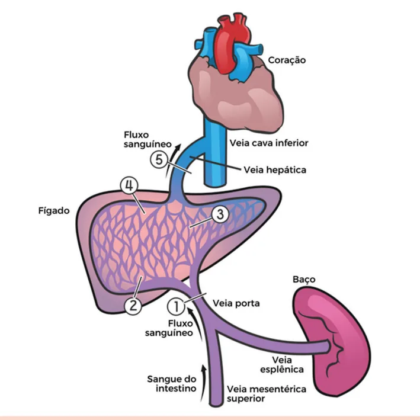

# Cirrose Hepática: Conceitos Gerais

<!-- page:1 -->

## Cirrose: Conceitos Gerais

- Resultado de uma desorganização da arquitetura lobular hepática;
- Quadro clínico é secundário a **hipertensão portal (HP)** e/ou **insuficiência hepática**:
  - **HP**: ascite/PBE; hidrotórax; circulação colateral; esplenomegalia; plaquetopenia/pancitopenia (sequestro esplênico);
  - **Insuficiência hepática**: hiperestrogenismo, hipoandrogenismo, coagulopatia, hipoalbuminemia, icterícia, imunodepressão;
  - **Misto**: Encefalopatia Hepática (EH), Síndrome hepatopulmonar (SHP), Síndrome hepatorrenal (SHR), Carcinoma hepatocelular (CHC).
- **Etiologias principais**: álcool, hepatite C e MASLD;
- **Outras**: hepatite B, HAI, hemocromatose, CBP, CEP, doença de Wilson, deficiência de α1-antitripsina, criptogênica.

## Arquitetura e Fisiologia Hepática

- O lóbulo hepático é a unidade estrutural do fígado, composta basicamente por hepatócitos e as seguintes estruturas:
  - **Veia centrolobular** (ao centro, como o próprio nome diz);
  - **Tríade portal** (localizada em cada vértice do hexágono, ou seja, na fronteira entre os lóbulos): vênula (ramo da veia porta hepática); arteríola (ramo da artéria hepática); ramo do ducto biliar.
  - **Sinusoides hepáticos** (endotélio fenestrado): células de Kupffer – macrófagos adjacentes às células do endotélio; espaço de Disse (entre o endotélio capilar e os hepatócitos), onde localizam-se as células estreladas (células de Ito).

## Insuficiência Hepática (Avaliação)

- Marcadores de função: **albumina, bilirrubina, tempo de protrombina e fator V**;
- **Child-Pugh**: Bilirrubina, Encefalopatia, Ascite, TAP/INR, Albumina:
  - Child-Pugh A: 5-6 pontos;
  - Child-Pugh B: 7-9 pontos;
  - Child-Pugh C: 10-15 pontos.
- **MELD(Na)**: Bilirrubina, INR, Creatinina e Sódio (2016);
- **MELD 3.0**: adicionou Sexo Feminino e Albumina.

## Hipertensão Portal (HP)

- **Gradiente de Pressão Venosa Hepática (GPVH) > 5 mmHg**;
- **HP clinicamente significativa**: GPVH > 10 mmHg (indicação de betabloqueio); rigidez hepática > 25 kPa; varizes, ascite, esplenomegalia, vasos colaterais portossistêmicos.
- A HP pode ser multifatorial.

### Classificação e Causas de Hipertensão Portal (HP)

> ⚠️ Tabela reconstruída a partir de OCR — confira contra a fonte original.

| Local | Subtipo | Causas |
|---|---|---|
| **Pré-hepática¹** | — | Trombose de v. porta; trombose de v. esplênica |
| **Intra-hepática** | Pré-sinusoidal² | Esquistossomose (principal causa); sarcoidose; colangite biliar primária (CBP) [fase não cirrótica] |
| **Intra-hepática** | Sinusoidal³ | Cirrose |
| **Intra-hepática** | Pós-sinusoidal⁴ | Doença hepática veno-oclusiva; síndrome de Budd-Chiari |
| **Pós-hepática⁵** | — | Insuficiência cardíaca (cardiomiopatia restritiva); pericardite constritiva |

¹ A HP intra-hepática pré-sinusoidal pode ser denominada como HP não cirrótica.
² / ³ / ⁴ / ⁵ A HP intra-hepática sinusoidal é o "protótipo" da cirrose — lembrar que há capilarização dos sinusoides.

---

<!-- page:2 -->

*Figura 1: Representação esquemática da unidade estrutural hepática.*

## Fisiopatologia da Lesão Hepática e Cirrose

- Seja qual for o mecanismo de lesão hepática, células de Kupffer liberam **citocinas inflamatórias**;
- Essas citocinas atuam nas **células estreladas hepáticas**, diferenciando-se em **miofibroblastos**;
- Os miofibroblastos, por sua vez, produzem **colágeno** (fibrose), que em sua via final culmina em cirrose. Além disso, há também presença de nódulos de regeneração nesse parênquima (regeneração de uma forma anárquica);
- Concomitantemente, há perda das fenestrações dos sinusoides, passando a ser capilarizados, dificultando as trocas gasosas com os hepatócitos e aumentando a resistência ao fluxo da veia porta;
- A consequência de todo esse processo é a desorganização da arquitetura lobular hepática: doença hepática crônica avançada, irreversível.

*Verificar Figura 2.*

*Figura 2: Fisiopatologia da lesão hepática e cirrose — lesão hepática → células de Kupffer → citocinas → diferenciação das células estreladas em miofibroblastos → colágeno → perda de fenestração dos sinusoides → cirrose.*

## Quadro Clínico

- Variável, de acordo com a etiologia, extensão da lesão e tempo de exposição;
- Podem ser atribuídos a basicamente duas causas do processo fisiopatológico:
  - **Hipertensão portal**: secundária ao fígado mais rígido e aumento da resistência vascular;
  - **Insuficiência hepática**: secundária à destruição e perda da função dos hepatócitos.

**Achados de hipertensão portal:**
- Ascite: Peritonite Bacteriana Espontânea (PBE);
- Hidrotórax;
- Circulação colateral: varizes esofágicas/gástricas (hemorragia digestiva alta varicosa); aranhas vasculares; cabeça de medusa;
- Esplenomegalia;
- Plaquetopenia/pancitopenia (sequestro esplênico).

---

<!-- page:3 -->

## Insuficiência Hepática — Achados Clínicos

- **Hiperestrogenismo**: telangiectasias; ginecomastia; eritema palmar;
- **Hipoandrogenismo**: sarcopenia; atrofia testicular; redução de pilificação;
- **Coagulopatia** (diminuição da produção de fatores de coagulação);
- **Hipoalbuminemia**;
- **Icterícia** (hiperbilirrubinemia direta);
- **Imunodepressão**.

### Complicações "Mistas"

- Encefalopatia Hepática (EH);
- Síndrome hepatopulmonar (SHP);
- Síndrome hepatorrenal (SHR);
- Carcinoma hepatocelular (CHC).

*Figura 3: Principais achados clínicos do paciente cirrótico.*

### Tabela 1: Situações Clínicas e Conceitos Fundamentais nas Lesões Hepáticas

> ⚠️ Tabela reconstruída a partir de OCR — confira contra a fonte original.

| Nomenclatura | Tempo | Enzimas | INR | Encefalopatia |
|---|---|---|---|---|
| Hepatite aguda | < 6 m | ↑↑ | < 1,5 | Não |
| Hepatite aguda grave | < 6 m | ↑↑ | ≥ 1,5 | Não |
| Insuficiência hepática aguda | < 6 m | ↑↑ | ≥ 1,5 | Sim |
| Hepatite crônica | > 6 m | ↓/↑ | < 1,5 | Não |
| Cirrose compensada (fibrose avançada, sem comprometimento funcional) | — | — | — | — |
| Insuficiência hepática crônica (fibrose avançada, com comprometimento funcional) | — | — | — | — |
| Cirrose descompensada (insuficiência hepática crônica com deterioração aguda da função) | — | — | — | — |
| Insuficiência hepática crônica agudizada — ACLF (cirrose descompensada com resposta inflamatória sistêmica exacerbada e falência orgânica) | — | — | — | — |

## Diagnóstico

- Anamnese, exame físico e exames complementares;
- **Laboratoriais**: hipoalbuminemia; hiperbilirrubinemia direta; plaquetopenia; alargamento do coagulograma;
- **Ultrassonografia (USG) Doppler de abdome**: sinais de fibrose e hipertensão portal;
- **Endoscopia digestiva alta (EDA)**: varizes esofagogástricas;
- **Biópsia hepática** – pode ser útil na investigação etiológica;
- **Elastografia hepática** (não invasivo): verificar a rigidez hepática.

> **Atenção**: não esperamos o aumento importante de transaminases como em outras situações clínicas (hepatites agudas).

*Verificar Tabela 1.*

## Elastografia Hepática

- Semelhante a uma ultrassonografia, com objetivo de avaliar a rigidez hepática;
- Na prática clínica podemos utilizá-la como método indireto para graduação da hipertensão portal. Para isso podemos utilizar a "regra dos 5";
- **Cortes importantes** (que costumam cair em prova): < 20 kPa com plaquetas > 150.000: evita EDA; > 25 kPa: sugere HPCS;
- O último consenso sobre hipertensão portal (**Baveno VII**) trouxe alguns conceitos importantes:
  - **Doença hepática crônica avançada compensada (DHCAc)** = Cirrose compensada;
  - **Hipertensão portal clinicamente significativa (HPCS)** = GPVH > 10 mmHg.

*Verificar Figura 4 na próxima página.*

---

<!-- page:4 -->

*Figura 4: Regra dos 5 — interpretação de valores da rigidez hepática a cada aumento de 5 kPa, conforme Baveno VII (2022).*

- Podemos aferir a gravidade da HP através do Gradiente de Pressão na Veia Hepática (GPVH), que é um procedimento realizado através da cateterização transjugular ou transfemoral da veia hepática;
- Basicamente dividimos a hipertensão portal (HP), definida por GPVH > 5 mmHg, em:
  - GPVH entre 5-10 mmHg: HP leve;
  - GPVH > 10 mmHg: HP clinicamente significativa (subdividida em com varizes e sem varizes).
- Na prática clínica não é um exame que utilizamos, fazendo uso de métodos indiretos como USG, TC, RNM e elastografia. Podemos resumir então em quando temos HP clinicamente significativa (GPVH > 10 mmHg):
  - Visualização de varizes na EDA;
  - USG, TC ou RM mostrando colaterais portossistêmicos (100% especificidade): veia paraumbilical recanalizada, circulação esplenorrenal espontânea, dilatação das veias gástricas esquerda e curta ou fluxo reverso no sistema porta;
  - Elastografia (Fibroscan): > 25 kPa.

> **Atenção**: não confunda os valores da elastografia (kPa) com os do GPVH (mmHg).

> **Atenção**: todo paciente com HPCS deve ser considerado para profilaxia de descompensação com betabloqueador.

## Fibrosis-4 Score (FIB-4)

- Escore criado para avaliar o nível de fibrose por um método indireto (sugere, não confirma). Não avalia função, como veremos a seguir com Child e MELD;
- Calculado a partir de 4 variáveis: plaquetas; AST (TGO); ALT (TGP); idade;
- Fórmula: **(Idade × AST) / (Plaquetas × √ALT)**;
- **Interpretação**:
  - < 1,3: ausência de fibrose avançada (rever em 1-3 anos);
  - 1,3 – 2,67: indeterminado (ponderar elastografia);
  - > 2,67: fibrose avançada.
- Bastante empregado na avaliação da MASLD (Doença Hepática Esteatótica associada à disfunção metabólica).

## Etiologias

- As principais variam de acordo com a população e período estudados, mas são elas:
  - **Álcool**: história de etilismo (mulher: 20-40 g/dia; homem: 40-80 g/dia);
  - **Hepatite C**: exames (sorologia, uma vez positiva, confirmar com a carga viral);
  - **MASLD** – Doença Hepática Esteatótica associada à disfunção metabólica: síndrome metabólica; exclusão das outras etiologias.
- **Outras etiologias "menos comuns"**:
  - **Hepatite B**: exames (sorologia) e, após, confirmar com carga viral;
  - **Hepatite autoimune (HAI)**: anticorpos: AML, Anti-LKM1, FAN; eletroforese de proteínas com aumento de gamaglobulinas; aumento de IgG; biópsia: infiltrado inflamatório periportal, hepatite de interface e rosetas.

---

<!-- page:5 -->

- **Hemocromatose**: quadros clássicos: hepatopatia, insuficiência cardíaca, artropatia, diabetes mellitus, hipogonadismo. Avaliação de ferro, ferritina, saturação de transferrina, mutações C282Y (principal);
- **Colangite biliar primária (CBP)**: colestase intra-hepática, sem dilatação de vias biliares (USG e colangioRM normais). Anticorpo antimitocôndria (AMA) é o principal marcador;
- **Colangite esclerosante primária (CEP)**: acometimento de vias biliares intra e/ou extra-hepáticas; USG e colangioRM para avaliar áreas de estenose em vias biliares; muito relacionada com DII (em especial RCU);
- **Doença de Wilson** – relacionada ao metabolismo do cobre: triagem com ceruloplasmina sérica baixa; cobre urinário 24h elevado; exame oftalmológico (lâmpada de fenda) com anéis de Kayser-Fleischer e sintomas neurológicos;
- **Deficiência de α1-antitripsina**: dosagem de α1-AT sérica baixa → teste genético;
- **Criptogênica**: quando não encontramos a etiologia da cirrose.

## Insuficiência Hepática — Estadiamento da Função Hepática

- TGO, TGP, FALC, GGT são marcadores de **inflamação**, e não de função hepática;
- Exames que medem a **função**: albumina, bilirrubina, tempo de protrombina e Fator V.

### Child-Pugh

- Lembrar de **BEATA**! (inicial de cada critério do score);
- Cada critério pontua de 1-3, sendo a pontuação mínima 5 e a máxima 15;
- **Interpretação conforme a pontuação**:
  - Child-Pugh A: 5-6 pontos [taxa de sobrevida em 1 ano: 100% | 2 anos: 85%];
  - Child-Pugh B: 7-9 pontos [taxa de sobrevida em 1 ano: 80% | 2 anos: 60%];
  - Child-Pugh C: 10-15 pontos [taxa de sobrevida em 1 ano: 45% | 2 anos: 35%].

*Verificar Tabela 2.*

### Tabela 2: Classificação de Child-Pugh para Avaliar Gravidade da Doença Hepática

> ⚠️ Tabela reconstruída a partir de OCR — confira contra a fonte original.

| Critério | 1 ponto | 2 pontos | 3 pontos |
|---|---|---|---|
| Bilirrubina (mg/dL) | < 2 | 2 – 3 | > 3 |
| Encefalopatia | Ausente | Graus I e II | Graus III e IV |
| Ascite | Ausente | Leve | Moderada/Grave |
| TAP/INR (segundos prolongados) | < 1,7 (< 4s) | 1,7 – 2,3 (4-6s) | > 2,3 (> 6s) |
| Albumina (g/dL) | > 3,5 | 2,8 – 3,5 | < 2,8 |

### MELD

- **Model for End-stage Liver Disease**;
- Desenvolvido para prever sobrevida do paciente;
- Usado no Brasil para determinar a prioridade da fila de transplante: quanto maior, mais prioridade (listar se ≥ 15);
- Considera: Bilirrubina, INR/TAP, Creatinina (**NÃO** tem albumina); em crianças = PELD;
- Calculado com uma fórmula predeterminada;
- Desde jan/2016, incluído o sódio (Na): hiponatremia é afecção comum e marcador de gravidade, sendo denominado **MELD-Na**:
  - MELD = 3,78 × log(Bilirrubina) + 11,2 × log(INR) + 9,57 × log(Creatinina) + 6,43
- **MELD 3.0**: adicionou Sexo Feminino e Albumina.

Relembrando: podemos aferir o aumento da pressão na veia porta através do Gradiente de Pressão na Veia Hepática (GPVH); se ele está > 5 mmHg, configuramos hipertensão portal.
- **HP clinicamente significativa** (indicação de betabloqueio): GPVH > 10 mmHg; rigidez hepática > 25 kPa; varizes, ascite, esplenomegalia, vasos colaterais portossistêmicos.
- Pode acontecer por diversos motivos — nem toda hipertensão portal é cirrose!

*Verificar Figura 5 na próxima página.*

- Podemos dividir a HP em:
  - Pré-hepática (número 1);
  - Hepática: pré-sinusoidal (número 2); sinusoidal (número 3); pós-sinusoidal (número 4);
  - Pós-hepática (número 5).

*Verificar Tabela 3 na próxima página.*

---

<!-- page:6 -->

*Figura 5: Circulação hepática e sítios de hipertensão portal.*

### Tabela 3: Classificação e Causas de Hipertensão Portal (HP)

> ⚠️ Tabela reconstruída a partir de OCR — confira contra a fonte original.

| Local | Subtipo | Causas |
|---|---|---|
| **Pré-hepática¹** | — | Trombose de v. porta; trombose de v. esplênica |
| **Intra-hepática** | Pré-sinusoidal² | Esquistossomose (principal causa); sarcoidose; colangite biliar primária (CBP) [fase não cirrótica] |
| **Intra-hepática** | Sinusoidal³ | Cirrose |
| **Intra-hepática** | Pós-sinusoidal⁴ | Doença hepática veno-oclusiva; síndrome de Budd-Chiari |
| **Pós-hepática⁵** | — | Insuficiência cardíaca (cardiomiopatia restritiva); pericardite constritiva |

**Obs.**: a HP pode ser multifatorial. A HP intra-hepática pré-sinusoidal pode ser denominada como HP não cirrótica. A HP intra-hepática sinusoidal é o "protótipo" da cirrose — lembrar que há capilarização dos sinusoides.

---

<!-- page:7 -->

## ACLF (Insuficiência Hepática Crônica Agudizada)

- **Acute-on-chronic liver failure**;
- Cirrose descompensada com resposta inflamatória sistêmica exacerbada, levando à falência orgânica.

### Fatores Precipitantes

- Infecção bacteriana;
- Hepatite alcoólica;
- HDA;
- Reativação de hepatite;
- Medicamentos;
- Causas mais raras: EBV/CMV/HSV/Varicela/HIV/Parvovírus B19; cirurgia recente; isquêmico.

### Falência Orgânica (Sistemas)

- **Circulatório**: necessidade de vasopressor;
- **Hepático**: bilirrubina ≥ 12,0 mg/dL;
- **Coagulação**: INR ≥ 2,5;
- **Rins**: Cr 1,5 – 1,9 mg/dL (amarelo); Cr ≥ 2,0 mg/dL (vermelho); necessidade de terapia de substituição renal (vermelho);
- **Cérebro**: Encefalopatia Hepática graus I e II (amarelo); Encefalopatia Hepática graus III e IV (vermelho);
- **Respiratório**: PaO2/FiO2 ≤ 200; SpO2/FiO2 ≤ 214.

### Classificação

- **Ia** → disfunção renal (vermelha);
- **Ib** → 1 disfunção (exceto renal vermelho) + 1 disfunção amarela (renal ou encefalopatia);
- **2** → 2 disfunções;
- **3a** → 3 disfunções;
- **3b** → 4 ou mais disfunções.

### Tratamento

- Suporte! Pacientes de alta mortalidade.
