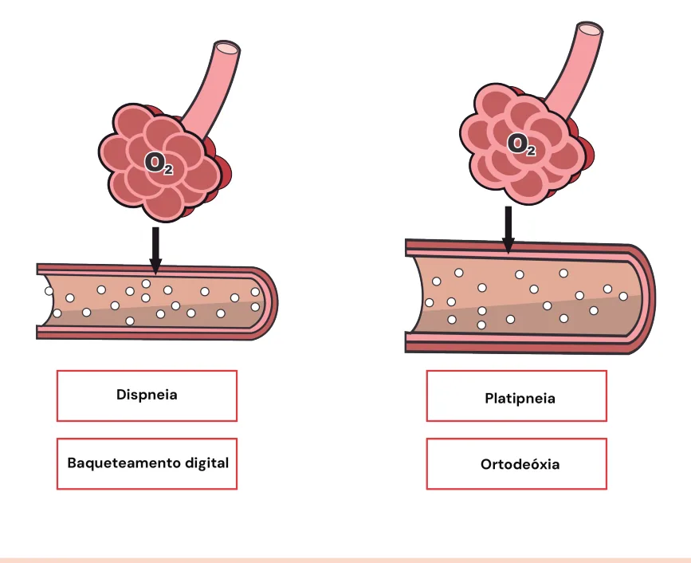

# Cirrose Hepática Varizes Esofágicas e Síndrome Hepatopulmonar

<!-- page:1 -->

## CIRROSE: VARIZES ESOFÁGICAS E

## SÍNDROME HEPATOPULMONAR

## HDA (CM) HEMORRAGIA DIGESTIVA ALTA (HDA) VARICOSA

- Estabilização clínica (1ª conduta): proteção de vias aéreas, expansão volêmica com cristaloides, hemotransfusão se Hb < 7 g/dL

- Controle do sangramento com vasoconstritor esplâncnico (mesmo antes da EDA) Terlipressina ou Octreotide

- Antibioticoprofilaxia para PBE: ceftriaxona

1g/dia (EV)

- Endoscopia Digestiva Alta (EDA), na urgência (ideal até 12h),no paciente estável Esofágicas: ligadura elástica Gástricas: cianoacrilato

- Refratariedade Nova EDA Balão de Sengstaken-Blakemore (terapia de transição, máximo 24h) TIPS Cirurgia para derivação portossistêmica

## HEMORRAGIA DIGESTIVA ALTA

## (HDA) VARICOSA DEFINIÇÃO

- É a HDA secundária à rotura de varizes, sejam esofágicas (maioria) ou gástricas (10-15%), decorrentes da hipertensão portal. Varizes gástricas isoladas: considerar hipertensão portal segmentar;

- Mortalidade: 15 – 25%, em 6 semanas.

- Recorrência: 60 – 70% em 1 – 2 anos (sem profilaxia).

TRATAMENTO Manejo inicial

- Estabilização clínica: Proteção de vias aéreas; Expansão volêmica com cristaloides; Hemotransfusão se Hb < 7 g/dL (limiar mais alto no caso de coronariopatia).

Tabela 1: Vasoconstritores esplâncnicos. VASOCONSTRITOR DO 2mg EV 4/4h na TERLIPRESSINA (1mg) 1mg EV 4/4h se hem Bôlus inicial de 50 OCTREOTIDE (100mcg/mL)

seguido de Profilaxias

- Primária Todos os pacientes com hipertensão portal clinicamente significativa (HPCS) Betabloqueador (1ª escolha): carvedilol (alvo Ligadura elástica (2ª escolha), apenas se intolerância ao B + varizes alto risco

6,25mg 2x/dia)

- Secundária β Para todos os pacientes que já tiveram um sangramento Betabloqueador + ligadura elástica.

## SÍNDROME HEPATOPULMONAR (SHP)

- Caracterizado pela platipneia e ortodeóxia

- Diagnóstico PaO2 < 80 mmHg OU Gradiente de oxigênio alveolar-arterial ≥ 15 mmHg (≥ 20 mmHg se > Identificação de defeito vascular pulmonar

65 anos) E (Ecocardiograma com “microbolhas”)

- Tratamento: O2 suplementar (S/N) + transplante hepático

Manejo específico

- Controle do sangramento com vasoconstritor esplâncnico (mesmo antes da EDA)

- Vasoconstrictor esplâncnico

- Verificar Tabela 1

- Antibioticoprofilaxia para PBE (5 dias ou até estabilidade para alta) Pelo maior risco de translocação bacteriana; Ceftriaxona 1g/dia EV (prioridade) OU Norfloxacino

400 mg/d (7 dias)

- Endoscopia Digestiva Alta (EDA), na urgência (ideal até Esofágicas Ligadura elástica (preferível); Escleroterapia Gástricas Cianoacrilato as primeiras 48h morragia controlada Manter por 2-5 dias após hemostasia endoscópica e 50 mcg/h

12h), quando paciente estável OSE TEMPO DE USO 0mcg EV em 10min,

---

<!-- page:2 -->

ATENÇÃO: lembrar que pacientes cirróticos

- Ligadura elástica (2ª escolha), apenas se:

também podem ter úlceras pépticas. É claro que, | Intolerância ao betabloqueador + varizes de proporcionalmente, sangramento por varizes nestes alto risco (médio ou grosso calibre, presença pacientes é muito comum, mas até confirmação de de redspots).

sangramento por varizes via EDA, é bem indicado também o uso de IBP em dose plena. ATENÇÃO: Todo paciente com HPCS deve ser considerado para profilaxia de descompensação

- TIPS preemptivo com betabloqueador Colocação de um TIPS de forma precoce, entre apresente alto risco de ressangramento, antes

24-72h após a admissão, em um paciente que PROFILAXIA SECUNDÁRIA

- Para todos os pacientes que já tiveram que ocorra a falha do tratamento ou seja, antes da um sangramento necessidade de colocação de um TIPS de resgate

- Betabloqueador + ligadura elástica. Considerar em pacientes: Child B > 7 e EDA com sangramento INDICAÇÕES DE EDA Child C com pontuação 10 a 13

- Se ausência de elastografia e não está em uso

Quadros refratários de betabloqueador

- Nova EDA

- Se plaquetas < 150.000 e não está em uso

- Balão de Sengstaken-Blakemore – é uma terapia de betabloqueador ponte, de transição, baseada em tamponamento

- Se tem contraindicação ao betabloqueador ou não mecânico (sonda de 3 vias); tolera seu uso Lúmen para aspiração de conteúdo gástrico;

- Verificar Tabela 2 Lúmen para insuflar a porção gástrica do balão; Lúmen para porção esofágica. ATENÇÃO: Se o paciente já está em uso de Deve ser utilizado por no máximo 24h: risco elevado betabloqueador, não é necessário realizar EDA para ulceração e perfuração esofágica avaliar varizes.

- TIPS;

## OUTRAS CAUSAS DE

| Útil para reduzir pressão portal;

## | É um shunt portossistêmico intra-hepático. SANGRAMENTO NO CIRRÓTICO

- Cirurgia para derivação portossistêmica.

## GASTROPATIA HIPERTENSIVA PORTAL

## PROFILAXIA PRIMÁRIA

- Padrão em “mosaico” no corpo gástrico

- Todos os pacientes com hipertensão portal | Hemorragias subepiteliais – Principalmente em clinicamente significativa (HPCS) - rever a ficha pacientes com gastropatia mais grave.

resumo de “Cirrose: Conceitos Gerais”

- Se intensa: encarar como HPCS

- Betabloqueador (1ª escolha) Tratamento

- Classicamente betabloqueadores não seletivos:

- Sangramento crônico propranolol, nadolol; | Betabloqueador não seletivo;

- Preferível atualmente: Carvedilol | Reposição de ferro; 3,125 - 6,25 mg 2x/dia | TIPS: se refratário às medidas iniciais. Apresenta melhor tolerância, efeito vasodilatador,

- Sangramento agudo anti-alfa-adrenérgico. | Vasoconstritores esplâncnicos;

- Precaução em ascites volumosas, refratárias.

- Ainda, é possível surgir duodenopatia, enteropatia,

- Suspender em: colopatia hipertensiva portal. PAS < 90 mmHg; Sangramento; PBE; Insuficiência renal.

Tabela 2: Frequência de EDA. Varizes Fator de risco p/ hepatopatia Frequência Presente 2 anos Ausente Quiescente 3 anos Presente 1 ano Fino calibre Quiescente 2 anos Alto risco Ligadura (só se profilaxia secundára ou se não (médio ou grosso calibre, red tolerar betabloqueador na primária) e repetir 2-4 6m e seguir 1/1 ano spots) sem até erradicação

---

<!-- page:3 -->

## GAVE (ECTASIA VASCULAR ANTRAL QUADRO CLÍNICO

## GÁSTRICA)

- Caracterizado pela platipneia e ortodeóxia:

- Ectasias vasculares antrais gástricas; | Platipneia: piora da dispneia ao sentar/ortostase Em aspecto de favo de mel; e melhora ao decúbito. Apesar de não ser “Watermelon stomach” – estômago em melancia; patognomônico, é bastante específico; “Watermelon stomach” – estômago em melancia;

- Não estão associadas à hipertensão portal;

- Outras associações: Esclerose sistêmica;

DRC; Cardiopatia.

## Tratamento

- EDA com plasma de argônio – principal;

- Antrectomia – se refratário;

(SHP)

- Cerca de ¼ dos cirróticos podem apresentar SHP.

- A liberação de citocinas vasodilatadoras, especialmente o óxido nítrico, levam à vasodilatação pulmonar, especialmente nos capilares das bases pulmonares, o que dificulta o acesso dos capilares ao

O2, com um distúrbio de ventilação-perfusão.

- Verificar Figura 1

Figura 1: Quadro clínico e fisiopatologia da síndrome hepatopulm patognomônico, é bastante específico;

| Ortodeóxia: dessaturação quando o paciente passa de uma posição supina para uma posição vertical. Apesar de não ser patognomônico, é bastante específico.

## DIAGNÓSTICO

- PaO2 < 80 mmHg OU Gradiente de oxigênio alveolararterial ≥ 15 mmHg (≥ 20 mmHg se > 65 anos) E

- Identificação de defeito vascular pulmonar Ecocardiograma com “microbolhas”; No átrio esquerdo (AE) em 1 ciclo: No AE, após 3 a 8 ciclos: Dilatação vasos intrapulmonares.

Shunt intracardíaco; CLASSIFICAÇÃO

- Leve: PaO2 ≥ 80 mmHg;

- Moderada: 60-80 mmHg;

- Grave: 50-60 mmHg; Considerar transplante hepático.

- Muito grave: < 50 mmHg.

- O2 suplementar, se necessário;

- Transplante hepático monar (SHP).

