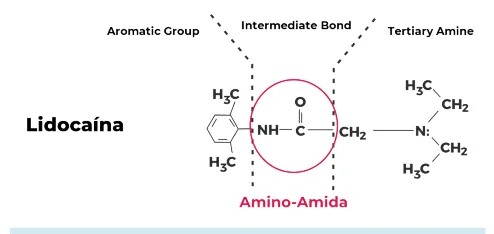

# Cirurgia Plástica Anestésicos Locais

<!-- page:1 -->

## Cirurgia Plástica

## Anestésicos Locais

**Definição**: substância capaz de gerar **bloqueio temporário e reversível da condução nervosa sensitiva e motora**.

- **Bases fracas** (amidas);
- Formulações comerciais são **ácidas** (associação com o íon cloreto), o que causa dor durante a infiltração anestésica.

### Mecanismo de Ação

- Bloqueio nervoso químico;
- Compressão nervosa;
- Distensão nervosa;
- Isquemia induzida pelo vasoconstrictor.

### Vasoconstrictor

- **Prolonga o efeito** do anestésico local;
- Reduz efeitos sistêmicos.

### Farmacocinética

- **Potência**: depende da lipossolubilidade; uma substância fortemente lipossolúvel (hidrofóbica) tem maior facilidade para atravessar a membrana plasmática, tendendo a ser mais potente.
  - Tipos:
    - **Baixa**: Procaína;
    - **Média**: Mepivacaína; Prilocaína; **Lidocaína** → principal representante;
    - **Alta**: Bupivacaína; Ropivacaína; Tetracaína; Etidocaína.

- **Latência**: período entre a administração da medicação e o início do efeito.
  - Depende do **pKa** (valor de pH no qual a concentração da substância na forma não ionizada é semelhante à da forma ionizada);
  - Forma **não ionizada** → efetiva = atravessa a membrana plasmática;
  - Forma **ionizada** (com íon H+) → não efetiva = dificuldade para atravessar a membrana plasmática;
  - pH do sangue = 7,4;
  - pKa lidocaína = 7,9 (25% não ionizada);
  - pKa bupivacaína = 8,1 (15% não ionizada).

- **Duração**: depende da capacidade de ligação a proteínas plasmáticas.
  - Forma **livre** → efetiva;
  - Forma **ligada** → não efetiva (circulante);
  - Quanto maior a forma ligada, maior a duração do efeito.

> ⚠️ Tabela reconstruída a partir de OCR — confira contra a fonte original.

| Anestésico | Início (min) | Duração (min) | Dose máx (mg/kg) |
|---|---|---|---|
| Lidocaína | 10-20 | 60-180 | 5 (7 com vasoconstrictor) |
| Bupivacaína | 15-30 | 180-360 | 3 |
| Ropivacaína | 15-30 | 180-360 | 3 |

Figura 1: Lidocaína - fórmula molecular.

---

<!-- page:2 -->

## Intoxicação por Anestésicos Locais

**Dose máxima da lidocaína**: 5 mg/kg sem vasoconstrictor x 7 mg/kg com vasoconstrictor.
**Dose máxima da bupivacaína e ropivacaína**: ~3 mg/kg.

### Neurológica

- Sinais precoces: **parestesia perioral** e **gosto metálico**;
- Tontura, zumbido, cefaleia, confusão;
- Convulsão, coma, morte.

### Cardíaca

- Arritmias (ex: bradicardia, fibrilação atrial, ventricular);
- Vasodilatação periférica, inotropismo negativo;
- Choque cardiogênico;
- PCR.

### Outros

- Meta-hemoglobinemia;
- Hipertermia maligna.

### Tratamento

- **Suporte**: medidas de suporte gerais;
- Interromper a administração do anestésico;
- Hidratação IV;
- O2 100%, proteção de via aérea;
- Monitorização;
- Controle das complicações cardíacas (**ACLS**);
- Controle de convulsões (**benzodiazepínicos**);
- **Emulsão lipídica intravenosa** (benefício demonstrado em estudos em casos graves).
