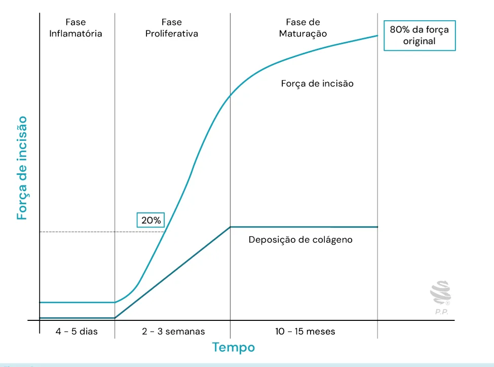

# Cirurgia Plástica - Cicatrização Fisiológica

<!-- page:1 -->

## CIRURGIA PLÁSTICA: CICATRIZAÇÃO

## FISIOLÓGICA

Cicatrização (CIR) INFLAMATÓRIA PROLIF Até 4-6° dia 7-2 Hemostasia Fibro Neutrófilos 24-48h M Tec macrófagos gran 3-5° “Maestros” Neoang Re-ep (quera

## CICATRIZAÇÃO FISIOLÓGICA

- Processo coordenado e dinâmico;

- Cascatas biológicas interligadas;

- Composta de três fases que se sobrepõem: Inflamatória; Proliferativa; Remodelamento ou maturação.

## FASE INFLAMATÓRIA

- Duração: 1º ao 4 – 6º dia;

- Neutrófilos: 24 – 48h;

- Macrófagos: 3 – 5º dia;

- Hemostasia: Vasoconstrição; Tampão plaquetário (hemostasia primária);

5 10 15 Inflamatória Proliferativa (4 - 6 dias) (4 - 24 dias) Figura 1: Gráfico ilustrativo das fases da cicatrização ao longo do FERATIVA MATURAÇÃO 21° dia Até 1-2 anos oblastos Síntese = 7° dia Degradação MEC Colágeno tipo III → I cido de nulação Aumento da força tênsil (nunca 100%)

ngiogênese Contração pitelização (Miofibroblastos; atinócitos) alfa-actina) Maturação Proliferação Inflamação Neutrófilo Macrófago Fibroblasto Linfócito Dias pós-cicatrização 20 25 30 35 Remodelamento (21 dias - 2 anos)

tempo. savitaler saluléc ed oremúN 0 2 4 6 8 10 12 14 16 Figura 2: Predominância celular durante os dias da cicatrização.

---

<!-- page:2 -->

Figura 3: Evolução da força de incisão da cicatriz ao longo do tempo d | Fatores de coagulação (hemostasia secundária). F

- Migração celular: Neutrófilos: fagocitose; Monócitos/Macrófagos: fagocitose, coordenação da cicatrização; Mastócitos: regulação da resposta imune e inflamatória; Inflamação: vasodilatação, edema, dor, rubor.

## FASE FIBROPROLIFERATIVA

- Duração: 7º dia – 21º dia;

- Predominância de fibroblastos: Produção da matriz extracelular (MEC); Colágeno, elastina, fibronectina, ácido hialurônico, glicoproteínas.

- Neoangiogênese: F Brotamento → formação de novos vasos → capilar maduro. F

- Formação tecido de granulação: Células, MEC, capilares, fatores de crescimento.

- Re-epitelização da ferida pelos queratinócitos: F Abundantes próximos a anexos cutâneos; Mais ativos em ambiente úmido.

Colágeno

- Proteína mais abundante - Aprox. ~30 tipos; Tipo I: mais abundante (pele, tendões, ossos); Tipo III: predomina na fase inicial da cicatrização;

- Proporção normal: 4 tipo I : 1 tipo III. de acordo com as fases de cicatrização.

## FASE DE MATURAÇÃO

- Duração: 21º dia a 1 – 2 anos;

- Equilíbrio do colágeno: Síntese = Degradação; Colágeno tipo III → tipo I; Aumento da força tênsil.

- Contração da ferida: TGF - ; Fibroblastos – Miofibroblastos; Capacidade contrátil = fibras alfa-actina.

β

## REFERÊNCIAS

Figura 1: Gráfico ilustrativo das fases da cicatrização ao longo do tempo. Fonte: acervo Medcof. Figura 2: Predominância celular durante os dias da cicatrização.

Fonte: acervo Medcof. Figura 3: Evolução da força de incisão da cicatriz ao longo do tempo de acordo com as fases de cicatrização.

Fonte: acervo Medtcof.

