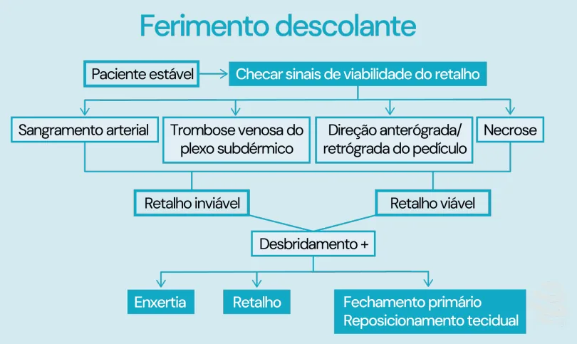
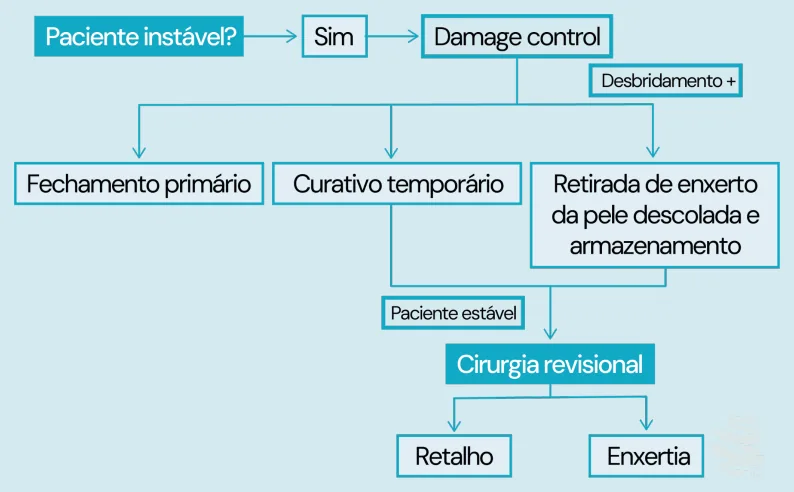

# Cirurgia Plástica - Ferimento Descolante

<!-- page:1 -->

## CIRURGIA PLÁSTICA: FERIMENTO

## DESCOLANTE

OUTROS TEMAS EM CIRURGIA PLÁSTICA Figura 1: Fluxograma: manejo do ferimento descolante em pacientes instáveis.

Figura 2: Fluxograma: manejo do ferimento descolante em pacientes estáveis.

## INTRODUÇÃO

- Fechamento primário = alto risco de falha;

- Membros inferiores (90%);

- Mecanismo do trauma:

- Apresentação: Trauma de alta intensidade → cisalhamento da pele | Variável extensão e perda cutânea;

→ descolamento da pele dos tecidos profundos | Pouco sangramento; → Comprometimento da vascularização arterial e/ | Com traumas isolados ou associados.

ou venosa.

---

<!-- page:2 -->

## TRATAMENTO DESCOLANTE OCULTO

- Atendimento inicial ATLS.

- Descolorante oculto (Morel-Lavallée) → plano

Paciente Instável descolado nos planos profundos, logo, não há perda

- Controle de danos; tecidual visível;

- Cirurgia conservadora de debridamento, associando a

- Diagnóstico clínico ou radiológico (TC ou RNM).

uma das 3 seguintes condutas:

- Tratamento: Fechamento primário;

- Pequeno (conservador): Curativo temporário; | Esvaziamento por punção; Retirada de enxerto da pele | Curativos compressivos;

descolada e armazenamento;

- Extenso ou com perda tecidual:

- Reabordagem em segundo tempo → cirurgia revisional | Cirurgia:

com retalho ou enxertia. | Desbridamento; Paciente Estável | Drenagem/aspiração;

- Checar sinais de viabilidade do retalho; | Enxerto;

- Verificar a direção do tecido descolado; | Retalho;

- Avaliar se o retalho é viável ou inviável → | Escleroterapia.

desbridamento se houver necessidade + alguma das seguintes opções: Enxertia; Retalho; Fechamento primário e reposicionamento tecidual.
