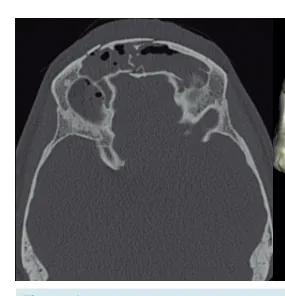
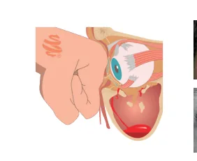
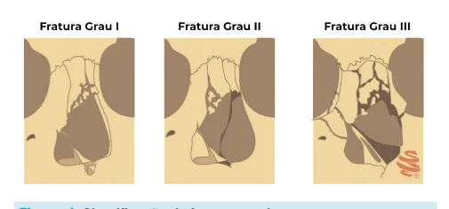
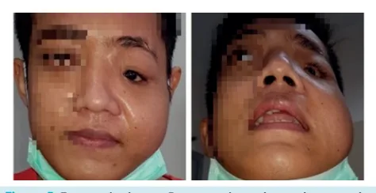
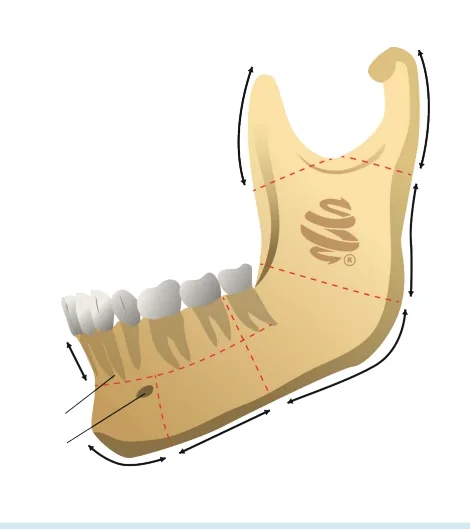
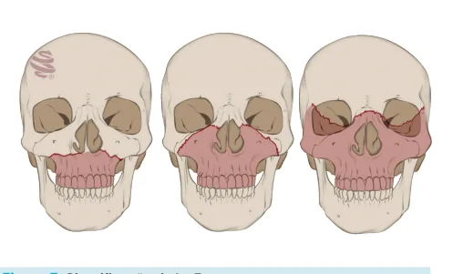

# Cirurgia Plástica - Fraturas de Face

<!-- page:1 -->

## Cirurgia Plástica: Fraturas de Face

*Outros temas em cirurgia plástica.*

### Fratura Tipo Blow-Out (resumo)

- Enoftalmia;
- Diplopia;
- Encarceramento;
- Fraturas das paredes medial e inferior.

### Maxila (Le Fort) — Resumo

- **I**: disjunção dentoalveolar;
- **II**: fratura piramidal;
- **III**: disjunção craniofacial.

## Atendimento Inicial

- Atendimento inicial → **ATLS**.

## Diagnóstico

- **Exame físico**: palpação (crepitação), avaliar mímica facial, dor local, hematoma, epistaxe, afundamentos, proporções da face, mordida;
- **Exames de imagem**: TC com reconstrução 3D (exame padrão-ouro) — cortes axial, coronal e sagital.

## Tratamento

- **Afastar emergências cirúrgicas**: encarceramento do músculo reto inferior; hematoma de septo nasal; hematoma retrobulbar;
- **Reparo precoce** → 5–7 dias após a fratura (até 14 dias): maior facilidade cirúrgica e melhor resultado;
- **Reparo tardio** → mais difícil, mais fibrose e consolidação viciosa.

## Fratura Frontal

### Anatomia

- Tábua anterior;
- Tábua posterior;
- Seio frontal;
- Ducto nasofrontal: comunica o seio frontal com a cavidade nasal.

### Apresentação Clínica

- Laceração, hematoma; equimose periorbital/subconjuntival;
- Afundamento frontal → pode estar ausente pelo "preenchimento" com edema;
- Lesão do nervo supraorbital → causa hipoestesia por lesão completa ou neuropraxia.

### Diagnóstico

- Padrão-ouro: TC de face com reconstrução 3D.

### Tratamento

- Se cirúrgico, reparo precoce: de 5 a 14 dias após o trauma (redução do edema).

## Urgências Cirúrgicas

- Encarceramento do músculo reto inferior;
- Hematoma retrobulbar;
- Hematoma de septo.

### Complicações

- **Rinorreia** (lesão de tábua posterior, lesão da dura-máter com escoamento de líquor pelo seio e saída pelo nariz);
- **Pneumoencéfalo**;
- **Meningite** (comunicação com meio externo);
- **Fístula carotídeo-cavernosa** (complicação tardia): exoftalmia pulsátil; perda visual; proptose; HSA; paralisia dos NC III, IV, VI;
- **Mucocele** (complicação tardia causada por falha de drenagem de secreção do epitélio respiratório, formando coleção sujeita a infecção secundária).

### Diagnóstico e Tratamento Cirúrgico

- Exame físico + TC dos ossos da face.

*Figura 1: Fratura da tábua posterior e anterior.*

- **Indicações de tratamento cirúrgico**: afundamento da parede anterior (indicação estética); fratura da parede posterior (laceração dural) → neurocirurgia; obstrução do ducto nasofrontal (risco de mucocele, nível hidroaéreo persistente);
- **Técnica**: redução aberta com fixação interna com placas e parafusos.

---

<!-- page:2 -->

*Figura 2: Anatomia — ossos e paredes da órbita.*

## Fratura Orbital

- Órbita composta por sete ossos: maxila; zigomático; osso frontal; etmoide; esfenoide; lacrimal; palatino (o osso nasal **não** faz parte da órbita);
- Composta de quatro paredes — medial, inferior, lateral e superior — e região do ápice;
- Paredes medial e inferior são as mais frágeis.

### Estruturas que Dão Passagem a Nervos Cranianos

- **Ápice orbitário**: NC II (óptico);
- **Fissura orbitária superior** (musculatura ocular externa): NC III, NC IV, NC VI; V1 (ramo oftálmico) do NC V;
- **Fissura orbitária inferior**: V2 (ramo maxilar) do NC V;
- **Forame infraorbital**: nervo infraorbital;
- **Forame supraorbital**: nervo supraorbital.

*Figura 3: Encarceramento muscular (emergência cirúrgica).*

### Apresentação Clínica

- Diplopia;
- Hematoma retrobulbar;
- Hemorragia subconjuntival;
- Equimose ou hematoma periorbital;
- Exoftalmia;
- Enoftalmia (afundamento do olho);
- Ptose palpebral;
- Alteração de acuidade visual, reflexo pupilar e movimento ocular;
- Perda da visão;
- Entrópio, ectrópio (inversão ou eversão da pálpebra);
- Anestesia do nervo infraorbital (parestesia na região nasal, malar e lábio superior).

### Diagnóstico

- Exame físico + TC.

### Urgência Cirúrgica

- Encarceramento muscular.

### Tratamento Cirúrgico

- Redução aberta com fixação interna com placas e parafusos.

### Complicações

- Diplopia persistente;
- Enoftalmia acentuada;
- Encarceramento muscular.

## Fratura Tipo Blow-Out

- Aumento súbito da pressão intraocular;
- Descompressão pela fratura das paredes medial e inferior (paredes mais frágeis);
- Herniação para o seio maxilar;
- **Encarceramento do músculo reto inferior** (paciente não consegue olhar para cima);
- Enoftalmia (afundamento da órbita).

### Síndrome da Fissura Orbitária Superior

- Acomete NC III, IV, VI: oftalmoplegia; dor; pupila midriática não fotorreagente; imobilidade ocular; ptose palpebral;
- Reflexo óculo-cardíaco: náuseas/vômitos, bradicardia e hipotensão.

### Síndrome do Ápice Orbitário

- Síndrome da fissura orbitária superior + NC II (amaurose);
- Hipoestesia palpebral, conjuntival e corneana.

---

<!-- page:3 -->

## Fratura Naso-Órbito-Etmoidal (NOE)

### Anatomia

- Cinco ossos: nasal, maxilar, frontal, lacrimal, etmoide;
- Fratura do osso nasal, orbital e etmoide;
- Fraturas combinadas (66%): frontal, zigoma, maxila;
- Bilaterais (66%).

### Apresentação Clínica

- Afundamento nasal;
- Equimose, hematoma;
- Crepitação;
- Telecanto traumático (afastamento traumático das partes moles); desinserção do tendão cantal medial;
- Epífora.

### Classificação de Markowitz

- **Tipo I**: fragmento único;
- **Tipo II**: cominuição, tendão cantal inserido;
- **Tipo III**: cominuição, tendão cantal desinserido.

### Diagnóstico

- Exame físico + TC de face.

### Tratamento

- **Redução fechada precoce** (maioria dos casos);
- **Redução aberta com fixação interna** com placas e parafusos;
- **Tratamento cirúrgico**: reposicionamento ósseo e reinserção do tendão cantal medial.

## Fratura Nasal

- Forças laterais, ântero-posteriores e mistas;
- Graus de gravidade: quanto maior o grau, maior a cominuição óssea.

### Classificação

- **Grau I**: fratura distal dos ossos nasais;
- **Grau II**: fratura total dos ossos nasais + septo dorsal;
- **Grau III**: NOE, indo das piriformes até processos frontais da maxila, com telescopagem do septo, perda de altura nasal e queda do dorso nasal.

*Figura 4: Classificação de fratura nasal.*

### Apresentação Clínica

- Epistaxe;
- Laterorrinia (desvio da linha média);
- Obstrução nasal;
- Fratura palpável;
- Nariz em sela;
- **Hematoma de septo = emergência cirúrgica** → drenagem + colocação de splint/tampão.

### Tratamento

- **Redução fechada precoce** (maioria): realizar de 5 a 7 dias após o trauma; até 2 horas do trauma, se laterorrinia como lesão isolada → redução incruenta com sedação e bloqueio anestésico regional;
- **Rinoplastia aberta**: fraturas grau II/III (NOE);
- Osteotomias, enxerto ósseo e de cartilagem.

### Complicações

- Deformidades estéticas;
- Obstrução de vias aéreas;
- Infecção;
- Fibrose septal;
- Espessamento septal;
- Sinéquias.

## Fratura de Zigoma e Arco Zigomático

- Zigoma → músculo da mastigação;
- **Suturas**: frontal (ZF); maxilar (ZM); temporal; esfenoidal.

### Apresentação Clínica

- Equimose, hematoma;
- Hemorragia subconjuntival;
- Distopia ocular;
- Obliquidade da fenda palpebral;
- Lesão do nervo infraorbital;
- Afundamento do malar;
- Trismo;
- Maloclusão.

*Figura 5: Fratura de zigoma — presença de equimose, hemorragia subconjuntival, distopia ocular, obliquidade da fenda palpebral.*

### Diagnóstico

- Exame físico + TC.

### Tratamento

- Depende de: local da fratura; grau do desvio; cominuição;
- **Não cirúrgico**: fraturas alinhadas, sem cominuição.

---

<!-- page:4 -->

### Tratamento Cirúrgico

- **Redução fechada**: fraturas de arco isoladas com desvio medial; fratura incompleta da sutura ZF;
- **Redução aberta com fixação interna com placas e parafusos**: fraturas cominutivas; diástase da sutura ZF, ZM; desvio lateral do arco e do corpo do zigoma; fratura de assoalho orbital.

## Fratura Maxilar

- Localizada centralmente na face e relacionada com graus de alto impacto;
- Geralmente a fratura ocorre na região mais anterior e medial.

*Figura 6: Maxila destacada em verde.*

### Apresentação Clínica

- Dor/edema;
- Equimose/hematoma;
- Crepitação óssea;
- Lesão do nervo infraorbital;
- Maloclusão;
- Mordida aberta anterior;
- Fratura alveolar → rompimento da gengiva;
- Face alongada e retraída.

## Classificação de Le Fort

- **Tipo 1**: transversal — acima dos processos alveolares dos dentes, próximo à altura do seio piriforme, estendendo-se lateralmente até os pterigóides laterais;
- **Tipo 2**: fratura piramidal — desde os processos pterigóides posteriores, subindo em direção craniomedial, passando pela maxila e pela parede inferior da órbita, unindo-se na linha média próxima ao osso nasal com uma fratura contralateral (pode causar fístula liquórica);
- **Tipo 3**: disjunção craniofacial — completa separação do crânio do restante da face, podendo ocorrer alongamento da face/retração; pode causar fístula liquórica.

*Figura 7: Classificação de Le Fort.*

### Tratamento

- **Objetivo**: restaurar oclusão, altura e projeção da face;
- **Cirúrgico**: redução aberta com fixação interna, com ou sem bloqueio intermaxilar, por meio de placas e parafusos.

## Fratura Mandibular

- Sínfise, parassínfise;
- Corpo;
- Ângulo da mandíbula;
- Ramos da mandíbula;
- Côndilo, processo coronoide;
- O corpo e o ângulo são mais suscetíveis a fraturas;
- **Músculos da mastigação**: temporal; masseter; pterigóideo medial; pterigóideo lateral.

*Figura 8: Anatomia da mandíbula.*

---

<!-- page:5 -->

## Apresentação Clínica

- Dor e crepitação;
- Trismo;
- Maloclusão;
- Laceração gengival/alveolar;
- Perda dentária;
- Desvio mandibular;
- Parestesia do lábio inferior e dentária.

## Classificação

- Depende de: localização; direção da fratura; favorabilidade; condição dentária;
- Fraturas favoráveis e desfavoráveis;
- Fraturas cominutivas;
- Fraturas em edêntulos;
- Fraturas condilares (intracapsulares) e subcondilares.

## Tratamento

- Redução aberta com fixação interna com placas e parafusos ± bloqueio intermaxilar.

## Referências

Figura 1: Fratura da tábua posterior e anterior. Fonte: RADIOPAEDIA. Radiopaedia.org. Disponível em: https://www.radiopaedia.org/. Acesso em: 23 jun. 2025.

Figura 2: Anatomia - Ossos e paredes da órbita. Fonte: acervo Medcof.

Figura 3: Encarceramento muscular (emergência cirúrgica). Fonte: acervo Medcof.

Figura 4: Classificação de fratura nasal. Fonte: acervo Medcof.

Figura 5: Fratura de zigoma. Presença de equimose, hemorragia subconjuntival, distopia ocular, obliquidade da fenda palpebral. Fonte: NELIGAN, P. Plastic surgery. 4. ed. v. 4. London: Elsevier, 2018.

Figura 6: Maxila destacada em verde. Fonte: acervo Medcof.

Figura 7: Classificação de Le Fort. Fonte: acervo Medcof.

Figura 8: Anatomia da mandíbula. Fonte: acervo Medcof.
