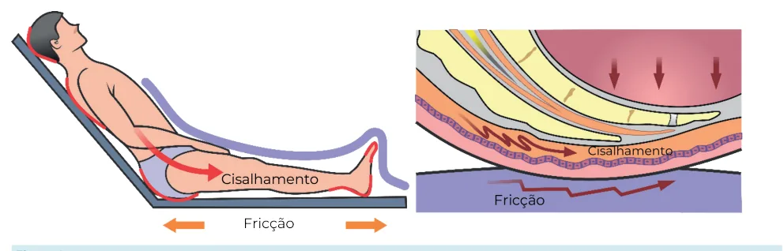
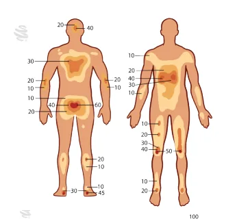
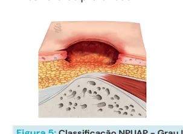
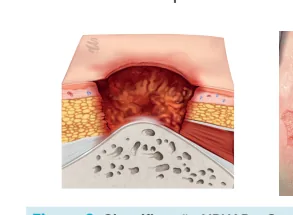

# Cirurgia Plástica - Lesões por Pressão

<!-- page:1 -->

## CIRURGIA PLÁSTICA

## LESÕES POR PRESSÃO

Outros temas em cirurgia plástica Fatores de risco: Prevenção:

- Imobilidade;

- Mudança de decúbito a cada 2h;

- Desnutrição;

- Evitar cisalhamento e umidade;

- Má perfusão tecidual;

- Evitar ressecamento da pele;

- Perda de sensibilidade;

- Otimizar estado nutricional;

- Espasticidade.

- Espumas, silicone, colchões de ar ou água, “caixa de retirada a pressão;

NPUAP ovos”, pneumáticos… I. Hiperemia que não desaparece após Quando operar?

- Se foco infeccioso, desbridar.

II. Exposição da derme; Reconstruir? III. Exposição de subcutâneo;

- Lesão em melhora; estado nutricional otimizado;

IV. Tecidos profundos (músculo, osso, tendão). decúbito; ferida limpa e sem infecção. Não classificável: Capa necrótica.

Lesão tissular profunda: Lesão profunda, derme íntegra. Figura 1: Etiologia das lesões por pressão.

## INTRODUÇÃO

- Impacto no sistema de saúde;

- Etiologia multifatorial: Locais (pressão, cisalhamento, infecção); Sistêmicos (idade, comorbidades, desnutrição).

- Verificar Figura 1

- Fator de risco: imobilidade ( idosos, fraturas de MMII, doenças neurológicas).

- Fisiopatologia: Pressão de fechamento capilar: 32 mmHg; LP: > 50 mmHg por > 2h.

- Áreas predispostas: Proeminências ósseas.

Figura 2: Áreas predispostas a lesão por pressão.

- Suscetibilidade tecidual à isquemia; Músculo é o mais suscetível.

---

<!-- page:2 -->

## CLASSIFICAÇÃO NPUAP

Lesão profunda suspeita: (NATIONAL PRESSURE ULCER

- Pele íntegra, alteração na coloração cutânea;

## ADVISORY PANEL)

- Pele tende a apresentar aspecto amarronzado, arroxeado/violáceo;

Grau I:

- Pode haver formação de bolhas hemorrágicas.

Grau I:

- Epiderme intacta.

- Eritema fixo – permanece após compressão (análogo à queimadura de primeiro grau).

Figura 3: Classificação NPUAP - Grau I.

- Grau II:

- Epiderme e derme;

- Não atinge o tecido subcutâneo;

- Dor, sensibilidade local.

Figura 4: Classificação NPUAP - Grau II.

- Grau III:

- Epiderme, derme e do tecido subcutâneo;

- Não apresentando exposição das estruturas profundas.

- Figura 5: Classificação NPUAP - Grau III.

Grau IV:

- Epiderme, derme, tecido subcutâneo com exposição das estruturas profundas.

- Figura 6: Classificação NPUAP - Grau IV. - Pode haver formação de bolhas hemorrágicas.

Figura 7: Classificação NPUAP - Lesão profunda suspeita. Lesão não classificável:

- lesão coberta por escara/ esfacelos;

- Necessita desbridamento (retirada da escara) para posterior reclassificação.

Figura 8: Classificação NPUAP - Lesão não classificável.

## OSTEOMIELITE

- Na presença de lesão profunda (grau III e IV), é imperativo descartar a presença de osteomielite;

- Quadro Clínico: Dor – se sensibilidade preservada; Úlcera com descarga purulenta; Febre; Leucocitose.

Exames Pré-Operatórios

- TC ou RNM: alterações da consistência óssea; abscessos.

Figura 9: Osteomielite.

## TRATAMENTO

- Principal: PREVENÇÃO! Mudança regular de decúbito; Avaliação de risco: escala de Braden (percepção sensitiva; umidade; atividade; mobilidade; nutrição; Equipe multidisciplinar; Controle de comorbidades; Cuidados com a pele; hidratação; curativos;

fricção e/ou cisalhamento.); produto de barreira; controle de incontinência;

---

<!-- page:3 -->

| Nutrição; Outras lesões por pressão | Espasticidade (Reabilitação; Medicamento;Cirurgia);

- Couro cabeludo: Controle de incontinência; | Retalho em hélice; Dispositivos de alívio de pressão.

- Nariz: Retalho nasogeniano;

LESÕES GRAU I E II:

- Não cirúrgico;

- Pode demonstrar resolutividade apenas com as medidas de prevenção.

LESÕES GRAU III E IV:

- Cirúrgico; Excisão em bloco da Bursa; Excisão de espículas ósseas; Preencher espaço morto. Retalhos fasciocutâneos e miocutâneos

- Otimização clínica: Adequar suporte nutricional Hb > 10, 0 g/dL e albumina > 3,5 mg/dL.

- Suspeita de osteomielite: Reconstrução em dois tempos; cultura óssea; biópsia óssea;

- Baixo risco para osteomielite: Reconstrução em tempo único;

- Complicações: Necrose do retalho; Recidiva da LP; Sinus; Úlcera de Marjolin.

Lesão por pressão sacral:

- Retalho de avanço V-Y;

- Retalho de rotação/transposição;

- Objetivo é mover os tecidos para que ocorra o fechamento do espaço morto.

Lesão trocantérica:

- Retalho tensor da fáscia lata;

Lesão isquiática:

- Retalho de avanço posterior da coxa;

- Comum em pacientes acamados e restritos a cadeira de rodas; | Retalho nasogeniano;

- Tornozelo/calcâneo: Retalho sural reverso; Microcirurgia.

Escaras estáveis de extremidades.

- Características: seca; sem sinais de infecção; sem odor fétido.

- Em pacientes debilitados, em muitos casos é preferível manter a escara , sem operar.

## REFERÊNCIAS

Figura 3: Classificação NPUAP - Grau I. Fonte: SONG, D. H.; NELIGAN, P. C. Plastic Surgery. Volume 4: Trunk and Lower Extremity. 4. ed. Philadelphia; St. Louis: Elsevier Health Sciences,

## 2017. ISBN 978-0-323-35706-7

Figura 4: Classificação NPUAP - Grau II. Fonte: SONG, D. H.; NELIGAN, P. C. Plastic Surgery. Volume 4: Trunk and Lower Extremity. 4. ed. Philadelphia; St. Louis: Elsevier Health Sciences,

Figura 5: Classificação NPUAP - Grau III. Fonte: SONG, D. H.; NELIGAN, P. C. Plastic Surgery. Volume 4: Trunk and Lower Extremity. 4. ed. Philadelphia; St. Louis: Elsevier Health Sciences,

Figura 6: Classificação NPUAP - Grau IV. Fonte: SONG, D. H.; NELIGAN, P. C. Plastic Surgery. Volume 4: Trunk and Lower Extremity. 4. ed. Philadelphia; St. Louis: Elsevier Health Sciences,

Figura 7:Classificação NPUAP - Lesão profunda suspeita. Fonte: SONG, D. H.; NELIGAN, P. C. Plastic Surgery. Volume 4: Trunk and Lower Extremity. 4. ed. Philadelphia; St. Louis: Elsevier Health Sciences,

Figura 8: Classificação NPUAP - Lesão não classificável. Fonte: SONG, D. H.; NELIGAN, P. C. Plastic Surgery. Volume 4: Trunk and Lower Extremity. 4. ed. Philadelphia; St. Louis: Elsevier Health Sciences,

Figura 9: Osteomielite. Fonte: adaptado de RADIOPAEDIA.ORG. Radiopaedia. Disponível em: https://www.radiopaedia.org/. Acesso em: 16 jun. 2025.
