# Cirurgia Vascular Aneurisma de Aorta I e II

<!-- page:1 -->

## CIRURGIA VASCULAR: ANEURISMA

## DE AORTA I E II

Aneurismas

- Aneurisma de aorta: em geral assintomático, sintomas já são sinais de mau prognóstico.

- Rastreio: homem > 65 anos tabagista - doppler aorta e ilíacas

- USG para seguimento, AngioTC para planejamento cirúrgico

- Indicação eletiva: Homens > 5,5cm, Mulheres >

5cm (Fusiformes)

## CONSIDERAÇÕES INICIAIS

## DEFINIÇÃO

- É a dilatação de todas as camadas da parede da artéria, atingindo um diâmetro ≥ 1,5x o diâmetro original/esperado.

OBS.: Em geral, a aorta apresenta 2,0 cm de diâmetro. Por definição, as dilatações acima de 3,0 desta artéria são denominadas aneurismas, enquanto que as dilatações entre 2,0 – 3,0 cm são denominadas ectasias.

## ETIOLOGIA

- Degenerativos ou ateroscleróticos – associados ao envelhecimento, são os mais comuns;

- Infecciosos ou micóticos – associados a doenças como tuberculose

- Inflamatórios – como, por exemplo, os aneurismas relacionados a doenças autoimunes

## CLASSIFICAÇÃO – MORFOLÓGICA

ANEURISMA FUSIFORME:

- Demonstra dilatação homogênea da artéria;

- Normalmente, é associado com os aneurismas de etiologia degenerativa;

- Apresentam padrão relativamente previsível de comportamento e crescimento.

## ANEURISMA SACULAR

- Decorrem em maior instabilidade, pela morfologia irregular → pior prognóstico, com maior tendência à rotura;

- Em geral, associa-se com as etiologias inflamatórias

(principalmente doença de Takayasu)/micóticas (principalmente tuberculose);

- Pelo risco associado, em conjunto com o comportamento imprevisível, todos os aneurismas saculares sempre são operados, independentemente do diâmetro.

- Verificar Figura 1 - Correção cirúrgica: Aberta x Endovascular Endovascular: Colo > 1,5cm para fixação das endopróteses Na rotura: preferência pelo endovascular

(menor mortalidade)

- Complicações: Endoleaks, Isquemia mesentérica, Isquemia medular, infecção de endopróteses, etc.

(A) Fusiforme (B) Sacular Figura 1: Variações de aneurisma.

## FATORES DE RISCO

- Idade;

- Sexo masculino;

- Tabagismo – é o fator modificável associado mais importante;

- História pessoal prévia de aneurisma em outras artérias do corpo (provável indicativo de doença do colágeno);

- História familiar de aneurisma;

- Aterosclerose;

- Hipertensão arterial sistêmica;

ATENÇÃO: Diabetes mellitus não é um fator de risco! De modo oposto, alguns estudos consideram a comorbidade como fator protetor.

## FISIOPATOLOGIA

- Marcada por uma série de alterações na parede aórtica;

- Durante a sístole, a artéria se dilata de modo a receber o volume direcionado pelo ventrículo esquerdo e depois retorna ao seu diâmetro original - isso é chamado complacência;

---

<!-- page:2 -->

- Substâncias associadas à elasticidade;

- Em geral, há indicação cirúrgica. Lembre-se, Colágeno tipo III; existem exceções. Elastina.

- Exame para diagnóstico + planejamento cirúrgico →

- Conforme o envelhecimento ocorre, há angiotomografia de aorta e ramos.

degeneração da matriz celular, pela perda da degeneração da matriz celular, pela perda da disponibilidade das substâncias na parede da aorta – metaloproteínas, elastases etc;

| Redução dos níveis de colágeno III e de elastina; | Aparente aumento do colágeno tipo I (associado a rigidez);

- Perda da complacência – favorece dilatações progressivas, sem o fator de “retorno” ao tamanho original aneurisma.

OBS.: A localização mais frequente dos aneurismas é na aorta infrarrenal – naturalmente, há menor quantidade de elastina e colágeno tipo III nessa região. P Isso porque a composição e elasticidade da aorta varia A de acordo com o gradiente de pressão ao qual cada d segmento é submetido.

## DIAGNÓSTICO E RASTREIO DO

## ANEURISMA DE

## AORTA ABDOMINAL

- Em boa parte dos casos, a evolução do aneurisma é assintomática! O screening é recomendado para prevenção de rotura.

## ASSIM, RECOMENDA-SE O RASTREIO EM

## POPULAÇÃO COM MAIOR RISCO HOMENS, > 65 ANOS, TABAGISTAS

- Método 1 ultrassom abdominal com doppler ; Sem alterações: não há indicação em repetir; Com alterações: seguir conforme os achados.

## PARA O PACIENTE ASSINTOMÁTICO → EXAME

## DE DIAGNÓSTICO

- Exame físico: massa pulsátil abdominal;

- Exame de imagem: Ultrassonografia de abdome com doppler; Ultrassom de aorta e ilíacas com doppler.

- O USG realizado de modo adequado é capaz de: Identificar as artérias mesentérica, tronco celíaco, artérias renais; Localizar o aneurisma em relação aos ramos viscerais; Identificar a presença de trombo mural; Classificar o aneurisma: fusiforme ou sacular; Medir o diâmetro.

PARA O PACIENTE SINTOMÁTICO:

- Sintomas: dor abdominal (por compressão de estruturas adjacentes ou por acometimento do plexo nervoso visceral), isquemia de membros (secundária à embolização do trombo mural). Geralmente, aneurismas sintomáticos são grandes, >7-8cm.

- Aneurismas sintomáticos têm pior prognóstico e maior risco de rotura OBS.: A reconstrução 3D é importante para a conduta, mas não é suficiente para estabelecer indicação cirúrgica, na medida em que oculta dados essenciais na tomada de decisão, como a presença dos trombos.

Nesse sentido, as reconstruções axiais são de suma importância já que consideram os elementos contrastados e os não contrastados, estabelecendo o diâmetro verdadeiro do aneurisma.

## TRATAMENTO

PACIENTE ASSINTOMÁTICO: A indicação depende da morfologia e do diâmetro do aneurisma;

- Sacular correção cirúrgica eletiva precoce, sempre! Preparo pré-operatório enxuto e cirurgia eletiva assim que possível.

- Fusiforme depende do diâmetro (principal fator preditor de rotura),onforme o Aortic Index; Homens > 5,5 cm; Mulheres > 5 cm.

0.0 1.0 2.0 3.0 4.0 5.0 6.0 7.0 8.0 9.0 10.0 adipmor oãçroporP %001 %57 %05 %52 %0 Homem Mulher P=0.195 Índice do tamanho aórtico (cm/m2)

Figura 2: Aortic Index: correção do diâmetro do aneurisma pelo tamanho do paciente. adipmor oãçroporP %001 %57 %05 %52 %0 Mulher Homem P<.001 0 1 2 3 4 55 , 56 7 8 9 10 11 12 13 14 15 Diâmetro do aneurisma (cm)

Figura 3: Proporção de ruptura de acordo com diâmetro do aneurisma.

---

<!-- page:3 -->

OBS.: A principal complicação do aneurisma não

- Como proceder - técnica? abordado é a rotura! Associa-se com elevada taxa de | Identificação do saco aneurismático;

mortalidade, mesmo quando submetida à correção | Identificação das artérias ilíacas; cirúrgica em tempo hábil. A taxa de rotura aumenta | Identificação do colo proximal e das artérias com o diâmetro! renais; A veia renal esquerda é um marco – cruza anteriormente à aorta (na maioria dos indivíduos) → 1° critério → crescimento acelerado; limite cranial.

- Taxa > 1 cm/ano ou 0,5 cm/semestre → sinal | Identificação da artéria mesentérica inferior;

de instabilidade! | Controle proximal e distal aorta + abertura do

- Conduta: Internação; pré-operatório enxuto com saco aneurismático;

tomografia. Cirurgia o mais breve possível. | Visualização do óstio da artéria mesentérica inferior 2° critério → embolização de trombos; e das artérias lombares; evidencia-se extenso

- Lembre-se: toda vez que há uma dilatação do sangramento – as artérias lombares e a artéria diâmetro arterial, há evolução com turbilhonamento mesentérica inferior fazem parte da rede colateral.

do fluxo; o turbilhonamento favorece a formação de Proceder com ligadura das lombares e do óstio da trombos, haja vista que o fluxo deixa de ser linear. artéria mesentérica inferior

- A embolização de trombos acomete os principais | Anastomose proximal e distal(is) territórios de vascularização da aorta: mesentéricas, | Revestimento da prótese com a capa aneurismática renais, membros inferiores. a fim de evitar o contato da prótese com alça

- Conduta: Internação; pré-operatório enxuto; cirurgia intestinal → pode causar fístula aorto-entérica;

o mais breve possível - Nesses casos, nem sempre é necessário proceder com a revascularização do território embolizado! Deve-se avaliar caso a caso.

3° critério → dor;

- A dor pode ser causada por: crescimento e rápida distensão da parede arterial; compressão das estruturas adjacentes; avaliação: à palpação ou referida. → é considerado iminência de rotura.

- Conduta: Internação; correção cirúrgica de URGÊNCIA é impossível prever a possibilidade de rotura!

4° critério → rotura;

- É a perda de continuidade da parede da aorta.

Geralmente se apresenta com sinais de instabilidade hemodinâmica (como desmaio);

- Demonstra altíssima taxa de mortalidade por choque hemorrágico;

- Constitui indicação cirúrgica de EMERGÊNCIA!

## TÉCNICA CIRÚRGICA

## ABERTA → ENXERTO COM PRÓTESE

## DE DACRON

- Tipos: Aorto-aórtico, aorto-biilíaco (preferíveis) ou aorto-femoral (evitado quando possível, pois causa desvascularização do território das artérias ilíacas internas);

- É viável para quaisquer anatomias.

- Aspecto cirúrgico:

D.V Figura 5: Passo-a-passo do tratamento cirúrgico aberto Figura 4:: Tratamento cirúrgico aberto do aneurisma da aorta abdominal infrarrenal.

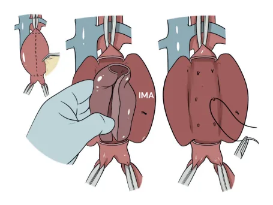

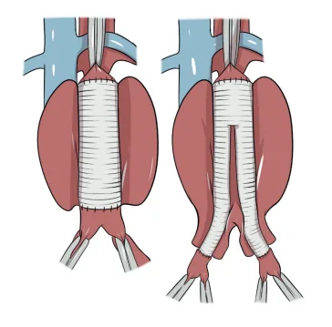

---

<!-- page:4 -->

| Classificação: proximal ou distal. | Extensão mínima: 1,5 cm – na região infrarrenal e ilíaca, mas pode variar de acordo com a marca fabricante da prótese.

Figura 6: Anatomia do aneurisma de aorta. OBS.: Ao lado, enumera-se como: 1 - veia renal esquerda (cruza anteriormente a aorta), 2 – duodeno, 3 – saco aneurismático, 4 – artéria ilíaca comum direita.

## ENDOVASCULAR (EVAR) TRADICIONAL

IMPLANTE DE STENT REVESTIDO POR TECIDO; Figura 7: Modelos de endopróteses utilizadas

- Não é viável para qualquer anatomia; no reparo endovascular.

- Configura um procedimento de menor porte cirúrgico e anestésico.

- Como proceder - técnica? Acesso através das artérias femorais – principalmente nos aneurismas infra-renais; Liberação das próteses + vedação do aneurisma.

ATENÇÃO: Nem sempre o reparo endovascular é simples e viável!

- Pré-requisitos mínimos para a cirurgia endovascular: Colo – é a região saudável, na qual a prótese está em contato, 360°, com a parede aórtica. É Figura 8: Tratamento endovascular dos aneurismas fundamental para a selagem da prótese, de modo a da aorta abdominal infrarrenal (EVAR).

isolar o saco aneurismático.

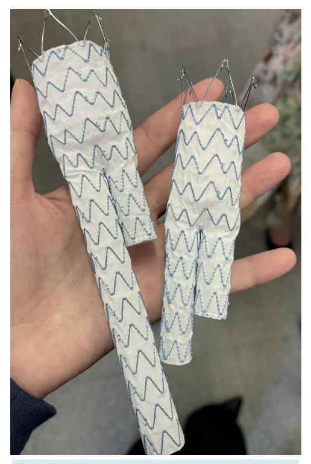

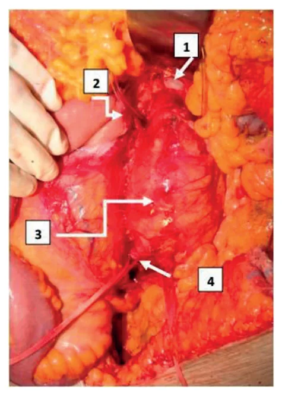

---

<!-- page:5 -->

Figura 9: Tratamento endovascular dos aneurismas da aorta abdominal infrarrenal (EVAR). ENDOVASCULAR → ALTERNATIVAS;

- Endopróteses ramificadas ou fenestradas para aneurismas complexos; Constituem alternativa aos casos em que o uso de endoprótese, por via tradicional, é inviável; Apresenta possibilidade de fixação em porção torácica da aorta; Considerações: Maior custo; maior tempo cirúrgico;

demora de fabricação – existem dispositivos off the shelf (com ramos ou fenestras padronizados, que atendem a maior parte da população);

Menor disponibilidade. Figura 10: Endopróteses ramificadas e fenestradas

- Endoprótese ramificada de ilíaca; Recomendadas aos pacientes com aneurisma de artéria ilíaca comum (com colo distal desfavorável); A ancoragem da prótese é realizada na artéria ilíaca interna e externa; Figura 11: Endoprótese ramificada de ilíaca

- Stent em paralelo; Também chamado de chaminé (stent para cima) ou periscópio (stent para baixo); Utilizado apenas no contexto de urgência abordagem aberta, se indisponibilidade de prótese endovascular adequada); Deve ser posicionado inferiormente à endoprótese ramificada ou fenestrada; Posicionar, no máximo, 2 stents associados à endoprótese; atentar-se ao fato da possibilidade de formação de goteiras (zona de possível endoleak).

(na eletiva, preferir próteses ramificadas ou Figura 12: Técnica de stents em paralelo - chaminé Figura 13: Técnica de stents em paralelo - chaminé

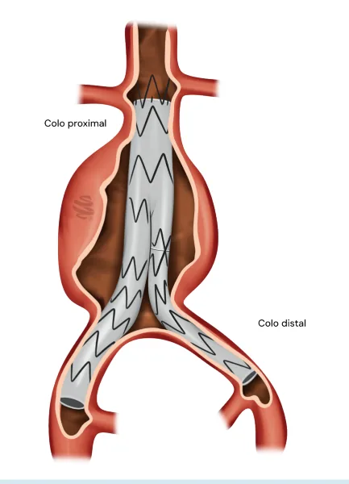

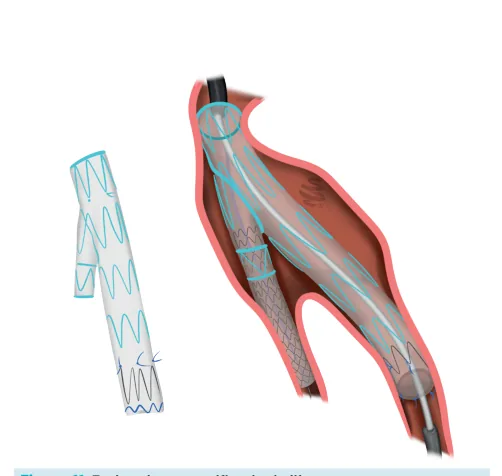

---

<!-- page:6 -->

- Por que a técnica endovascular não é indicada para todos os pacientes? Alto custo; Durabilidade ainda não é bem determinada:

Necessidade de reintervenções associadas ao Necessidade de reintervenções associadas ao aneurisma (endoleaks);

| Necessidade de controle com angiotomografia. Ainda está em desenvolvimento, e expansão, a técnica por USG com contraste (microbolhas), para melhor avaliação.

Como racionalizar?

- Alto risco cirúrgico → reparo endovascular, se possível;

- Baixo risco cirúrgico → reparo aberto, provavelmente;

- Aneurisma roto → reparo endovascular, sempre que possível.

## ANEURISMA TORÁCICO

- Menos frequente

- Indicações: Reparo de urgência → mesmos critérios Reparo eletivo (nos pacientes assintomáticos):

homens > 6 cm e mulheres > 5,5 cm

- Marcos anatômicos: Colo proximal: artéria subclávia esquerda Colo distal: tronco celíaco

- Tratamento: Preferência pelo reparo endovascular. O ponto mais comum de ancoragem proximal da prótese da EVAR torácica é a zona 3 (Z3). No caso de necessidade de ancoragem na Z1, pensar em revascularizar artérias carótida e subclávia. Aberto: Debranching Endovascular: Endopróteses ramificadas ou fenestradas.

- - - - - C

- Figura 14: Anatomia da aorta torácica com suas zonas de ancoragem. Figura 15: Estratégia de revascularização da artéria subclávia aberta. Debranching aorta ascendente - tronco braquiocefálico artéria carótida interna esquerda e subclávia esquerda.

Figura 16: Estratégias de revascularização da artéria subclávia endovascular. Endoprótese ramificada (esquerda)

e fenestrada (direita).

## ANEURISMA TORACOABDOMINAL

- Menos frequente

- Reparo de urgência: mesmos critérios

- Reparo eletivo (nos pacientes assintomáticos): Diâmetros torácicos: homem > 6 cm; Diâmetros abdominais: homem > 5,5 cm;

mulher > 5,5 cm mulher > 5 cm

- Cobrir o mínimo de aorta possível

- Risco de paraplegia por isquemia de medula secundária à oclusão de artérias lombares

- Reparo endovascular x toracofrenolaparotomia

## COMPLICAÇÕES PRECOCES

## SÍNDROME COMPARTIMENTAL

- Complicação frequente em pós-operatório de aneurisma roto (pois é um paciente que previamente apresentava um hematoma de retroperitônio, recebe alto volume em intra-operatório e cursa frequentemente com edema de alças).

- 50% dos rotos (corrigido por técnica aberta ou endovascular) desenvolvem hipertensão intraabdominal (>12mmHg) e 20% vão desenvolver

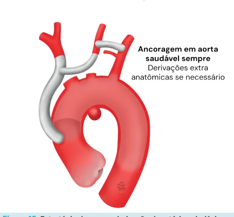

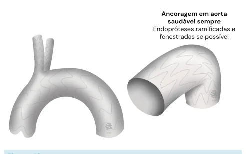

---

<!-- page:7 -->

síndrome compartimental (>20mmHg). Também ISQUEMIA MEDULAR: ocorre em alguns aneurismas operados eletivamente.

- Complicação precoce, associada à oclusão das

- Fatores de risco: artérias que irrigam a coluna – ocorre principalmente Uso de balão intra-aórtico em aneurismas toracoabdominais ou torácicos; Coagulopatia

- Artéria de Adamkiewicz (artéria radicular magna); Coagulopatia Transfusão maciça Perda de consciência PCR pré-operatória Hipotensão no intraoperatório Uso de próteses aorto monoilíacas (cada vez menos utilizado)

- Tratamento: peritoneostomia e à Barker (centro e direita).

Figura 17: Peritoneostomia com kit de vácuo (à esquerda) ISQUEMIA MESENTÉRICA:

- Pode ocorrer tanto no reparo aberto quanto no reparo endovascular;

- Vascularização do intestino: Artérias principais: Tronco celíaco; Artéria mesentérica superior; Artéria mesentérica inferior; É sabido que todas essas artérias são interligadas por redes de colaterais; A comunicação do tronco celíaco (pela artéria gastroduodenal) com a artéria mesentérica superior é realizada através das artérias pancreatoduodenais. A artéria mesentérica superior é o principal vaso que faz partedas redes colaterais: isso significa que sua oclusão não é compensada pelas outras artérias abdominais. A principal rede de comunicação entre as AMS e Todo reparo de aneurisma de aorta abdominal oclui a AMI (que irriga principalmente o retossigmoide).

Ramos das artérias ilíacas internas. AMI é a Arcada de Riolan. Nessa situação, a arcada de Riolan tem fundamental importância para manter a irrigação desse território. Pacientes idosos ateroscleróticos ou com hipovolemia no intraoperatório têm chance aumentada de isquemia mesentérica do referido território no pós-operatório.

- Quadro clínico: dor abdominal, distensão, constipação. Tipicamente a partir do 3º ao 5º dia pós-operatório.

- É uma complicação grave com mortalidade alta.

- Na dúvida diagnóstica, pesquisar isquemia endoluminal por meio de: Retossigmoidoscopia Colonoscopia Laparotomia, se exames indisponíveis

- Tratamento: retossigmoidectomia - Artéria de Adamkiewicz (artéria radicular magna); Artéria dominante na irrigação medular; Se origina ao nível de T8 – L1, em cerca de 75% dos pacientes.

- Rede de colaterais → ramos das vertebrais, ramos da artéria subclávia e outros ramos da aorta, ilíacas internas;

- Principal sintoma: paraplegia;

- Fatores de risco: Cobertura extensa da aorta pela prótese; Aterosclerose; Choque no intraoperatório; Cobertura de diversos ramos, de modo simultâneo.

- Prevenção: Drenagem liquórica, para descompressão → evitar a evolução para síndrome compartimental medular.

Pode ser feita de maneira profilática, terapêutica ou mesmo pela monitorização da pressão liquórica intraoperatória;

| Proceder com a cobertura mínima necessária; | Aos casos com necessidade de cobertura extensa optar por realizar em vários procedimentos.

## COMPLICAÇÕES TARDIAS

ENDOLEAK:

- Complicação exclusiva dos pacientes submetidos ao reparo endovascular;

- É caracterizado como o vazamento peri-endoprótese; Em alguns casos, pode pressurizar o saco aneurismático e evoluir com crescimento e rotura do aneurisma.

- Atenção! Nem sempre é uma complicação. Logo, nem sempre requer correção!

- Identificação: Angiotomografia – de controle; Pode estar associado, ou não, ao crescimento do saco aneurismático. Ultrassonografia com contraste (microbolhas) ainda l é pouco disponível.

- Classificação: Tipo Ia: Relacionado ao má vedamento da prótese no colo proximal; Colo curto (< 1,5 cm); prótese pequena em comparação ao diâmetro aórtico; colo angulado.

. | Sempre requer correção cirúrgica!

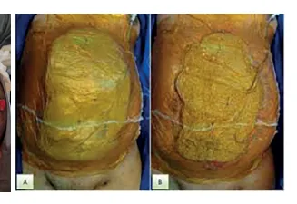

---

<!-- page:8 -->

## | Tipo Ib: INFECÇÃO DE PRÓTESE

| Segue o mesmo raciocínio do tipo Ia;

- Contaminação grosseira do material, fístula com TGI Contudo, a entrada sanguínea se dá através colo distal, pelo refluxo criado através da zona de baixa pressão do saco aneurismático; É menos maligno em comparação ao tipo Ia – contudo, também é de grande volume; Requer correção cirúrgica. Tipo II: Endoleak comum (quase 100% dos casos precocemente), associado com refluxo pelos ramos – artérias lombares, nutridas pela circulação colateral da irrigação medular proveniente de ramos da artéria aorta torácica e ramos da artéria ilíaca interna Nesse sentido, na aposição da endoprótese, o saco aneurismático se torna uma região de baixa pressão → favorece o refluxo sanguíneo; através da artéria mesentérica inferior; nutrido pela arcada de Riolan. O volume do vazamento é pequeno; é um quadro típico de pós-operatório precoce, eventualmente pelo baixo fluxo essas redes de colaterais trombosam. Não requer correção cirúrgica; deve-se fazer seguimento com exames de imagem de controle. Tipo III; Associado à perda de continuidade da endoprótese (furo, desconexão); Decorre em alta pressurização do saco aneurismático; Requer correção cirúrgica. Tipo IV; É pouco frequente; Associa-se ao tecido da endoprótese, ou seja, com a porosidade do instrumento. A baixa porosidade do tecido dificulta a formação de uma camada neoíntima (epitelização da prótese); Tipo V; Raro! Endotensão → o conteúdo que preenche o saco aneurismático é um líquido inflamatório.

baixa pressão do saco aneurismático; nesse sentido, favorece a “babação” da prótese. Resumindo a conduta:

- Todo aneurisma de aorta submetido a correção endovascular deve ser submetido a exames de imagem tomográfico de controle, no intuito de identificação de endoleak cirúrgico. Endoleak tipo Ia, Ib e III sempre cirúrgicos; Endoleak tipo II quase nunca cirúrgico; É considerado normal no período pré-operatório precoce; tende a trombosar no seguimento. Fístula aorto duodenal enxerto entérico com gás no interior do saco aneurismático.

76% Fístula Figura 18 Fistula aortoduodenal. Figura 19: AngioTC demonstrando infecção de prótese, Figura 20: Fístula aortoduodenal, onde observamos a endoprótese (A) erodindo pra dentro da terceira porção duodenal (B).

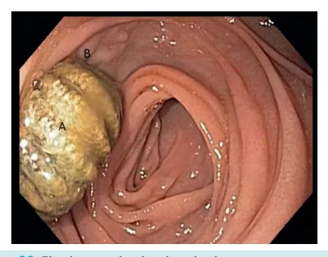

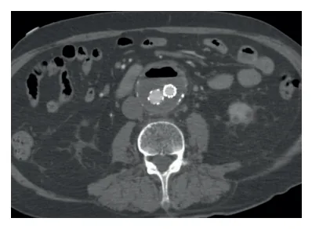

---

<!-- page:9 -->

Regiões de alto risco:

- Proximidade com o esôfago (região de aorta torácica descendente) fístula aorto-esofágica;

- Proximidade com o duodeno fístula aorto-duodenal.

Quadro clínico:

- Hematêmese;

- Hematoquezia;

- Hemorragia digestiva alta maciça.

Curso clínico:

- Sepse, elevação dos marcadores inflamatórios.

Confirmação diagnóstica:

- Angiotomografia: achado patognomônico → gás periprótese (dentro do saco aneurismático). Indica fístula com o TGI.

Tratamento em etapas (se possível):

- Tratamento da fístula

- Explante da prótese aórtica

- Reconstrução da aorta (trajeto anatômico X trajeto extra-anatômico) Anatômico: maior complexidade / maior perviedade Dacron embebido em ATB Aorta de cadáver (pouco utilizado no Brasil) Figura 22: Enxerto axilo-bifemoral, estratégia Safena espiralada de revascularização extra-anatômica. Extra-anatômico: cirurgia mais rápida / menor perviedade Bypass axilo-bifemoral direita temos: dacron embebido em rifampicina, veias femorais extra-anatômico utilizado na reconstrução da aorta.

Figura 21: Estratégias de reconstrução aórtica in situ (anatômico) pós-explante de endoprótese. Da esquerda para Figura 23: O enxerto axilo-bifemoral é o principal enxerto e aorta de cadáver. Tem baixa perviedade.

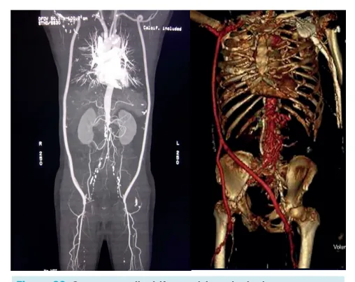

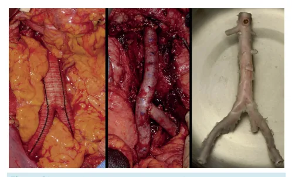

---

<!-- page:10 -->

## OUTRAS COMPLICAÇÕES TARDIAS: REFERÊNCIAS

- Pseudoaneurisma de anastomose; Pode ser causada pela degeneração da costura da Figura 6: Anatomia do aneurisma de aorta.

prótese de Dacron na artéria nativa; Adaptado de Unicamp - Processo Seletivo de Residência Médica - Préz Oclusão de ramos por progressão de Requisito em Cirurgia Geral 2021.

- Oclusão de ramos por progressão de R doença aterosclerótica;

- Endoleaks.

## SEGUIMENTO

CIRURGIA ABERTA:

- Método e período → USG com doppler de aorta e S ilíacas anual; & p

- A principal complicação no pós-operatório é a hérnia P incisional (precipitado pela doença do colágeno associada a formação de aneurisma);

- Demonstra baixa taxa de reintervenção; A Quando realizada, normalmente não é relacionada com o próprio aneurisma, e sim com hérnias, por exemplo

- Atenção ao custo – barato!!

## CIRURGIA ENDOVASCULAR: A

- Método e período → Angiotomografia de aorta e ramos; Primeiro exame em 3 meses de pós-operatório; Seguimento posterior com exame anual.

- Principal complicação: Endoleaks – há possibilidade de reintervenção no F próprio aneurisma; w Alternativa diagnóstica para pesquisa de endoleak:

( USG com microbolhas – anual.

- Atenção aos seguintes pontos: Contraste e radiação (pacientes jovens); Custo alto, demonstra certa indisponibilidade. h no reparo endovascular.

S Requisito em Cirurgia Geral 2021. Figura 7: Modelos de endopróteses utilizadas Acervo pessoal do autor.

Figura 17: Peritoneostomia com kit de vácuo (à esquerda) e à Barker (centro e direita). Simão, T. S., Rocha, F. S., Moscon, F. B., Pinheiro, R. R., Barbosa, F. E. A. S., & Faiwichow, L.. (2013). Curativo à vácuo para cobertura temporária de peritoneostomia. ABCD. Arquivos Brasileiros De Cirurgia Digestiva (são Paulo), 26(2), 147–150.

Figura 19: AngioTC demonstrando infecção de prótese, com gás no interior do saco aneurismático. Acervo pessoal do autor.

Figura 20: Fístula aortoduodenal, onde observamos a endoprótese (A) erodindo pra dentro da terceira porção duodenal (B).

Vegunta R, Vegunta R, Kutti Sridharan G (September 05, 2019) Secondary Aortoduodenal Fistula Presenting as Gastrointestinal Bleeding and Fungemia. Cureus 11(9): e5575 Figura 21: Estratégias de reconstrução aórtica in situ (anatômico) pós-explante de endoprótese. Da esquerda para direita temos: dacron embebido em rifampicina, veias femorais e aorta de cadáver.

Fatima, Javairiah et al. “Treatment strategies and outcomes in patients with infected aortic endografts.” Journal of vascular surgery vol. 58,2 (2013): 371-9. doi:10.1016/j.jvs.2013.01.047 Figura 23: O enxerto axilo-bifemoral é o principal enxerto extra-anatômico utilizado na reconstrução da aorta. Tem baixa perviedade.

https://www.sciencedirect.com/science/article/abs/pii/ S0890509614001769#fig1
