# Cirurgias Pediátricas no PS

<!-- page:1 -->

Urgências cirúrgicas ESTENOSE HIPERTRÓFICA DE PILORO

- Vômitos NÃO BILIOSOS que não melhoram + desidratação + abdome escavado + oliva pilórica;

- Quadro clínico + oliva pilórica = patognomônico da doença;

- Prevalência no sexo masculino, em torno de

2–12 semanas de vida; A

- USG é o melhor método diagnóstico;

- Estabilização clínica da alcalose metabólica;

- Quando tudo estiver estabilizado, encaminhar para cirurgia (piloromiotomia)!

## INTUSSUSCEPÇÃO INTESTINAL

- Dor em cólica + fezes mucossanguinolentas (geleia de morango) + FID vazia;

- Acometimento em torno de 3–30 meses de vida;

prevalente em 2/3 sexo masculino! E

- USG é o melhor método diagnóstico (pseudo-rim/ sinal do alvo);

- Paciente estável e sem sinais de alarme? 1.° tentar redução com enema; 2.° laparotomia exploradora para redução.

## DIVERTÍCULO DE MECKEL

- Enterorragia é o sintoma mais comum;

- Diagnóstico com cintilografia (Tc-99);

## ESTENOSE HIPERTRÓFICA DE Q PILORO (EHP)

- O QUE É E COMO CHEGA AO PS?

- Hipertrofia progressiva da musculatura pilórica, causando estreitamento e alongamento persistentes do canal pilórico;

- Mais comum no sexo masculino, com média de idade C de apresentação entre 2–12 semanas de vida.

- - C

- - - Figura 1: Estenose hipertrófica de piloro (EHP) com oliva pilórica e abdome escavado. - Cirurgia se sintomático;

- Quando for um achado acidental: em exame de imagem, apenas acompanhar; no intraoperatório, considerar ressecção.

- Frequentemente apresenta-se com mucosa gástrica ectópica.

## APENDICITE AGUDA

- Diagnóstico é CLÍNICO!

- Mais comum acima de 2 até os 50 anos de idade!

- Blumberg positivo com hiporexia, vômitos e febre baixa;

- USG e TC são apenas auxiliares;

- Tratamento é cirúrgico;

- Complicações: necrose, perfuração, abscesso localizado, peritonite purulenta.

## ESCROTO AGUDO

- Assimetria + hiperemia + dor unilateral = escroto agudo;

- Escroto agudo = USG doppler: sem fluxo? EMERGÊNCIA CIRÚRGICA! com fluxo aumentado? Orquiepididimite.

## QUADRO CLÍNICO

- Vômitos não biliosos frequentes;

- Irritabilidade e desidratação;

- Abdome escavado;

- Alcalose metabólica + acidúria paradoxal;

- Verificar Figura 2 na próxima página.

COMO DIAGNOSTICAR?

- Exame físico: oliva pilórica → patognomônico!

- Ultrassonografia (USG) abdominal: sinal do alvo + espessamento longitudinal;

- Exame contrastado: estreitamento bulbar;

- Verificar Figura 3 na próxima página.

## COMO TRATAR?

- ESTABILIZAÇÃO CLÍNICA! → A EHP não é uma emergência!

- Cirurgia: piloromiotomia a Fredet-Ramstedt;

- Via cirúrgica: convencional x videolaparoscópica;

- Verificar Figura 4 na próxima página.

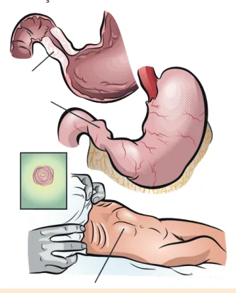

---

<!-- page:2 -->

Projétil de vômito HCI HCI A criança está K+ H O perdendo muito! Na+ 2 Preciso COMPENSAR Blaaarghh! A c Rete Sem cloro e não consigo secretar bicarbonato Muito BIC!!!

Alcalose metabólica Figura 2: Explicação fisiopatológica da alcalose metabólica com a Ex. Físico Sinal do alv Oliva pilórica lo Figura 3: Oliva pilórica; sinal do alvo ao USG; estreitamento bulba Figura 4: Piloromiotomia a Fredet-Ramstedt convencional x videolaparoscópica. Rim compensação renal er sódio Para salvar o sódio, e água a aldosterona vai me ajudar!

Na+ E vamo reter água já que água ama Na+ o sódio K+ K+ H+ H+ H+ H+ K+ K+ K+ Aldosterona Estou sacrificando Potássio e Hidrogênio Acidúria paradoxal acidúria paradoxal, características da EHP.

USG lvo + espessamento Contrastado ongitudinal Estreitamento bulbar ar ao exame contrastado.

## DIAGNÓSTICOS DIFERENCIAIS

- Verificar Tabela 1 na próxima página.

## INVAGINAÇÃO/INTUSSUSCEPÇÃO

## INTESTINAL

## O QUE É?

- Acontece quando um intestino proximal telescopa no distal pelo peristaltismo: Forma primária: adenite mesentérica; Forma secundária: Meckel, pólipos.

- Pico epidemiológico: 3–30 meses de vida;

- Mais comum no sexo masculino: 2/3 dos casos!

- A localização mais comum é a ileocecal;

- Verificar Figura 5 na próxima página.

- Fezes em geleia de morango/framboesa;

- Cólica intestinal intensa e variável;

- Sinal de Dance (fossa ilíaca direita [FID] vazia).

## DIAGNÓSTICO

- USG: sinal do alvo e pseudo-rim;

- Enema contrastado: sinal do menisco;

- Verificar Figura 6 na próxima página.

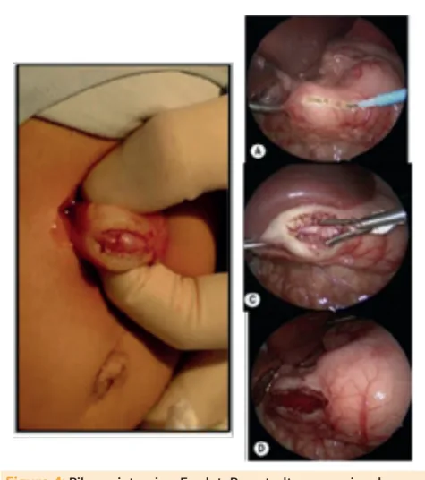

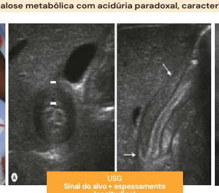

---

<!-- page:3 -->

Tabela 1: Diferenciação de apresentação clínica e tratamento de:estenose hipertrófica de piloro, refluxo gastroesofágico e atresia duodenal.

Refluxo Atresia Estenose hipertrófica de piloro gastroesofágico duodenal Vômitos NÃO BILIOSOS Frequência INCOERCÍVEIS PLANO/ Abdome ESCAVADO Desidratação +++ CLÍNICO + Tratamento CIRÚRGICO Figura 5: Invaginação intestinal.

USG Sinal do alvo pseudo-rim Figura 6: Intussuscepção em crianças: avaliação por métodos de ima Alimentares Biliosos Pouco Incoercíveis frequentes -- Escavo -- +++ Clínico CIRÚRGICO Enema contrastado Sinal do menisco agem e abordagem terapêutica.

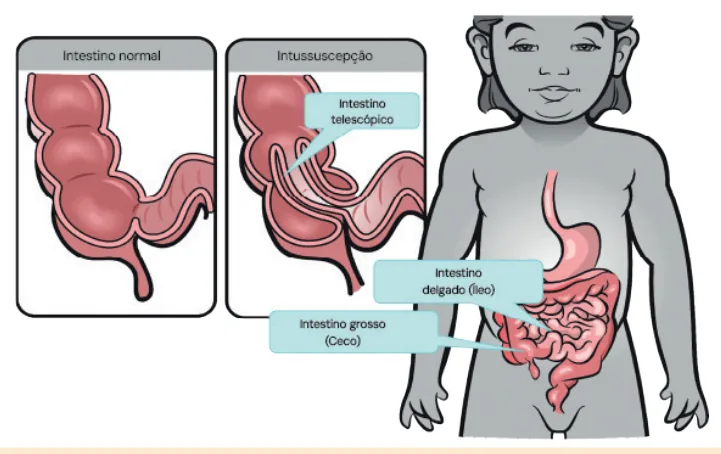

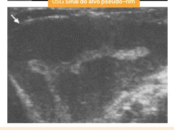

---

<!-- page:4 -->

## TRATAMENTO

- Laparotomia/laparoscopia: se falha da redução com

- Enema contrastado/USG: iniciar por essa modalidade enema ou instabilidade.

em pacientes estáveis; Figura 7: Tratamento não operatório (enema). Figura 8: Cirúrgico (laparotomia) de invaginação intestinal.

- Persistência do conduto onfalomesentérico e a rotação intestinal embrionária;

- Mucosa gástrica ectópica.

Figura 9: Embriologia do conduto onfalomesentérico.

## EPIDEMIOLOGIA: REGRA DOS 2

- 2% da população (4% sintomáticos);

- Descoberta aos 2 anos;

- 2x mais no sexo masculino;

- 2 pés da válvula ileocecal (VIC) (60 cm);

- 2 polegadas de tamanho (5 cm);

- Verificar Figura 10 .

- Sangramento;

- Obstrução – Intussuscepção ou volvo;

- Diverticulite;

- Hérnia de Littré;

- Neoplasia: adulto. Figura 10: Divertículo de Meckel.

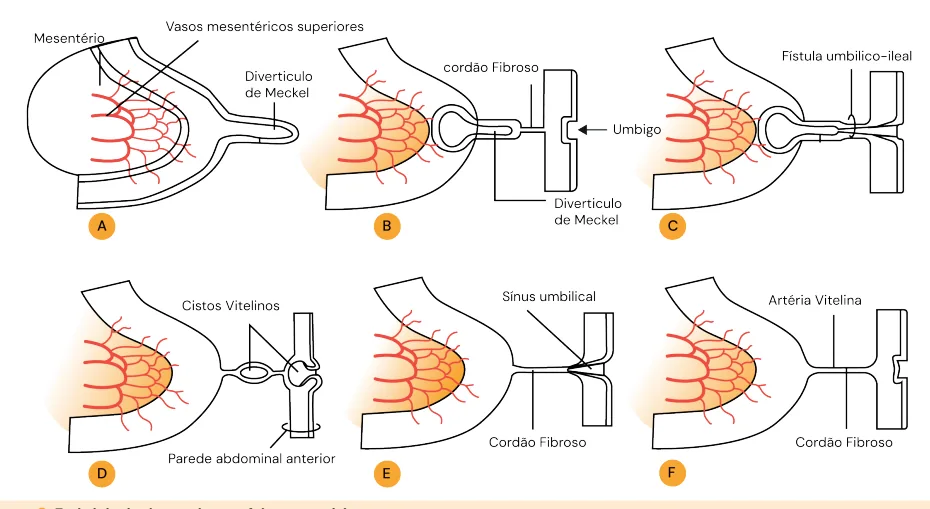

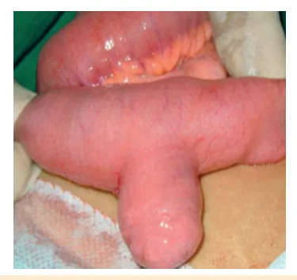

---

<!-- page:5 -->

## DIAGNÓSTICO QUADRO CLÍNICO

- Endoscopia digestiva alta (EDA) e colonoscopia para

- Dor na FID;

excluir outras causas;

- Bloomberg positivo;

- O achado pode ser acidental (em exame de imagem

- Náuseas e vômitos;

ou no intraoperatório de outra condição cirúrgica);

- Hiporexia;

ou no intraoperatório de outra condição cirúrgica);

- Cintilografia com TC-99: padrão-ouro → Destaca mucosa gástrica fora do estômago.

- Figura 11: Cintilografia como exame padrão-ouro para diagnóstico de divertículo de Meckel.

- Se for por achado acidental: no intraoperatório: considerar ressecção no mesmo tempo cirúrgico; C em algum exame de imagem: expectante!

- Se sintomático: abordar cirurgicamente.

- E

- Figura 12: Tratamento cirúrgico de divertículo de Meckel

(enterectomia segmentar com enteroanastomose primária).

- Doença que mais comumente requer cirurgia abdominal de emergência na criança;

- Principal causa de abdome agudo cirúrgico na A criança > 2 anos;

- Representa 10% das admissões em salas de emergências pediátricas.

- É clínico! - Hiporexia;

- Febre;

- Constipação ou diarreia.

Tabela 2: Métodos secundários para diagnóstico de apendicite por imagem. Achados USG Achados TC Estrutura tubular não Estrutura tubular na FID compressível na FID Fecalito Fecalito Diâmetro > 7 mm Diâmetro > 7 mm Espessura da parede > 2 Sinal do alvo adjacente ao mm ceco Espessamento da gordura Espessamento adjacente ao ceco mesentérico Blumberg USG positivo Abscesso Líquido livre em FID Líquido livre em FID CLASSIFICAÇÃO

- Complicada: necrose → Perfuração → Abscesso localizado → Peritonite purulenta/fecal.

- CIRÚRGICO: laparotomia – Incisão a Rocky-Davis; videolaparoscópica.

- Etiologias principais: torção testicular; torção de Hidátide de Morgagni; orquiepididimite; dor testicular intermitente.

Figura 13: Evidências clínicas e cirúrgicas de escroto agudo. Avaliação

- USG doppler de região testicular: o USG da região testicular com doppler deve ser feito, mas não deve atrasar a conduta frente suspeita cirúrgica.

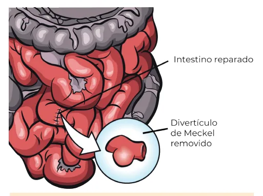

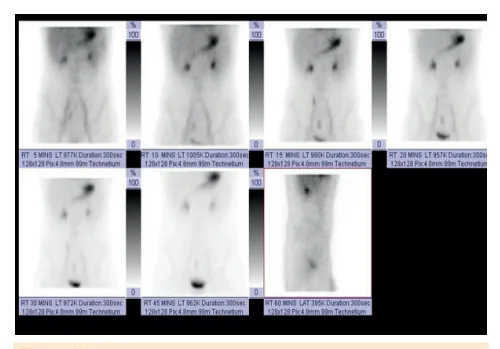

---

<!-- page:6 -->

Dor testicular aguda Fluxo + Fluxo duvidoso Fluxo Orquipedidimite/d Possível torção or testicular testicular/hidátide Torção testicular intermitente TTO CONSERVADOR:

ATB TTO AINE CIRURGICO REPOUSO Figura 14: Fluxograma de avaliação de dor testicular aguda. ORQUIEPIDIDIMITE

- Bacteriana (10%–15% dos casos de escroto agudo);

- Viral (caxumba): raro;

- Clínica de dor e edema escrotal com testículo móvel;

- USG doppler com fluxo aumentado ou exame de urina alterado;

- Anti-inflamatório não esteroidal (AINE) + antibiótico

(ATB) de acordo com cultura.

## DOR TESTICULAR INTERMITENTE

- Sintomas muito semelhantes à torção testicular, mas melhoram com analgesia comum;

- USG doppler é normal;

- Obrigatório haver história de recorrência.

## TORÇÃO DE HIDÁTIDE DE MORGAGNI

- Sintomas muito semelhantes à torção testicular, mas melhoram com AINE;

- Ao exame físico, haverá a presença do blue-dot, ou ponto azul;

- Principal causa de escroto agudo (subdiagnosticada);

- Cirurgia é tratamento de exclusão!

Figura 15: Blue-dot/torção de hidátide. Figura 16: (continuação) Blue-dot/torção de hidátide.

## TORÇÃO DO TESTÍCULO

- Sintomas não melhoram!! Se melhoram, sinal de isquemia do órgão.

- É comum encontrarmos o testículo torcido alto e horizontal com reflexo cremastérico ausente;

- USG doppler: pouco ou ausência de fluxo;

- EMERGÊNCIA CIRÚRGICA: com o orquidopexia contralateral: > 24 horas de sintoma: < 10% de chance de salvamento testicular.

Figura 17: Tratamento cirúrgico evidenciando torção testicular esquerda.

## REFERÊNCIAS

Figura 3: Oliva pilórica; sinal do alvo ao USG; estreitamento bulbar ao exame contrastado. Radiologia Brasileira, v. 36, n. 2, p. 89-94, mar. 2003.

Oliva pilórica / sinal do alvo ao USG / Estreitamento bulbar ao exame contrastado. Figura 4: Piloromiotomia a Fredet-Ramstedt convencional x videolaparoscópica.

Disponível em https://pre-med.jumedicine.com/wp-content/uploads/ sites/9/2021/09/1-Intussusception-and-HPS-summary.pdf. Acesso em: 3 jul. 2025.

Figura 6: Intussuscepção em crianças: avaliação por métodos de imagem e abordagem terapêutica. Radiologia Brasileira, v. 38, n. 3, p. 203-208, jun. 2005. Sinais radiológicos de Invaginação intestinal.

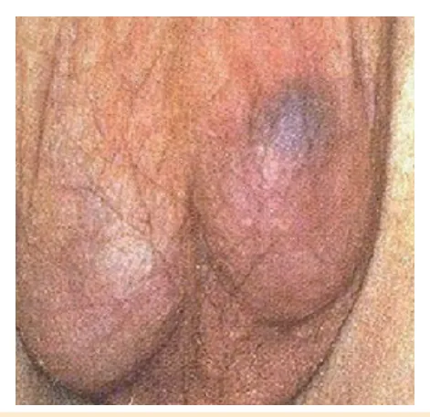

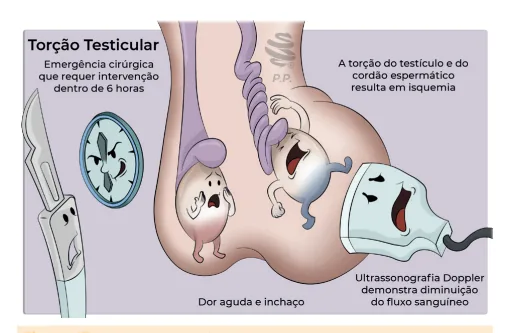

---

<!-- page:7 -->

Figura 8: Cirúrgico (laparotomia) de invaginação intestinal. Tabela 2: INSTITUTO LAPARO. Métodos secundários para Radiologia Brasileira, v. 38, n. 3, p. 203-208, jun. 2005. Cirúrgico diagnóstico de apendicite por imagem.

(laparotomia) de invaginação intestinal. Disponível em: https://www.institutolaparo.com.br/cirurgia/ apendicectomia/. Acesso em: 3 jul. 2025. Métodos secundários para Figura 10: RESEARCHGATE. Divertículo de Meckel.

diagnóstico de apendicite por imagem. Disponível em: https://www.researchgate.net/figure/MeckelsDiverticulum-shown-during-surgery_fig1_340214946. Acesso em: 3 jul.

2025. Divertículo de Meckel.

e Figura 11: RADIOPAEDIA. Cintilografia como exame gold-standart para diagnóstico de divertículo de Meckel.

Disponível em: https://radiopaedia.org/cases/meckel-diverticulum-4. D Acesso em: 3 jul. 2025. Cintilografia como exame gold-standard para A diagnóstico de divertículo de Meckel.

Figura 12: GOCONQR. Tratamento cirúrgico de divertículo de Meckel (enterectomia segmentar com enteroanastomose D primária).

Disponível em: https://www.goconqr.com/mapamental/20162841/ diverticulo-de-meckel. Acesso em: 3 jul. 2025. Tratamento cirúrgico de divertículo de Meckel. Figura 13: Evidências clínicas e cirúrgicas de escroto agudo.

Ashcraft - Cirurgia pediátrica, 6. ed. Evidências clínicas e cirúrgicas de escroto agudo. Figura 15: DRMAITABLOG. Blue dot / torção de hidátide.

Disponível em: https://www.drmaitablog.site/2016/11/dolor-testicular.html. Acesso em: 3 jul. 2025. Blue dot / torção de hidátide.

Figura 16: DRMAITABLOG. Torção testicular com possível necrose do órgão. Disponível em: https://www.drmaitablog.site/2016/11/dolor-testicular.html.

Acesso em: 3 jul. 2025. Torção testicular com possível necrose do órgão.
