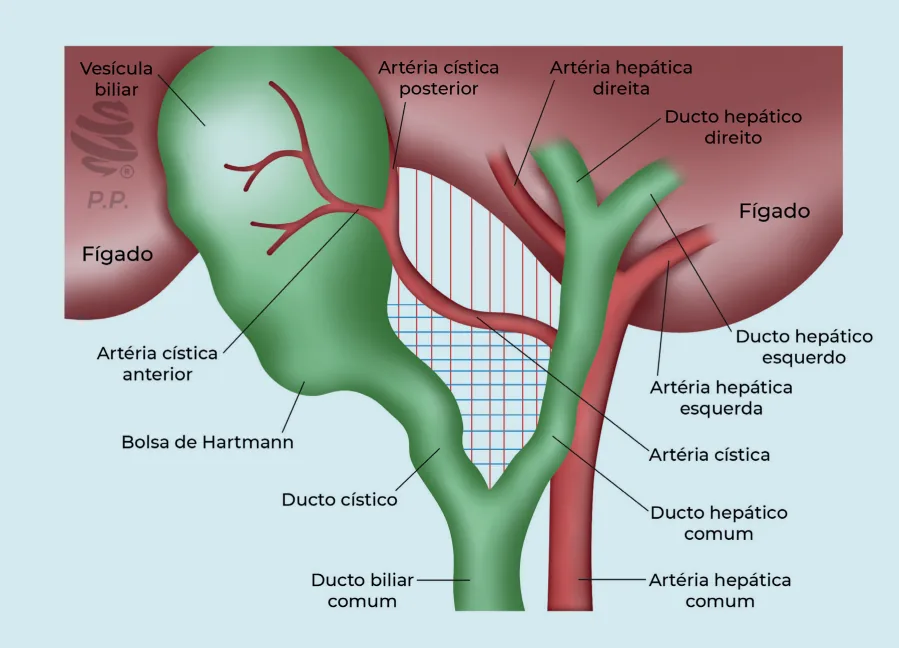

# Colecistite - Visão Crítica de Segurança

<!-- page:1 -->

## Colecistite - Visão Crítica de Segurança

- **Colecistectomia VLP** = padrão-ouro;
- Conversão / cirurgia aberta → não diminui complicações, não facilita cirurgia;
- Quando fazer aberta? Suspeita de câncer; instabilidade hemodinâmica; coagulopatia refratária.

## Colecistectomia Videolaparoscópica

- Via de acesso padrão-ouro;
- Quando fazer aberta? Suspeita de câncer; instabilidade hemodinâmica; coagulopatia refratária.

## Colecistectomia Segura

**Visão crítica de segurança (Visão Crítica de Strasberg):**

1. Limpeza do trígono hepatocístico;
2. Porção distal do platô cístico exposta;
3. Apenas duas estruturas entrando na vesícula.

**E depois:**

- Clipar o cístico;
- Clipar a artéria;
- Soltar a vesícula.

**Sulco de Rouviere** → limite inferior da dissecção.

## Colecistectomia Difícil - Fatores de Risco

- Colecistite aguda;
- Colecistite crônica recorrente;
- Obesidade;
- Sexo masculino;
- Cirrose;
- Espessamento da parede;
- Episódios prévios de coledocolitíase.

---

<!-- page:2 -->

## Colecistectomia Difícil - Estratégias de Prevenção e Resgate

**Prevenção**

- Supervisão;
- Humildade;
- Devagar é rápido;
- Não tenha vergonha de converter;
- Não suture, não clipe sem ver;
- Visão crítica de segurança.

**Resgate**

- Abortar;
- Converter;
- Colecistostomia;
- Fundo-cística;
- Parcial.

**Fundo-cística e parcial = melhores opções.**

## Manejo — Colangiografia Intraoperatória

**Quando fazer:**

- Dúvida intraoperatória;
- Suspeita de coledocolitíase.

**Satisfatória quando:**

- Visualização de hepáticos;
- Sem falha de enchimento;
- Escoamento do contraste para o duodeno.

**Intraoperatório:**

1. Colangiografia intraoperatória;
2. Sabe resolver? → resolver, até converter se necessário;
3. Não sei resolver → drenar e encaminhar; CPRE ou colangio-RM para avaliar lesões.

**Pós-operatório:**

- Resolver fase aguda (drenar, DTPH, CPRE, ATB e suporte);
- ColangioRM / CPRE;
- Prótese / plastia / biliodigestiva.

## Lesões de Vias Biliares

- **Prótese**: vazamentos pequenos;
- **Plastia**: lesões pequenas em ductos principais;
- **Biliodigestiva**: estenoses tardias e transecções totais.

### Fatores de Risco

- Má visualização / confundimento de estruturas (97%);
- Inflamação;
- Má exposição;
- Não aderência à visão crítica de segurança;
- Confiança errônea;
- Obesidade, síndrome de Mirizzi.
