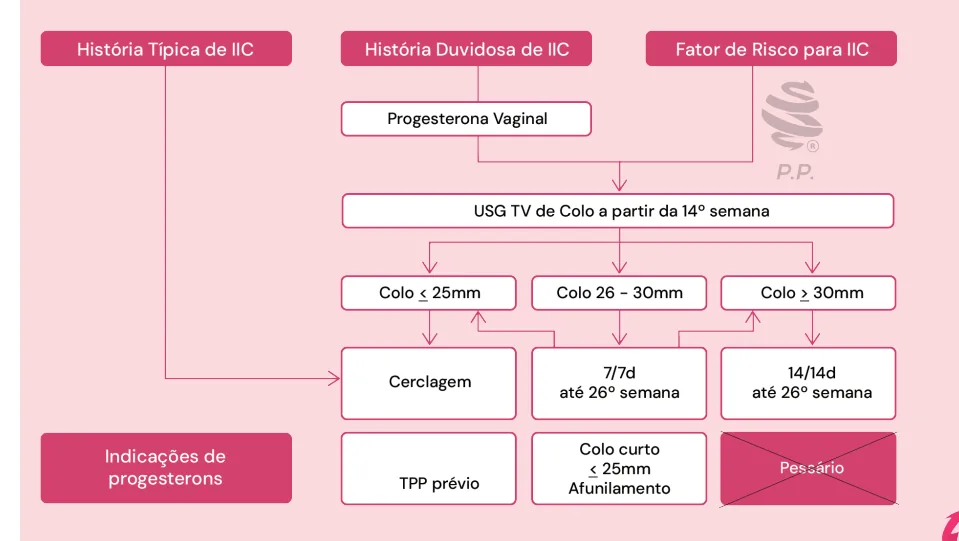
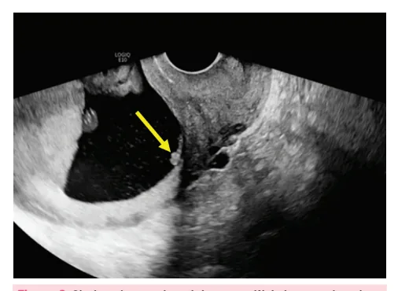
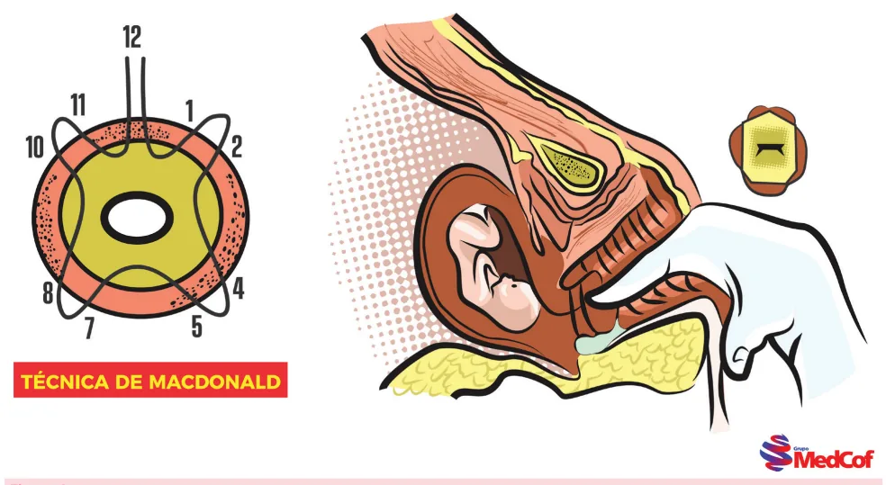
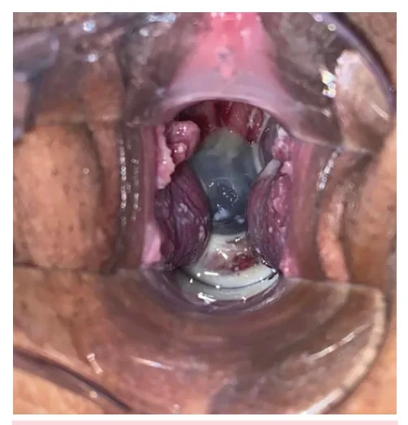

# Colo Curto e Incompetência Istmocervical

<!-- page:1 -->

## COLO CURTO E

## INCOMPETÊNCIA ISTMOCERVICAL

Colo curto; Incompetência Istmocervical;

## COLO CURTO

## CONSIDERAÇÕES GERAIS

- É um achado ultrassonográfico;

- O rastreamento deve ser universal, pela ultrassonografia transvaginal (USTV) na época do exame morfológico do 2° trimestre (entre 20 e

24 semanas).

## DIAGNÓSTICO

- Comprimento do colo ≤ 25 mm e/ou Afunilamento; Sludge: aglomerado de conteúdo amorfo, Figura 2: Colo de comprimento curto com afunilamento hiperecogênico, móvel e próximo ao colo do útero (sugestivo de processo inflamatório/ infeccioso local); Deve ser visualizado o eco glandular endocervical.

Figura 3: Sludge observado próximo ao orifício interno do colo Figura 1: Colo uterino de comprimento normal do útero (seta).

---

<!-- page:2 -->

## CONDUTA CASOS INTERMEDIÁRIOS

- Manter vigilância infecciosa – através de avaliação cervicovaginal e urinária; CONDIÇÕES INTERMEDIÁRIAS

- Progesterona natural, via vaginal: 200 mg, até

- Uma perda com suspeita de IIC

36 semanas. ou 36 semanas. o

## INCOMPETÊNCIA

## ISTMOCERVICAL (IIC)

- Diagnóstico por história clínica;

- Dilatação indolor e recorrente do colo do útero, levando a perdas de fetos saudáveis no segundo trimestre da gestação;

- Classicamente são, pelo menos, duas perdas gestacionais consecutivas e cada vez mais precoces: C Abortos tardios: 12 – 20 semanas; Prematuros extremos: 20 – 28 semanas.

- CONDUTA – CERCLAGEM VAGINAL

Técnica de MacDonald, modificada por Pontes;

- Técnica com duas suturas em bolsa no colo uterino;

- Realizada entre 12 – 16 semanas, nos casos de IIC.

- Verificar Figura 4

Cuidados Perioperatórios:

- Em período pré-operatório: Afastar malformações congênitas Avaliar e tratar infecções vaginais; Realizar colpocitologia oncótica.

(morfológico de primeiro trimestre);

- Em período pós-operatório Repouso absoluto não é indicado.

Figura 4: Cerclagem Vaginal pela técnica de Macdonald modificada p ou

- Fatores de risco para IIC: Trauma cervical: dilatação intempestiva, fórceps sem dilatação total, cauterização de alta frequência (CAF); Malformação uterina congênita: útero bicorno ou didelfo etc. Defeitos do colágeno: Síndrome de Marfan e

Síndrome de Ehlers-Danlos.

## CONDUTA

- Seguimento por USTV do colo, da 14ª – 26ª semana da gestação;

- Interpretação do exame e conduta: Colo > 30 mm → repetir o exame em 14 dias; Colo entre 25–30 mm → repetir o exame em 7 dias; Colo ≤ 25 mm → proceder com cerclagem vaginal.

OBS.: No HCFMUSP, o seguimento ocorre da 16ª – 24ª semana. ATENÇÃO! No caso de seguimento com observação de colo curto, a indicação da cerclagem ocorre se houver associação com fatores de risco. Apenas a presença de colo curto não indica a realização do procedimento.

por Pontes

---

<!-- page:3 -->

## CERVICODILATAÇÃO PRECOCE CERCLAGEM ABDOMINAL

- Condição de diagnóstico clínico em que é possível Indicações:

observar dilatação cervical com ou sem protrusão de

- Falha de cerclagem vaginal: feita a cerclagem, porém membranas amnióticas; houve perda da gravidez;

membranas amnióticas; Figura 5: Visualização direta de membranas amnióticas protrusas

- Considerar a realização de cerclagem vaginal heroica até 24 - 26 semanas. Cirurgia que apresenta maiores riscos (infecção, rompimento de membranas e perda gestacional) quando comparada à cerclagem profilática; Pode orientar repouso relativo e abstinência sexual Pode prescrever progesterona vaginal. houve perda da gravidez;

(sem consenso);

- Sem condições cirúrgicas para via vaginal (ex: paciente submetida à traquelectomia);

- Pode ser realizada pelas vias laparotômica ou laparoscópica, idealmente fora do período gestacional;

- Também conhecida como “cerclagem definitiva”, pois não se retiram os pontos e a via de parto é cesariana.

## REFERÊNCIAS

Figura 1: Colo uterino de comprimento normal. Arquivo pessoal. Figura 2: Colo de comprimento curto com afunilamento.

Arquivo pessoal. Figura 3: Sludge observado próximo ao orifício interno do colo do útero (seta). Merrett A, Knipe H, Murphy A, Amniotic fluid sludge (ultrasound).

Reference article, Radiopaedia.org (Accessed on 20 Nov 2023) https://doi. org/10.53347/rID-160705 Figura 5: Visualização direta de membranas amnióticas protrusas.

Arquivo pessoal.

