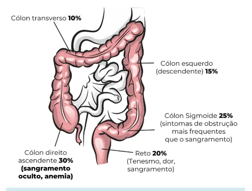

# Coloproctologia Câncer Colorretal (2)

<!-- page:1 -->

## COLOPROCTOLOGIA: CÂNCER

## COLORRETAL

Coloproctologia Câncer colorretal Carcinogênese do CCR: APC → B-catenina → T K-Ras → P-53.

- Rastreamento: 45 – 85 anos → Colonoscopia a cada

10 anos.

- Estadiamento: Cólon (TC) x Reto (RM)

## INTRODUÇÃO E

## CONSIDERAÇÕES GERAIS

## DEFINIÇÕES

- É o tumor mais comum do trato gastrointestinal. E

- FATORES DE RISCO

Gerais

- Sedentarismo;

- Estilo de vida não saudável – dieta pobre em fibras e rica em substâncias industrializadas; com maior consumo de alimentos ultraprocessados , padrão C ocidental de alimentação;

- Diabetes; E

- Tabagismo; B

- Etilismo;

- Obesidade;

- Idade.

Hereditários

- Polipose adenomatosa familiar;

- Polipose associada à MUTYH;

- Síndrome de Lynch (HNPCC). 100% dos pacientes que apresentam PAF podem desenvolver CCR até os 40 anos de idade. Também chamada de câncer colorretal hereditário não polipoide. Deve-se a mutação no MLH1, MSH2 E

MSH6 e PMS2; Doença inflamatória intestinal

- Retocolite ulcerativa;

- Doença de Crohn – eleva em 10 – 20x o risco de câncer colorretal;

- Tem maior risco de CCR devido ao grau de inflamação colônica associado ao tempo de atividade de doença apresentada, esses pacientes podem apresentar CCR com pior prognóstico e mais agressivos.

Colite actínica

- Secundária à radiação abdominal;

- Pacientes podem apresentar sangramentos esporádicos em fezes. Normalmente, Tratamento:

- Câncer de cólon e reto intraperitoneal: Cirurgia com margens livres + linfadenectomia - 12 linfonodos. Margem 5cm;

- Câncer de reto extraperitoneal (médio e distal):

Neoadjuvância (QRT para T3/T4 ou N+) + Retossigmoidectomia Excisão total do Mesorreto. se como um quadro de telangiectasias em cólon associado a maior rigidez do mesmo em pacientes que tiveram exposição a radiação nesta topografia.

## EPIDEMIOLOGIA

- 2º ou 3º tipo de câncer mais comum tanto no sexo feminino como no masculino, a depender da região analisada.

- Verificar Tabela 1 na próxima página

## CARCINOGÊNESE DO CÂNCER

## EXISTE UMA SEQUÊNCIA CARCINOGÊNICA BEM ESTABELECIDA

- O processo leva, em média, 10 anos, na população geral.

OBS.: Este tempo se correlaciona com a frequência de rastreio por colonoscopia. O tempo entre um exame e o seguinte (em média, de 5 – 10 anos) dá-se por esse motivo.

- Sequência: (1) Epitélio normal, sem alterações; (2) demais fatores de risco; (3) Mutação do gene APC pólipos; (4) Mutação da beta-catenina – demonstra potencial displásico; (5) Mutação do gene K-Ras displásico, de baixo para alto grau; (6) Mutação do gene p53 – origem de tumor com potencial invasivo da membrana basal; (7) Evolução carcinomatosa – com mutações finais da telomerase.

Agressão epitelial – tabagismo, sedentarismo e (gene supressor tumoral) – predispõe à formação de (proto-oncogene) – evolui com aumento do potencial OBS: A origem da mutação do gene p53 marca a origem do carcinoma!!! Essa alteração fornece capacidade da neoplasia em estágio inicial invadir a submucosa e dessa forma ganhar a circulação hematogênica e a linfática, tendo maior possibilidade de metastatização.

---

<!-- page:2 -->

Tabela 1: Epidemiologia do câncer no Brasil Localização Localização Casos % Casos % primária primária Próstata 65.840 29,2 Mama feminina 66.280 29,7 Próstata 65.840 29,2 Cólon e reto 20.540 9,1 Traqueia, brônquio 17.760 7,9 e pulmão Estômago 13.360 5,9 Homens Cavidade oral 11.200 5,0 Esôfago 8.690 3,9 Bexiga 7.590 3,4 Linfoma não6.580 2,9 Hodgkin Laringe 6.470 2,9 Leucemias 5.920 2,6 Normal Risco Ade APC B-catenina K-R Figura 1: Sequência adenoma-carcinoma no câncer colorretal.

## PÓLIPOS

## PÓLIPOS NEOPLÁSICOS

- Apresentam displasia, isto é, risco de malignização;

- A maioria dos pacientes que consomem uma dieta ocidental, terão pólipos após os 50 anos de idade, quanto mais displasia ou atipias, crescimento e comportamento viloso, maior capacidade de malignização e transformação neoplásica;

- Subtipos: Adenomas: Tubular – melhor prognóstico; Viloso – pior prognóstico; Tubuloviloso – prognóstico intermediário. Serrilhados: apresentam morfologia plana, principalmente durante a insuflação do cólon, com coloração semelhante à da mucosa normal, o que prejudica o diagnóstico e o tratamento endoscópico.

- Verificar Figura 2 Mama feminina 66.280 29,7 brônquio e 12.440 5,6 pulmão tireoide enomas Carcinomas pior prognóstico!

Cólon e reto 20.470 9,2 Colo de útero 16.710 7,5 Traqueia, Mulheres Glândula 11.950 5,4 Estômago 7.870 3,5 Ovário 6.650 3,0 Corpo de útero 6.540 2,9 Linfoma não5.450 2,4 Hodgkin SNC 5.230 2,3 Ras P-53 Telomerase DICA! Adenoma “viloso... vilão” apresenta Figura 2: Pólipo neoplásico (lesão séssil serrilhada).

## PÓLIPOS NÃO-NEOPLÁSICOS

- Não apresentam displasia;

- Subtipos: Hamartomas: são compostos de elementos normalmente encontrados no tecido local, porém com crescimento desorganizado. Cuidado:

pode surgir pólipo adenomatoso sobre um pólipo hamartomatoso;

---

<!-- page:3 -->

Localização Manifestações clínicas | Inflamatórios: antigamente, era denominados “pseudo-pólipos”; são áreas de cicatrização da mucosa (pacientes com doença inflamatória intestinal); Hematoquezia Alteração do hábito intestinal e | Hiperplásicos: são áreas com proliferações | Hiperplásicos: são áreas com proliferações pequenas da mucosa.

## RASTREAMENTO

## RASTREAMENTO: 45 – 85 ANOS

- Populacional: a partir dos 45 anos;

- Exames: Colonoscopia a cada 10 anos. Bom custo benefício, com capacidade de identificação de pequenos pólipos, e pela possibilidade de polipectomia; Teste imunoquímico fecal (TIF) para sangue oculto, anualmente; Sigmoidoscopia, a cada 10 anos associado ao Sigmoidoscopia apenas, a cada 5 anos; Colonografia por tomografia computadorizada Teste de DNA de fezes multitarefas com DNA-FIT imunoquímico DNA fecal), a cada 3 anos; Teste de sangue oculto nas fezes baseado em

TIF, anualmente; (CTC), ou Colono virtual, a cada 5 anos; (DNA-DTM-MT; Também conhecido como teste Guaiac, anualmente;

- Até 85 anos (75 - 85 anos - rastreamento individualizado): levar em consideração expectativa de vida e performance status.

- Familiares de primeiro grau com câncer colorretal: A partir de 40 anos de idade ou, pelo menos, 10 anos antes da idade que o familiar apresentou câncer colorretal. O rastreamento é sempre realizado com colonoscopia;

- Alto risco (PAF, Lynch, RCU, Doença de Crohn): a depender do protocolo.

- COLONOSCOPIA VIRTUAL

- Indicação: Lesões intransponíveis em colonoscopia convencional, mas em cólon com capacidade de preparo;

- Eficácia semelhante à da colonoscopia óptica para P a detecção de pólipos clinicamente pequenos e de câncer colorretal.

Cuidado: as fezes podem simular lesões ou pólipos.

## MANIFESTAÇÕES CLÍNICAS

Tabela 2: Manifestações clínicas. Localização Manifestações clínicas

- Anemia intestinal, sangue oculto nas fezes Cólon esquerdo Alteração do hábito intestinal e consistência fecal colorretal conforme a topografia.

Fadiga Cólon direito Massa palpável Dificilmente evolui com obstrução Obstrução Tenesmo Dor Reto Calibre fecal reduzido Obstrução Figura 3: Manifestações clínicas e prevalência do câncer

- Neoplasias do cólon direito são menos sintomáticas; Principal manifestação: anemia assintomática;

- Tumores do cólon esquerdo e retossigmoide apresentam-se mais frequentemente com sintomas obstrutivos, devido à menor dimensão do cólon nesta topografia.

## PROGNÓSTICO

- Tumores de cólon direito demonstram pior prognóstico em comparação àqueles do cólon esquerdo e reto;

- Diagnóstico em estágios mais avançados, maior associação com a síndrome de Lynch; Síndrome de Lynch cursa com instabilidade de microssatélites, o que favorece a implantação ou então invasão da submucosa sem desenvolver o processo neoplásico de forma contígua, favorecendo o pior prognóstico.

- Os tumores do cólon esquerdo em geral têm melhor prognóstico pois costumam manifestar sintomas precocemente, principalmente pela presença de sangue vivo nas fezes (hematoquezia), além de apresentar maior sensibilidade aos quadros obstrutivos devido ao menor lumen e maior crescimento intraluminal concêntrico constrictivo.

---

<!-- page:4 -->

Figura 4: Estadiamento T do câncer colorretal

## ESTADIAMENTO

## CÂNCER DE RETO X CÂNCER DE CÓLON

Tabela 3: Câncer de reto X Câncer de Cólon Reto Cólon Tomografia de tórax e Tomografia de tórax e de de abdome superior abdome superior Ressonância magnética Tomografia de pelve de pelve CEA (antígeno CEA (antígeno carcinoembrionário) carcinoembrionário)

Colonoscopia Colonoscopia completa completa (exclusão (exclusão de outras lesões de outras lesões sincrônicas)

sincrônicas) OBS.: O CEA é um bom marcador prognóstico e para acompanhamento. RESSONÂNCIA MAGNÉTICA DE PELVE – PARA ESTADIAR OS TUMORES DE RETO.

- Devido a maior quantidade de tecido adiposo, favorece uma melhor visualização das estruturas, assim como invasão do músculo elevador do ânus;

- Consegue identificar melhor invasão extramural, e disseminação angiolinfática;

- Ainda, há possibilidade de localizar o tumor de reto acima (tumores altos; intraperitoneais) ou abaixo reflexão peritoneal.

(tumores médios ou baixos; extraperitoneais) da ESTADIAMENTO TNM: Tabela 4: Câncer de reto X câncer de cólon Nx Linfonodos não avaliados N0 Sem linfonodos comprometidos N1 1 – 3 linfonodos positivos N2 4 ou + linfonodos positivos M0 Sem metástase M1 Metástases à distância 0 Tis N0M0 (in situ)

I T1-T2 N0M0 II T3-T4 N0M0 III Tx N+M0 IV TxNx M1

- Verificar Figura 4

## TRATAMENTO

CÂNCER DE CÓLON OU RETO (INTRAPERITONEAL):

- Tratamento cirúrgico;

- Quimioterapia apenas adjuvante (não se faz neoadjuvância);

- Cirurgia - depende do local do tumor: Cólon direito: colectomia direita; Cólon esquerdo: colectomia esquerda; Colon transverso: transversectomia; Sigmoide: retossigmoidectomia; Em alguns casos, deve-se realizar ressecção em bloco com exérese multivisceral de focos acometidos pela neoplasia. Pode ser necessário ressecção de parte da bexiga, ureterectomia e em alguns casos até nefrectomia para controle do foco.

- Linfadenectomia: ligadura dos vasos na origem com retirada de, pelo menos, 12 linfonodos: Cólon direito: artéria ileocecoapendicocólica em sua base com a mesentérica superior, e o ramo direito da cólica média, podendo ainda estender para a cólica média dependendo da localização do tumor (flexura hepática); Cólon transverso: artéria cólica média; Cólon esquerdo: artéria mesentérica inferior ramos retal superior, sigmoideana, cólica esquerda.

---

<!-- page:5 -->

Nódulos de cólica média Nódulos de cólica direitos Nódulos ileocólicos Nós cecais Nós apendiculares Nós ilíacos internos Nódulos retais médios Nódulos retais inferiores Para nós inguinais Figura 6: Anatomia: artérias e drenagem linfática no cólon.

OBS.: A retirada de menos de 12 linfonodos na peça C cirúrgica pressupõe a realização de procedimento cirúrgico “não oncológico”, isto é, sem o estadiamento adequado. Nesses casos o paciente deve ser encaminhado à quimioterapia sistêmica, mesmo que não existam mais linfonodos comprometidos. Dessa forma a retirada incompleta de linfonodos nos dará na patologia um TNM com a avaliação do status linfonodal

- NX (sem possibilidade de avaliação), impedindo estadiamento correto do paciente pelo menos, 5 cm! superiores (nós principais) inferiores (nódulos principais) cólica esquerda superiores

ATENÇÃO!!! A margem cirúrgica colônica deve ser de, Colectomia Direita Colectomia direita estendida Figura 5: Colectomia direita e direita estendida. Nós epicólicos Nós paracólicos Nós mesentéricos Nódulos mesentéricos Nódulos de Nós paraaórticos Nós sigmoides Nódulos retais Margem: 5cm CÂNCER DE RETO (EXTRAPERITONEAL)

- Até cerca de 7 cm da borda anal, abaixo da reflexão peritoneal;

- Ressonância magnética é o exame mais adequado para estadiamento de lesões na região pélvica.

Identifica invasão de estruturas adjacentes, lesões extramurais, situação do mesorreto;

- Neoadjuvância: Indicações: Lesões T3 ou T4; Linfonodo positivo; Tumores distais que envolvem o esfíncter anal Envolvimento da fáscia mesorretal (pela tentativa de melhor da margem comprometida). Esquema terapêutico: Quimiorradioterapia de radioterapia; Benefícios: Downstaging tumoral; Eleva a taxa de preservação esfincteriana; Redução das taxas de recidiva local do tumor; Resposta patológica completa: ocorre em clinicamente) – proceder com Watch and wait;

(pela tentativa de preservação esfincteriana); 5-fluorouracil + Leucovorin, associado à 5040cG 15 – 30% dos pacientes (o tumor desaparece

---

<!-- page:6 -->

OBS.: A quimiorradioterapia convencional demonstra

- Amputação abdominoperineal do reto - definida com capacidade de reduzir a taxa de recidiva local, contudo reestadiamento após neoadjuvância:

não altera a taxa sistêmica. | Indicação: ressonância magnética com evidência de invasão da musculatura elevadora do ânus.

| Essa cirurgia, também chamada de procedimento ATENÇÃO: O esquema padrão-ouro é dado por: neoadjuvância – aguardo de 12 semanas – cirurgia.

Figura 7: Ressonância magnética da região pélvica.

- TNT – Terapia neoadjuvante total: Esquema terapêutico é um pouco diferente, com outros quimioterápicos (por exemplo folfirinox ou mflox) + radioterapia Diminui recidiva sistêmica.

- Terapia Alvo e Imunoterapia: terapias sistêmicas alternativas em casos específicos Bevacizumab: Fármaco que promove inibição do fator de crescimento endotelial vascular suprimento tumoral; Nivolumab ou Pembrolizumab: Terapia alvo para mutações do MSH1, principalmente utilizado em pacientes que possuam instabilidade de microssatélites e Síndrome de Lynch.

(VEGF) dessa forma, inibe angiogênese e Excisão total do mesorreto

- É a retirada do reto acompanhado de toda a gordura adjacente que o cerca;

- O mesorreto é composto de diversos linfonodos e vasos sanguíneos com potencial metastático, assim, a excisão total é associada com melhora das taxas de recidiva local e sistêmica;

- Os limites são as fáscias de Denovelier e Waldeyer:

Fáscia anterior (Septo Retroprostatico) – Denovelier; Fáscia posterior (Pre-sacral) – Waldeyer;

- No reto: Margem distal extraperitoneal livre de neoplasia é suficiente para ressecção R0! A indicação da amputação de reto depende do acometimento do esfíncter. Normalmente a margem de segurança situa-se a 2cm da linha pectínea. | Essa cirurgia, também chamada de procedimento de Miles, é uma abordagem abdominal e perineal que envolve a retirada do espécime cirúrgico através da dissecção perineal, com ressecção dos músculo elevador do anus associado a retirada do reto distal com seu mesorreto e sigmoide e confecção de uma colostomia definitiva.

## QUIMIOTERAPIA ADJUVANTE

- Indicações: Presença de linfonodos positivos (III) indicação principal; Presença de menos de 12 linfonodos ressecados com a peça cirúrgica; Tumor T4; Cirurgia de urgência em tumores obstruídos e perfurados; Tumores pouco diferenciados; Invasão angiolinfática e perineural.

## CÂNCER DE RETO PRECOCE

- Lesão precoce que alcança, no máximo, a camada mucosa e submucosa, independente de acometimento linfonodal;

- Ressecção endoscópica do câncer de reto precoce - indicações: SM1; Menor de 4 cm de diâmetro; Margens livres após a ressecção; Menos de 30 – 40% da circunferência; < 6 cm de distância da margem anal; Ausência de sinais de comprometimento linfonodal; Ausência de metástase; Histologia bem diferenciada.

FLUXOGRAMA GERAL DE MANEJO: Câncer de reto precoce Estadiamento: colonoscopia completa Cromoscopia com magnificação (Kudo)

RNM de pelve TC TAP CEA Adenocarcinoma in situ C>T1N0M0 CT1N0M0 ESD Cirurgia/neoadjuvância TEM/TEO m Figura 8: Fluxograma geral de manejo do câncer de reto precoce

---

<!-- page:7 -->

## PADRÕES DE CRIPTA DE KUDO REFERÊNCIAS

- Chance de Câncer (Sm) no Vi aprox. 30% e Vn 90%;

- I – IV – Ressecção endoscópica; Figura 2: Pólipo neoplásico (lesão séssil serrilhada).

- Vi – 30% de probabilidade de invasão submucosa - MELLO, B. B. de. Lesões sésseis serrilhadas. 2021. Disponível em: https://

Ressecção endoscópica ou Cirurgia; endoscopiaterapeutica.net/pt/assuntosgerais/lesoes-sesseis-serrilhadas/.

Ressecção endoscópica ou Cirurgia; e

- Vn – invasão grosseira da camada submucosa - Cirurgia;

- Cirurgia endoscópica transanal (TEO/TEM) ou D ressecção colonoscópica são métodos de ressecção C o nas neoplasias que apresentam-se na magnificação de imagem de I-IV. endoscopiaterapeutica.net/pt/assuntosgerais/lesoes-sesseis-serrilhadas/.

Acesso em: 16 jul. 2025. Imagem. Figura 7: Ressonância magnética da região pélvica. DI MUZIO, B. Tubulovillous adenoma of the rectum. Radiopaedia [Internet].

Caso clínico publicado em: 12 jul. 2018. Disponível em: https://doi. org/10.53347/rID-61649. Acesso em: 17 jul. 2025.
