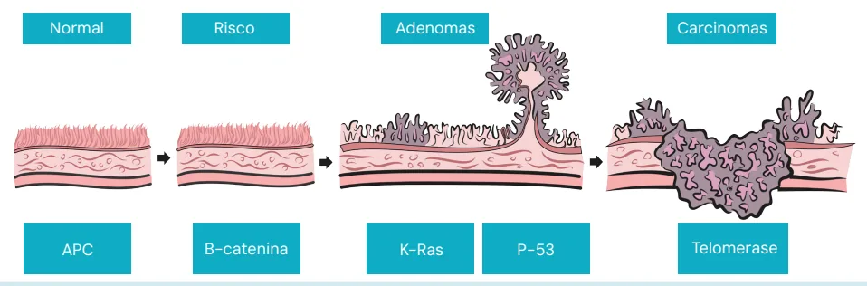
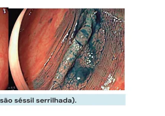
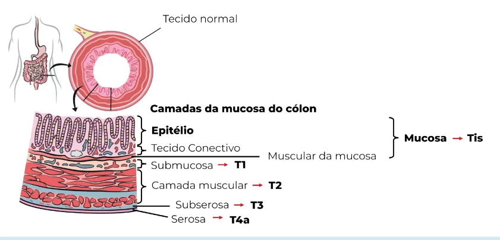
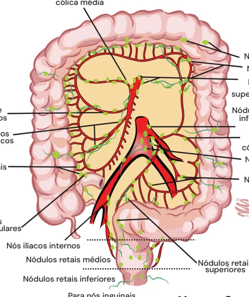
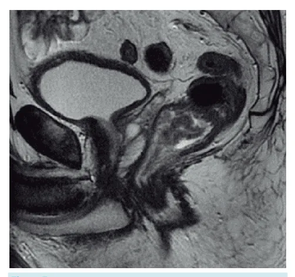

# Coloproctologia Câncer Colorretal

<!-- page:1 -->

## Coloproctologia: Câncer Colorretal

**Carcinogênese do CCR:** APC → beta-catenina → K-Ras → p53.

- **Rastreamento:** 45 – 85 anos → Colonoscopia a cada 10 anos.
- **Estadiamento:** Cólon (TC) x Reto (RM).

## Introdução e Considerações Gerais

### Definições

- É o **tumor mais comum do trato gastrointestinal**.

### Fatores de Risco

**Gerais**

- Sedentarismo;
- Estilo de vida não saudável — dieta pobre em fibras e rica em substâncias industrializadas, com maior consumo de alimentos ultraprocessados, padrão ocidental de alimentação;
- Diabetes;
- Tabagismo;
- Etilismo;
- Obesidade;
- Idade.

**Hereditários**

- **Polipose adenomatosa familiar (PAF)** — **100%** dos pacientes com PAF podem desenvolver CCR até os 40 anos de idade;
- **Polipose associada à MUTYH**;
- **Síndrome de Lynch (HNPCC)** — também chamada de câncer colorretal hereditário não polipoide. Deve-se a mutação nos genes **MLH1, MSH2, MSH6 e PMS2**.

**Doença inflamatória intestinal**

- Retocolite ulcerativa;
- Doença de Crohn — eleva em **10 – 20x** o risco de câncer colorretal;
- Maior risco de CCR devido ao grau de inflamação colônica associado ao tempo de atividade da doença; esses pacientes podem apresentar CCR com pior prognóstico e mais agressivo.

**Colite actínica**

- Secundária à radiação abdominal;
- Pacientes podem apresentar sangramentos esporádicos nas fezes. Normalmente se apresenta como um quadro de telangiectasias em cólon associado a maior rigidez do mesmo, em pacientes que tiveram exposição a radiação nesta topografia.

**Tratamento (visão geral):**

- **Câncer de cólon e reto intraperitoneal:** cirurgia com margens livres + linfadenectomia (mínimo de **12 linfonodos**). Margem de **5 cm**;
- **Câncer de reto extraperitoneal (médio e distal):** neoadjuvância (QRT para T3/T4 ou N+) + retossigmoidectomia com excisão total do mesorreto.

## Epidemiologia

- 2º ou 3º tipo de câncer mais comum tanto no sexo feminino como no masculino, a depender da região analisada.

> ⚠️ Dados de tabela ambíguos no OCR original — não foi possível reconstruir com segurança o pareamento de localização/casos/percentuais da Tabela 1 (epidemiologia do câncer no Brasil, por sexo); conteúdo listado em texto corrido a seguir.

- **Homens:** próstata (maior incidência), seguido de traqueia/brônquio/pulmão, cólon e reto, estômago, cavidade oral, esôfago, bexiga, linfoma não Hodgkin, laringe e leucemias, entre outros.
- **Mulheres:** mama feminina (maior incidência), seguido de cólon e reto, colo de útero, traqueia/brônquio/pulmão, glândula tireoide, estômago, ovário, corpo de útero, linfoma não Hodgkin e SNC, entre outros.

## Carcinogênese do Câncer Colorretal

### Existe uma Sequência Carcinogênica Bem Estabelecida

- O processo leva, em média, **10 anos**, na população geral.

> **OBS.:** Este tempo se correlaciona com a frequência de rastreio por colonoscopia. O intervalo entre um exame e o seguinte (em média, de 5 – 10 anos) se dá por esse motivo.

- **Sequência:**
  1. Epitélio normal, sem alterações;
  2. Agressão epitelial pelos fatores de risco (tabagismo, sedentarismo, entre outros);
  3. Mutação do gene **APC** (gene supressor tumoral) → formação de pólipos;
  4. Mutação da **beta-catenina** — demonstra potencial displásico;
  5. Mutação do gene **K-Ras** (proto-oncogene) — evolui com aumento do potencial displásico, de baixo para alto grau;
  6. Mutação do gene **p53** — origem de tumor com potencial invasivo da membrana basal;
  7. Evolução carcinomatosa — com mutações finais da **telomerase**.

> **OBS.:** A origem da mutação do gene **p53** marca a origem do carcinoma! Essa alteração fornece à neoplasia em estágio inicial a capacidade de invadir a submucosa e, dessa forma, ganhar a circulação hematogênica e linfática, aumentando a possibilidade de metastatização.

---

<!-- page:2 -->

*Figura 1: Sequência adenoma-carcinoma no câncer colorretal.*

## Pólipos

### Pólipos Neoplásicos

- Apresentam **displasia**, isto é, risco de malignização;
- A maioria dos pacientes que consomem uma dieta ocidental terão pólipos após os 50 anos de idade; quanto mais displasia/atipias, crescimento e comportamento viloso, maior a capacidade de malignização e transformação neoplásica;
- **Subtipos (adenomas):**
  - **Tubular** — melhor prognóstico;
  - **Viloso** — pior prognóstico;
  - **Tubuloviloso** — prognóstico intermediário.
- **Serrilhados:** apresentam morfologia plana, principalmente durante a insuflação do cólon, com coloração semelhante à da mucosa normal, o que prejudica o diagnóstico e o tratamento endoscópico.

> **DICA!** Adenoma **"viloso... vilão"** apresenta pior prognóstico!

*Figura 2: Pólipo neoplásico (lesão séssil serrilhada).*

### Pólipos Não Neoplásicos

- Não apresentam displasia;
- **Subtipos:**
  - **Hamartomas:** compostos de elementos normalmente encontrados no tecido local, porém com crescimento desorganizado. Cuidado: pode surgir pólipo adenomatoso sobre um pólipo hamartomatoso;
  - **Inflamatórios:** antigamente denominados "pseudopólipos"; são áreas de cicatrização da mucosa (pacientes com doença inflamatória intestinal);
  - **Hiperplásicos:** são áreas com pequenas proliferações da mucosa.

---

<!-- page:3 -->

> ⚠️ Dados de tabela ambíguos no OCR original — não foi possível reconstruir com segurança o pareamento localização/manifestações da tabela desta página; conteúdo listado em texto corrido a seguir (ver também seção "Manifestações Clínicas" abaixo, onde o conteúdo equivalente aparece mais claro).

- Manifestações possíveis: hematoquezia; alteração do hábito intestinal.

## Rastreamento

### Rastreamento: 45 – 85 Anos

- **Populacional:** a partir dos 45 anos;
- **Exames:**
  - **Colonoscopia**, a cada 10 anos — bom custo-benefício, com capacidade de identificação de pequenos pólipos e possibilidade de polipectomia;
  - **Teste imunoquímico fecal (TIF)** para sangue oculto, anualmente;
  - **Sigmoidoscopia**, a cada 10 anos, associada ao TIF anualmente; ou sigmoidoscopia isolada, a cada 5 anos;
  - **Colonografia por tomografia computadorizada (CTC)**, ou colono virtual, a cada 5 anos;
  - **Teste de DNA de fezes multitarget (DNA-FIT/DNA fecal imunoquímico)**, a cada 3 anos;
  - **Teste de sangue oculto nas fezes baseado em guaiaco**, anualmente;
- **Até 85 anos** (75 – 85 anos: rastreamento individualizado): levar em consideração expectativa de vida e performance status;
- **Familiares de primeiro grau com câncer colorretal:** a partir de 40 anos de idade ou, pelo menos, 10 anos antes da idade em que o familiar apresentou câncer colorretal. O rastreamento é sempre realizado com **colonoscopia**;
- **Alto risco** (PAF, Lynch, RCU, Doença de Crohn): a depender do protocolo.

### Colonoscopia Virtual

- **Indicação:** lesões intransponíveis em colonoscopia convencional, mas em cólon com capacidade de preparo;
- Eficácia semelhante à da colonoscopia óptica para detecção de pólipos clinicamente relevantes e de câncer colorretal.

> Cuidado: as fezes podem simular lesões ou pólipos.

## Manifestações Clínicas

- **Cólon direito:**
  - Anemia (sangue oculto nas fezes);
  - Fadiga;
  - Massa palpável;
  - Dificilmente evolui com obstrução.
- **Cólon esquerdo:**
  - Alteração do hábito intestinal e da consistência fecal;
  - Obstrução.
- **Reto:**
  - Tenesmo;
  - Dor;
  - Calibre fecal reduzido;
  - Obstrução.

*Figura 3: Manifestações clínicas e prevalência do câncer colorretal conforme a topografia.*

- Neoplasias do cólon direito são menos sintomáticas; principal manifestação: **anemia assintomática**;
- Tumores do cólon esquerdo e retossigmoide apresentam-se mais frequentemente com sintomas obstrutivos, devido à menor dimensão do cólon nesta topografia.

## Prognóstico

- Tumores de cólon direito demonstram **pior prognóstico** em comparação àqueles do cólon esquerdo e reto;
- Diagnóstico em estágios mais avançados, maior associação com a síndrome de Lynch. A síndrome de Lynch cursa com instabilidade de microssatélites, o que favorece a implantação/invasão da submucosa sem desenvolver o processo neoplásico de forma contígua, favorecendo o pior prognóstico;
- Os tumores do cólon esquerdo, em geral, têm **melhor prognóstico**, pois costumam manifestar sintomas precocemente, principalmente pela presença de sangue vivo nas fezes (hematoquezia), além de apresentar maior sensibilidade aos quadros obstrutivos devido ao menor lúmen e maior crescimento intraluminal concêntrico constritivo.

---

<!-- page:4 -->

*Figura 4: Estadiamento T do câncer colorretal.*

## Estadiamento

### Câncer de Reto x Câncer de Cólon

| Exame | Reto | Cólon |
|---|---|---|
| Tomografia de tórax e de abdome superior | Sim | Sim |
| Ressonância magnética de pelve | Sim | — |
| Tomografia de pelve | — | Sim |
| CEA (antígeno carcinoembrionário) | Sim | Sim |
| Colonoscopia completa (exclusão de outras lesões sincrônicas) | Sim | Sim |

> **OBS.:** O CEA é um bom marcador prognóstico e para acompanhamento.

**Ressonância magnética de pelve — para estadiar os tumores de reto:**

- Devido à maior quantidade de tecido adiposo, favorece uma melhor visualização das estruturas, assim como a invasão do músculo elevador do ânus;
- Consegue identificar melhor a invasão extramural e a disseminação angiolinfática;
- Ainda, há possibilidade de localizar o tumor de reto acima da reflexão peritoneal (tumores altos; intraperitoneais) ou abaixo dela (tumores médios ou baixos; extraperitoneais).

**Estadiamento TNM:**

| Categoria | Definição |
|---|---|
| Nx | Linfonodos não avaliados |
| N0 | Sem linfonodos comprometidos |
| N1 | 1 – 3 linfonodos positivos |
| N2 | 4 ou mais linfonodos positivos |
| M0 | Sem metástase |
| M1 | Metástases à distância |

| Estágio | TNM |
|---|---|
| 0 | Tis N0 M0 (in situ) |
| I | T1-T2 N0 M0 |
| II | T3-T4 N0 M0 |
| III | Tx N+ M0 |
| IV | Tx Nx M1 |

## Tratamento

### Câncer de Cólon ou Reto (Intraperitoneal)

- Tratamento cirúrgico;
- Quimioterapia apenas **adjuvante** (não se faz neoadjuvância);
- **Cirurgia** — depende do local do tumor:
  - Cólon direito: colectomia direita;
  - Cólon esquerdo: colectomia esquerda;
  - Cólon transverso: transversectomia;
  - Sigmoide: retossigmoidectomia;
  - Em alguns casos, deve-se realizar ressecção em bloco com exérese multivisceral dos focos acometidos pela neoplasia. Pode ser necessária ressecção de parte da bexiga, ureterectomia e, em alguns casos, até nefrectomia para controle do foco.
- **Linfadenectomia:** ligadura dos vasos na origem, com retirada de, pelo menos, **12 linfonodos**:
  - Cólon direito: artéria ileocecoapendicocólica em sua base com a mesentérica superior, e o ramo direito da cólica média, podendo ainda estender-se à cólica média a depender da localização do tumor (flexura hepática);
  - Cólon transverso: artéria cólica média;
  - Cólon esquerdo: artéria mesentérica inferior, ramos retal superior, sigmoideano, cólica esquerda.

---

<!-- page:5 -->

*Figura 6: Anatomia — artérias e drenagem linfática no cólon (nódulos epicólicos, paracólicos, mesentéricos, ileocólicos, cecais, apendiculares, ilíacos internos, para-aórticos, sigmoides, retais e para nós inguinais).*

> **OBS.:** A retirada de menos de 12 linfonodos na peça cirúrgica pressupõe a realização de procedimento cirúrgico "não oncológico", isto é, sem o estadiamento adequado. Nesses casos, o paciente deve ser encaminhado à quimioterapia sistêmica, mesmo que não existam mais linfonodos comprometidos. A retirada incompleta de linfonodos resultará, na patologia, em um TNM com o status linfonodal **NX** (sem possibilidade de avaliação), impedindo o estadiamento correto do paciente.

> **ATENÇÃO!!!** A margem cirúrgica colônica deve ser de, pelo menos, **5 cm**!

*Figura 5: Colectomia direita e colectomia direita estendida.*

### Câncer de Reto (Extraperitoneal)

- Até cerca de **7 cm** da borda anal, abaixo da reflexão peritoneal;
- Ressonância magnética é o exame mais adequado para estadiamento de lesões na região pélvica; identifica invasão de estruturas adjacentes, lesões extramurais e situação do mesorreto.

**Neoadjuvância:**

- **Indicações:**
  - Lesões T3 ou T4;
  - Linfonodo positivo;
  - Tumores distais que envolvem o esfíncter anal (pela tentativa de preservação esfincteriana);
  - Envolvimento da fáscia mesorretal (pela tentativa de melhora da margem comprometida).
- **Esquema terapêutico:** quimiorradioterapia — 5-fluorouracil + Leucovorin, associado à radioterapia (dose de 5040 cGy).
- **Benefícios:**
  - Downstaging tumoral;
  - Eleva a taxa de preservação esfincteriana;
  - Redução das taxas de recidiva local do tumor;
  - Resposta patológica completa: ocorre em 15 – 30% dos pacientes (o tumor desaparece clinicamente) — proceder com **Watch and wait**.

---

<!-- page:6 -->

> **OBS.:** A quimiorradioterapia convencional demonstra capacidade de reduzir a taxa de recidiva local, contudo não altera a taxa sistêmica.

> **ATENÇÃO:** O esquema padrão-ouro é dado por: neoadjuvância → aguardo de 12 semanas → cirurgia.

- **Amputação abdominoperineal do reto** — definida com reestadiamento após neoadjuvância. **Indicação:** ressonância magnética com evidência de invasão da musculatura elevadora do ânus. Essa cirurgia, também chamada de procedimento de Miles, é uma abordagem abdominal e perineal que envolve a retirada do espécime cirúrgico através da dissecção perineal, com ressecção do músculo elevador do ânus associada à retirada do reto distal com seu mesorreto e sigmoide, e confecção de uma colostomia definitiva.

*Figura 7: Ressonância magnética da região pélvica.*

- **TNT — Terapia Neoadjuvante Total:** esquema terapêutico um pouco diferente, com outros quimioterápicos (por exemplo, FOLFIRINOX ou mFOLFOX) + radioterapia. Diminui a recidiva sistêmica.
- **Terapia alvo e imunoterapia:** terapias sistêmicas alternativas em casos específicos:
  - **Bevacizumabe:** fármaco que promove inibição do fator de crescimento endotelial vascular (VEGF), inibindo a angiogênese e o suprimento tumoral;
  - **Nivolumabe ou Pembrolizumabe:** terapia alvo para mutações do MSH1, principalmente utilizada em pacientes que possuam instabilidade de microssatélites e síndrome de Lynch.

**Excisão total do mesorreto**

- É a retirada do reto acompanhado de toda a gordura adjacente que o cerca;
- O mesorreto é composto de diversos linfonodos e vasos sanguíneos com potencial metastático; assim, a excisão total é associada com melhora das taxas de recidiva local e sistêmica;
- Os limites são as fáscias de Denonvilliers e Waldeyer:
  - Fáscia anterior (septo retroprostático) — Denonvilliers;
  - Fáscia posterior (pré-sacral) — Waldeyer;
- No reto: margem distal extraperitoneal livre de neoplasia é suficiente para ressecção **R0**! A indicação da amputação do reto depende do acometimento do esfíncter. Normalmente, a margem de segurança situa-se a **2 cm** da linha pectínea.

## Quimioterapia Adjuvante

- **Indicações:**
  - Presença de linfonodos positivos (estágio III) — indicação principal;
  - Presença de menos de 12 linfonodos ressecados com a peça cirúrgica;
  - Tumor T4;
  - Cirurgia de urgência em tumores obstruídos e perfurados;
  - Tumores pouco diferenciados;
  - Invasão angiolinfática e perineural.

## Câncer de Reto Precoce

- Lesão precoce que alcança, no máximo, a camada mucosa e submucosa, independentemente de acometimento linfonodal;
- **Ressecção endoscópica do câncer de reto precoce — indicações:**
  - SM1;
  - Menor que 4 cm de diâmetro;
  - Margens livres após a ressecção;
  - Menos de 30 – 40% da circunferência;
  - < 6 cm de distância da margem anal;
  - Ausência de sinais de comprometimento linfonodal;
  - Ausência de metástase;
  - Histologia bem diferenciada.

**Fluxograma geral de manejo — câncer de reto precoce:** estadiamento com colonoscopia completa e cromoscopia com magnificação (Kudo), RM de pelve, TC TAP e CEA. Adenocarcinoma in situ ou cT1N0M0 → ESD/TEM/TEO. cT1N0M0 com fatores de risco → cirurgia/neoadjuvância.

*Figura 8: Fluxograma geral de manejo do câncer de reto precoce.*

---

<!-- page:7 -->

## Padrões de Cripta de Kudo

- Chance de câncer (Sm) no padrão Vi: aproximadamente **30%**; no padrão Vn: aproximadamente **90%**;
- Padrões I – IV: ressecção endoscópica;
- **Vi** — 30% de probabilidade de invasão submucosa: ressecção endoscópica ou cirurgia;
- **Vn** — invasão grosseira da camada submucosa: cirurgia;
- A cirurgia endoscópica transanal (TEO/TEM) ou a ressecção colonoscópica são métodos de ressecção nas neoplasias que se apresentam, na magnificação de imagem, entre os padrões I e IV.

## Referências

- MELLO, B. B. de. Lesões sésseis serrilhadas. 2021. Disponível em: https://endoscopiaterapeutica.net/pt/assuntosgerais/lesoes-sesseis-serrilhadas/. Acesso em: 16 jul. 2025.
- DI MUZIO, B. Tubulovillous adenoma of the rectum. Radiopaedia [Internet]. Caso clínico publicado em: 12 jul. 2018. Disponível em: https://doi.org/10.53347/rID-61649. Acesso em: 17 jul. 2025.
