# Coloproctologia Doenças Orificiais

<!-- page:1 -->

## Coloproctologia — Doenças Orificiais

### Visão Geral

- **Hemorroida externa**: abaixo da linha pectínea. **Dói** (pode haver **trombose**).
- **Hemorroida interna**: acima da linha pectínea. **Não dói**. Sangramento e prolapso.
- **Plicoma sentinela** e **papila hipertrófica**: achados associados à fissura anal crônica.
- **Abscesso perianal**: infecção das **glândulas de Chiari**; aproximadamente **50%** evoluem com fístulas perianais.
- **Fístulas** – classificadas pela **Regra de Parks**.
- **Tratamento das hemorroidas**:
  - Melhorar o hábito evacuatório (evitar esforço).
  - **Grau II (interna)**: ligadura elástica ou escleroterapia.
  - **Cirurgia** indicada se: trombose de repetição / hemorroidas internas graus III e IV / insucesso do tratamento clínico / motivo estético (ambulatorial).
  - **Hemorroidectomia**: técnicas de Milligan-Morgan (aberta) ou Ferguson (fechada) — tratam hemorroidas internas e externas.
  - **Técnicas não excisionais**: PPH ou THD — indicadas principalmente para hemorroida interna com prolapso circunferencial.
- **Fissura anal**:
  - Pode ser aguda ou crônica.
  - Crônica: hipertrofia esfincteriana, ulceração esbranquiçada, plicoma sentinela.

## Hemorroida — Classificação

- É uma **estrutura normal do corpo**, responsável pela **continência fecal** e proteção dos esfíncteres. Não confundir hemorroida (estrutura normal, sem complicação) com **doença hemorroidária** (resultante do ingurgitamento e prolapso das mesmas).
- São **coxins vasculares** (arteríolas + veias) sustentados por tecido conjuntivo.

**Hemorroidas internas:**
- Acima da linha pectínea.
- Recobertas por mucosa.
- Irrigadas pelo plexo hemorroidário superior.
- Inervação visceral → **não doem**.

**Hemorroidas externas:**
- Abaixo da linha pectínea.
- Recobertas pelo anoderma (pele).
- Irrigadas pelo plexo hemorroidário inferior.
- Inervação somática → **pode ocorrer dor**.

## Fisiopatologia

- Degeneração dos tecidos de sustentação anal.
- Hiperfluxo arterial, através dos ramos da artéria retal superior.
- Destruição do tecido conjuntivo dentro dos coxins anais.
- Por fim, ocorre deslizamento dos coxins.

## Fatores de Risco

- Esforço ao evacuar.
- Hábitos dietéticos.
- Fatores genéticos.
- Aumento da pressão abdominal.
- Gestação.
- Sexo masculino.
- Dieta pobre em fibras.
- Musculação.
- **HPB** (hiperplasia prostática benigna).

**Coxins hemorroidários** — posições clássicas:
- Lateral esquerdo — **3h**.
- Posterior direito — **7h**.
- Anterior direito — **11h**.
- Padrão de descrição — **12h** → linha média anterior.

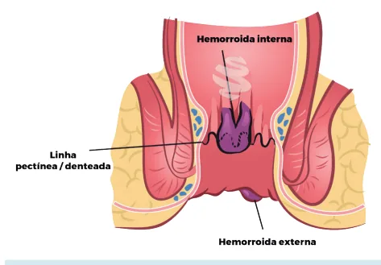

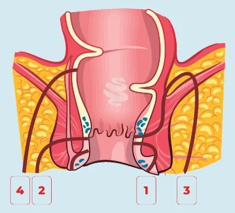

---

<!-- page:2 -->

Figura 2: Localização das hemorroidas.

## Classificação das Hemorroidas Internas

- **Grau I**: sem prolapso hemorroidário.
- **Grau II**: prolapso com esforço e retorno espontâneo.
- **Grau III**: prolapso com esforço e retorno manual.
- **Grau IV**: hemorroidas não reduzem.

## Sintomas

- É importante ter um raciocínio topográfico para saber que tipo de sintoma o paciente pode apresentar.
- Normalmente, todos os pacientes com hemorroidas podem apresentar **hematoquezia**, independentemente de a hemorroida ser interna ou externa.
- **Internas**: sangramento, prurido, prolapso.
- **Externas**: dor, abaulamento local. **Trombose** (normalmente das veias que acompanham o plexo hemorroidário) → dor aguda + nodulação local.

Figura 3: Hemorroidas internas.
Figura 4: Hemorroida externa.
Figura 5: Graus de hemorroida interna.

## Diagnóstico Diferencial

- **Varizes retais**: manifestam-se em virtude da **hipertensão portal**. A conduta para varizes retais sangrantes deve ser a sutura cirúrgica ou ligadura elástica.

Figura 6: Varizes retais.

- **Procidência de reto** → prolapso de espessura total. Normalmente visualizado em pacientes idosos ou multíparas com parto vaginal.
  - Ao realizar esforço, em geral há perda de fezes espontânea.
  - **Conduta**: fixação do reto com tela; **cirurgia de Altemeier** (retossigmoidectomia perineal), com sutura do músculo puborretal e anastomose por via anal, podendo também ser realizada por via abdominal.

## Tratamento

- **Para todos os pacientes**: medidas dietéticas para amolecer as fezes (aumento de fibras e água); menor esforço evacuatório; banho de assento.

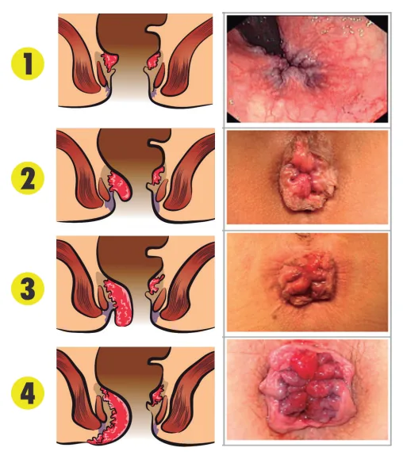

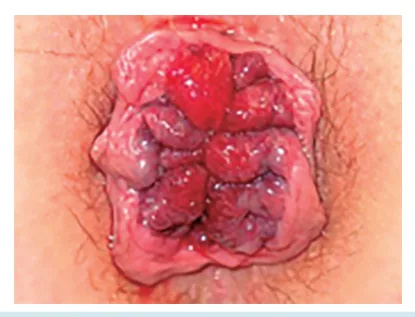

---

<!-- page:3 -->

- **Tratamento ambulatorial** (refratariedade ao tratamento clínico):
  - **Ligadura elástica** (apenas hemorroidas internas).
  - **Escleroterapia** — apenas para grau II.

Figura 7: PPH.

- **Indicações de cirurgia**: trombose de repetição; hemorroidas internas graus III e IV; insucesso de tratamento clínico ou queixas estéticas (ambulatorial).
- **Vigência de trombose**: tratamento conservador (**AINEs**); cirurgia — **hemorroidectomia** se <48h, ou **trombectomia** (risco de estenose anal e incontinência).

## Técnicas Excisionais (Hemorroidectomias)

- Consiste na excisão de todo o coxim hemorroidário, tanto interno quanto externo. Serve, portanto, de tratamento para ambos os tipos de hemorroidas.
- **Aberta** → técnica de **Milligan-Morgan**.

Figura 8: Milligan-Morgan.
Figura 9: Hemorroidectomia.

- **Fechada** → técnica de **Ferguson**.

Figura 10: Ferguson.

- **Principais complicações**: dor, estenose anal, abscesso com risco de Fournier, incontinência fecal (se houver lesão esfincteriana), sangramento.
- Importante lembrar de manter as pontes mucosas, que favorecem a continência do paciente e diminuem o risco de estenose.

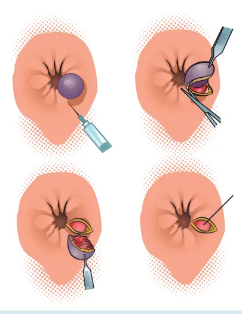

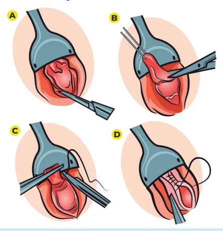

---

<!-- page:4 -->

## Técnicas Não Excisionais → Hemorroidas Internas

- **PPH** (prolapso circunferencial da mucosa retal): sutura em bolsa com grampeamento do excesso de tecido hemorroidário, acima da linha pectínea. Principalmente indicado para hemorroidas circunferenciais.

Figura 11: PPH.

- **THD** (Transanal Hemorrhoidal Dearterialization): visualização dos vasos que irrigam os coxins hemorroidários + realização de sutura contínua (lift) → aumenta a sustentação do canal anal.

Figura 12: THD.

- **Vantagem**: cursa com menos dor no pós-operatório.
- **Desvantagem**: apresenta maior taxa de recidiva.

## Fissura Anal

- **Ulceração linear distal à linha pectínea**.
- Normalmente localizada na linha média posterior (**90%**). Fissuras em locais atípicos devem levantar suspeita de: HIV, doença de Crohn, neoplasia, sífilis, tuberculose.
- Alta relação com trauma local.

## Etiologia

- Constipação.
- Diarreia volumosa.
- Sexo anal.
- Trauma anal.

## Classificação

- **Agudas** (< 6 semanas).
- **Crônicas** (> 6 semanas): hipertrofia esfincteriana; ulceração esbranquiçada; plicoma sentinela + papila hipertrófica.

Figura 13: Fissura anal.

- **Tratamento clínico** → principalmente para as fissuras agudas: bloqueadores do canal de cálcio tópicos (**diltiazem** e **nifedipina**) ou fármacos que contenham óxido nítrico; regularização do hábito evacuatório; aumento da ingesta de fibras e água; banho de assento.
- **Tratamento cirúrgico** → para as fissuras crônicas: **esfincterotomia lateral interna** (padrão-ouro); toxina botulínica (Botox).

## Fístulas Perianais

- Ocorrem pela comunicação entre a cripta infectada e o tecido perianal.
- Associadas a: abscesso perianal; doença de Crohn; tuberculose/HIV.
- Mais comuns em mulheres.
- Drenagem constante de material purulento (fecaloide) pelo ânus.

Figura 14: Fístula perianal.

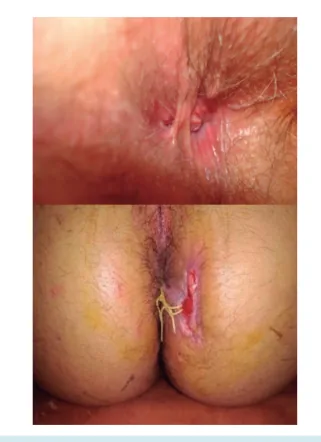

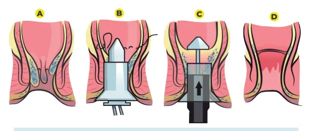

---

<!-- page:5 -->

## Classificação de Parks — Fístulas

- **Parks 1** → interesfincteriana — **45%** dos casos.
- **Parks 2** → transesfincteriana — **30%** dos casos.
- **Parks 3** → supraesfincteriana — **20%** dos casos.
- **Parks 4** → extraesfincteriana — **5%** dos casos.

**Fístulas complexas**: interesfincteriana com mais de 35% de envolvimento do esfíncter externo; transesfincterianas; supraesfincterianas; extraesfincterianas; associadas à doença de Crohn, radioterapia ou neoplasia.

Figura 15: Classificação de Parks.
Figura 16: Classificação de Parks.

## Regra de Goodsall-Salmon

- Orifício externo **anterior** com menos de 3 cm: trajeto **linear** para a cripta correspondente.
- Orifício externo **posterior** com menos de 3 cm: trajeto **curvilíneo** para a cripta média posterior.
- Orifício a **mais de 3 cm** da borda anal: trajeto curvilíneo para a cripta média posterior, ou trajeto drenando para outra fístula na mesma topografia.

Figura 17: Regra de Goodsall-Salmon.

- **Avaliação por exames de imagem** — métodos possíveis: RM de pelve; TC de pelve; USG endorretal; fistulografia.

Figura 18: Fístulas perianais.

## Tratamento

- Fístulas simples (interesfincterianas ou transesfincterianas, que acometem < 30% do esfíncter, e superficiais): **fistulectomia** ou **fistulotomia**.
- Fístulas complexas (alto risco de incontinência): **sedenho**; retalhos; **LIFT**.
- Existem outros métodos, ainda sem evidência totalmente comprovada mas promissores, como o **plug de fibrina** e a cola (Tissucol), para realizar o fechamento do trajeto fistuloso e garantir a saída do material no reto.

Figura 19: Sedenho.

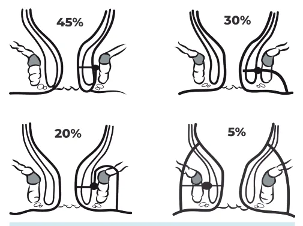

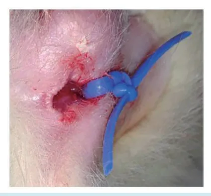

---

<!-- page:6 -->

Figura 20: LIFT.

## Abscesso Perianal

- Infecção das **glândulas de Chiari**.
- Normalmente se apresenta com nódulo eritematoso flutuante em região perianal, com sintomas consumptivos, anorexia, prostração e dor no local do abscesso. Pacientes com abscessos mais profundos (supraelevadores) podem apresentar quadro apenas com sintomas consumptivos, sem outros achados locais.
- Aproximadamente **50%** apresentam fístulas perianais posteriormente ao quadro.
- **Classificação de Parks** — também utilizada para abscessos perianais.
- **Tratamento**: drenagem, com ou sem antibioticoterapia. Cuidado com a evolução para **síndrome de Fournier** e para fístulas perianais.
- Ao se diagnosticar abscesso retal em região supraelevadora, lembrar que normalmente são quadros que se desenvolvem a partir de patologias da cavidade abdominal, seja por apendicite ou por diverticulite aguda.
- Lembrar: todo abscesso diagnosticado deve se tornar um abscesso drenado.

Figura 21: Tratamento cirúrgico.
Figura 22: Abscessos perianais — classificação.

## Referências

Figura 3: Hemorroidas internas — Domínio público - Google. Figura 4: Hemorroida externa — Domínio público - Google.

Figura 5: Graus de hemorroida interna — Adaptado, acervo pessoal Medcof. Figura 6: Varizes retais — www.endoscopiaterapeutica.com.br. Figura 8: Milligan-Morgan — Acervo pessoal Medcof. Figura 12: THD — Acervo pessoal. Figura 13: Fissura anal — Acervo pessoal Medcof, modificado. Figura 14: Fístula perianal — Acervo pessoal Medcof, modificado. Figura 18: Fístulas perianais — Weerakkody Y, Rasuli B, Tao W, et al. Perianal fistula. Reference article, Radiopaedia.org (Accessed on 17 Jul 2025).

Figura 19: Sedenho — Acervo pessoal Medcof, modificado. Figura 21: Tratamento cirúrgico — Acervo Pessoal Medcof.

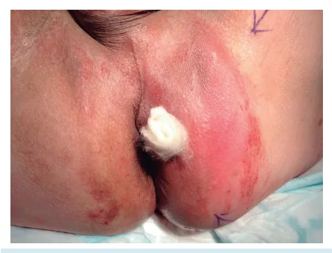
