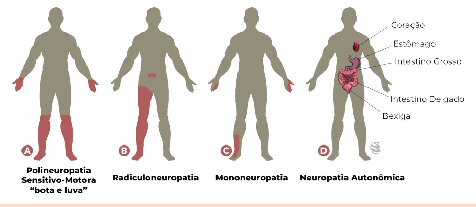
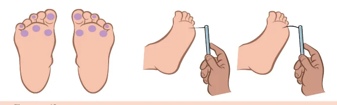

# Complicações Crônicas do DM

<!-- page:1 -->

Diabetes (CM) RASTREAMENTOS

- DM2: início ao diagnóstico;

- DM1: início após 5 anos do diagnóstico;

- 1x/ano.

Doença Renal do Diabetes

- Relação albumina/creatinina na urina

(amostra isolada) +

- Creatinina sérica → cálculo TFG (CKD-EPI).

Retinopatia

- Exame de fundo de olho/mapeamento de retina.

Neuropatia Periférica

- Clínico após exclusão de outras causas

Neuropatia Autonômica

- Sintomas Hipotensão Taquicardi SCA sem d

Cardiovascular | Morte súb

- CARTS/Testes FC a respir Valsava; Hipotensão

- Sintomas Controle e Plenitude p Má absorç Desnutriçã

Gastrointestinal

- Cintilografia c

- Sintomas ITU repetiç Retenção e Disfunção Dispareuni

Urogenital

- Diagnóstico d

Tratamento

- Combater HAS, albuminúria, obesidade, tabagismo, a

Neuropatia periférica Restaurador

- Ácido Alfalipóico

- Fisioterapia

- Reposição B12/D

Sintomático

- Antidepressivo tricíclico

- Gabapentinoides

- Inibidores da recaptação de serotonina

(e norepinefrina)

- Outros anticonvulsivantes (carbamazepina) Sensibilidade dolorosa; Sensibilidade térmica; Sensibilidade vibratória (diapasão); Reflexo aquileu.

(dois dos quatro abaixo): Pé diabético

- Palpação de pulsos;

- Teste de monofilamento Não é para rastreamento de neuropatia periférica → só dá alterado quando tem perda de sensibilidade protetora (alto risco de ulceração).

o postural e pós-prandial; ia em repouso; dor típica; bita; s de Ewing ração profunda; o postural. errático da glicose;

pós-prandial; ção de medicamentos orais; ão. com Tecnécio99 para medida do esvaziamento gástrico. ção; bexiga palpável;

e incontinência urinária; erétil; ia/secura vaginal. de exclusão. alimentação inadequada e sedentarismo.

Neuropatia autonômica Cardiovascular

- Hipotensão postural: meias elásticas, ingesta hídrica, fludrocortisona/midodrine/ clonidina/octreotide

- Taquicardia sinusal: beta-bloqueadores

Gastrointestinal

- Fracionamento refeição

- Dieta com fibras

- Laxantes/antidiarreicos

- Procinéticos

Urogenital

- Bexiga neurogênica: manobra de Credé

(“apertar a bexiga”); doxasozina

- Disfunção erétil: inibidores da fosfodiesterase 5

- Dispaurenia/secura: lubrificantes

---

<!-- page:2 -->

## NEUROPATIA DIABÉTICA

| Hipoglicemia assintomática → menor secreção de glucagon e adrenalina;

- Presença de sintomas e/ou sinais de disfunção dos

- Mononeuropatia – acomete apenas 1 nervo periférico nervos periféricos em indivíduos com DM, após a | O mais comum é o acometimento de 3º par exclusão de outras possíveis causas. craniano (ÓCULO-MOTOR) É um diagnóstico de exclusão! | Ptose palpebral e midríase; A ausência de sintomas não afasta a presença | Nervos medianos → Síndrome do Túnel do Carpo;

de neuropatia. | Nervo ulnar e radial → Síndrome da mão “caída”;

- É a complicação crônica mais prevalente, atingindo | Nervo fibular → ‘’pé caído’’; Até mesmo pacientes com pré-DM já têm algum | Nervo tibial anterior → Síndrome do túnel do tarso;

cerca de 50% dos pacientes | Nervo femoral lateral → meralgia parestésica; grau de neuropatia diabética;

- Pode ocorrer também a mononeurite múltipla, que é o acometimento de vários nervos

FISIOPATOLOGIA periféricos isoladamente;

- Hiperglicemia crônica → ativa a via do poliol e da

- Radiculoneuropatia hexosamina → estresse osmótico → disfunção | Geralmente acomete apenas 1 nervo, acometendo mitocondrial → apoptose neuronal. apenas o dermátomo correspondente.

- Dislipidemia e hipertensão também corroboram para a | Neuropatia do plexo radicular – principalmente da disfunção neuronal. região lombossacral, é a mais comum; Costuma acometer mais comumente idosos,

APRESENTAÇÃO CLÍNICA | Paciente pode se queixar de dor intensa, em

- Polineuropatia sensitivo-motora ‘’bota e luva’’; queimação, na região das coxas, junto à fraqueza

- Mais comum, acomete principalmente mãos e pernas muscular significativa; Paciente pode apresentar parestesias, disestesias, | A radiculopatia torácica é outra neuropatia alodinia, hiperalgesia, câimbras e fraqueza muscular. que pode acometer pacientes diabéticos e faz Surge em repouso, geralmente melhora com diagnóstico diferencial com neuralgia pós-herpética.

a atividade física e piora à noite, tem um acometimento distal-proximal; NEUROPATIA PERIFÉRICA

- Verificar Figura 1 Rastreamento

- Neuropatia autonômica – acomete o sistema nervoso

- DM2 → Ao diagnóstico.

simpático e parassimpático

- DM1 → 5 anos após o diagnóstico. Cardiovascular → hipotensão postural e pós-

- Rastreamento negativo (DM1 e DM2) → prandial, taquicardia em repouso, síndrome reavaliação anual.

coronariana aguda SEM dor típica, morte súbita;

- Avaliar fibras finas em pré-diabéticos. Periférica → sensação de resfriamento/ Diagnóstico congelamento, pele ressecada, formação de calos

- Clínico e de exclusão → presença de dois ou mais Gastrointestinal → disfagia, pirose, gastroparesia, testes ou sinais neurológicos alterados. Genitourinária → disfunção erétil e vesical; | Sensibilidade dolorosa (fibra C fina);

constipação, diarreia e incontinência fecal; | Sempre avaliar fibras finas e grossas. ejaculação retrógrada; dispareunia; | Sensibilidade térmica ao frio (fibra A delta fina);

| Sudomotora → anidrose distal; | Sensibilidade ao calor (fibra C fina); | Redução da produção de suor, principalmente | Sensibilidade vibratória (fibra A beta grossa);

na periferia. | Reflexo aquileu (fibra a alfa grossa). Figura 1: Apresentações clínicas da neuropatia diabética

---

<!-- page:3 -->

- Sempre excluir outras causas como deficiência de Tratamento vitamina B12, etilismo, hipotireoidismo, síndrome

- O tratamento de base é controlar glicemia, HAS, peso, do túnel do carpo, excesso de vitamina B6, drogas, dislipidemia, albuminúria, tabagismo e etilismo.

substâncias neurotóxicas e metais pesados.

- O tratamento restaurador consiste na tentativa de

- O teste do monofilamento não é tão utilizado para restaurar função neural e funcionalidade

- O teste do monofilamento não é tão utilizado para diagnóstico, ele é utilizado como avaliação do risco de úlcera; Avalia a pressão plantar → fibras A alfa e beta (grossa).

- Verificar Figura 2

- Aplicar o monofilamento com 10g em cada um dos 6 pontos em cada pé, questionando sobre sensibilidade 2 ou mais pontos acometidos em cada pé, o teste do monofilamento é positivo: pé de risco de ulceração.

Figura 2: Teste do Monofilamento 10 g

## NEUROPATIA AUTONÔMICA

Tabela 1: Sintomas, diagnóstico e tratamento dos diversos tipos d Tipo Sintomas e diagnóstico

- Sintomas Hipotensão postural e pós-prandial; Taquicardia em repouso; SCA sem dor típica; Morte súbita;

Cardiovascular

- Testes autonômicos de reflexos cardiovasculares (CARTS)/Testes de Ew FC a respiração profunda; Valsava; Hipotensão postural.

- Sintomas Controle errático da glicose; Plenitude pós-prandial; Má absorção de medicamentos orais Desnutrição.

Gastrointestinal

- Cintilografia com Tecnécio99 para med do esvaziamento gástrico.

- Sintomas ITU repetição; bexiga palpável; Retenção e incontinência urinária; Disfunção erétil; Dispareunia/secura vaginal.

- Diagnóstico de exclusão. Fisioterapia; Ácido alfa-lipóico; Reposição de vitamina D e B12.

Urogenital restaurar função neural e funcionalidade

- Tratamento sintomático de controle da dor pode ser feito com gabapentinoides e anticonvulsivantes:

(gabapentina, pregabalina e carbamazepina), inibidores da recaptação de serotonina e norepinefrina (duloxetina e venlafaxina) e antidepressivos tricíclicos:

amitriptilina e nortriptilina. de neuropatia autonômica Tratamento

- Hipotensão ortostática Evitar mudanças posturais bruscas, meias elásticas, aumentar a ingesta de líquidos, evitar bebidas quentes e consumo de álcool. Fármacos: fludrocortisona, midodrine, clonidina e octreotide.

wing

- Taquicardia sinusal Betabloqueadores cardiosseletivos.

- Gastroparesia Refeições em pequenas porções e frequentes, procinéticos, marcapasso gástrico e injeção de s; toxina botulínica no piloro.

- Diarreia dida | Dieta com fibras solúveis e/ou restrição de glúten e lactose, antibióticos, enzimas pancreáticas, antidiarreicos, anticolinérgicos e octreotide.

- Constipação intestinal Dieta rica em fibras, agentes lubrificantes, laxativos osmóticos e procinéticos.

- Bexiga neurogênica Manobra de credé (apertar a bexiga para facilitar seu esvaziamento durante o processo de micção); Doxazosina, autocateterização vesical intermitente, cirurgia do colo vesical.

- Disfunção sudomotora: Lubrificantes e emolientes da pele, toxina botulínica, vasodilatadores.

- Disfunção erétil: Inibidores da 5-fosfodiesterase; Próteses penianas.

- Secura vaginal Lubrificantes vaginais, cremes vaginais hormonais.

