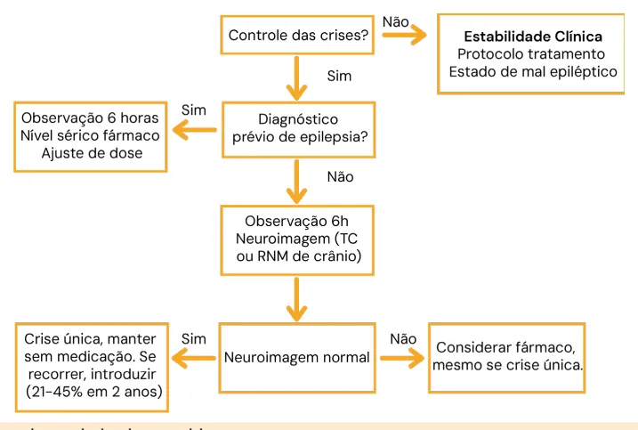

# Convulsão na Emergência e Convulsão Febril

<!-- page:1 -->

## Convulsão na Emergência e Convulsão Febril

**Convulsão na Emergência e Convulsão Febril (Pediatria)**

### 1ª Crise Epiléptica

- Tem natureza epiléptica?
- Fator desencadeante?
- Risco de recorrência?

**No pronto-socorro**

- Avaliação sistematizada (ABC);
- Monitorização;
- Acesso venoso periférico;
- Hipoglicemia? Corrigir;
- Estado de mal epiléptico?

### Crise Febril

- Vigência de febre, sem infecção intracraniana ou outra causa definida:
  - Excluem-se crianças com crises afebris prévias;
  - Febre pode ocorrer 24h antecedendo ou sucedendo a crise;
  - 6 meses a 60 meses de idade.
- **Simples**:
  - < 15 min;
  - Não recorre em < 24h;
  - Tônico-clônica generalizada (é a mais comum).
- **Complexa**:
  - > 15 min;
  - Recorre em 24h;
  - Focal.

**Risco de recorrência**: < 18 meses; história familiar; baixa temperatura; período curto da febre e crise (< 1h).

**Risco de epilepsia**: história familiar de epilepsia; crise febril complexa; alteração no exame neurológico; idade > 3 anos na 1ª crise febril.

### Estado de Mal Epiléptico (EME)

- Crises epilépticas contínuas ou intermitentes com duração superior a 5 minutos, sem que nesta haja recuperação da consciência entre os episódios;
- EM focal = duração > 10 minutos;
- EM ausência = duração 10-15 minutos.

**Condução terapêutica**

1. **1º passo**: benzodiazepínico pela via de mais rápido acesso. Pode repetir 1 vez;
2. **2º passo**: fenitoína - 15-20 mg/kg/dose, EV;
3. **3º passo**: fenobarbital - 20 mg/kg/dose, EV;
4. **EME refratário**: anestésicos;
5. **EME super-refratário**: outros fármacos anestésicos (quetamina), antiepilépticos; imunoterapia.

### Período Neonatal

- **1ª linha**: fenobarbital;
- **2ª linha**: fenitoína ou levetiracetam (cardiopatas); midazolam; lidocaína;
- Outras opções: hipotermia terapêutica; piridoxina (se suspeita de canalopatias/dependência de piridoxina).

### Primeira Crise Epiléptica — Investigação Clínica

- Paciente dá entrada no pronto atendimento em vigência de crise epiléptica?
- É realmente um fenômeno de natureza epiléptica?
- Quais fatores desencadearam a crise (crise sintomática aguda, lesão estrutural, genético, metabólico, etc.)?
- Risco de recorrência?

**De acordo com o contexto clínico:**

- Triagem metabólica (glicemia, sódio);
- Triagem infecciosa: se suspeita de meningite (hemograma, urina, líquor);
- Neuroimagem: se déficit focal (tomografia de crânio ou ressonância magnética);
- Eletroencefalograma;
- Avaliação toxicológica;
- Eletrocardiograma: para excluir síncopes cardíacas.

### Quando Tratar

- Se não preenche critérios para epilepsia, tem baixo risco de recorrência e não tem comorbidade: tratamento não é uma emergência. Não melhora prognóstico a longo prazo e tem efeitos adversos;
- LCR, neuroimagem e EEG: quase nunca são necessários;
- Nenhum tratamento é recomendado, seja intermitente ou contínuo, exceto na forma aguda se for prolongada;
- Síndromes autolimitadas da infância dispensam tratamento;
- Crises provocadas: pode ser iniciado tratamento na fase inicial, não mais do que 12 semanas.

---

<!-- page:2 -->

## Passo a Passo

*Figura 1: Fluxograma de manejo da crise convulsiva.*

## Estado de Mal Epiléptico (EME)

### Definição

- Crise epiléptica com duração ≥ 30 minutos ou crises epilépticas subentrantes sem recuperação completa da consciência;
- Crises epilépticas contínuas ou intermitentes com duração ≥ 5 minutos, sem que haja recuperação da consciência entre os episódios (ou ≥ 10 minutos em crianças < 5 anos de idade).

### Epidemiologia

- Emergência neurológica mais comum na pediatria;
- Maior incidência no primeiro ano de vida;
- 60% das crianças são previamente hígidas;
- Mortalidade de 3 a 9%.

### Complicações Neurológicas e Sistêmicas

- Cascata de alterações multissistêmicas;
- **Fase hiperdinâmica**: descarga simpática;
- **Fase de falência da homeostase**: hipotensão, hipoperfusão sistêmica e perda de autorregulação, causando morte neuronal.

### Abordagem Inicial

- Avaliação sistematizada (ABC);
- Monitorização cardíaca, pressão arterial (PA) e oximetria de pulso;
- Pesquisa e correção da hipoglicemia (glicose 25%, 2 mL/kg endovenoso - EV);
- Exames complementares a depender do quadro clínico.

> ⚠️ Tabela reconstruída a partir de OCR — confira contra a fonte original.

**Tabela 1: Fases do Estado de Mal Epiléptico**

| Fase | Tipos de EME | Duração |
|---|---|---|
| I | Preliminar ou iminente | 5-30 min |
| II | Estabelecido | > 30 min |
| III | Refratário | Falha nas fases I e II |
| IV | Super-refratário | Persiste > 60 min ou apesar do tratamento com anestésico por mais de 24 horas |

### Terapêutica

**1º Passo**: tem acesso venoso?

- **Sim**: diazepam 0,3 mg/kg; midazolam 0,2 mg/kg;
- **Não**: diazepam via retal (VR) 0,5 mg/kg; midazolam via oral (VO) 0,5 mg/kg; midazolam via nasal (VN) 0,2 mg/kg; midazolam intramuscular (IM) 0,2 mg/kg.

Uma dose adicional pode ser feita após 5 minutos.

**2º Passo**: controle das crises?

- **Sim**: internação hospitalar; investigação clínica; fármaco de manutenção.

---

<!-- page:3 -->

- **Não**: fenitoína (EV) 15-20 mg/kg (velocidade máxima de infusão: 1 mg/kg/min); dose adicional de fenitoína: 10 mg/kg, se necessário.

**3º Passo**: controle das crises?

- **Sim**: internação hospitalar; investigação clínica; fármaco de manutenção.
- **Não**: fenobarbital (EV) 20 mg/kg (velocidade máxima de infusão 2 mg/kg/min); dose adicional de fenobarbital: 20 mg/kg; opção: valproato de sódio em > 2 anos.

**4º Passo**: controle das crises?

- **Sim**: internação hospitalar; investigação clínica; fármaco de manutenção.
- **Não**: EME refratário. Encaminhamento à UTI e EEG.

**5º Passo**: controle das crises?

- **Sim**: manter sedação por 24-48h, com controle clínico-eletroencefalográfico; investigar causas; tratar complicações.
- **Não**: EME super-refratário. Considerar troca por outro fármaco anestésico (quetamina); outros fármacos antiepilépticos (topiramato, levetiracetam); outras opções: lidocaína, dieta cetogênica, imunoterapia, cirurgia.

**Lembrar que etiologias específicas requerem tratamentos efetivos.**

### Classificação

- **Eletroclínica** (via crise clínica e em EEG): motora, não motora, sequencial e não classificável;
- **Eletrográfica** (somente em EEG);
- Síndromes epilépticas.

### Etiologias

- Hipóxica;
- Estrutural;
- Genética;
- Metabólica;
- Infecciosa;
- Desconhecida;
- Crises autonômicas — geralmente associadas a hemorragias. Eletroencefalograma é o método padrão-ouro.

### Terapêutica de EME no Período Neonatal

- Abordagem inicial sistematizada (ABC);
- Testar e tratar distúrbios metabólicos e infecção;
- Iniciar vídeo-EEG contínuo (busca-se controle de crises e padrão surto-supressão no EEG);
- **1º Passo**: ataque com fenobarbital EV (20 mg/kg); manutenção 5 mg/kg/dia;
- Se crises continuam: ataque com fenitoína EV (20 mg/kg); manutenção 6-8 mg/kg/dia 8/8h; outras opções: levetiracetam, midazolam, lorazepam, topiramato.

## Crise Epiléptica no Período Neonatal

- Incidência e prevalência têm relação direta com a idade gestacional, peso ao nascimento e método diagnóstico (clínico ou eletroencefalográfico);
- Dificuldade em diferenciar eventos epilépticos dos não epilépticos;
- Pode ser sintoma inicial de uma síndrome epiléptica;
- Etiologia multifatorial — importante história familiar;
- **Asfixia perinatal é o principal fator de risco**.

### Diagnóstico

- Crises clônicas são as de mais fácil reconhecimento;
- Crises mioclônicas (associação com erro inato do metabolismo) e tônicas generalizadas são difíceis de caracterizar.

## Crise ou Convulsão Febril

### Definição

- Crise epiléptica, em geral na vigência de febre, na ausência de infecção intracraniana ou outra causa definida;
- Crianças de 6 a 60 meses (média de 20 meses);
- Febre pode ocorrer 24h antecedendo ou sucedendo a crise;
- Excluem-se crianças com crises afebris prévias.

### Etiologia e Fisiopatologia

- Altas temperaturas estão relacionadas à fisiopatologia do evento:
  - Aumentam a excitabilidade neuronal;
  - Reduzem o limiar das convulsões;
  - Geralmente associadas a infecções do sistema nervoso central (SNC) e isquemia;
- O alvo de temperatura varia de forma individual;
- Imaturidade do sistema nervoso central.

---

<!-- page:4 -->

## Fatores de Risco

- Febre per si;
- Doenças virais (herpesvírus humano 6, influenza, adenovírus e parainfluenza);
- Vacinas (DTP, tríplice viral e Hib);
- Predisposição genética (20% em média);
- Diminuição do nível sérico de zinco e ferro;
- Estresse e tabagismo materno.

## Prognóstico

- Favorável na maioria das crianças;
- Não há relato de óbitos ou sequelas dessas crises.

### Recorrência

**Fatores de risco para recorrência:**

- Idade menor que 18 meses (na primeira crise);
- Crise em vigência de baixa temperatura;
- Curta duração entre o início da febre e ocorrência da crise (< 1 hora);
- História familiar de crise febril em parentes de 1º grau.

### Epilepsia

**Fatores de risco para epilepsia:**

- Alteração neurológica prévia à crise;
- Crises afebris em parentes de 1º grau;
- Crise febril complexa prévia;
- Idade > 3 anos na 1ª crise febril.

**Quanto mais fatores somados, maior o risco de recorrência e/ou de epilepsia.**

## Classificação

> ⚠️ Tabela reconstruída a partir de OCR — confira contra a fonte original.

**Tabela 2: Tipos de Crise Convulsiva Febril**

| Característica | Simples (típica) | Complexa |
|---|---|---|
| Semiologia | Tônico-clônica generalizada | Focal |
| Duração | Menos de 15 minutos | Mais de 15 minutos |
| Recorrência em 24 horas | Não recorre | Recorre |
| Sinais neurológicos pós-ictais | Ausentes | Podem estar presentes |

## Investigação Diagnóstica

- Avaliar etiologia da febre:
  - Febre esclarecida: investigação pode ser interrompida;
  - Febre não esclarecida: meningite deve ser considerada.
- Exames laboratoriais gerais;
- **Punção liquórica é indicada se**:
  - Idade < 6-12 meses, pois exame neurológico pouco confiável;
  - Lactentes jovens não imunizados ou estado de imunização desconhecido (vacinas Hib e pneumocócica);
  - Em uso de antibiótico atual ou há pouco tempo.
- **EEG e neuroimagem**: não são necessários nas do tipo febril simples.

## Tratamento

- Nenhum tratamento é recomendado, seja intermitente ou contínuo, exceto na forma aguda, se prolongada;
- Antitérmico profilático não previne recorrência de crises;
- Educação dos pais acerca da natureza benigna das crises, possibilidade de recorrência e como proceder diante do evento.

## Hot Topics

- Relação entre crise febril e epilepsia do lobo temporal;
- Crises febris prolongadas, focais ou que ocorrem em clusters podem ser "red flags" para possível evolução para epilepsia (gene SCN1A - síndrome de Dravet);
- Relação entre crise febril e epilepsia genética com crises febris plus;
- FIRES (Febrile Infection-Related Epilepsy Syndrome).
