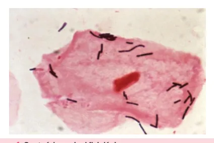
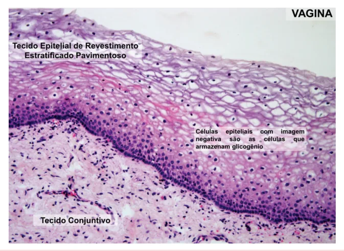
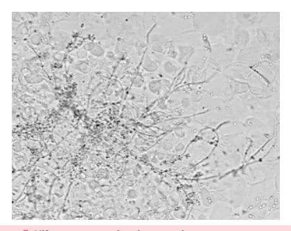
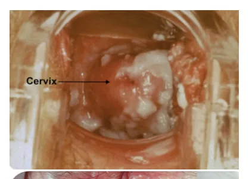
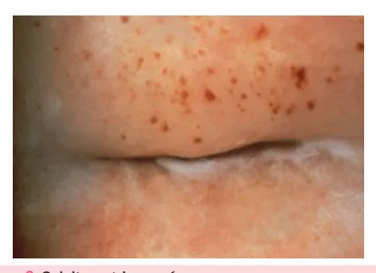
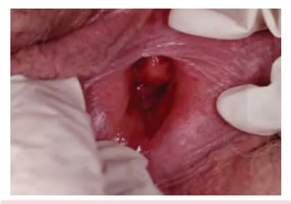
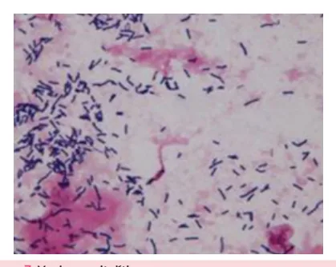

# Corrimentos Vaginais

<!-- page:1 -->

## Resumo Rápido

**Candidíase**

- Quadro clínico: corrimento esbranquiçado, sem odor, prurido vulvar e piora dos sintomas antes da menstruação;
- Diagnóstico: anamnese + exame físico, **pH vaginal < 4,5** e teste das aminas (KOH) negativo;
- Tratamento: **fluconazol 150 mg VO** dose única ou **miconazol creme 2%** (ou outros azólicos), 1 aplicador cheio ao se deitar por 7 dias, ou **nistatina creme vaginal 25.000 UI/g**, 1 aplicador (4g) ao se deitar por 14 dias.

**Vaginose bacteriana**

- Quadro clínico: corrimento vaginal fétido, branco-acinzentado, bolhoso e piora dos sintomas após a menstruação;
- Diagnóstico: anamnese + exame físico, **pH vaginal > 4,5**, teste das aminas (KOH) positivo, *clue cells* e **escore de Nugent ≥ 7**;
- Tratamento: **metronidazol 500 mg VO** duas vezes ao dia durante sete dias; OU **metronidazol gel 0,75% – 5g** (um aplicador) intravaginal ao deitar durante cinco dias.

**Tricomoníase**

- Quadro clínico: corrimento vaginal fétido, amarelo-esverdeado e colpite;
- Diagnóstico: anamnese + exame físico, **pH vaginal > 4,5**, microscopia do conteúdo vaginal e teste das aminas positivo;
- Tratamento: **metronidazol 2 g VO** dose única; OU **metronidazol 500 mg VO**, 12/12h por 7 dias.

**Vaginose citolítica**

- Quadro clínico: corrimento esbranquiçado, sem odor, prurido vulvar e piora dos sintomas antes da menstruação;
- Diagnóstico: anamnese + exame físico, **pH vaginal < 4,0** e bacterioscopia: aumento excessivo de lactobacilos, raros leucócitos ou ausência deles;
- Tratamento: duchas vaginais com bicarbonato de sódio.

**Vaginite atrófica**

- Quadro clínico: corrimento vaginal escasso e epitélio vaginal friável;
- Diagnóstico: anamnese + exame físico, **pH vaginal alcalino** e microscopia: redução de lactobacilos e aumento de células parabasais;
- Tratamento: estrogenioterapia tópica.

## Conceitos Gerais

### Equilíbrio Vaginal

- Depende de 3 fatores: **microbioma vaginal**; **imunidade vaginal**; **epitélio celular**.

### Microbioma Vaginal

**Conteúdo vaginal fisiológico**

- Água, muco cervical, células vaginais e cervicais esfoliadas;
- Transudato dos vasos locais, eletrólitos, proteínas, células de defesa.

*Figura 1: Conteúdo vaginal fisiológico.*

- Toda a microbiota vive em um ambiente dinâmico, sofrendo influência de inúmeros fatores, sendo o **status hormonal** um importante fator:
  - Idade → menacme: pH vaginal 3,8 - 4,5, com maior riqueza e abundância; infância e menopausa: menor riqueza e abundância;
  - Infância: pH ~ 7,0; menopausa: pH entre 5,0 e 7,5;
  - Prática sexual;
  - Medicamentos;
  - Higiene íntima.
- O gênero *Lactobacillus* domina o microambiente vaginal.

**Comunidades vaginais (CST = *Community State Types*)**

- Existem 5 tipos de comunidades vaginais:
  - Tipo I: *Lactobacillus crispatus*;
  - Tipo II: *Lactobacillus gasseri*;
  - Tipo III: *Lactobacillus iners*;
  - Tipo IV: polimicrobiana (*Gardnerella*, *Prevotella*) → associada à vaginose bacteriana;
  - Tipo V: *Lactobacillus jensenii*.

---

<!-- page:2 -->

> ⚠️ Tabela reconstruída a partir de OCR — confira contra a fonte original.

**Tabela 1: Componentes da microbiota vaginal**

| Categoria | Principais componentes |
|---|---|
| Bactérias | *Lactobacillus* spp.; aeróbias; anaeróbias facultativas; anaeróbias estritas |
| Outros microrganismos | *Staphylococcus aureus*; *S. epidermidis*; *Streptococcus agalactiae*; *Escherichia coli*; *Gardnerella vaginalis*; *Prevotella*; *Bacteroides*; *Ureaplasma urealyticum*; *Mycoplasma hominis* |
| Fungos | *Candida* sp. |

## Imunidade Vaginal

### Lactobacillus sp.

- Bactérias gram-positivas, aeróbias facultativas;
- Metabolismo fermentativo (glicogênio);
- Produzem metabólitos que inibem a proliferação de patógenos: **ácido láctico**; **H2O2**; **bacteriocinas**;
- Impedem competitivamente a aderência de patógenos às células epiteliais;
- Regulam a resposta imune, controlando a inflamação (IL-1β, IL-6, INF-γ) e mantendo a **quiescência imunológica**.

*Figura 2: Histologia do epitélio vaginal.*

### Epitélio Celular

- Epitélio pluriestratificado (~25 camadas);
- Além do obstáculo mecânico:
  - Descamação programada (a cada 4 horas);
  - Acúmulo de glicogênio;
  - Regula produção de certas enzimas (MMP-8);
  - Favorece reconhecimento de antígenos.

## Roteiro Diagnóstico

### Anamnese

- Corrimento: duração; ciclicidade e número de episódios/ano; quantidade e consistência; cor, odor e sintomas associados;
- Práticas sexuais;
- Método contraceptivo;
- Hábitos pessoais.

---

<!-- page:3 -->

### Exame Físico e Ginecológico

- Avaliar macroscopia do corrimento;
- Exame especular;
- Pesquisa de lesões.

### Exames Complementares

- Fita de pH vaginal, posicionada no terço superior da parede vaginal lateral;
- Coleta de amostra de conteúdo vaginal;
- Exame a fresco;
- Coloração de Gram: roxo = gram positivo; rosa = gram negativo;
- Culturas.

## Vaginose Bacteriana

- Surge a partir de uma alteração da microbiota vaginal;
- Há substituição de *Lactobacillus* por bactérias anaeróbias.

### Disbiose

- Aumento de anaeróbios e gram-negativos;
- Redução de lactobacilos.

### Agentes

- *Gardnerella vaginalis*;
- *Megasphaera* sp.;
- *Atopobium* sp.;
- *Sneathia* sp.;
- *Mobiluncus* spp.

### Quadro Clínico

- Até 75% dos casos podem ser assintomáticos;
- Manifestações:
  - Odor vaginal fétido — principal;
  - Corrimento vaginal fluido, de cor acinzentada;
  - Piora após a menstruação (pH básico).

### Complicações

**Ginecológicas**

- Bartolinite;
- Doença inflamatória pélvica aguda;
- Infertilidade;
- ITU (recorrente);
- Infecção pós-procedimento.

**Obstétricas**

- Abortamento;
- Prematuridade;
- Infecção puerperal;
- Ruptura prematura de membranas ovulares (RPMO).

### Diagnóstico

**Critérios de Amsel**

- Presença de, pelo menos, **3 critérios**:
  - pH vaginal ≥ 4,5;
  - Corrimento vaginal fino e homogêneo;
  - Teste de aminas positivo (KOH 10%, *whiff test*);
  - *Clue cells* na microscopia.

*Figura 3: Clue cells.*

**Escore de Nugent**

- Bacterioscopia + coloração de Gram;
- Interpretação:
  - Escore 0 a 3: flora tipo I (normal);
  - Escore 4 a 6: flora tipo II (intermediária);
  - Escore 7 a 10: vaginose bacteriana.

### Tratamento

- **FEBRASGO, CDC**: metronidazol 500 mg VO 12/12h por 7 dias; ou metronidazol gel vaginal 0,75% — 1 aplicador (5 g), 1x/dia por 5 dias.
  - Efeitos colaterais dos imidazólicos: náuseas e vômitos, cefaleia, insônia, tontura, boca seca e gosto metálico.
- **Ministério da Saúde**: metronidazol 500 mg VO 12/12h por 7 dias; ou metronidazol gel vaginal 10% — 1 aplicador, 1x/dia por 5 dias.
- **NÃO é IST!** Sem recomendação de tratamento das parcerias sexuais.

**Outras opções de tratamento**

- Tinidazol 1 g VO — 1x/dia por 5 dias;
- Tinidazol 2 g VO — 1x/dia por 2 dias;
- Clindamicina 300 mg VO — 12/12h por 7 dias.

**Uso em gestantes**

- Metronidazol 500 mg VO — 12/12h por 7 dias;
- Metronidazol gel vaginal a 0,75% (7,5 mg/g) — 5g, 1x/dia por 5 dias;
- Clindamicina 300 mg VO — 12/12h por 7 dias.

**ATENÇÃO!** O tinidazol está contraindicado em gestantes por apresentar potencial teratogênico ao feto.

**Efeito dissulfiram (ou antabuse)**

- É a reação adversa após a ingestão de álcool;
- Sensibilidade aguda após inibição da enzima acetaldeído desidrogenase (que transforma o álcool em acetaldeído);
- Consequências: cefaleia latejante; palpitações e sudorese; vertigem; confusão mental; dificuldade respiratória.

---

<!-- page:4 -->

**FEBRASGO** recomenda manter a abstinência de álcool durante e até 24 horas após o tratamento com imidazólicos.

**CDC** afirma que não há vinculação do efeito do uso do álcool com imidazólicos.

### Vaginose Bacteriana Recorrente

- Caracterizada por **≥ 3 episódios/ano**;
- Associada à formação de biofilme.

**Tratamento**

- Metronidazol gel vaginal 0,75% 1x/dia por 10 dias → metronidazol gel vaginal 0,75% 2x/semana por 16 semanas;
- Metronidazol 500 mg VO 12/12h por 10-14 dias OU metronidazol gel vaginal 10% 1x/dia por 10 dias → ácido bórico 600 mg via vaginal (VV) 1x/dia por 21 dias + metronidazol 10% VV 2x/semana, por 4-6 meses.

**Probióticos**

- Restabelecem o meio vaginal;
- Opções terapêuticas atuais e em estudo: probióticos (*L. reuteri*, *L. crispatus*, *L. plantarum*); agentes acidificantes (vitamina C, ácido lático).

## Candidíase

Causada pelo fungo do gênero *Candida*.

- Possui diferentes espécies: *albicans*; *glabrata*; *krusei*.

### Fungo Dimórfico

- Leveduras: colonização;
- Pseudo-hifas e blastoconídios: invasão.

### Quadro Clínico

- Corrimento vaginal esbranquiçado, em aspecto de "leite coalhado", grumoso;
- Sem odor;
- Prurido vulvar (presente em 60–90% dos casos);
- Disúria e dispareunia;
- Piora dos sintomas antes da menstruação;
- pH ácido.

*Figura 4: Candidíase vaginal.*

### Exame Ginecológico

- Hiperemia vulvar, edema e fissuras;
- Exame especular: hiperemia da mucosa vaginal;
- Conteúdo vaginal esbranquiçado.
- Verificar Figura 4.

### Fatores Predisponentes

- Gravidez;
- Antibioticoterapia;
- Endocrinopatias (diabetes mellitus);
- Alterações imunológicas;
- Uso de contraceptivos em alta dosagem.

*Figura 5: Hifas no exame de microscopia.*

---

<!-- page:5 -->

- Prurido e ardor;
- Disúria e dispareunia;
- Colpite em framboesa;
- pH vaginal ácido; piora na menstruação e em contato com sêmen.

### Tratamento

**Oral**

- Fluconazol 150 mg VO dose única;
- Itraconazol 100 mg — 2 cápsulas VO 12/12h, 1 dia;
- Cetoconazol 200 mg — 2 cápsulas VO 1x/dia, 5 dias.

**Tópica**

- Miconazol creme 2% (ou outros azólicos), 1 aplicador cheio ao se deitar por 7 dias;
- Nistatina creme vaginal 25.000 UI/g, 1 aplicador (4g) ao se deitar por 14 dias.
- O tratamento do parceiro sexual não é recomendado nos episódios simples.

### Quadro Recorrente

- Dá-se por 4 ou mais episódios em 12 meses, confirmados laboratorialmente.

**Tratamento**

- *Candida albicans*: fluconazol 150 a 200 mg VO nos dias 1º, 4º e 7º; antifúngicos tópicos por 10 a 14 dias; manutenção com fluconazol 150 mg VO 1x/semana por 6 meses;
- *Candida* não *albicans*: ácido bórico — óvulo 600 mg VV por 14 dias;
- Não existem protocolos estabelecidos sobre o tratamento de parceiros.

### Gestantes

- Realizar o tratamento por via intravaginal;
- Não usar: azólicos por via oral; ácido bórico intravaginal.

## Tricomoníase

### Informações Gerais

- É uma infecção sexualmente transmissível;
- A maioria dos casos são oligo ou assintomáticos;
- Infecções não tratadas podem durar meses a anos.

### Agente Etiológico

- *Trichomonas vaginalis*: é um protozoário anaeróbio facultativo; coloniza trato genital inferior, uretra, ectocérvice; o ser humano é o único hospedeiro natural;
- Transmissão: contato com fluido ou fômites; período de incubação: 4–28 dias.

### Fatores de Risco

- 2 ou mais parceiros sexuais/ano;
- Baixo nível socioeconômico;
- Disbiose vaginal (vaginose bacteriana);
- **ATENÇÃO!** O CDC, para pessoas vivendo com HIV, recomenda o rastreamento anual de *T. vaginalis* mesmo em indivíduos assintomáticos.

### Quadro Clínico

- Corrimento vaginal: amarelo-esverdeado, profuso, bolhoso, podendo ter odor desagradável, com piora em contato com sêmen.

*Figura 6: Colpite na tricomoníase.*

### Diagnóstico

- Anamnese + exame físico;
- Microscopia do conteúdo vaginal;
- pH vaginal > 4,5;
- Teste das aminas: pode ser positivo.

### Tratamento

- **CDC**: 2015 — metronidazol 2 g, via oral, em dose única; 2021 — metronidazol, 500 mg, de 12/12h, via oral, por 7 dias;
- **Ministério da Saúde**: metronidazol 2 g, via oral, em dose única.
- Recomendações: tratar as parcerias sexuais; abstinência sexual; pesquisar outras ISTs; retestagem a partir de 3 meses após tratamento.

## Vaginose Citolítica

### Definição

- Situação com proliferação excessiva de *Lactobacillus*: ↑ lactobacilos → ↑ ácido lático.

### Quadro Clínico

- Prurido;
- Ardor e queimação;
- Irritação;
- Dispareunia;
- Disúria;
- Piora cíclica dos sintomas (principalmente na fase lútea e pré-menstrual);
- Eritema vulvar;
- Corrimento vaginal esbranquiçado heterogêneo.

### Exame Microscópico

- Ausência de *Trichomonas*, *Gardnerella* e *Candida*;
- Número aumentado de lactobacilos (muitas vezes aderentes à célula epitelial intermediária vaginal);
- Escassez de leucócitos;
- Citólise.

---

<!-- page:6 -->

*Figura 7: Vaginose citolítica.*

### Tratamento

- Objetivos: alívio dos sintomas, aumento parcial do pH, restaurar o equilíbrio vaginal através da redução do número de lactobacilos;
- Irrigação vaginal com solução de bicarbonato de sódio (pH 8,5 - 9,0);
- Óvulos vaginais, via vaginal à noite na segunda fase do ciclo: bicarbonato de sódio 10%; borato de sódio 2%.

## Vaginite Inflamatória Descamativa

- Dá-se por uma intensa inflamação vaginal de etiologia desconhecida;
- Acomete mulheres na perimenopausa e pós-menopausa.

### Quadro Clínico

- Eritema;
- Corrimento moderado ou profuso, com dispareunia.

### Diagnóstico e Tratamento

- Excluir infecção por *Chlamydia trachomatis*, *Neisseria gonorrhoeae* e *Trichomonas vaginalis*;
- Clindamicina creme vaginal 2%, 1x ao dia durante 14 dias; ou hidrocortisona 10% intravaginal durante duas a quatro semanas.

*Figura 8: Vaginite inflamatória descamativa.*
*Figura 9: Microscopia da vaginite inflamatória descamativa.*

## Vaginite Aeróbia

- Predomínio de bactérias aeróbias entéricas: *Streptococcus* sp.; *Staphylococcus aureus*; *Escherichia coli*;
- Corrimento vaginal com odor desagradável;
- Prurido e ardor vulvar.

### Diagnóstico

- pH vaginal > 4,5;
- Exame microscópico do conteúdo vaginal.

*Figura 10: Microscopia na vaginite aeróbia.*

### Tratamento

- Sem consenso;
- Corticosteroides vaginais;
- Antibioticoterapia vaginal.

---

<!-- page:7 -->

## Vaginite Atrófica

- Faz parte da síndrome geniturinária da menopausa.

### Fisiopatologia

- ↓ Estrogênio = ↓ depósito de glicogênio = ↓ ácido lático;
- ↑ pH vaginal (4,5 - 5,0) = ↓ lactobacilos.

### Quadro Clínico

- Corrimento vaginal escasso;
- Dispareunia, disúria;
- Epitélio vaginal friável.

### Diagnóstico

- Anamnese + exame físico;
- pH alcalino;
- Exame microscópico do conteúdo vaginal: redução de lactobacilos e aumento de células parabasais.

### Tratamento

- Estrogenoterapia tópica.

## Fluxograma de Investigação

> ⚠️ Fluxograma reconstruído a partir de OCR — confira contra a fonte original.

*Figura 11: Fluxograma diagnóstico dos corrimentos vaginais.*

Anamnese, exame físico e pH vaginal:

- **pH < 4,5**:
  - Corrimento mucoide fisiológico;
  - Prurido + corrimento grumoso → microscopia: hifas e leveduras → **candidíase**; ou aumento de lactobacilos → **vaginose citolítica**.
- **pH > 4,5**:
  - Odor fétido e *whiff test* positivo → exame a fresco: *clue cells* → **vaginose bacteriana**;
  - Whiff negativo → exame a fresco: protozoários flagelados → **tricomoníase**; ou células inflamatórias → **vaginite aeróbia / vaginite inflamatória descamativa**.

## Cervicites

- Inflamação da mucosa endocervical (epitélio colunar do colo uterino);
- Causa infecciosa (gonocócica e/ou não gonocócica): *Chlamydia trachomatis*; *Neisseria gonorrhoeae*; outros agentes: *Mycoplasma hominis*, *Ureaplasma urealyticum* e infecção secundária (bactérias anaeróbias e gram-negativas);
- Maioria é assintomática;
- Quando sintomática: corrimento vaginal, sangramento intermenstrual, dispareunia e disúria.

### Exame Físico

- Dor à mobilização do colo uterino;
- Material mucopurulento no orifício externo do colo;
- Sangramento ao toque da espátula ou swab.

### Diagnóstico

- Técnicas de biologia molecular (PCR);
- Cultura em diferentes meios;
- Exame microscópico do conteúdo vaginal.

### Tratamento

**Chlamydia trachomatis**

- Azitromicina 1 g via oral — dose única; OU
- Doxiciclina 100 mg, VO, duas vezes ao dia, por sete dias (exceto gestantes); OU
- Amoxicilina 500 mg, VO, três vezes ao dia, por sete dias.

**Neisseria gonorrhoeae**

- Ciprofloxacino 500 mg, VO, dose única; OU
- Ceftriaxona 500 mg, intramuscular, dose única.

### Tratamento em Gestantes

**Chlamydia trachomatis**

- Azitromicina 1 g, via oral — dose única; OU
- Eritromicina 500 mg, VO, de 6/6 horas, por 7 dias, ou a cada 12 horas, por 14 dias; OU
- Amoxicilina 500 mg, VO, de 8/8 horas, por sete dias.

**Neisseria gonorrhoeae**

- Ciprofloxacino é contraindicado em gestantes e menores de 18 anos, sendo a ceftriaxona o medicamento de escolha.

## Referências

Figura 1: Conteúdo vaginal fisiológico. CENTER FOR DISEASE CONTROL AND PREVENTION. Public Health Image Library. 2023. Disponível em: https://phil.cdc.gov/details.aspx?pid=1048.

---

<!-- page:8 -->

Figura 2: Histologia do epitélio vaginal. FÁVARO, L. F.; SILVA, L. F.; TANAMATI, L. W.; SCHRAMM, M. V. P.; MORETTI, R. Histologia de Órgãos e Sistemas – Texto e Atlas. Sistema Reprodutor Feminino.

Figura 3: Clue cells. CHEN, Xiaodi; LU, Yune; CHEN, Tao; LI, Rongguo. The Female Vaginal Microbiome in Health and Bacterial Vaginosis. Frontiers in Cellular and Infection Microbiology, v. 11, 2021.

Figura 4: Candidíase vaginal. EHRSTROM, S. Aspects on Chronic Stress and Glucose Metabolism in Women with Recurrent Vulvovaginal Candidiasis and in Women with Localized Provoked Vulvodynia. 2007. Tese de doutorado. Karolinska Institutet, Estocolmo.

Figura 5: Hifas no exame de microscopia. SPACH, David H.; MUZNY, Christina A. 2021.

Figura 6: Colpite na tricomoníase. SPACH, David H.; MUZNY, Christina A. 2021. Disponível em: https://www.std.uw.edu/go/comprehensive-study/vaginitis/core-concept/all.

Figura 7: Vaginose citolítica. SANCHES, et al. Laboratorial Aspects of Cytolytic Vaginosis and Vulvovaginal Candidiasis as a Key for Accurate Diagnosis: A Pilot Study. Rev Bras Ginecol Obstet 2020; 42(10): 634-641. DOI: 10.1055/s-0040-1715139.

Figura 8: Vaginite inflamatória descamativa; Figura 9: Microscopia da vaginite inflamatória descamativa. NYIRJESY, P.; PEYTON, C.; WEITZ, M. V.; et al. Causes of chronic vaginitis. Obstetrics and Gynecology, v. 108, p. 1185-1191, 2006; LIMA-SILVA, Joana et al. Desquamative inflammatory vaginitis - Vaginite inflamatória descamativa. Serviço de Ginecologia, Centro Hospitalar de São João, [s.d.].

Figura 10: Microscopia na vaginite aeróbia. DONDERS, G. et al. Aerobic vaginitis: abnormal vaginal flora entity that is distinct from bacterial vaginosis. International Journal of Infectious Diseases, 2005. DOI: 10.1016/j.ics.2005.02.064. Publicado por Elsevier B.V.

Figura 11: Fluxograma diagnóstico dos corrimentos vaginais. Acervo de imagens Medcof.

Tabela 1: Componentes da microbiota vaginal.
