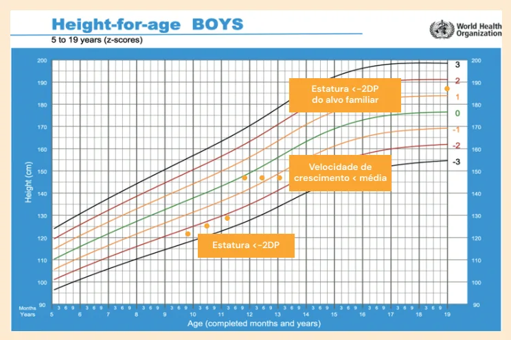
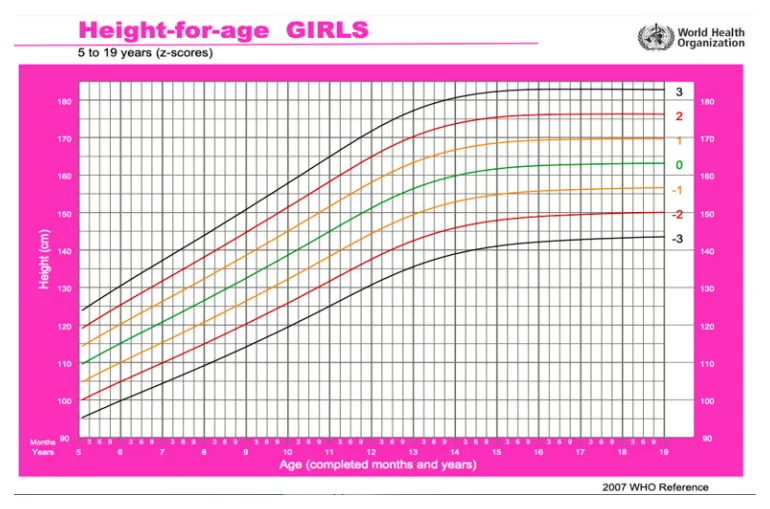
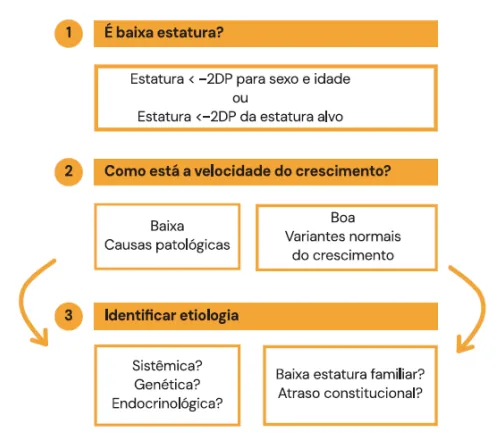

# Crescimento e Baixa Estatura

<!-- page:1 -->

## Crescimento (PED) — Baixa Estatura (PED)

## Definição

A baixa estatura pode ser definida de 3 formas:

- Estatura com **Z-escore abaixo de -2** para sexo e idade;
- Velocidade de crescimento (VC) baixa para a faixa etária, sendo visualizada como retificação da curva de crescimento;
- Estatura mais de **2 desvios padrão** abaixo do Z-escore da estatura alvo (EA).

*Figura 1: Definição de baixa estatura.*

### Investigação

**Baixa estatura com VC normal — variantes normais:**

- Baixa estatura familiar;
- Atraso constitucional.

**Investigação:**

- Anamnese;
- Exame físico;
- Calcular EA;
- Idade óssea.

> ⚠️ Tabela reconstruída a partir de OCR — confira contra a fonte original.

**Tabela 1: Principais diferenças entre as etiologias de baixa estatura na criança**

| | Baixa estatura familiar | Atraso constitucional | Causas patológicas do crescimento |
|---|---|---|---|
| Velocidade de crescimento | Normal | Normal | Baixa |
| Estatura alvo | Baixa | Normal | Normal |
| Idade óssea | Normal | Atrasada | Normal ou atrasada |
| Estatura | < -2DP do alvo familiar | — | — |
| Velocidade de crescimento | < média a < -2DP | — | — |

**Baixa estatura com VC baixa — causas patológicas:**

- **Sistêmica?** Doença celíaca? Doença renal crônica? Acidose tubular renal?
- **Genética?** Síndrome de Turner.
- **Endocrinológica?** Deficiência de GH (hormônio do crescimento); hipotireoidismo.

**Investigação:**

- Hemograma, PCR/VHS;
- Anti-transglutaminase + IgA;
- Ureia, creatinina, eletrólitos, gasometria, urina;
- TSH, T4L;
- IGF-1 e IGFBP-3;
- Cariótipo em meninas.

---

<!-- page:2 -->

*Figura 2: Curva de estatura por idade para meninas de 5 a 19 anos, pela OMS.*

## Fisiologia do Crescimento

### Fases do Crescimento

- **Feto**: influenciado pela função placentária e pela nutrição materna;
- **Bebê**: estimulado pela genética e pela nutrição da criança;
- **Criança**: determinado pelo GH e hormônio tireoidiano, também sofre impacto da nutrição;
- **Adolescente**: sofre influência do GH e dos esteroides sexuais.

### Crescimento Esperado

**Peso:**

- Perda de **5-10%** do peso após o nascimento: retorno ao peso de nascimento em **10-14 dias**;
- Média de ganho de peso da criança:
  - Primeiros 3 meses: 30 g/dia;
  - Do 3º ao 6º mês: 20 g/dia;
  - No 2º semestre: 10 g/dia;
  - 700 g/mês — 1º trimestre;
  - 600 g/mês — 2º trimestre;
  - 500 g/mês — 3º trimestre;
  - 400 g/mês — 4º trimestre;
- Marcos importantes: dobra o peso de nascimento com **4 meses** e triplica com **1 ano**;
- Ganho de **2 kg/ano** entre os 2 anos e a puberdade.

**Estatura e velocidade de crescimento:**

- Média da velocidade de crescimento:
  - Ao nascimento: 50 cm;
  - 0-12 meses: +25 cm (+15 cm no primeiro semestre e +10 cm no segundo);
  - 1-2 anos: +12 cm;
  - 2-4 anos: +7-8 cm/ano;
  - 4-6 anos: +6 cm/ano;
  - 6 anos até a puberdade: +5-7 cm/ano;
- Puberdade:
  - Meninas têm estirão na fase de **M3** (8-10 cm/ano);
  - Meninos têm estirão na fase de **G4** (10-14 cm/ano).

**Atenção!** A velocidade de crescimento nunca é menor que **5 cm/ano**!

**Perímetro cefálico (PC):**

- Ao nascimento, a média é de **35 cm**;
- Aumenta cerca de:
  - 1 cm/mês durante o primeiro ano;
  - 2 cm/mês no 1º trimestre;
  - 1 cm/mês no 2º trimestre;
  - 0,5 cm/mês no 2º semestre;
- Com 2 anos, atinge **85%** do PC do adulto.

### Antropometria

No Brasil, são usados os gráficos da OMS, divididos por sexo e por idade:

- **0-5 anos**: peso/idade; estatura/idade; peso/estatura; IMC/idade.
- **5-10 anos**: peso/idade; estatura/idade; IMC/idade.
- **10-19 anos**: estatura/idade; IMC/idade.

### Gráficos de Crescimento

- As curvas são dadas a partir do Z-escore;
- O centro (parte verde) é denominado escore 0.

---

<!-- page:3 -->

**Tabela 2: Classificação da estatura de acordo com percentil ou Z-score**

| Valores críticos (percentil) | Valores críticos (Z-score) | Altura (para sexo e idade) |
|---|---|---|
| p < 0,1 | Z-score < -3 | Muito baixa estatura |
| p 0,1 a 3 | Z-score -3 a -2 | Baixa estatura |
| p > 3 | Z-score > -2 | Estatura adequada |

### Endocrinopatias

- **Hipotireoidismo**: solicitar TSH, T4L;
- **Deficiência de GH**: IGF-1, IGFBP-3 (não dosar GH).

## Avaliação da Baixa Estatura

### É Baixa Estatura?

- **Critérios**:
  - 1º critério: estatura < -2DP para o sexo e idade;
  - ou 2º critério: estatura < -2DP da estatura alvo (EA).
- **Cálculo da estatura alvo**:
  - Menina: média dos pais − 6,5 cm;
  - Menino: média dos pais + 6,5 cm;
  - Alvo +/- 8,5 cm.

### Como Está a Velocidade de Crescimento?

- Medir a estatura com intervalo de, pelo menos, **4 a 6 meses**;
- Fazer a proporção do crescimento para 12 meses;
- A velocidade de crescimento nunca é menor que **5 cm/ano**!

**VC normal:**

- Variantes normais do crescimento;
- Anamnese, exame físico, estatura alvo e idade óssea.

**VC reduzida:**

- Investigar causas patológicas.

### Idade Óssea

- Indica maturação endócrina global;
- Ajuda a identificar a causa da baixa estatura;
- Rx de mão e punho esquerdos;
- Comparar com Atlas de Greulich e Pyle;
- Limite normal: **20%** acima ou abaixo da idade cronológica.

### Causas Patológicas

**Sistêmicas:**

- Nefropatia: solicitar ureia, creatinina, gasometria, urina, eletrólitos;
- Doença celíaca: solicitar anti-endomísio, anti-transglutaminase, IgA;
- Outros: hemograma, vitamina D, proteína C reativa.

**Genéticas:**

- Cariótipo em todas as meninas;
- **Síndrome de Turner (45,X)**: baixa estatura pode ser a única manifestação.
  - Baixa estatura com VC baixa a partir de 2 anos de idade;
  - Idade óssea atrasada;
  - Se confirmada, fazer RM de hipófise;
  - Tratamento: GH recombinante SC.

**Obesidade associada à baixa estatura = considerar causas endócrinas!**

### Outras Causas de Baixa Estatura

**Síndrome de Noonan** — Rasopatia. Mutação autossômica dominante do **PTPN11**.

- Baixa estatura;
- Pescoço alado, baixa implantação de cabelo e orelha, alteração do filtro labial;
- Retardo mental;
- Criptorquidia;
- Malformação cardíaca (estenose pulmonar e miocardiopatia hipertrófica).

Tratamento: GHrh!

**Síndrome de Silver-Russell** — afeta IGF-2.

- Pequeno para a idade gestacional (PIG);
- Baixa estatura + IMC baixo;
- Macrocrania relativa (PC preservado), face triangular;
- Clinodactilia do 5º dedo;
- Assimetria hemicorporal.

**Acondroplasia**

- Mutação ativadora autossômica dominante do **FGFR3**;
- Baixa estatura desproporcional;
- Encurtamento rizomélico;
- Macrocefalia;
- Mão em tridente;
- Cifose ou lordose.

Tratamento: **vosoritide** (análogo de peptídeo natriurético tipo C).

### Variantes Normais do Crescimento

São diagnósticos de exclusão.

**Baixa estatura familiar:**

- Velocidade de crescimento normal + estatura alvo baixa + idade óssea normal.

**Atraso constitucional do crescimento:**

- Velocidade de crescimento normal + estatura alvo normal + idade óssea atrasada;
- Puberdade pode estar atrasada;
- História familiar semelhante;
- Estatura final é normal.

### Resumindo, Como Proceder?

- É baixa estatura?
  - **Sim** → como está a velocidade de crescimento?
    - **Ruim**: causas patológicas — sistêmica, genética ou endocrinológica;
    - **Boa**: variantes normais — baixa estatura familiar, atraso constitucional.

---

<!-- page:4 -->

## Referências

Figura 1: Definição de baixa estatura. Referência: Adaptado de ORGANIZAÇÃO MUNDIAL DA SAÚDE. Curva de estatura por idade para meninos de 5 a 19 anos. 2025. Disponível em: https://www.who.int/tools/child-growth-standards. Acesso em: 25 mar. 2025.

Figura 2: Curva de estatura por idade para meninas de 5 a 19 anos, pela OMS. Referência: ORGANIZAÇÃO MUNDIAL DA SAÚDE. Curva de estatura por idade para meninas de 5 a 19 anos. 2025. Disponível em: https://www.who.int/tools/child-growth-standards. Acesso em: 25 mar. 2025.

Figura 3: Esquema de investigação da baixa estatura.

