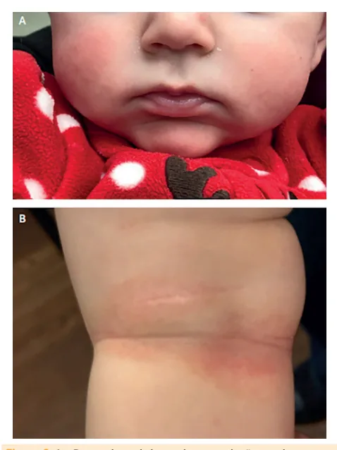
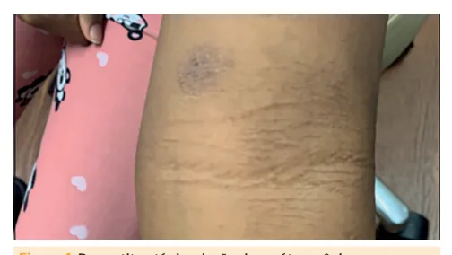
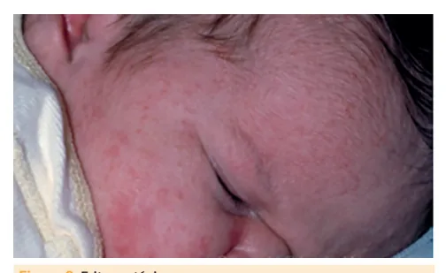
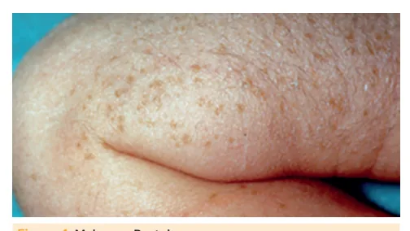
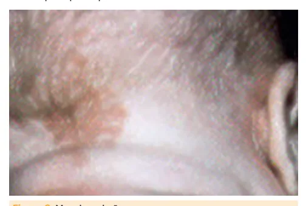
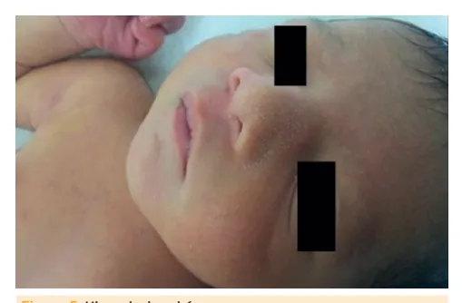
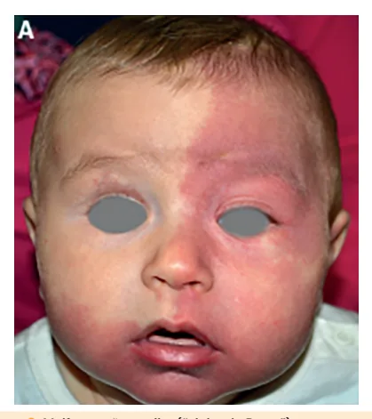
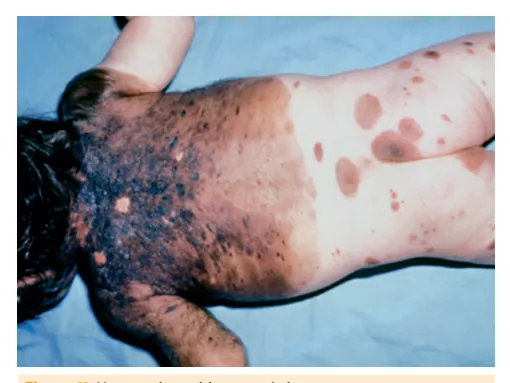
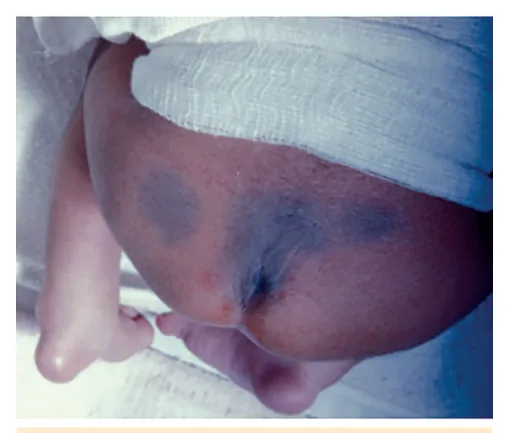

# Dermatite Atópica e Lesões Benignas do Recém-nascido

<!-- page:1 -->

## Dermatite Atópica e Lesões Benignas do Recém-nascido

Dermatite atópica e lesões benignas (PED).

### Dermatite Atópica — Resumo

- **Diagnóstico clínico**: prurido nos últimos 12 meses em locais característicos (lactentes: face/superfície extensora; demais: flexuras) + ≥3 dos seguintes:
  - Pele seca ou xerose no último ano;
  - História pessoal de rinite alérgica (RA)/asma ou familiar de RA/asma/DA em < 4 anos;
  - Idade precoce de início do quadro;
  - Eczema em locais característicos.
- **Manejo**: educação/evitar gatilhos + hidratação + anti-inflamatório tópico (corticoide/inibidores de calcineurina).

> ⚠️ Tabela reconstruída a partir de OCR — confira contra a fonte original.

**Tabela comparativa: dermatoses transitórias benignas do recém-nascido**

| | Eritema tóxico | Melanose pustulosa transitória | Miliária cristalina | Miliária rubra |
|---|---|---|---|---|
| **Quando** | 1-4 dias (principalmente 2º/3º dia) | Ao nascimento | 5-8 dias | Após 1ª semana |
| **Duração** | Poucos dias, autolimitado | Pústulas: dias; mancha hiperpigmentada: semanas | Poucos dias, autolimitado | Poucos dias, autolimitado |
| **Etiologia** | Desconhecida; coleções eosinofílicas | Acúmulo de neutrófilos + poucos eosinófilos | Obstrução de glândulas sudoríparas — pele imatura | Obstrução mais profunda, com processo inflamatório associado |
| **Características** | Vesículas, pápulas, pústulas rodeadas por halo eritematoso | Vesicopustulosas, sem eritema ao redor → descamação em colarete → mancha hipercrômica | Vesículas superficiais, sem eritema ao redor | Eritema associado |
| **Distribuição** | Universal, poupando palmas e plantas | Universal, incluindo palmas e plantas | Face, couro cabeludo, porção superior do tronco | Face, couro cabeludo, porção superior do tronco |
| **Tratamento** | Sem necessidade de tratamento específico | Sem necessidade de tratamento específico | Evitar superaquecimento | Evitar superaquecimento |

> ⚠️ Tabela reconstruída a partir de OCR — confira contra a fonte original.

**Tabela comparativa: lesões vasculares e pigmentares do recém-nascido**

| | Mancha salmão ("nevo vascular") | Malformação capilar (vinho do Porto) | Melanocitose dérmica ("mancha mongólica") | Hemangioma |
|---|---|---|---|---|
| **Presente ao nascimento** | Sim | Sim | Sim | Em até 50% dos casos NÃO está presente ao nascimento |
| **Regressão** | Desaparece até o final do 1º ano | Permanente | Desaparece, geralmente até o final do 1º ano | Regressão possível até 9 anos |
| **Etiologia** | Ectasia vascular; imaturidade do sistema autonômico | Malformação capilar | Defeito de migração de melanócitos da crista neural, que se acumulam na derme | Tumor vascular benigno mais comum da infância |
| **Características** | Mancha rósea clara, homogênea, que some à digitopressão, piora ao choro e à sucção | Mancha vinhosa intensa, homogênea, não altera por choro ou sucção, isolada, unilateral, respeitando linha média | Manchas marrom-azuladas ou arroxeadas | Crescimento rápido até 4-6 meses → regressão progressiva, paulatina, até 9 anos |
| **Distribuição** | Occipital, glabela, pálpebras superiores | Universal, mais comum em face | Preponderante em topografia lombossacra | Universal; maior vigilância em ponte nasal, região perioral, periocular |
| **Associações/observações** | Nenhuma associação relevante | Sturge-Weber e Klippel-Trenaunay | — | Crescimento acelerado traz potencial de complicações/deformidades |
| **Tratamento** | Sem necessidade de tratamento específico | Uso potencial de *Pulsed Dye Laser* | Sem necessidade de tratamento específico | 1ª linha: propranolol |

---

<!-- page:2 -->

## Dermatite Atópica (DA)

A apresentação varia de acordo com a idade:

**Lactentes**

- Local: face, geralmente poupando trígono nasolabial;
- Lesão: eczematosa → pápulas/placas pruriginosas, com ou sem crostas hemáticas; exsudato.

### Introdução

- Dermatose inflamatória;
- Curso crônico/recidivante;
- Início precoce: primeiros 2 anos de vida;
- Marcha atópica: DA como primeira manifestação de um quadro atópico.

### Epidemiologia

- Dermatose mais comum na criança;
- Prevalência aumentando: poluição, infecções, exposição a alérgenos;
- Acomete qualquer idade, mas ocorre tipicamente na infância:
  - **60%** inicia no primeiro ano de vida;
  - **80%** manifesta forma leve;
  - **70%** apresenta melhora gradual até o final da infância.
- Histórico familiar positivo é importante fator de risco.

### Etiofisiopatogenia

- Doença multifatorial: fatores genéticos, ambientais, psicossomáticos.

Ocorre por:

- **Barreira epidérmica disfuncional**: mutação da proteína filagrina (proteína estrutural da epiderme) + alteração lipídica;
- **Anormalidades do microbioma cutâneo**: disbiose (*S. aureus* e *M. furfur*);
- **Desregulação imunológica**:
  - Respostas imunes inatas reduzidas na pele;
  - Respostas mediadas por linfócitos T exacerbadas;
  - Fase aguda: predomínio de resposta **Th2**;
  - Fase crônica: resposta **Th1**;
  - Aumento de IgE.
- **Fatores ambientais/psicossomáticos**: atuam como gatilhos de exacerbações.

### Clínica

- Características clássicas, comuns a todas as fases: **prurido e xerodermia**!
- Classificação de lesões cutâneas se dá por fases (aguda, subaguda e crônica) que podem coexistir:
  - **Agudas**: pápulas eritematosas;
  - **Subagudas**: pápulas eritematosas, escoriações por coçadura e descamação;
  - **Crônicas**: liquenificação, aumento da espessura da pele, pápulas fibróticas.

*Figura 1: Dermatite atópica: lesão de caráter crônico.*

**Pré-puberal (2-10 anos)**

- Local: áreas de flexura, a destacar regiões antecubital e poplítea;
- Lesão: características subagudas/crônicas;
- Alta ocorrência de infecção secundária (*S. aureus*!) → crostas tornam-se melicéricas.

*Figura 2: A — Dermatite atópica no lactente: lesão aguda, poupando trígono central. B — Dermatite atópica no pré-púbere: lesão subaguda em região de flexura.*

**Puberal**

- Local: áreas de flexura;
- Lesões: características crônicas;
- Nesta faixa etária, pode haver manifestação isolada em face (perioral e periocular), dorso das mãos e dos pés, punhos e/ou tornozelos.

### Diagnóstico

Clínico!

**Critérios**

- Obrigatório: prurido nos últimos 12 meses;
- Mais ≥3 dos seguintes:
  - Pele seca ou histórico de xerose no último ano;
  - Histórico pessoal de rinite alérgica (RA) ou asma; ou histórico familiar de RA/asma/DA;
  - Idade de início do quadro: precoce (geralmente < 2 anos);
  - Eczema em locais característicos: malar/frontal/superfície extensora em < 4 anos e em flexuras em > 4 anos.

---

<!-- page:3 -->

**Características clínicas e laboratoriais que corroboram:**

- Pregas de Dennie-Morgan: duplas linhas infraorbitárias;
- Hiperpigmentação periorbitária;
- Ceratose pilar;
- Ceratocone;
- Ictiose vulgar;
- Hiperlinearidade palmar;
- Aumento dos níveis séricos de IgE;
- Eosinofilia;
- Testes cutâneos de puntura positivos: têm alto valor preditivo negativo; se positivos, demonstram apenas sensibilização, não necessariamente alergia.

### Classificação de Gravidade: SCORAD (*Scoring Atopic Dermatitis*)

- Avalia: extensão; intensidade; prurido; distúrbio do sono.
- Verificar Tabela 1 na próxima página.

### Desencadeantes

- Aeroalérgenos (ácaros);
- Clima (extremos de temperatura);
- Fatores psicossociais;
- Antígenos alimentares (~30% dos pacientes): ovo, leite de vaca, trigo, soja, amendoim.

### Complicações

- Destaque para infecções secundárias: *S. aureus*;
- Erupção variceliforme de Kaposi (eczema herpético).

### Tratamento

**Pilares**: educação em saúde; hidratação; tratamento anti-inflamatório; identificação e eliminação dos fatores desencadeantes.

- **Educação em saúde**: elucidar o curso crônico da doença, importância das medidas de profilaxia ambiental e assiduidade de manutenção da hidratação;
- **Higiene da pele**: evitar banhos quentes e prolongados, preferência por sabonete líquido, com pH levemente ácido, evitar buchas;
- **Hidratação**: deixar a pele levemente úmida e aplicar hidratante 3 minutos após o banho;
  - Uso de emolientes: base da terapia de manutenção, também realizado nas exacerbações;
  - Desejável aplicação diária, disciplinada, preferível com pele úmida: lactente: 150 g/semana; criança: 200 g/semana; adolescente: 500 g/semana.

**Terapêutica anti-inflamatória**

- 1ª linha: corticosteroides tópicos;
- 2ª linha: inibidores tópicos da calcineurina. Preferível em topografia de face.

**Modo de uso**

- Reativa: quadros leves;
- Pró-ativa: quadros moderado-graves → 2 dias por semana; com uso de corticoides tópicos por até 3 meses e os inibidores tópicos da calcineurina até 12 meses.

**Corticosteroides**: 7 classes de potência (avaliação por vasoconstrição). A indicação de escolha do corticoide depende da região acometida, idade do paciente e gravidade da lesão.

- Baixa potência: hidrocortisona. Indicações: face, períneo, dermatite leve;
- Média/alta potência: pacientes mais velhos, dermatite moderada a grave, regiões para além de face/períneo.

**Atenção**: o uso prolongado do corticoide tópico em áreas de maior chance de absorção sistêmica (face e períneo) acarreta risco de desregulação do eixo hipotálamo-hipófise-adrenal, podendo desencadear insuficiência adrenal após a suspensão.

**Inibidores tópicos da calcineurina**: indicados em pacientes não responsivos ou intolerantes à corticoterapia, em áreas de face/intertriginosas e em pacientes impossibilitados de uso da corticoterapia.

- Pimecrolimus creme 1%: DA leve, maiores de 3 meses;
- Tacrolimus pomada 0,03%: DA moderada-grave, maiores de 2 anos.

**Tratamento sistêmico**: opções são corticosteroides sistêmicos via oral, ciclosporina e metotrexato. Evitar corticosteroide sistêmico pelo risco de rebote após suspensão e efeitos adversos potenciais dessa terapêutica.

**Anti-histamínicos**: a histamina NÃO é o mecanismo principal do prurido na DA. Assim, são úteis quando há concomitância de exacerbação de outras manifestações atópicas, como rinite e conjuntivite alérgicas. Alguns utilizam anti-histamínicos sedativos (como hidroxizina) pelo efeito adverso de sonolência.

**Potenciais**: fototerapia e tratamento alvo (via JAK/STAT).

### Prognóstico

- Resolução do quadro na infância, na maioria dos casos;
- Fatores de mau prognóstico: doença disseminada na infância; mutação no gene da filagrina; RA e asma concomitantes; histórico familiar de DA em pais ou irmãos; níveis de IgE muito elevados.

### Prevenção

- Amamentação;
- Probióticos: carece de evidências científicas mais robustas.

---

<!-- page:4 -->

> ⚠️ Tabela reconstruída a partir de OCR — confira contra a fonte original.

**Tabela 1: Classificação dos corticosteroides tópicos conforme sua potência**

| Potência | Exemplo |
|---|---|
| Superpotente | Propionato de clobetasol 0,05% (creme e pomada); dipropionato de betametasona 0,05% (pomada); valerato de betametasona 0,1% (pomada); halcinonida 0,1% (pomada); valerato de diflucortolona (creme e pomada) |
| Potente | Dipropionato de betametasona 0,05% (creme); valerato de betametasona 0,1% (creme); halcinonida 0,1% (creme); acetonido de triancinolona (pomada); furoato de mometasona 0,1% (pomada); acetonido de fluocinolona (pomada) |
| Potência média | Prednicarbato (pomada); acetonido de triancinolona (creme); desonida (pomada); aceponato de metilprednisolona (creme); furoato de mometasona 0,1% (creme); acetonido de fluocinolona (creme); prednicarbato (creme); desonida (creme) |
| Potência leve | Aceponato de metilprednisolona (creme); fluorandrenolide (creme ou pomada); hidrocortisona (pomada); pivalato de flumetasona (creme ou pomada); hidrocortisona (creme); dexametasona; prednisolona; metilprednisolona |

## Dermatoses Benignas do Recém-nascido

### Introdução

- Alterações encontradas na pele do recém-nascido (RN): congênitas ou adquiridas; transitórias ou permanentes;
- Pele imatura, com alta ocorrência de dermatoses: maioria benigna, transitória, sem necessidade de tratamento específico;
- Quadros mais frequentes: pápulas, vesículas e/ou pústulas; lesões vasculares; lesões hiperpigmentadas.

### Pápulas, Vesículas e/ou Pústulas

**Eritema tóxico**

- Quando? 1-4 dias de vida (principalmente 2º/3º dia de vida);
- Duração? Poucos dias, autolimitado;
- Etiologia? Desconhecida. São coleções eosinofílicas;
- Características: vesículas, pápulas, pústulas rodeadas por halo eritematoso;
- Distribuição: universal, poupando palmas e plantas;
- Tratamento: sem necessidade de tratamento específico.
- Verificar Figura 3.

*Figura 3: Eritema tóxico.*

**Melanose pustulosa transitória**

- Quando? Ao nascimento;
- Duração? Pústulas: dias; mancha hiperpigmentada: semanas, autolimitado;
- Características: acúmulo de neutrófilos + eosinófilos escassos.

*Figura 4: Melanose pustulosa.*

- Características: lesões vesicopustulosas, sem eritema circundante → descamação em colarete → mancha hipercrômica;
- Distribuição: universal, incluindo palmas e plantas;
- Tratamento: sem necessidade de tratamento específico.
- Verificar Figura 4.

---

<!-- page:5 -->

**Hiperplasia sebácea**

- Quando? Ao nascimento;
- Duração? Primeiro mês, autolimitado;
- Etiologia? Glândulas sebáceas hiperplásicas;
- Características: lesões papulares amareladas múltiplas;
- Distribuição: dorso nasal e região malar;
- Tratamento: sem necessidade de tratamento específico.

*Figura 5: Hiperplasia sebácea.*

**Cistos de milia**

- Quando? Primeiras semanas de vida;
- Duração? Poucas semanas-meses, autolimitado;
- Etiologia? Cistos de inclusão epidérmica;
- Características: pápulas peroladas, levemente endurecidas;
- Distribuição: região frontal e mento, principalmente. Quando em palato, recebe o nome de pérolas de Epstein;
- Tratamento: sem necessidade de tratamento específico.

**Bolhas de sucção**

- Características: bolhas solitárias ou erosões;
- Quando? Ao nascimento;
- Distribuição: dedos, dorso das mãos, antebraço;
- Duração? Primeiro mês, autolimitado;
- Etiologia? Decorrente de sucção vigorosa pelo RN no período intraútero;
- Tratamento: sem necessidade de tratamento específico.

**Miliária**

- Quando? Cristalina: 5-8 dias; rubra: após a primeira semana de vida;
- Etiologia? Sudorese associada à obstrução de glândulas sudoríparas que não estão completamente desenvolvidas no período neonatal;
- Características: ocorre mais em regiões quentes; estados febris; RN superagasalhado ou RN em incubadoras;
  - Cristalina: vesículas superficiais, sem eritema ao redor;
  - Rubra: obstrução mais profunda, com processo inflamatório → eritema associado.
- Distribuição: face, couro cabeludo, porção superior do tronco;
- Duração? Poucos dias, autolimitado;
- Tratamento: medidas para evitar superaquecimento.
- Verificar Figura 6 e Figura 7.

*Figura 6: Miliária cristalina.*
*Figura 7: Miliária rubra.*

### Lesões Vasculares

**Mancha salmão ("nevo vascular")**

- Quando? Ao nascimento;
- Duração? Melhora gradativa com desaparecimento até o terceiro ano de vida;
- Etiologia? Ectasia vascular localizada; imaturidade do sistema autonômico que inerva vasos sanguíneos da região;
- Características: mancha rósea clara, limites imprecisos, some à vitropressão/digitopressão e torna-se mais intensa ao choro e sucção;
- Distribuição: região occipital ("bicada da cegonha"), glabela ("beijo dos anjos"), pálpebras superiores. Não respeita limites da linha média;
- Tratamento: sem necessidade de tratamento específico → geralmente glabela e pálpebras superiores desaparecem com o passar do tempo; a lesão occipital pode permanecer.

*Figura 8: Mancha salmão.*

---

<!-- page:6 -->

**Malformação capilar ("vinho do Porto")**

- Quando? Ao nascimento;
- Duração? Permanente;
- Etiologia? Malformação capilar;
- Características: mancha cor vinhosa intensa, homogênea, não alterada por choro ou sucção. Geralmente, forma isolada, unilateral, respeitando linha média;
- Distribuição: universal, sendo mais característico em face;
- Associações:
  - Síndrome de Sturge-Weber: malformação vascular na região inervada pelo ramo oftálmico do trigêmeo, associada a angiomas em leptomeninges e anomalias oculares;
  - Síndrome de Klippel-Trenaunay: malformações vasculares associadas ou não a malformações linfáticas, hipertrofia de partes moles/ossos → pode haver assimetria de membros.
- Tratamento: seguimento pertinente à síndrome/quadro subjacente, se for o caso. Uso potencial de *Pulsed Dye Laser*.

*Figura 9: Malformação capilar ("vinho do Porto").*

**Hemangioma**

- O que é? Tumor vascular benigno mais comum da infância;
- Quando? Em até 50% dos casos, a lesão NÃO está presente ao nascimento. Pode haver lesão precursora;
- Duração? Regressão possível até 9 anos;
- Características: fase de crescimento rápido até 4-6 meses, seguida de fase de estabilização e posterior fase de regressão progressiva, paulatina, até 9 anos;
- Distribuição: universal; locais de maior vigilância são ponte nasal, região perioral, periocular;
- Tratamento: considerar medicamentos em casos de crescimento acelerado, com potencial de complicações/deformidades. Quando indicado, as opções são: 1ª linha: propranolol; 2ª linha: corticoide VO, remoção cirúrgica, *Pulsed Dye Laser*, embolização.

*Figura 10: Hemangioma.*

### Lesões Hiperpigmentadas

**Nevos melanocíticos congênitos (NMC)**

- Quando? Ao nascimento;
- Duração? Permanente;
- Características: mancha de coloração vinho clara até preto-azulado. Pode ser acompanhada de placa pilosa. Risco aumentado de melanoma em relação à população geral. Quando há múltiplos NMC, nomeia-se melanose cutânea;
- Distribuição: universal. Os NMC maiores geralmente se localizam em tronco e cabeça. Em casos de NMC gigantes/melanose cutânea: realizar ressonância nuclear magnética do sistema nervoso central para avaliação de melanocitose neurológica;
- Tratamento: seguimento atento.

*Figura 11: Nevo melanocítico congênito.*

**Melanocitose dérmica ("mancha mongólica")**

- Quando? Ao nascimento;
- Duração? Desaparece com o passar dos anos, geralmente ao final do 1º ano de vida;
- Etiologia? Defeito de migração de melanócitos da crista neural, que se acumulam na derme;
- Características: manchas marrom-azuladas ou arroxeadas;
- Distribuição: preponderante em topografia lombossacra;
- Tratamento: sem necessidade de tratamento específico.
- Verificar Figura 12 na próxima página.

---

<!-- page:7 -->

*Figura 2: A — Dermatite atópica no lactente: lesão aguda, poupando trígono central. B — Dermatite atópica no pré-púbere: lesão subaguda em região de flexura.* Frazier W, Bhardwaj N. Atopic Dermatitis: Diagnosis and Treatment. Am Fam Physician. 2020 May 15;101(10):590-598. PMID:32412211.

*Figura 12: Melanocitose dérmica ("mancha mongólica").*

### Miscelânea

**Nevo sebáceo**

- Placa amarelada em couro cabeludo, cabeça e pescoço, principalmente;
- Pode aumentar na adolescência por estímulo hormonal.

**Aplasia cutis congênita**

- Ausência de pele/tecido subcutâneo em área circunscrita, ao nascimento;
- Geralmente, localiza-se isoladamente em couro cabeludo;
- Se defeito em calota craniana está associado, lembrar-se: síndrome de Adams-Oliver e trissomia do 13.

## Referências

Figura 1: Dermatite atópica: lesão de caráter crônico. Frazier W, Bhardwaj N. Atopic Dermatitis: Diagnosis and Treatment. Am Fam Physician. 2020 May 15;101(10):590-598. PMID:32412211.

Figura 3: Eritema tóxico. O'Connor NR, McLaughlin MR, Ham P. Newborn skin: Part I. Common rashes. Am Fam Physician. 2008 Jan 1;77(1):47-52. PMID:18236822.

Figura 4: Melanose Pustulosa. O'Connor NR, McLaughlin MR, Ham P. Newborn skin: Part I. Common rashes. Am Fam Physician. 2008 Jan 1;77(1):47-52. PMID:18236822.

Figura 5: Hiperplasia sebácea. Ghosh S. Neonatal pustular dermatosis: an overview. Indian J Dermatol. 2015 Mar-Apr;60(2):211. doi: 10.4103/0019-5154.152558. PMID: 25814724; PMCID: PMC4372928.

Figura 6: Miliária cristalina. O'Connor NR, McLaughlin MR, Ham P. Newborn skin: Part I. Common rashes. Am Fam Physician. 2008 Jan 1;77(1):47-52. PMID:18236822.

Figura 7: Miliária rubra. O'Connor NR, McLaughlin MR, Ham P. Newborn skin: Part I. Common rashes. Am Fam Physician. 2008 Jan 1;77(1):47-52. PMID:18236822.

Figura 8: Mancha salmão. Wirth FA, Lowitt MH. Diagnosis and treatment of cutaneous vascular lesions. Am Fam Physician. 1998 Feb 15;57(4):765-73. PMID:9490999.

Figura 9: Malformação capilar ("vinho do Porto"). Diociaiuti A, Paolantonio G, Zama M, Alaggio R, Carnevale C, Conforti A, Cesario C, Dentici ML, Buonuomo PS, Rollo M, El Hachem M. Vascular Birthmarks as a Clue for Complex and Syndromic Vascular Anomalies. Front Pediatr. 2021 Oct 7;9:730393. doi: 10.3389/fped.2021.730393. PMID: 34692608; PMCID: PMC8529251.

Figura 10: Hemangioma. McLaughlin MR, O'Connor NR, Ham P. Newborn skin: Part II. Birthmarks. Am Fam Physician. 2008 Jan 1;77(1):56-60. PMID:18236823.

Figura 11: Nevo melanocítico congênito. McLaughlin MR, O'Connor NR, Ham P. Newborn skin: Part II. Birthmarks. Am Fam Physician. 2008 Jan 1;77(1):56-60. PMID:18236823.

Figura 12: Melanocitose dérmica ("mancha mongólica"). McLaughlin MR, O'Connor NR, Ham P. Newborn skin: Part II. Birthmarks. Am Fam Physician. 2008 Jan 1;77(1):56-60. PMID:18236823.

