# Dermatoses e Infecções de Partes Moles

<!-- page:1 -->

## Dermatoses e Infecções de Partes Moles

Dermatoses Infecciosas e Infecções de Partes Moles — resumo:

- **Escabiose**: *Sarcoptes scabiei* variante *hominis*; túneis e prurido; tratar com permetrina a 5% (para > 2 meses) ou enxofre tópico.
- **Pediculose**: *Pediculus humanus capitis*, tratar com permetrina a 1%.
- **Larva migrans cutânea** (*Ancylostoma braziliensis* ou *caninum* — helminto): lesão serpiginosa em áreas expostas.
- **Tungíase** (*Tunga penetrans* — pulga): pápula esférica branco-amarelada com ponto negro central. Tratamento: remover a pulga + tiabendazol VO.
- **Impetigo**: *Staphylococcus aureus* e *Streptococcus pyogenes*; tópico — mupirocina; sistêmico — cefalexina.
- **Pele escaldada estafilocócica**: bolhas finas causadas por toxinas; tratar com oxacilina + clindamicina.
- **Ectima**: "impetigo ulcerado", *S. pyogenes*; se gangrenoso, cobrir *Pseudomonas*.
- **Erisipela e celulite**: *Streptococcus pyogenes* e *Staphylococcus aureus*; cefalexina ou penicilina.
- **Tínea capitis**: *Microsporum canis* e *Trichophyton tonsurans*; tratamento: griseofulvina ou terbinafina.
- **Molusco contagioso**: pápulas umbilicadas peroladas; tratamento: curetagem.

## Dermatoses Parasitárias

### Definição

- Afecções da pele causadas por insetos, vermes e protozoários.

### Escabiose

- Etiologia: *Sarcoptes scabiei* variante *hominis*;
- Transmissão: contato direto (pele); indireto (fômites);
- Quadro clínico com prurido intenso (pior à noite) e túneis; de acordo com a faixa etária:
  - Lactente: eritema, edema, crosta, vesículas; lesões em couro cabeludo, palmas, plantas e axilas;
  - Adolescentes: pápulas, vesículas, crostas; lesões em espaço interdigital, punho, tornozelo, axila e virilha.
- Complicações: infecção bacteriana secundária devido às escoriações advindas do prurido;
- Diagnóstico: clínico, microscopia.

*Figura 1: Lesões de escabiose em palma da mão, com eritema e pápulas.*

**Tratamento**

- Cuidados com fômites;
- Tratar todos os contatos;
- **1ª escolha**: permetrina loção a 5%; repetir em 7-14 dias; contraindicada em < 2 meses;
- **2ª escolha**: ivermectina oral; menos eficaz; contraindicada em crianças com < 15 kg e < 2 anos;
- Crianças < 2 meses ou gestantes: enxofre 5 a 10% creme ou loção;
- Tratamento dos sintomas: emolientes, anti-histamínicos.

### Pediculose

- Etiologia: *Pediculus humanus capitis*;
- Transmissão: contato direto (cabelo); indireto (fômites);
- Epidemiologia: mais comum entre 3-11 anos, no período escolar, e em meninas;
- Quadro clínico: prurido intenso, lêndeas;
- Complicações: infecção bacteriana secundária associada a escoriação devido a prurido.

*Figura 2: Pediculose em fios de cabelo.*

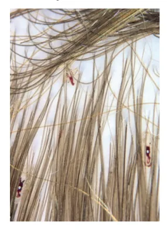

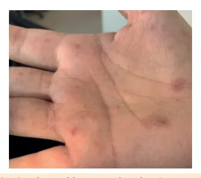

---

<!-- page:2 -->

**Tratamento**

- Remoção mecânica das lêndeas com pente fino;
- Lavar com água quente as roupas, lençóis, tiaras e escovas;
- Farmacológico:
  - 1ª escolha: permetrina a 1% (aplicar no cabelo seco e limpo, repetir em uma semana);
  - 2ª escolha: ivermectina VO; contraindicada em crianças < 15 kg.

### Larva Migrans Cutânea

- Etiologia: *Ancylostoma braziliensis* ou *caninum* (helminto);
- Transmissão: larva penetra na pele (areia/praia com fezes de animais);
- Quadro clínico: trajetos sinuosos + prurido; lesão serpiginosa (com bolha, pápula), única ou múltipla; comum em áreas expostas: mãos, pés, nádegas;
- Aguda e autolimitada em 1-2 meses.

*Figura 3: Lesão serpiginosa relacionada à larva migrans cutânea.*

**Tratamento**

- Alívio dos sintomas e redução de risco de complicações bacterianas;
- Sistêmico: albendazol (> 2 anos) 400 mg dose única, repetir em 7 dias;
- Tópico: tiabendazol 15% 2x/dia por 14 dias;
- Outras opções: ivermectina ou tiabendazol oral.

### Tungíase

- Etiologia: *Tunga penetrans* (pulga);
- Transmissão: penetração na pele (areia, zona rural);
- Quadro clínico: pápula esférica branco-amarelada com ponto central (segmento posterior contendo ovos); prurido, dor;
- Acometimento: região palmo-plantar.

*Figura 4: Lesão causada por tungíase, com pápula amarelada com ponto escuro central.*

**Tratamento**: extração da pulga com agulha estéril; após a remoção, recomenda-se tiabendazol 25 mg/kg/dia por 10 dias ou ivermectina em dose única.

## Piodermites

- Infecções da pele e dos seus anexos;
- Geralmente causadas por cocos gram-positivos: *Staphylococcus aureus* e *Streptococcus pyogenes*. Atenção para o MRSA de comunidade;
- Em geral, são infecções de pouca gravidade e o manejo é ambulatorial;
- Podem ter complicações extracutâneas: glomerulonefrite pós-estreptocócica.

### Impetigo

- Definição: infecção superficial da pele, não deixa cicatriz;
- Pode ser primária ou secundária (picada de inseto, lesão de dermatite atópica);
- Etiologia: *Staphylococcus aureus* e *Streptococcus pyogenes*;
- Transmissão: interpessoal, em contato próximo;
- Clínica: forma crostosa (*S. aureus* ou *S. pyogenes*) x forma bolhosa (*S. aureus*);
- Diagnóstico: clínico; cultura se imunodeficiência ou dificuldade de tratamento ou recorrência.

*Figura 5: Lesões causadas por impetigo, com crostas melicéricas.*

**Tratamento**

- Medidas locais + antibioticoterapia + hábitos higiênicos adequados;
- Hábitos higiênicos: manter a lesão limpa, lavar com sabão; sabonetes antissépticos por curtos períodos; lavagem das mãos + manter unhas cortadas (evita autoinoculação e previne recorrência);
- Antibioticoterapia tópica: indicada para lesões localizadas, em pequena quantidade e sem comprometimento sistêmico. Mupirocina, retapamulina, ácido fusídico.

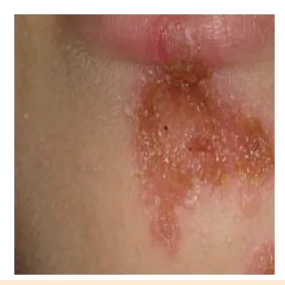

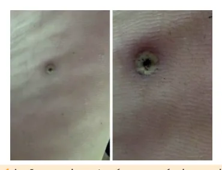

---

<!-- page:3 -->

- Antibioticoterapia sistêmica: indicada para grande número de lesões, mais de uma região, quadro bolhoso, comprometimento sistêmico:
  - Cefalexina, amoxicilina + clavulanato;
  - Considerar bactrim ou clindamicina se suspeita de CA-MRSA;
  - Duração: 7 dias.
- Complicações: glomerulonefrite pós-estreptocócica. O tratamento não reduz o risco.

### Pele Escaldada Estafilocócica

- Etiologia: exotoxinas A e B do *Staphylococcus aureus* fagotipos 1, 2 e 3 na circulação (não somente na pele);
- Clínica: eritema e fissuras, bolhas grandes e finas que se rompem e liberam fluido purulento; sinal de Nikolsky positivo (pele desprende próximo às bolhas); não envolve mucosas; sintomas sistêmicos podem estar presentes;
- Diagnóstico: clínico; cultura da bolha é negativa.

*Figura 6: Síndrome da pele escaldada estafilocócica.*

**Tratamento**: antibioticoterapia sistêmica:

- Oxacilina;
- Associar clindamicina (bacteriostático, mas inibe síntese da toxina);
- Vancomicina se suspeita de MRSA;
- Terapêutica de suporte: cuidados com desidratação, regulação térmica e nutrição.

### Choque Tóxico Estafilocócico

- Etiologia: *S. aureus* + produção de toxina (TSST-1) → produção maciça de citocinas;
- Epidemiologia: crianças entre 6 meses e 2 anos são as mais vulneráveis; possui relação com uso de absorventes internos em pacientes mais velhas;
- Clínica: início rápido de febre, hipotensão e envolvimento multissistêmico (vômito, diarreia, mialgia, renal, hepático, SNC);
- Pele: eritrodermia (rash macular difuso envolvendo região palmo-plantar), podendo evoluir com ulcerações, petéquias, vesículas e bolhas;
- Descamação após 1-2 semanas, com queda de cabelo e unhas;
- Mucosa: hemorragia conjuntival, hiperemia vaginal e orofaríngea;
- Diagnóstico: culturas de sangue, mucosas, feridas — formas jovens do agente.

**Tratamento**: suporte e antibioticoterapia empírica (oxacilina ou vancomicina, associada à clindamicina).

### Ectima

- Definição: tipo de impetigo ulcerado, causado pelos mesmos agentes (principal: *S. pyogenes*);
- Transmissão: interpessoal, em contato próximo;
- Clínica: lesão mais profunda, ulcerada, recoberta por crosta marrom-enegrecida com halo eritematoso/violáceo elevado. Deixa cicatriz;
- Subtipo mais grave: ectima gangrenoso (comum em área de períneo e normalmente causado por *Pseudomonas aeruginosa*).

*Figura 7: Lesão causada por ectima: profunda e ulcerada, com crosta marrom e halo eritematoso.*

**Tratamento**: antibiótico sistêmico; cefalexina é 1ª escolha.

## Infecções Foliculares

### Foliculite

- Definição: infecção e inflamação dos folículos pilosos;
- Agente mais comum: *Staphylococcus aureus*;
- Superficial: pústulas brancas com halo eritematoso ao redor dos óstios foliculares;
- Tratamento: higiene local nos casos leves; mupirocina tópica se quadro persistente em área limitada; cefalosporina de primeira geração nos casos mais extensos.

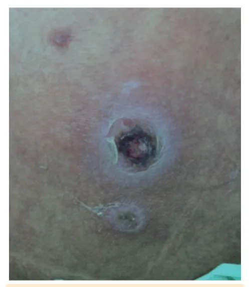

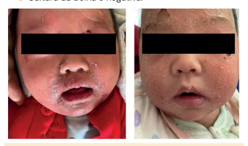

---

<!-- page:4 -->

*Figura 8: Lesões causadas por foliculite, com pústulas ao redor dos óstios foliculares.*

### Furunculose

- Definição: infecção do folículo mais profunda, que invade derme até tecido celular subcutâneo;
- Tratamento: compressas quentes, drenagem, antibioticoterapia sistêmica se eritema extenso;
- Furunculose de repetição:
  - Definição: 6 ou mais episódios por ano, ou 3 em 3 meses;
  - Diagnóstico: cultura da lesão, se possível;
  - Tratamento: cuidados locais de higiene, sabão antisséptico, banho de hipoclorito e antibioticoterapia para o quadro agudo;
  - Opção de antibiótico para descolonização: mupirocina tópica em narinas, 2x/dia por 5-10 dias.

*Figura 9: Furúnculo simples.*

### Carbúnculo

- Definição: agrupamento de furúnculos que se estende até a hipoderme.

*Figura 10: Lesão causada por carbúnculo, com componente inflamatório importante.*

## Erisipela

- Definição: infecção superficial da pele, com disseminação linfática superficial;
- Agentes etiológicos: *Streptococcus* (*pyogenes* e outros) e *Staphylococcus aureus*; penetram por porta de entrada;
- Clínica: área eritematosa bem delimitada, dolorosa, pode ter linfangite ascendente e vesículas ou bolhas sobre a lesão. Pode ter sintomas sistêmicos (febre).

*Figura 11: Erisipela, com eritema bem delimitado.*

**Tratamento**: antibioticoterapia sistêmica sempre.

- Oral: amoxicilina, cefalexina;
- Parenteral: penicilina cristalina, cefazolina. Parenteral é usada para lactentes, acometimento extenso, imunossuprimidos, falha ambulatorial.

## Celulite

- Definição: infecção profunda da pele com acometimento de derme e subcutâneo;
- Etiologia: *Staphylococcus aureus*, *Streptococcus* do grupo A, entre outros. Penetram por quebra de barreira cutânea;
- Quadro clínico: eritema, edema, limites imprecisos, evolução mais insidiosa que a erisipela.

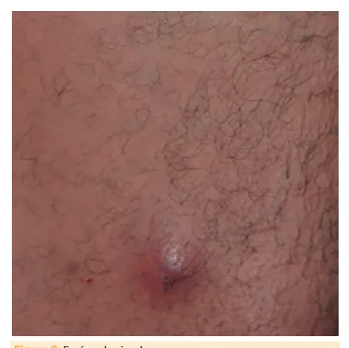

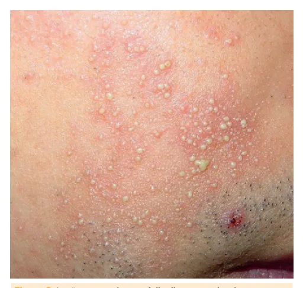

---

<!-- page:5 -->

*Figura 12: Lesão de celulite na perna.*

**Tratamento**

- Antibioticoterapia sistêmica;
- Oral: cefalexina, amoxicilina + clavulanato, 7 dias. Considerar clindamicina se falha;
- Parenteral: cefazolina, oxacilina, penicilina, ceftriaxona, 5 a 7 dias;
- Indicações de internação: imunossuprimidos, comprometimento do estado geral, acometimento extenso de face, região cervical, periarticular e periorificial.

## Dermatofitoses

### Tíneas

- Dermatófitos: fungos que digerem queratina.
  - Fungos geofílicos: solo;
  - Fungos zoofílicos: animais;
  - Fungos antropofílicos: seres humanos.
- Locais: *corporis*, *pedis*, *cruris*;
- Quadro clínico: placa com halo eritêmato-descamativo e centro claro;
- Diagnóstico: clínico, confirmado por exame micológico direto.

*Figura 13: Lesão causada por tínea, com halo eritêmato-descamativo e centro claro.*

**Tratamento**: antifúngicos tópicos (ex: clotrimazol, cetoconazol) 1-2x/dia por 3 semanas OU antifúngicos orais (ex: terbinafina, itraconazol) se disseminada ou em imunocomprometidos.

### Tínea Capitis

- Etiologia: *Microsporum canis* (sul/sudeste) e *Trichophyton tonsurans* (norte/nordeste);
- Quadro clínico: alopecia localizada com fios tonsurados, descamação e eritema; grau máximo de inflamação: Kerion celsi;
- Transmissão: fômites e animais de estimação;
- Diagnóstico: micológico direto e cultura.

*Figura 14: Lesão de tínea capitis, com pelos tonsurados na região da alopecia.*

**Tratamento**: sistêmico sempre; griseofulvina (para *Microsporum* sp.) por 6-8 semanas; terbinafina (*Trichophyton* sp.) por 4 semanas.

## Dermatoviroses

### Molusco Contagioso

- Quadro clínico: pápulas umbilicadas peroladas, de 2-5 mm, em forma de cúpula. São lesões únicas ou agrupadas;
- Etiologia: vírus molusco contagioso da família *Poxvirus*;
- Transmissão: fômites, piscinas. Pode ter transmissão sexual;
- Tratamento: doença autolimitada, dura 6-9 meses; tratamento indicado para imunossuprimidos, doença extensa, com complicação secundária ou queixa estética; opções de tratamento: curetagem (primeira escolha), crioterapia, métodos químicos.

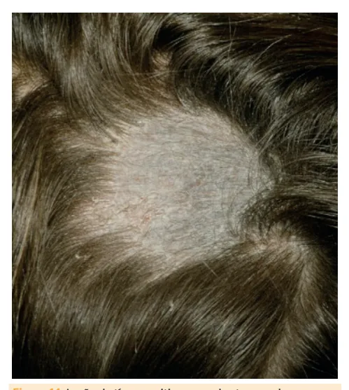

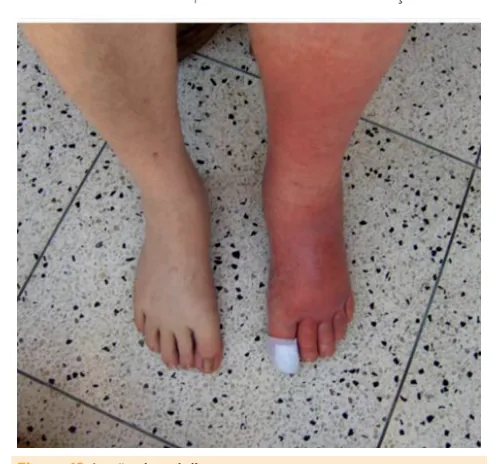

---

<!-- page:6 -->

*Figura 15: Lesões causadas por molusco contagioso, com pápulas peroladas umbilicadas.*

## Referências

Figura 1: Lesões de escabiose em palma da mão, com eritema e pápulas. BERNIGAUD, Charlotte; FISCHER, Katja; CHOSIDOW, Olivier. The management of scabies in the 21st century: past, advances and potentials. Acta Dermato-Venereologica, v. 100, n. 9, p. 5727, 2020. doi: 10.2340/00015555-3468.

Figura 2: Pediculose em fios de cabelo. MELLO, Cristina Diniz Borges Figueira de; FRANÇA, Andrea Fernandes Eloy da Costa; MAGALHÃES, Renata Ferreira. Entodermoscopy of Pediculosis capitis. JAAD Case Reports, v. 22, p. 70–71, 2022. doi: 10.1016/j.jdcr.2022.02.011. PMCID: PMC8938624. PMID: 35330983.

Figura 3: Lesão serpiginosa relacionada à larva migrans cutânea. HAMILTON, William L.; AGRANOFF, Daniel. Imported gnathostomiasis manifesting as cutaneous larva migrans and Löffler's syndrome. BMJ Case Reports, 2018. doi: 10.1136/bcr-2017-223132. PMCID: PMC5812380. PMID: 29420245.

Figura 4: Lesão causada por tungíase, com pápula amarelada com ponto escuro central. CRIADO, Paulo Ricardo; LANDMAN, Gilles; REIS, Vitor Manoel Silva dos; JUNIOR, Walter Belda. Tungiasis under dermoscopy: in vivo and ex vivo examination of the cutaneous infestation due to Tunga penetrans. Anais Brasileiros de Dermatologia, v. 88, n. 4, p. 649–651, jul.-ago. 2013. doi: 10.1590/abd1806-4841.20132071. PMCID: PMC3760950. PMID: 24068146.

Figura 5: Lesões causadas por impetigo, com crostas melicéricas. IOVINO, Susan M.; KRANTZ, Kenneth D.; BLANCO, Daisy M.; FERNÁNDEZ, Josefina A.; OCAMPO, Naomi; NAJAFI, Azar; MEMARZADEH, Bahram; CELERI, Chris; DEBABOV, Dmitri; KHOSROVI, Behzad; ANDERSON, Mark. NVC-422 topical gel for the treatment of impetigo. PMCID: PMC3160610. PMID: 21904634.

Figura 6: Síndrome da pele escaldada estafilocócica. YOU, Cong; WU, Zhiwei; LIAO, Mingyi; YE, Xiaoying; LI, Longnian; YANG, Tao. Associated outcomes of different intravenous antibiotics combined with 2% mupirocin ointment in the treatment of pediatric patients with staphylococcal scalded skin syndrome. Clinics in Cosmetic and Investigative Dermatology, v. 16, p. 1691–1701, 28 jun. 2023. doi: 10.2147/CCID.S417764. PMCID: PMC10315143. PMID: 37404367.

Figura 7: Lesão causada por ectima: profunda e ulcerada, com crosta marrom e halo eritematoso. ULUDOKUMACI, Seven; BALKAN, İlker İnanç; METE, Bilgül; ÖZARAS, Reşat; SALTOĞLU, Neşe; SOYSAL, Teoman. Ecthyma gangrenosum-like lesions in a febrile neutropenic patient with simultaneous Pseudomonas sepsis and disseminated fusariosis. PMCID: PMC3878534. PMID: 24385814.

Figura 8: Lesões causadas por foliculite, com pústulas ao redor dos óstios foliculares. SUN, Kai-lv; CHANG, Jian-min. Special types of folliculitis which should be differentiated from acne. Dermato-endocrinology, v. 9, n. 1, e1356519, 27 set. 2017. doi: 10.1080/19381980.2017.1356519. PMCID: PMC5821164. PMID: 29484091.

Figura 9: Furúnculo simples. SUN, Kai-lv; CHANG, Jian-min. Special types of folliculitis which should be differentiated from acne. Dermato-endocrinology, v. 9, n. 1, e1356519, 27 set. 2017. doi: 10.1080/19381980.2017.1356519. PMCID: PMC5821164. PMID: 29484091.

Figura 10: Lesão causada por carbúnculo, com componente inflamatório importante. SUN, Kai-lv; CHANG, Jian-min. Special types of folliculitis which should be differentiated from acne. Dermato-endocrinology, v. 9, n. 1, e1356519, 27 set. 2017. doi: 10.1080/19381980.2017.1356519. PMCID: PMC5821164. PMID: 29484091.

Figura 11: Erisipela, com eritema bem delimitado. WILSON, Eugene K.; DEWEBER, Kevin; BERRY, James W.; WILCKENS, John H. Cutaneous infections in wrestlers. Sports Health, v. 5, n. 5, p. 423–437, set. 2013. doi: 10.1177/1941738113481179. PMCID: PMC3752190. PMID: 24427413.

Figura 12: Lesão de celulite na perna. WILSON, Eugene K.; DEWEBER, Kevin; BERRY, James W.; WILCKENS, John H. Cutaneous infections in wrestlers. Sports Health, v. 5, n. 5, p. 423–437, set. 2013. doi: 10.1177/1941738113481179. PMCID: PMC3752190. PMID: 24427413.

Figura 13: Lesão causada por tínea, com halo eritêmato-descamativo e centro claro. BAUMGARDNER, Dennis J. Fungal infections from human and animal contact. Journal of Patient-Centered Research and Reviews, v. 4, n. 2, p. 78–89, 25 abr. 2017. doi: 10.17294/2330-0698.1418. PMCID: PMC6664368. PMID: 31413974.

Figura 14: Lesão de tínea capitis, com pelos tonsurados na região da alopecia. BAUMGARDNER, Dennis J. Fungal infections from human and animal contact. Journal of Patient-Centered Research and Reviews, v. 4, n. 2, p. 78–89, 25 abr. 2017. doi: 10.17294/2330-0698.1418. PMCID: PMC6664368. PMID: 31413974.

Figura 15: Lesões causadas por molusco contagioso, com pápulas peroladas umbilicadas. BHATIA, Neal; HEBERT, Adelaide A.; DEL ROSSO, James Q. Comprehensive management of molluscum contagiosum: assessment of clinical associations, comorbidities, and management principles. Journal of Clinical and Aesthetic Dermatology, v. 16, n. 8, Supl. 1, p. S12–S17, ago. 2023. PMCID: PMC10453397. PMID: 37636015.

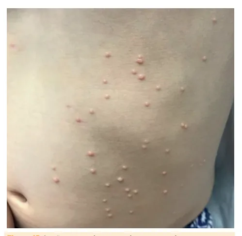
