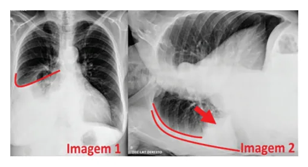
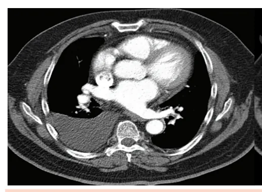
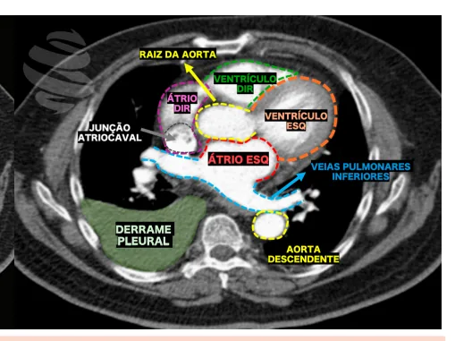

# Derrame Pleural

<!-- page:1 -->

Derrame Pleural (CM)

## INTRODUÇÃO

- Acúmulo anormal de líquido na cavidade pleural;

- Associado a diversas condições clínicas.

## QUADRO CLÍNICO

- Tríade clássica: dor torácica, tosse e dispneia;

- Dor ventilatório dependente, localizada;

- Tosse esporádica, pouco intensa;

- Dispneia multifatorial.

## EXAME FÍSICO

- No local acometido pelo derrame: Expansibilidade reduzida; Macicez à percussão; MV abolido ou reduzido.

ANÁLISE DO LÍQUIDO PLEURAL Sempre solicitar proteínas e DHL (pleura e sangue). Critérios de Light Relação proteína líquido pleural/ Proteínas totais sangue > 0,5 Relação DHL pleural/sangue > 0,6 Desidrogenase DHL líquido pleural > 2/3 do valor láctica de referência sérico

- 1 presente = EXSUDATO;

- Todos ausentes = TRANSUDATO.

## CONSIDERAÇÕES GERAIS

- Definição: é o acúmulo anormal de líquido entre as pleuras visceral e parietal.

MANIFESTAÇÕES CLÍNICAS:

- Dispneia → geralmente progressiva (a depender da velocidade de instalação);

- Dor torácica, do tipo ventilatório-dependente;

- Tosse seca ou produtiva.

- Aparelho respiratório: Taquipneia; Expansibilidade torácica reduzida; Macicez à percussão torácica.

## DIAGNÓSTICO

- É dado pelo conjunto de fatores obtidos a partir de: história clínica + elementos do exame físico + propedêutica armada. Transudato

- Insuficiência cardíaca, hidrotórax hepático;

- Falso exsudato (pensar principalmente em usuários de diuréticos): gradiente de proteína (sérica– pleural) > 3,1 g/dL; gradiente de albumina (sérica – pleural)

> 1,2 g/dL;

- Tratamento: diurético e tratamento da doença de base.

Exsudato

- Infecções, neoplasias, outros;

- Avaliar o diferencial na celularidade: Predomínio linfocítico ou neutrofílico?

- Predomínio linfocítico: ADA baixo: neoplásico? ADA > 30-40 → pensar em tuberculose: Diagnósticos diferenciais: linfoma, artrite reumatoide / lúpus eritematoso sistêmico.

- Predomínio neutrofílico: Parapneumônico: Complicado: pH < 7,2 e/ou DHL > 1000 → drenagem torácica.

## EXAMES COMPLEMENTARES

- Radiografia de tórax: Figura 1 : sinal do menisco; derrame pleural à direita; Figura 2 : radiografia de tórax – incidência de Laurell;

presença de duas lâminas líquidas, determinando a mobilidade do fluido. Figura 1: Radiografia de tórax em PA em ortostase à esquerda e em Laurell à direita, demonstrando derrame pleural.

- Verificar Figura 2 na próxima página.

---

<!-- page:2 -->

Figura 2: Tomografia de Tórax com contraste - corte axial na janela mediastinal (ou de partes moles) evidenciando pequeno derrame pleural à direita.

## CONDUTAS DIAGNÓSTICAS

- Critérios para exsudato:

Toracocentese | Proteína pleural/proteína soro > 0,5;

- Sempre indicada (motivo de controvérsia); considerar | DHL pleural/DHL soro > 0,6;

não realizar em casos de insuficiência cardíaca | DHL pleural > ⅔ o limite superior da normalidade como etiologia provável - possível considerar prova (normalmente maior que 200).

terapêutica com diureticoterapia:

- Classificação: Alívio: | Exsudato – apenas um critério - confirmar em Utilizada em etiologias conhecidas; demonstra usuários de diuréticos; Contraindicada nos casos de pulmão não | Sim: tratar de acordo com a causa-base;

utilidade para a redução dos sintomas associados; | Diagnóstico estabelecido? expansível (por exemplo em caso de atelectasia | Não: proceder com broncoscopia; biópsia de por obstrução do brônquiofonte por neoplasia). pleura; videotoracoscopia (VATS).

| Diagnóstica: realizada em quadros novos ou em investigação de complicações. ATENÇÃO! Nem todo exsudato é exsudato! Os critérios de Light demonstram algumas limitações, principalmente para ANÁLISE DO LÍQUIDO os pacientes em uso de diuréticos →

- Sempre deve ser realizada uma coleta pareada para pseudo-exsudato! Nesses casos, é útil considerar o uso cálculo dos Critérios de Light (líquido pleural e sangue). de uma ferramenta semelhante ao “GASA” (“gradiente

- Pesquisar: albumina soro-ascite”), a fim de confirmar a amostra como Sérico e pleural: proteínas totais; DHL, glicose, exsudato, caso: albumina soro – albumina pleural ≤ 1,2. Líquido pleural: pH, celularidade total e diferencial, citologia oncótica, bacterioscopia, exame ATENÇÃO! No caso de diagnóstico de transudato, micológico direto, pBAAR; culturas – BAAR, fungos, não é indicada a realização de demais exames, em bactérias; adenosina deaminase (ADA), PCR-TB. virtude de que faz parte da própria etiologia da

colesterol e triglicérides; Critérios de Light insuficiência cardíaca.

- É realizado pela avaliação dos seguintes parâmetros: DHL; Etiologias Proteínas totais → pleural e soro.

- Observe as Tabelas 1 e 2 na próxima página.

---

<!-- page:3 -->

## TRATAMENTO

Tabela 1: Etiologias de exsudato. Etiologias de exsudato

- Atente-se: a principal conduta deve ser tratar a causa- base:

Metástase pleural | Hipervolemia? → diuréticos; Metástase pleural Neoplasia pulmonar primária Neoplasias Neoplasia de mama Mesotelioma Doenças infecciosas Parapneumônico (PAC)

Pode se manifestar como TEP transudato Pancreatite Doenças do trato Abscesso intra-abdominal gastrointestinal Perfuração esofágica Artrite reumatoide LES Síndrome de Sjögren GPA – Granulomatose com Doenças poliangiite reumatológicas ES – Esclerose sistêmica Amiloidose Sarcoidose (mais comum exsudato, mas pode ser também transudato)

Reação a drogas Histiocitose de células de Outros Langerhans Síndrome de Meigs Hemotórax Neoplasias (ex: linfoma), lesão Quilotórax do ducto torácico após trauma ou cirurgia Tabela 2: Etiologias de transudato.

Etiologias de transudato Insuficiência cardíaca Frequentemente bilateral, congestiva ou à direita Cirrose hepática Hidrotórax hepático Síndrome nefrótica Hipoalbuminemia Pode se manifestar como TEP exsudato Mixedema e sarcoidose Eventos raros | Hipervolemia? → diuréticos;

| Quadros infecciosos? → antimicrobianos; | Neoplasias? → toracocentese de alívio, tratamento primário (tratar a causa base!).

- Quando indicar drenagem? Empiemas e derrames parapneumônicos complicados, conforme abaixo. Empiema: Líquido purulento; Gram e culturas + Derrame parapneumônico complicado: pH <7,2; DHL >1000; Glicose <60.

## REFERÊNCIAS

Figura 1: Radiografia de tórax em PA em ortostase à esquerda e em Laurell à direita, demonstrando derrame pleural.

Arquivo pessoal. Figura 2: TC de tórax evidenciando derrame pleural à direita. Arquivo pessoal.
