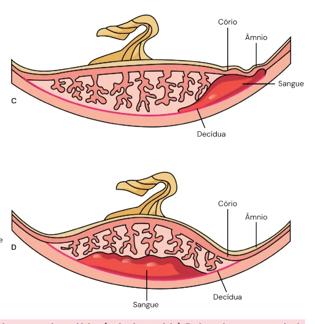
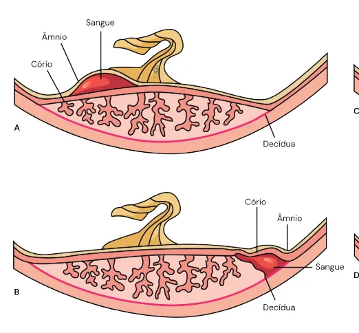
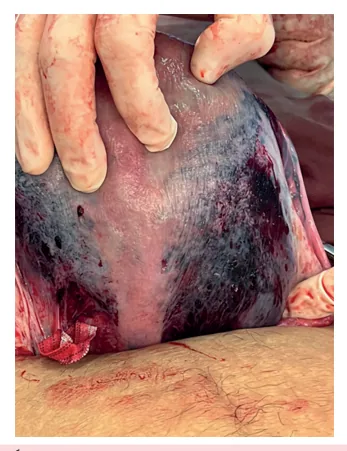

# Descolamento Prematuro de Placenta

<!-- page:1 -->

## Descolamento Prematuro de Placenta (DPP)

## Resumo

**Definição**

- Descolamento parcial ou completo da placenta, intempestiva e prematura, no corpo do útero, após a 20ª semana de gestação.

**Conduta**

- Monitorização maternofetal e amniotomia;
- Parto pela via mais rápida (exceto se paciente estável e feto morto).

**Fatores de Risco**

- Trauma abdominal e síndromes hipertensivas.

**Complicações**

- Óbito fetal;
- Prematuridade;
- Coagulação intravascular disseminada;
- Choque hemorrágico;
- Útero de Couvelaire.

**Clínica**

- Sangramento vaginal, dor abdominal, hipertonia, taquissistolia, sofrimento fetal, hemoâmnio.

**Diagnóstico**

- Eminentemente clínico.

- A taxa de mortalidade perinatal é aproximadamente **20 vezes maior** em relação às gestações sem DPP;
- A maioria das mortes perinatais ocorre intraútero;
- A prematuridade é a principal causa de mortalidade pós-natal.

## Definição

- Descolamento parcial ou completo da placenta normalmente inserida, de maneira intempestiva, antes da expulsão do feto, após a 20ª semana de gestação.

## Epidemiologia

- A incidência varia de **0,3 a 1%**.

## Fatores de Risco

- A Tabela 1 exemplifica os fatores de risco para DPP, associados aos fatores sociodemográficos, comportamentais e maternos.

Tabela 1: Fatores de risco para Descolamento Prematuro de Placenta.

> ⚠️ Tabela reconstruída a partir de OCR — confira contra a fonte original.

**Sociodemográficos e Comportamentais:**

- Idade materna ≥ 35 anos e < 20 anos;
- ≥ 3 partos;
- Raça negra;
- Mães solo;
- Tabagismo, uso de álcool e drogas;
- Infertilidade de causa indeterminada.

**Fatores Maternos na Gestação Atual:**

- Síndromes hipertensivas (responsáveis por até 50% dos casos de DPP não traumáticos);
- Hiper-homocisteinemia;
- Diabetes pré-gestacional;
- Trombofilias;
- Hipotireoidismo;
- Anemia;
- Malformações uterinas;
- Rotura prematura de membranas ovulares;
- Corioamnionite;
- Oligoâmnio/polidrâmnio;
- Placenta prévia;
- Gestação múltipla;
- Trauma (automobilístico, brevidade do cordão, versão externa, torção do útero gravídico, retração uterina intensa);
- Amniocentese/cordocentese.

---

<!-- page:2 -->

Figura 2: Tipos de Descolamento Prematuro de Placenta. A: descolamento subamniótico (pré-placentário); B: descolamento marginal (subcoriônico); C: descolamento retroplacentário com exteriorização do sangramento; D: descolamento retroplacentário com sangramento oculto.

**Síndromes Hipertensivas:**

- Fator clínico mais associado ao DPP;
- Associado à hipertensão arterial crônica materna, pré-eclâmpsia sobreposta e pré-eclâmpsia grave.

**Uso de Cocaína:**

- Devido à vasoconstrição aguda, que leva à isquemia, vasodilatação reflexa e quebra da integridade vascular.

**Tabagismo:**

- Associado a um risco 2,5 vezes maior de DPP e óbito fetal;
- Mecanismo relacionado à isquemia periférica decidual, que promove a erosão de vasos.

**Fatores Mecânicos (trauma):**

- Costumam ser mais graves.

## Fisiopatologia

- A fisiopatologia está diretamente relacionada à região da decídua basal.

Figura 1: Fisiopatologia.

- Causa base: trauma, anomalias vasculares placentárias ou placentação anômala;
- → ruptura dos vasos maternos na decídua basal;
- → sangue acumulado atinge a zona de clivagem deciduoplacentária e inicia a separação entre a placenta e o útero;
- → a porção descolada da placenta é incapaz de permutar gases e nutrientes.

- A Figura 2 destaca os tipos de DPP.

## Classificação

**Classificação de Sher:**

- **Grau I**: assintomático ou sangramento genital discreto, sem hipertonia uterina significativa;
- **Grau II**: feto vivo, porém com vitalidade fetal prejudicada; sangramento genital moderado com hipertonia uterina; repercussões hemodinâmicas na mãe;
- **Grau III**: óbito fetal;
  - IIIA: com coagulopatia instalada;
  - IIIB: sem coagulopatia instalada.

## Quadro Clínico

- Sangramento vaginal vermelho escuro (pode estar ausente);
- Dor abdominal súbita e intensa;
- Hipertonia / taquissistolia;
- Altura uterina aumentada (se sangramento oculto);
- Sofrimento fetal agudo;
- Convergência tensional (PAS e PAD mais próximas);
- Hemoâmnio.

## Diagnóstico

- O diagnóstico de DPP é **eminentemente clínico**. Não devem ser realizados exames complementares, como a ultrassonografia, para definição diagnóstica.

## Conduta

**Monitorização**

- Avaliação dos sinais vitais maternos e da vitalidade fetal.

---

<!-- page:3 -->

Figura 4: Protocolo de conduta na assistência ao descolamento prematuro de placenta.

> ⚠️ Fluxograma reconstruído a partir de OCR — confira contra a fonte original.

- **DPP com feto morto**: gestante estável → parto vaginal; instabilidade materna → cesárea.
- **DPP com feto vivo**: parto iminente → parto vaginal; sofrimento fetal agudo (SFA) ou trabalho de parto lento → cesárea.

**Avaliação laboratorial**

- Tipagem sanguínea, hemograma completo e coagulograma.

**Amniotomia**

- Redução do hematoma retroplacentário e da passagem de tromboplastina para a circulação materna.

Figura 3: Hemoâmnio.

## Estabilidade Hemodinâmica e Vitalidade Fetal

- A via de parto é dependente da estabilidade hemodinâmica materna e da vitalidade fetal;
- Gestante estável → parto vaginal; instável → cesárea.

## Complicações

- **Útero de Couvelaire**: infiltração de sangue no miométrio; maior risco de atonia; sem necessidade de histerectomia imediata.

Figura 5: Útero de Couvelaire.

## Referências

Figura 2: Tipos de Descolamento Prematuro de Placenta. Acervo Medcof.

Figura 3: Hemoâmnio. Acervo Medcof.

Figura 5: Útero de Couvelaire. Acervo Medcof.

