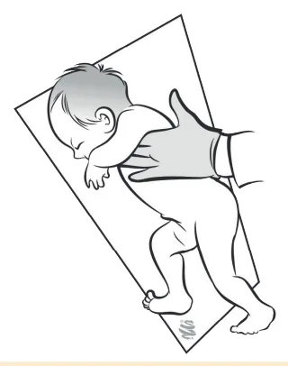
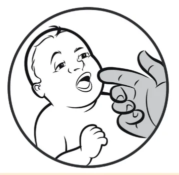
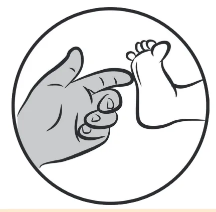
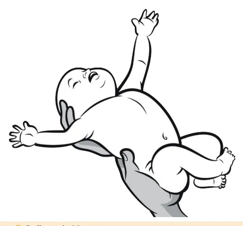

# Desenvolvimento Infantil

<!-- page:1 -->

## Desenvolvimento

- **Janela de Oportunidades - Primeiros Mil Dias** (gestação + 2 anos);
- **Grandes áreas**: Social, Adaptativo, Linguagem e Motor;
- **Tônus**: flexor > extensor;
- **Reflexos primitivos**: desaparecem com o controle voluntário.

**Avaliação:**

- Fatores de risco: pré-natal, neonatal, pós-natal e ambiental;
- Perímetro cefálico (PC) e alterações fenotípicas.

### Tabela 1: Marcos do Desenvolvimento por Idade — Recém-Nascido a 5 Meses

> ⚠️ Tabela reconstruída a partir de OCR — confira contra a fonte original.

| Idade | Social | Adaptativo | Linguagem | Motor |
|---|---|---|---|---|
| RN | Observa o rosto humano | Eleva a cabeça em decúbito ventral | Reage ao som | Pernas e braços fletidos, cabeça lateralizada, reflexos primitivos |
| 1M | Sorri | Abre as mãos | Emite sons (vocaliza) | Movimenta os membros |
| 2-3M | Responde ao contato social | Segura objetos | Ri alto | Levanta a cabeça e apoia-se nos antebraços, de bruços |
| 4-5M | — | Busca ativa de objetos | Localiza o som | Rola |

**Macete mnemônico:** "PORRE SAEM RESPONDE RINDO E SEGURA A CABEÇA BULE ROLO" (associando reage ao som / emite sons / responde ao contato social / ri alto / levanta e apoia a cabeça / localiza o som / rola).

### Tabela 2: Marcos do Desenvolvimento por Idade — 6 a 36 Meses

> ⚠️ Tabela reconstruída a partir de OCR — confira contra a fonte original.

| Idade | Social | Adaptativo | Linguagem | Motor |
|---|---|---|---|---|
| 6-8M | Brinca de esconde-achou | Transfere objetos entre as mãos | Duplica sílabas | Senta sem apoio |
| 9-11M | Imita gestos | Pinça | Jargão | Anda com apoio |
| 12-14M | Mostra o que quer | Coloca blocos na caneca | Fala 1 palavra | Anda sem apoio |
| 15-17M | — | Torre de 2 cubos | Fala 3 palavras | Anda para trás |
| 18-23M | Aponta 2 figuras | Torre de 3 cubos | Frases de 2 palavras | Chuta a bola |
| 24-29M | Tira a roupa | Constrói torre de 6 cubos | Reconhece duas ações ("quem mia? quem late?") | Pula com os 2 pés |
| 30-36M | Veste-se com supervisão, brinca com outras crianças | Imita o desenho de uma linha | Segue ordens com 2-3 etapas, sabe nome e idade | Arremessa a bola |

- Os marcos começam com aquisições mais simples e depois mais complexas.

**Interpretação:**

- Se ausência de 1 marco da faixa etária anterior, perímetro cefálico (PC) alterado ou alterações fenotípicas: **provável atraso** — encaminhar para avaliação (equipe multidisciplinar, rede de atenção especializada);
- Se ausência de 1 marco da faixa etária atual ou presença de fator de risco: **alerta para o desenvolvimento** — estimulação e retorno precoce.

---

<!-- page:2 -->

## 1. Conceitos

- Primeiro aquisições mais simples, depois mais complexas;
- Etapas gradativas e previsíveis: uma etapa é necessária para a próxima;
- Desenvolvimento Infantil engloba: crescimento físico; maturação neurológica; desenvolvimento comportamental, sensorial, cognitivo e de linguagem; relações;
- Inicia na concepção;
- Nascimento: cérebro imaturo;
- Maturação e mielinização → aquisição de marcos;
- Influenciado pelo ambiente e estímulos.

## 1.1 Janela de Oportunidades dos 0-2 Anos

- Primeiros Mil Dias: maior desenvolvimento cerebral;
- Período crítico. Se houver atraso, estimular e reabilitar (melhoram o prognóstico);
- Desenvolvimento infantil típico: base para comparação;
- Avaliar em toda consulta!

## 1.2 Fatores de Risco

- **Pré-natal**: ausente, escasso;
- **Neonatal**: pré-termo, baixo peso, asfixia, internação, infecção, hemorragia peri-intraventricular, icterícia grave;
- **Pós-natal**: traumatismo cranioencefálico (TCE) grave, meningite, convulsão, comorbidades;
- **Ambiental**: uso de substâncias psicoativas (SPA), abuso, depressão materna, consanguinidade;
- **Epidemiológico**: aumento de transtornos do desenvolvimento/comportamento.

## 1.3 Avaliação

- Fatores de risco;
- Marcos do desenvolvimento neuropsicomotor (DNPM);
- Perímetro cefálico: normal entre z-score -2 e z-score +2;
- Alterações fenotípicas: fenda palpebral oblíqua; olhos afastados; implantação baixa de orelhas; fenda palatina; pescoço curto/largo; prega palmar única;
- Triagem: Denver II (até 6 anos); escala Bayley.

## 2. Áreas e Marcos

### 2.1 Áreas do DNPM

- Pessoal-social (S);
- Adaptativo - motor fino (A);
- Linguagem (L);
- Motor grosseiro (M).

### 2.2 Desenvolvimento Motor

- Craniocaudal;
- Proximodistal.
- **Sequência motor grosseiro**: fixação ocular → sustento cefálico → tronco e membros superiores (MMSS) → quadril → membros inferiores (MMII);
- **Sequência motor adaptativo**: preensão palmar reflexa → cubitopalmar → palmar → pinça.

### 2.3 Tônus

- RN: flexor em membros, hipotonia paravertebral;
- Primeiros meses: reduz tônus flexor;
- 2º semestre: alterna.

### 2.4 Reflexos Primitivos

- Fisiológicos ao nascimento;
- Com maturação e mielinização, devem desaparecer para haver movimento voluntário.

**Período de desaparecimento dos reflexos primitivos:**

- **Marcha reflexa**: 1-2 meses.

Figura 1: Marcha Reflexa. Criança em ortostase, levemente inclinada; o contato da planta do pé com a superfície resulta em marcha.

- **Procura**: 3-4 meses.

Figura 2: Reflexo de Procura. Após estimulação perioral, ocorre rotação da cabeça "buscando" o estímulo, seguida de sucção reflexa.

---

<!-- page:3 -->

- **Tônico cervical**: 3-4 meses.

Figura 3: Reflexo Tônico Cervical (ou do Esgrimista). Rotação lateral da cabeça, extensão dos membros ipsilaterais, flexão dos contralaterais.

- **Cutâneo-plantar (em extensão) e preensão plantar**: máximo 15-18 meses.

Figura 6: Reflexo Cutâneo-Plantar. Estímulo da porção lateral do pé, desencadeando a extensão do hálux.

- **Preensão palmar**: 4-6 meses.

Figura 4: Preensão palmar. Pressão da palma da mão, seguida de flexão dos dedos.

- **Moro**: 4-6 meses.

Figura 5: Reflexo de Moro. Extensão e abdução dos MMSS, seguida de adução e flexão após queda súbita.

## 2.5 Desenvolvimento da Linguagem

- 0-3 meses: choro;
- 2-3 meses: sorriso social;
- 6-9 meses: balbucios (bababa, mamama);
- 9-12 meses: jargão;
- ~12 meses: primeiras palavras;
- 18 meses: vocabulário expandido (~50 palavras);
- 24 meses: frases de 2 palavras (quero tetê, dá água), vocabulário de 200 palavras;
- 2-3 anos: frases de 3 palavras;
- 3 anos: fala compreensível;
- 4-5 anos: frases completas.

## 2.6 Avaliação - Caderneta de Saúde da Criança

- Instrumento de vigilância para o acompanhamento dos marcos do desenvolvimento;
- Verificar faixa etária atual (marco pode estar presente) e anterior (marco deve estar presente);
- Os principais marcos de cada faixa etária estão nas Tabelas 1 e 2.

---

<!-- page:4 -->

## Tabela 3: Trecho da Caderneta da Saúde — Marcos do Desenvolvimento do Nascimento aos 6 Meses

> ⚠️ Tabela reconstruída a partir de OCR — confira contra a fonte original. A tabela original apresenta, para cada marco, a faixa etária de 0 a 6 meses em que ele é esperado (marcado com "x") e a técnica de como pesquisá-lo.

| Marco | Como pesquisar |
|---|---|
| Postura: pernas e braços fletidos, cabeça lateralizada | Deite a criança em superfície plana, de costas; observe se seus braços e pernas ficam flexionados e sua cabeça lateralizada. |
| Observa um rosto | Posicione seu rosto a aproximadamente 30 cm acima do rosto da criança. Observe se a criança olha para você, de forma evidente. |
| Reage ao som | Fique atrás da criança e bata palmas ou balance um chocalho a cerca de 30 cm de cada orelha da criança e observe se ela reage ao estímulo sonoro com movimentos nos olhos ou mudança da expressão facial. |
| Eleva a cabeça | Coloque a criança de bruços (barriga para baixo) e observe se ela levanta a cabeça, desencosta o queixo da superfície, sem virar para um dos lados. |
| Sorri quando estimulada | Sorria e converse com a criança; não lhe faça cócegas ou toque sua face. Observe se ela responde com um sorriso. |
| Abre as mãos | Observe se em alguns momentos a criança abre as mãos espontaneamente. |
| Emite sons | Observe se a criança emite algum som, que não seja choro. Caso não seja observado, pergunte ao acompanhante se faz em casa. |
| Movimenta os membros | Observe se a criança movimenta ativamente os membros superiores e inferiores. |
| Responde ativamente ao contato social | Fique à frente do bebê e converse com ele. Observe se ele responde com sorriso e emissão de sons como se estivesse "conversando" com você. Pode pedir que a mãe o faça. |
| Segura objetos | Ofereça um objeto tocando no dorso da mão ou dedos da criança. Esta deverá abrir as mãos e segurar o objeto pelo menos por alguns segundos. |
| Emite sons, ri alto | Fique à frente da criança e converse com ela. Observe se ela emite sons (gugu, eeee, etc), veja se ela ri emitindo sons (gargalhada). |
| Levanta a cabeça e apoia-se nos antebraços, de bruços | Coloque a criança de bruços, numa superfície firme. Chame sua atenção a frente com objetos ou seu rosto e observe se ela levanta a cabeça apoiando-se nos antebraços. |
| Busca ativa de objetos | Coloque um objeto ao alcance da criança (sobre a mesa ou na palma de sua mão) chamando sua atenção para o mesmo. Observe se ela tenta alcançá-lo. |
| Leva objetos à boca | Ofereça um objeto na mão da criança e observe se ela o leva à boca. |
| Localiza o som | Faça um barulho suave (sino, chocalho, etc.) próximo à orelha da criança e observe se ela vira a cabeça em direção ao objeto que produziu o som. Repita no lado oposto. |
| Muda de posição (rola) | Coloque a criança em superfície plana de barriga para cima. Incentive-a a virar para a posição de bruços. |

- A tabela mostra os marcos de cada área (S, A, L, M) de acordo com cada faixa etária (0 a 6 meses, distribuídas em cores).

---

<!-- page:5 -->

## 2.7 Situações Especiais

- **Prematuros**: de acordo com a idade corrigida até 2 anos. Ex.: Idade Gestacional (IG) de 28 semanas e idade cronológica de 6 meses: 40 - 28 = 12 semanas; 12 dividido por 4 = 3 meses; 6 - 3 = 3 meses de idade corrigida;
- **Síndrome de Down**: marcos mais tardios, tabelas específicas.

## 3. Condução e Estimulação

### 3.1 Avaliação e Conduta

- **Provável atraso**: PC alterado ou alterações fenotípicas ou ausência de ≥ 1 marco da faixa etária anterior. **Conduta**: encaminhar para avaliação (equipe multidisciplinar, rede de atenção especializada);
- **Alerta para desenvolvimento**: ausência de ≥ 1 marco da faixa etária atual ou presença de fator de risco. **Conduta**: estimulação e retorno precoce (30 dias);
- **Desenvolvimento adequado**: todos os marcos da faixa etária presentes e sem fator de risco.

> Atenção à regressão dos marcos!

### 3.2 O Que Atrapalha o Desenvolvimento?

- **Telas**: < 2 anos, zero telas;
- **Chupeta**: prejudica desenvolvimento da linguagem oral, menor desempenho intelectual;
- Estresse tóxico;
- Falta de estímulo.

### 3.3 Estresse Tóxico

- **Definição**: estresse grave e recorrente. Ex.: abuso, negligência, lar disfuncional, pobreza extrema. Eleva cortisol e norepinefrina em resposta ao estresse, causando distúrbio da plasticidade e neurotoxicidade.

Figura 7: Mecanismos fisiopatológicos do estresse nas células neuronais e arquitetura cerebral — hiper-reatividade; redução da neurogênese, alterando a sinaptogênese; mudanças na arquitetura cerebral.

- **Consequências**: diminuição do tamanho do cérebro, redução de redes neurais; risco de transtornos do neurodesenvolvimento e de saúde mental; risco de repetição do ciclo.

### 3.4 Como Estimular?

- Convivência, colo, afeto, tempo de qualidade;
- Brincar;
- Tempo no chão e na natureza;
- Leitura compartilhada;
- Conversar ("mamanhês"), cantar, contar histórias.

## Referências

Tabela 3: Trecho da caderneta da saúde - Marcos do Desenvolvimento do Nascimento aos 6 meses. Fonte: Adaptado de Caderneta de Saúde da Criança, Ministério da Saúde, 2022.
