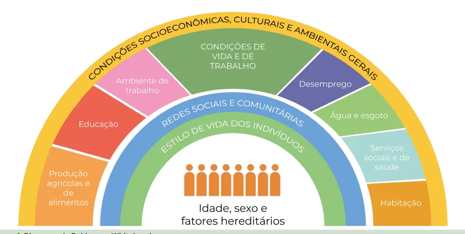

# Determinação Social do Processo Saúde-Doença e Promoção de Saúde

<!-- page:1 -->

## DETERMINANTES SOCIAIS DA SAÚDE

Saúde Pública SUS Determinantes Sociais de Saúde (DSS) DIAGRAMA DE DAHLGREN & WHITEHEAD , 1991 M Figura 1: Diagrama de Dahlgren e Whitehead.

DIAGRAMA DE DAHLGREN & WHITEHEAD: INTERV Figura 2: Diagrama de Dahlgren e Whitehead. POLÍTICA NACIONAL DE PROMOÇÃO DA SAÚDE ( Objetivo geral:

“Promover a equidade e a melhoria das condições e do individual e coletiva e reduzindo vulnerabilidades e risc econômicos, políticos, culturais e ambientais.” Temas prioritários:

I. Formação e educação permanente II. Alimentação adequada e saudável III. Práticas corporais e atividades físicas IV. Enfrentamento ao uso do tabaco e de seus deriva V. Enfrentamento do uso abusivo de álcool e de outr VI. Promoção da mobilidade segura VII. Promoção da cultura da paz e dos direitos human VIII. Promoção do desenvolvimento sustentável MODELO PARA ANÁLISE E AÇÃO SOBRE OS DSS VENÇÕES SOBRE DSS Intersetorialidade Participação social Distais Intermediários Proximais (PNPS)

os modos de viver, ampliando a potencialidade da saúde cos à saúde decorrentes dos determinantes sociais, ados ras drogas nos

---

<!-- page:2 -->

## PROMOÇÃO DA SAÚDE

- Ações intersetoriais com parcerias estratégicas.

## FUNDAMENTOS E PRINCÍPIOS

- Participação social e empoderamento comunitário.

- Cultura organizacional horizontal e cooperativa.

## HISTÓRICO

- Apoio à pesquisa, avaliação e inovação.

Relatório Lalonde (Canadá, 1974):

- Comunicação inclusiva, valorizando saber

Relatório Lalonde (Canadá, 1974):

- Marco inicial da Promoção da Saúde.

- Campos de Determinantes: Biologia humana, A de vida.

Ambiente, Saúde (organização da assistência), Estilo Carta de Ottawa (1986)

- Resultado da 1ª Conferência Internacional sobre

- Promoção da Saúde, realizada em Ottawa, Canadá.

- Inspira-se na Declaração de Alma-Ata (1978) e na meta global de “Saúde para Todos no Ano 2000”

- Promoção da Saúde: Promoção da saúde é o processo de capacitação da comunidade para P atuar na melhoria da sua qualidade de vida e saúde, incluindo maior participação no controle deste processo.”

Eixos de ação:

1. Construção de políticas públicas saudáveis

- 2. Criação de ambientes favoráveis à saúde

3. Reforço da ação comunitária

4. Desenvolvimento de habilidades pessoais

5. Reorientação dos serviços de saúde

## PROMOÇÃO DA SAÚDE NO BRASIL POLÍTICA NACIONAL DE PROMOÇÃO DA

## SAÚDE (PNPS) – PORTARIA Nº 687/2006

Objetivo Geral

- Promover a qualidade de vida e reduzir vulnerabilidade e riscos à saúde relacionados aos seus determinantes e condicionantes – modos de viver, condições de trabalho, habitação, ambiente, educação, lazer, cultura, acesso a P bens e serviços essenciais.

Objetivos Específicos D

1. Inserir ações de promoção da saúde, com ênfase na

- Atenção Básica.

2. Ampliar autonomia e co-responsabilidade dos

sujeitos e coletividades.

3. Estimular visão ampliada de saúde entre profissionais.

4. Aumentar a resolutividade do SUS com M

qualidade e segurança.

- 5. Estimular alternativas inovadoras e inclusivas.

6. Valorizar o uso dos espaços públicos para produção

de saúde.

7. Promover ambientes mais saudáveis e sustentáveis.

8. Integrar políticas públicas para qualidade de vida.

- 9. Reforçar a gestão democrática e cooperação intersetorial.

10. Prevenir determinantes de doenças e agravos.

11. Estimular cultura de paz e modos de vida

não-violentos.

- 12. Fortalecer parcerias com setores e atores sociais.

Diretrizes

- Promoção da saúde como parte da equidade e qualidade de vida. - Comunicação inclusiva, valorizando saber popular e tradicional.

Ações Prioritárias

- Divulgação e implementação da Política Nacional de

- Alimentação saudável

- Práticas corporais e atividade física

- Prevenção ao tabagismo

- Redução do uso abusivo de álcool e drogas

- Acidentes de trânsito

- Prevenção da violência

- Desenvolvimento sustentável sociais, visando ampliar autonomia, equidade e qualidade de vida.

Promoção da Saúde e Prevenção de Doenças Promoção da Saúde: atua sobre os determinantes

- Ex: políticas públicas saudáveis, espaços urbanos promotores de saúde.

Prevenção de Doenças: atua sobre fatores de risco ou a própria doença, buscando evitá-la, detectála precocemente ou mitigar seus efeitos. Existem diversos níveis de prevenção, a exemplo de Leavell & Clark (primária, secundária e terciária), além da quaternária e quinquenária.

- Ex: vacinação, rastreamentos, tratamento e reabilitação.

## DETERMINAÇÃO SOCIAL DO

## PROCESSO SAÚDE-DOENÇA DETERMINAÇÃO X DETERMINANTE

- Determinantes: elementos isolados, abordagem positivista, centrada na causalidade linear.

- Determinação: leitura dialética, histórica e relacional do processo saúde-doença, centrada no sujeito em seu contexto social.

Modelo de Dahlgren & Whitehead (1991)

- O modelo proposto por Dahlgren e Whitehead representa os Determinantes Sociais da Saúde (DSS) em camadas concêntricas e interdependentes, ilustrando como fatores estruturais, intermediários e individuais interagem

- Entende que a saúde não depende apenas de características biológicas ou comportamentais, mas é produzida historicamente nas relações sociais, econômicas, culturais e ambientais em que as pessoas vivem e trabalham.

- Está organizado em camadas concêntricas, partindo do núcleo individual fixo, passando por camadas proximais, intermediárias (meso) e chegando à camada mais distal (macroestrutural).

---

<!-- page:3 -->

Figura 1: Diagrama de Dahlgren e Whitehead. DIAGRAMA DE DAHLGREN & WHITEHEAD , 1991 MODELO PARA ANÁLISE E AÇÃO SOBRE OS DSS

- Verificar Figura 1

- 2005: criação da Comissão sobre Determinantes

Sociais da Saúde, pela OMS;

- 2006: criação da Comissão Nacional sobre os

Determinantes Sociais da Saúde (CNDSS);

- 2008: Documento-síntese do CNDSS e adoção oficial do Modelo de Dahlgren & Whitehead no Brasil

## NÍVEIS DE INTERVENÇÃO SOBRE

## OS DETERMINANTES

## SOCIAIS DA SAÚDE

- Propõe a atuação governamental nos diversos níveis de determinação social da saúde.

- Organiza-se de forma hierárquica, conforme a profundidade e complexidade da intervenção, iniciando pelas camadas mais distais e macroestruturais:

Tabela 1: Níveis de Intervenção Política sobre os Determinantes

Nível Foco da Intervenção Exemplos de Ação Mudanças estruturais Reforma agrária e Nível 1 de longo prazo acordos ambientais Saneamento, Condições de vida e Nível 2 transporte e trabalho habitação Apoio social e Ações intersetoriais Nível 3 fortalecimento comunitárias e comunitário conselhos locais Educação em saúde, Estilo de vida e Nível 4 alimentação saudável escolhas individuais e atividade física Esse modelo entende que:

- As intervenções mais profundas na promoção da equidade em saúde estão nos níveis estruturais e intermediários.

- A ênfase exclusiva em estilos de vida individuais ignora os condicionantes sociais que restringem escolhas e oportunidades, podendo reforçar culpabilizações e iniquidades.

- Políticas públicas baseadas nos DSS devem ser intersetoriais, integradas e sustentadas por dados epidemiológicos e análise crítica do contexto social.

Componentes importantes das intervenções em saúde sobre os Determinantes Sociais da Saúde

- Intersetorialidade (integração entre saúde, educação, habitação, assistência etc.)

- Participação social (controle social das políticas públicas)

- Uso de evidências (base científica e dados em saúde)

## DIAGRAMA DE SOLAR E IRWIN

- Adotado pela Organização Mundial da desigualdades estruturais na sociedade produzem iniquidades em saúde ao operarem por meio de determinantes intermediários.

Saúde (OMS) esse modelo explicita como as

- Verificar Figura 2 na próxima página em Saúde) a posição socioeconômica de indivíduos e grupos com base em fatores como:

Determinantes Estruturais (Estrutura das Desigualdades São os responsáveis pela estratificação social, moldando

- Classe social

- Gênero

- Etnia (racismo estrutural)

- Escolaridade

- Ocupação

- Renda

---

<!-- page:4 -->

CONTEXTO Sócioeconômico e político

- Circunstâncias materiais:

Posição sócioeconômica condições de moradia e trabalho, Posição sócioeconômica

- Governança

- Políticas macroeconômicas

Classe social Gênero

- Políticas sociais, Etnia (racismo) trabalho, habilitação, terra

Mercado de Educação

- Políticas públicas, educação, saúde, Coesão so proteção social

Ocupação Renda

- Cultura e valores sociais

Determinantes Estruturais das Iniquidades em Saúde Figura 2: Fluxograma: diagrama de Solar e Irwin.

- Contexto socioeconômico e político

- Estruturas de poder, normas sociais e culturais as condições reais de vida e saúde da população: t

Determinantes Intermediários Refletem os efeitos das desigualdades estruturais sobre A

- Circunstâncias materiais: habitação, ambiente de trabalho, disponibilidade de alimentos, transporte, saneamento A

- Fatores psicossociais: estresse, insegurança, t exclusão social

- Fatores comportamentais e biológicos: estilos de vida, vulnerabilidades fisiológicas A

- Sistema de saúde: acesso, cobertura, d qualidade, equidade saúde é considerado um determinante intermediário. e dimensões estrutural e intermediária. disponibilidade de alimentos etc.

( No diagrama de Solar & Irwin, 2010, o sistema de A A coesão social e o capital social atravessam as

- Fatores comportamentais e biológicos SOBRE A

## EQUIDADE EM SAÚDE E O

- Fatores psicossociais ocial & capital social saúde

BEM-ESTAR Sistema de saúde Determinantes intermediários da

## REFERÊNCIAS

Figura Cofexpress. Adaptado de DAHLGREN, G.; WHITEHEAD, M. Policies and strategies to promote social equity in health. Stockholm: Institute for Futures Studies, 1991.

Figura 1: Diagrama de Dahlgren e Whitehead. Adaptado de DAHLGREN, G.; WHITEHEAD, M. Policies and strategies to promote social equity in health. Stockholm: Institute for Futures Studies, 1991.

Figura 2: Fluxograma: diagrama de Solar e Irwin. Adaptado de A conceptual framework for action on the social determinants of health. Social Determinants of Health. Discussion Paper 2 (Policy and Practice). Geneva: WHO, 2010.

Tabela 1: Autoral. Adaptado de ROUQUAYROL, Maria Zélia; GURGEL, Marcelo. Rouquayrol: epidemiologia e saúde. Medbook, 2021 p. 644-645.
