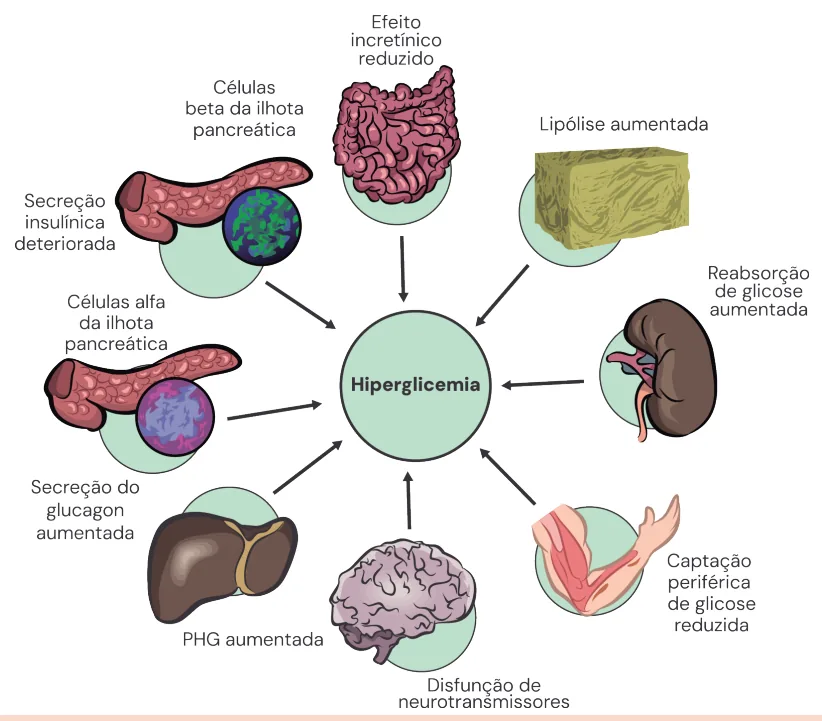
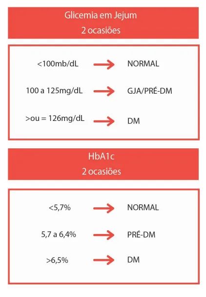

# Diabetes Classificação, Fisiopatologia e Diagnóstico

<!-- page:1 -->

## DIABETES: CLASSIFICAÇÃO

## FISIOPATOLOGIA E DIAGNÓSTICO

Diabetes (CM)

## CLASSIFICAÇÃO

## DM1 DM2 MODY LADA

Idade Dx Maioria < 25 anos > 25 anos Maioria < 25 anos Maioria > 30 anos Geralmente Sobrepeso e Similar a população Similar a população Peso magros obesidade geral geral Anticorpos Presentes Ausentes Ausentes Presentes Dependência de Ocasional (Tipo 1 Sempre Ocasional Tardio insulina e 3)

Sensibilidade à Normal Reduzida Normal Normal insulina Histórico familiar de Infrequente Frequente Multigeracional Infrequente DM Risco de CAD Alto Baixo Baixo Intermediário QUADRO CLÍNICO | Antes e após início do tratamento com GC/ Sinais e sintomas TÍPICOS de hiperglicemia antipsicóticos (clorpromazina, clozapina,

- Poliúria; olanzapina, quetiapina e risperidona);

- Polidipsia; Como

- Polifagia;

- Preferencialmente glicemia de jejum + HbA1c.

- Perda de peso inexplicada;

- Desidratação. DIAGNÓSTICO

Sinais e sintomas SUGESTIVOS de hiperglicemia

- Um único exame alterado (GJ OU

- Noctúria; HbA1c) e repetido OU

- Visão turva;

- Dois exames distintos (GJ E HbA1c) alterados,

- Cansaço; mesmo que na mesma amostra.

- Infecções recorrentes (candidíase e periodontite);

- Má cicatrização de feridas.

## RASTREAMENTO

Pacientes assintomáticos

- Todos ≥ 35 anos;

- < 35 anos + IMC ≥ 25 kg/m2 + algum dos abaixo: Sedentarismo; Histórico familiar em parentes em 1º grau; História de DMG; Portadores de acantose nigricans; HAS, DCV prévia, HDL < 35mg/dL, Síndrome dos ovários policísticos;

TGL > 250mg/dL;

- Para além do critério de idade: Pré-DM em exame prévio; DMG prévio/RN GIG FINDRISC alto/muito alto; Comorbidades relacionadas a DM secundário DHGM;

(endocrinopatias/vírus HIV);

---

<!-- page:2 -->

- Glicemia de jejum ≥ 126 E HbA1c ≥ 6,5 já

- Valores intermediários (GJ ≥ 100 porém < 126 e/ confirmam o diagnóstico. ou HbA1c ≥ 5,7 porém <6,5) também requerem A normalidade dos dois exames não exclui o realização ed TTGO-1h;

diagnóstico em pacientes ≥ 3 fatores de risco ou FINDRISC alto → realizar TTGO-1h GJ e/ou HbA1c GJE HbA1c GJ OU HbA1c GJ E/OU HbA1c compatíveis compatível compatível com DM com DM com pré-DM DM Repetir confirmado exame alterado Sim Confirma DM?

Não MEV + repetir exame em 6 meses Repetir TOTG 1h ≥ 209mg/dL

## EPIDEMIOLOGIA

- Doença extremamente prevalente mundialmente.

- Expectativa de aumento da prevalência no futuro.

- Aumenta a morbimortalidade em 2-3 vezes.

- Reduz a expectativa de vida.

## DM TIPO 1 (DM I)

- Menos prevalente: 5-10% dos pacientes diabéticos;

- Afeta principalmente crianças e adolescentes, mas Q também pode acometer adultos jovens.

- 50% de concordância em gêmeos monozigóticos Não tem uma carga genética tão importante quanto no DM2, em que a concordância de gêmeos monozigóticos chega a 90%.

Fisiopatologia

- Predisposição genética + desencadeador ambiental inespecífico (infecção etc.) T Gera um aumento da produção de autoanticorpos pancreáticas → queda dos níveis de insulina;

→ inflamação → destruição das células beta

- Processo ocorre em curto espaço de tempo; Valor ≥ 209 na 1ª hora confirma o diagnóstico de alto/muito alto em 1 ano em 1 ano em 1 ano

DM nesses cenários. Normais ≥ 3 fatores de risco Não DM OU FINDRISC TOTG 1h 155-208mg/dL <155mg/dL Pré-DM Normal Novo rastreio Novo rastreio Normal Novo rastreio Anticorpos e marcadores

- DM1A → tem anticorpos presentes (anticorpos anti-ilhota) Antiinsulina (IAA) Antidescarboxilase do ácido glutâmico Antitirosina-fosfatase Ia-2 e IA-2B Antitransportador de zinco (Znt8).

(anti-GAD65)

- DM1B → não tem anticorpos detectáveis em exames laboratoriais;

- Peptídeo C → diminuído, produzido junto à insulina no pâncreas;

Quadro clínico e complicações

- “Poli”s ao diagnóstico normalmente presentes Poliúria Polidipsia Polifagia Perda de peso (falta de insulina);

- Complicação mais comum → cetoacidose diabética (CAD).

Tratamento

- Insulinoterapia.

---

<!-- page:3 -->

Figura 1: Fisiopatologia do DM2 DM TIPO 2 (DM II) Tratamento

- Idade > 40 anos

- Hipoglicemiantes orais e/ou subcutâneos no início. Com o aumento da prevalência da síndrome metabólica, vem aparecendo cada vez mais cedo; OUTROS TIPOS DE DIABETES 80% portadores têm obesidade; LADA

- Representa 90-95% dos casos de diabetes.

- Diabetes autoimune do adulto

- Concordância de 90% em gêmeos monozigóticos | Cerca de 3-12% dos casos de diabetes

(maior herdabilidade);

- Evolução mais lenta

- Fatores de risco: obesidade, história familiar de | Idade superior a 30 anos;

DM, negros e hispânicos, idade > 40 anos, HAS, | Independência de insulina por pelo menos 6 meses dislipidemia, DMG/Macrossomia fetal, tabagismo, SOP após o diagnóstico.

(síndrome dos ovários policísticos);

- Anticorpos presentes.

Anticorpos e marcadores MODY

- Ausência de anticorpos.

- Diabetes monogenético

- Peptídeo C normal ou elevado (varia conforme a fase | Mutação de um gene que vai regular a produção de da doença). insulina pelas células beta pancreáticas.

Fisiopatologia | Acomete duas ou mais gerações consecutivas –

- Resistência periférica à insulina nos adipócitos e possui história familiar forte.

músculo esquelético; Verificar Figura 1

- Ausência de sinais de resistência insulínica e ausência

- Secreção deficiente de insulina de forma relativa pelo de anticorpos ICA.

pâncreas e aumento da produção hepática de glicose;

- Verificar Tabela 1 na próxima página

Quadro clínico e complicações

- Geralmente assintomático ao diagnóstico;

- Paciente pode abrir o quadro com estado hiperglicêmico hiperosmolar; CAD pode ocorrer mais raramente.

---

<!-- page:4 -->

Tabela 1: MODY 2 e 3 Tipos Complicações Características Clínicas Tratamento (Gene mutado) microvasculares Hiperglicemia leve e MODY 2 estável Apenas dieta Raras (GCK) Tipicamente Insulinoterapia (exceção)

assintomática Boa resposta a doses baixas de MODY 3 Defeito progressivo Frequentes Sulfoniluréias (HNF 1 alfa) na secreção de insulina Insulinoterapia - longo prazo Diabetes secundário DM secundário a doenças do pâncreas exócrino DM secundário a Endocrinopatias

- Doenças que lesam o pâncreas exócrino também

- Hormônios contrarreguladores como GH, cortisol, podem levar ao acometimento do pâncreas endócrino glucagon, catecolaminas e tiroxina; por destruição das células beta. Inibem a ação da insulina. | Pancreatite, trauma, neoplasia pancreática, fibrose Exemplo: Acromegalia, Síndrome de Cushing, cística, hemocromatose, etc.

Glucagonoma, Feocromocitoma, Hipertireoidismo. | Clinicamente se assemelha a DM1

- Outra patologia associada é a síndrome dos ovários DM pós-transplante policísticos, que cursa com resistência insulínica e

- Epidemiologia pode levar à DM2. | Pós-transplante renal → 5% em 01 ano.

DM secundário a medicamentos | Pós-transplante hepático → 18% em 01 ano.

- Glicocorticoides, ácido nicotínico e inibidores

- Para realizar o diagnóstico temos os mesmo da protease critérios de DM, porém o paciente tem que ter Antagonizam a ação da insulina e induzem a tido alta hospitalar e vir em desmame do esquema resistência insulínica, podendo cursar com DM2. de imunossupressão.

- Tiazídicos e estatinas possuem controvérsias.

- Não utilizar HbA1c no 1º ano pós-transplante, pois

- Antipsicóticos atípicos podem causar ganho de peso pode ser um valor subestimado.

e hiperprolactinemia, que piora a resistência insulínica

- Fatores de risco:

e podem levar a DM2. | Receptor > 40 anos de idade, obesidade, DM secundário a infecções intolerância a glicose no perioperatório, doença

- Ação direta do patógeno pode influenciar no renal policística; doador cadáver e/ou do sexo desenvolvimento de diabetes mellitus masculino, ausência de compatibilidade ideal entre Rubéola congênita, CMV, Coxsackie B, Adenovírus receptor e doador, vírus da hepatite C e CMV, uso e Parotidite podem causar DM por destruição das de imunossupressões. Vírus da hepatite C → 1/3 dos pacientes portadores relacionam com DM pós-transplante.

células beta pancreáticas. | Micofenolato de mofetila e azatioprina não se crônicos têm DM.

- Rastreamento deve ser realizado em todo paciente Aumenta as chances de diabetes por ação candidato a transplante.

direta→ resistência insulínica, supressão do GLP-

- GJ e/ou TOTG 75g semanal no 1º mês de transplante, Drogas de escolha para tratamento: ano do transplante podemos realizar anualmente.

1 e aumento da DPP4. depois no 3º, 6º e 12º mês pós-transplante, e após um MTF e pioglitazona.

- Verificar Tabela 2

Tabela 2: Classificação geral dos quatro principais tipos de diabetes

Idade Dx Maioria < 25 anos Maioria > 25 anos Maioria < 25 anos Maioria > 30 anos Geralmente Sobrepeso e Similar à população Similar à população Peso magros obesidade geral geral Ac Presentes Ausentes Ausentes Presentes Dependência de Sempre Ocasional Ocasional (Tipo 1 e 3) Tardio insulina Sensibilidade à Normal Reduzida Normal Normal insulina HF de DM Infrequente Frequente Multigeracional Infrequente Risco de CAD Alto Baixo Baixo Intermediário

---

<!-- page:5 -->

- Todos ≥ 35 anos;

- < 35 anos + IMC ≥ 25 kg/m2 + algum dos abaixo: Sedentarismo; Histórico familiar em parentes em 1º grau; História de DMG; Portadores de acantose nigricans; HAS, DCV prévia, HDL < 35mg/dL, TGL > 250mg/dL; Síndrome dos ovários policísticos;

- Para além do critério de idade: Pré-DM em exame prévio; DMG prévio/RN GIG FINDRISC alto/muito alto; Comorbidades relacionadas a DM secundário Antes e após início do tratamento com GC/ antipsicóticos (clorpromazina, clozapina, olanzapina, quetiapina e risperidona);

(endocrinopatias/vírus HIV);

- Sintomáticos (poliúria, polidipsia, polifagia e perda de peso) também devem ter DM pesquisada.

## DIAGNÓSTICO

## PRINCÍPIOS

- Todos os tipos de diabetes seguem esse critério, exceto DMG que será estudado em GO;

## CRITÉRIOS

- Glicemia de jejum em duas ocasiões;

- HbA1c (hemoglobina glicada) em duas ocasiões;

- Glicemia de jejum + HbA1c na mesma ocasião;

- TOTG (teste de tolerância oral à glicose) com 75g;

- Sintomas clássicos (“Polis”) com glicemia casual >

200 mg/dL; Tabela 3: Valores de corte para diagnóstico de DM e pré-DM

- Glicemia de jejum ≥ 126 E HbA1c ≥ 6,5 já confirmam o diagnóstico. A normalidade dos dois exames não exclui o diagnóstico em pacientes ≥ 3 fatores de risco ou

, FINDRISC alto → realizar TTGO-1h

- Valores intermediários (GJ ≥ 100 porém < 126 e/ou ed TTGO-1h; Valor ≥ 209 na 1ª hora confirma o diagnóstico de

HbA1c ≥ 5,7 porém <6,5) também requerem realização DM nesses cenários.

- Verificar Figura 2 na próxima página

## CONSIDERAÇÕES SOBRE OS EXAMES

HbA1c

- HbA1c (hemoglobina glicada) em duas ocasiões ou associada a glicemia de jejum alterada, em uma ocasião, dá o diagnóstico de DM.

Alguns fatores interferem na glicação da hemoglobina:

- Fatores que aumentam a meia vida da hemácia podem levar a falsa elevação de HbA1c (álcool, deficiência de ferro, insuficiência renal crônica etc).

- Fatores que diminuem a meia vida da hemácia podem levar a falsa diminuição de HbA1c (anemia hemolítica, hemoglobinopatias, perda de sangue etc).

- Frutosamina pode ajudar na diferenciação.

Frutosamina

- Proteína (albumina) glicada;

- Fornece o controle glicêmico nos últimos 7 a 14 dias; Boa correlação com HbAlc;

- Utilidade: Avaliar controle glicêmico em condições que alteram a HbAlc (hemoglobinopatias); Necessidade de avaliar mudanças a curto prazo no controle glicêmico (gravidez).

Peptídeo C

- O peptídeo C é produzido no processo de clivagem das formas precursoras da insulina (pró-insulina) pelas células beta no pâncreas Quando secreta insulina, secreta também peptídeo C; Reflete a função pancreática e a capacidade de produção insulínica pelo órgão.

- Nas fases iniciais do DMII está aumentado

(compensação pancreática da resistência insulínica);

- Após falência do pâncreas, seja no DMI ou DMII, fica diminuído.

---

<!-- page:6 -->

GJ e/ou HbA1c Normais GJE HbA1c GJ OU HbA1c GJ E/OU HbA1c compatíveis compatível compatível com DM com DM com pré-DM DM Repetir confirmado exame alterado Sim Confirma DM?

Não MEV + repetir exame em 6 meses Repetir TOTG 1h ≥ 209mg/dL Figura 2: Fluxograma para rastreamento e diagnóstico de DM2 em ad ≥ 3 fatores de risco Não DM OU FINDRISC alto/muito alto TOTG 1h 155-208mg/dL <155mg/dL Pré-DM Normal Novo rastreio Novo rastreio em 1 ano em 1 ano Normal Novo rastreio em 1 ano dultos assintomáticos
