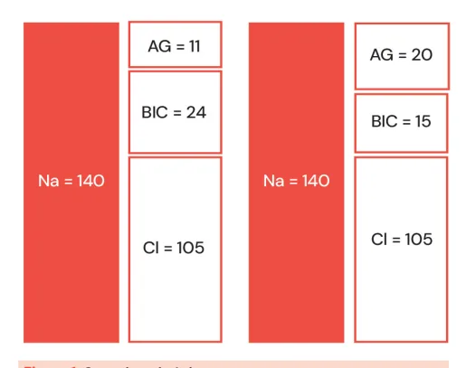
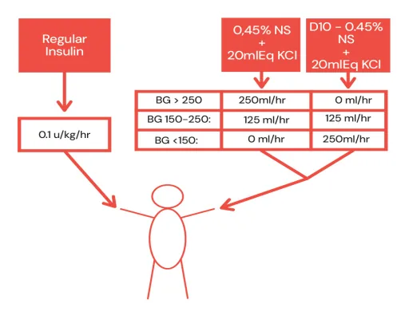

# Diabetes: Hipoglicemia e Emergências Hiperglicêmicas (CAD e EHH)

<!-- page:1 -->

## Emergências Hiperglicêmicas (CAD e EHH)

### Sintomas

- Variáveis → "polis" (poliúria, polifagia, polidipsia), dor abdominal, náuseas, vômitos, alteração de consciência, choque, IRpA, desidratação grave

### Fatores de Risco

- Primo-descompensação, má aderência, condições e infecções graves, problema social

### Diagnóstico

- História, sintomas clínicos, gasometria arterial, osmolaridade sérica, urina tipo I, glicemia, cetonemia. Coletar demais laboratoriais → não esquecer dos eletrólitos
- **CAD:** pH < 7,3, glicose > 200 mg/dL (atenção à CAD euglicêmica), bicarbonato < 18, cetonúria fortemente positiva ou cetonemia positiva (beta-hidroxibutirato > 3 ou cetonúria pelo menos ++)
- **EHH:** glicose > 600 mg/dL, osmolaridade efetiva > 320 mOsm/L, alterações neurológicas, ausência de cetonemia significativa, ausência de acidose

### Tratamento

- Tripé → insulina, reposição de eletrólitos e reposição de fluidos
- Insulina regular EV — bolus + 0,1 UI/kg/h (lembrar da possibilidade de insulina lispro)

## Introdução

- A **cetoacidose diabética (CAD)** e o **estado hiperosmolar hiperglicêmico (EHH)** são as complicações mais graves encontradas em pacientes diabéticos
- **CAD:** caracterizada por acidose metabólica de ânion-gap elevado, hiperglicemia, cetonemia e cetonúria. É mais observada em pacientes DM tipo 1, em primo-descompensação
- **EHH:** caracterizado por hiperglicemia, acidose e cetonemia variáveis, osmolaridade elevada e sintomas neurológicos. É mais comum em pacientes com DM tipo 2

## Fatores de Risco

- DM tipo 1 (primo-descompensação)
- Má aderência ou uso inadequado de insulina
- Infecções
- AVC, IAM, pancreatite
- Medicações (corticoides, diuréticos, iSGLT-2)
- Problemas psicossociais
- Uso de drogas

### Reposição Hospitalar

- **Reposição de eletrólitos — especialmente potássio:**
  - < 3,5: repor potássio antes de iniciar a insulina
  - 3,5-5,0: repor potássio enquanto se ministra a insulina
  - > 5: não repor potássio e manter a insulina → monitorar 2/2h
- **Reposição de fluidos:** SF 0,9%, soro 0,45%, glicose 5%, ringer lactato, plasma-Lyte. O sódio guia a reposição volêmica após a primeira hora: < 135 → SF 0,9%; > 135 → soro 0,45%

### Critérios de Resolução

- **CAD** → glicose < 200; ânion-gap < 12; pH > 7,3 e bicarbonato > 18 mEq/L
- **EHH** → glicose < 250; osmolaridade < 300 mOsm; débito urinário adequado; cetonas baixas
- Patência oral
- Após a resolução → dar dieta, desligar o soro glicosado, introduzir insulina basal + regular; desligar a bomba 2 horas após

### Complicações

- Edema cerebral, hipocalemia, hipoglicemia, EAP não cardiogênico, acidose metabólica hiperclorêmica, rabdomiólise

## Manifestações Clínicas

- A CAD apresenta evolução mais aguda → em menos de 24 horas
- O EHH tem evolução mais lenta → dias
- Dor abdominal — mais comum em CAD
- Gastroparesia
- Desidratação grave
- Respiração de Kussmaul
- Taquipneia
- Náuseas e vômitos
- Alteração do nível de consciência — mais comum em EHH

## Exames Complementares

- Glicemia → hiperglicemia
- Gasometria → acidose metabólica

---

<!-- page:2 -->

- **Eletrólitos (reforço no potássio):**
  1. **Sódio — hiponatremia:** deve ser feita a correção de 1,6-2 mEq/L de sódio para cada 100 mg/dL de glicemia acima do valor basal (100 mg/dL). Ou seja, se o valor de sódio medido é de 130 e a glicemia está em 400, deve-se aumentar 1,6 pontos a cada 100 de glicemia acima de 100 (3x100) → 3x1,6 = 4,8 → valor de sódio corrigido 134,8. Em geral, ocorre em pacientes mal nutridos ou que usaram insulina antes de chegar ao departamento de emergência, jejum prolongado, gestantes ou uso de medicações do grupo dos inibidores de SGLT2
  2. **Potássio:** em geral, os pacientes apresentam déficit de potássio — entre 300-600 mEq
- Hemograma → procurar infecção
- Função renal → diminuição da TFG pela hipovolemia
- Urina → corpos cetônicos
- Osmolaridade sérica se EHH

> **Atenção!** Em primeiro momento, lembre-se de que o shift de potássio mantém os níveis séricos normais ou mesmo elevados.

## Diagnóstico

### CAD

- **Critérios diagnósticos:** pH < 7,3; glicemia > 200 mg/dL (atenção com a euglicemia, por exemplo em uso de inibidores de SGLT-2); bicarbonato < 18; presença de cetonemia e/ou cetonúria fortemente positiva
- Em geral, observa-se acidose metabólica com ânion-gap aumentado
- O bicarbonato é usado para tamponar o H+, por isso sua concentração diminui

Figura 1: Conceitos de ânion-gap. À esquerda = situação normal; à direita = acidose metabólica com ânion-gap elevado.

> Lembre-se! AG = Na – (Cl + Bic) → valor de referência entre 8 e 12 mM.

- **CAD euglicêmica:** ver seção específica de complicações do uso de iSGLT-2

### EHH

- Normalmente, há ausência de acidose, ou presença leve
- **Cálculo da osmolaridade:** Osmolalidade efetiva = [2 x Na (mEq/L)] + [glicose (mg/dL) ÷ 18]. Utilizar o sódio normal, não o corrigido
- **Critérios diagnósticos:** glicemia > 600 mg/dL; osmolaridade efetiva > 320 mOsm/L; bicarbonato > 15 mEq/L; sem cetonas, ou presença discreta; alterações neurológicas

## Diagnóstico Diferencial

- **Cetoacidose alcoólica, cetoacidose por má nutrição:** acidose metabólica; bicarbonato normalmente > 15 mEq/L; baixos níveis de cetoácidos; sem hiperglicemia
- **Outras causas de acidose metabólica de ânion-gap aumentado:** intoxicações exógenas (metanol, etilenoglicol, AAS), sepse, uremia, acidose por metformina

## Tratamento

### Reposição de Fluidos

- Medida inicial — volume: o déficit hídrico é muito importante. Iniciar com 1 a 2L de cristaloides
- Após, realizar checagem de sódio sérico corrigido
- Após 2ª-3ª hora: se a concentração sérica de sódio corrigida for < 135 mEq/L, a solução salina isotônica deve ser continuada a uma taxa de 250-500 mL/hora; se ≥ 135 mEq/L, o fluido EV geralmente é substituído por soro ao meio (0,45%), na mesma taxa, a fim de ofertar água sem eletrólitos

### Insulina

- Dose: 0,1 UI/kg — com aumento possível
- **Objetivo:** queda de 50-75 mg/dL de glicose/hora. Se queda < 50 → dobrar a infusão; se queda > 75 → diminuir a infusão pela metade
- Atenção ao potássio → a infusão de insulina leva à queda de potássio:
  - > 5,0 → não repor e manter a insulina
  - Entre 3,5 e 5 → repor potássio enquanto é mantida a administração de insulina
  - < 3,5 → repor potássio → após a reposição, avaliar nível e considerar início da administração de insulina

---

<!-- page:3 -->

- Manter infusão até 250-300 mg/dL de glicose no EHH e 250-200 mg/dL em CAD; após, deve-se reduzir a infusão de insulina pela metade (dose entre 0,02-0,05 UI/kg)
- Não esquecer de introduzir soro glicosado 5% nas soluções a fim de evitar hipoglicemia

### Monitorização

- Glicose de 1/1 hora
- Eletrólitos, função renal, pH de 2/2 ou 4/4 horas
- Verificar Figura 2 na próxima página

### Critérios de Resolução

- **CAD** → glicose < 200; ânion-gap < 12; pH > 7,3 e bicarbonato > 18 mEq/L
- **EHH** → glicose < 250; osmolaridade < 300 mOsm; débito urinário adequado; cetonas baixas
- Patência oral
- Verificar Tabela 1

### Bicarbonato

- Uso muito controverso; talvez haja algum benefício para pacientes com pH < 6,9
- **NAGMA (non-anion gap metabolic acidosis):** pode ocorrer no curso do quadro, principalmente em CAD. O ânion-gap melhora, porém os níveis de bicarbonato não se elevam de modo adequado. As soluções bicarbonatadas podem auxiliar no controle

### Conduta Após a Resolução

- Liberar dieta "para diabetes"
- Desligar soro glicosado (SG)
- Iniciar insulina basal: glargina 0,25 UI/kg ou NPH 0,6 UI/kg dividida em 2 doses
- Após 2h da realização da insulina basal, desligar a bomba de infusão
- Seguimento com endocrinologista

### Particularidades no EHH

- Hidratação inicial igual à da CAD nas primeiras 2-4h: 50% do déficit em 8-12h e todo o déficit em 24-48h
- Evitar queda acentuada de glicemia: evitar quedas maiores que 90-120/h
- Queda de sódio de 10 mmol/L em 24h
- Queda da osmolaridade de 3-8 Osm/kg/h

### Tabela 1: Características Laboratoriais Típicas de Pacientes com Cetoacidose Diabética e Estado Hiperosmolar Hiperglicêmico

> ⚠️ Tabela reconstruída a partir de OCR — confira contra a fonte original.

| Parâmetro | CAD Leve | CAD Moderada | CAD Grave | EHH |
|---|---|---|---|---|
| Glicemia plasmática (mg/dL) | > 200 | > 200 | > 200 | > 600 |
| pH arterial | 7,25 a 7,30 | 7,00 a 7,24 | < 7,00 | > 7,30 |
| Bicarbonato sérico (mEq/L) | 15 a 18 | 10 a < 15 | < 10 | > 18 |
| Cetonúria | Positiva | Positiva | Positiva | Pequena |
| Cetonas séricas (reação nitroprussiato) | Positiva | Positiva | Positiva | Pequena |
| Cetonas séricas — ensaio enzimático do betahidroxibutirato (faixa normal < 0,6 mmol/L) | 3 a 4 mmol/L | 4 a 8 mmol/L | > 8 mmol/L | < 0,6 mmol/L |
| Osmolalidade sérica efetiva (mOsm/kg) | Variável | Variável | Variável | > 320 |
| Ânion gap | > 10 | > 12 | > 12 | Variável |
| Alterações no estado sensorial | Alerta | Alerta/sonolento | Estupor/coma | Estupor/coma ou obnubilação mental |

---

<!-- page:4 -->

## Complicações

- Edema cerebral
- Edema pulmonar não cardiogênico
- Hipoglicemia
- Hipocalemia
- Rabdomiólise
- Acidose metabólica hiperclorêmica → excesso de SF 0,9%

Figura 2: Protocolo de duas bolsas para correção de CAD ou "two-bags".

