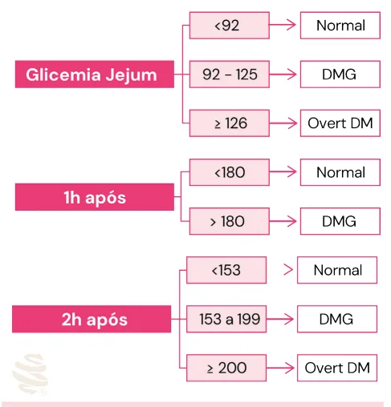
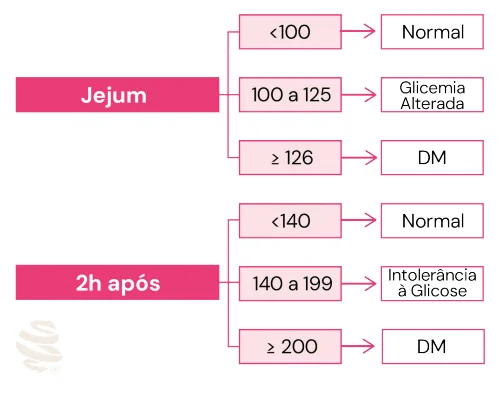

# Diabetes na Gestação

<!-- page:1 -->

## Diabetes Mellitus e Gravidez

### Diabetes Mellitus Gestacional

- **Rastreio universal:** todas as gestantes devem ser rastreadas para diabetes gestacional, exceto quem já possui o diagnóstico.
- A glicemia em jejum no início da gestação e o teste de tolerância à glicose oral com sobrecarga de 75g permitem o diagnóstico de diabetes mellitus gestacional e do diabetes prévio.

**Glicemia de Jejum:**

- **<92 mg/dL:** normal.
- **92-125 mg/dL:** DMG.
- **≥126 mg/dL:** diabetes mellitus prévio.

## Classificação

- Diabetes Mellitus (DM) tipo 1.
- DM tipo 2.
- LADA.
- MODY.
- **Diabetes Mellitus Gestacional (DMG):** iniciado durante a gestação, que pode ou não persistir após o parto.

## Fatores de Risco

- Idade acima de 35 anos.
- Sobrepeso / obesidade.
- Antecedente familiar de primeiro grau de DM.
- DMG em gestação prévia.
- Macrossomia ou feto grande para idade gestacional (GIG) prévio.
- Hipertensão arterial crônica.
- Uso crônico de corticosteroide.
- Antecedente de óbito perinatal.

## Mecanismo

- Existe uma secreção placentária de hormônios e mediadores metabólicos diabetogênicos: ↑ secreção de insulina; ↓ glicemia de jejum. **Responsável:** lactogênio placentário.
- A partir da 24ª semana, aumenta a resistência insulínica.
- Quando as modificações na função pancreática são insuficientes para vencer a resistência insulínica → diabetes mellitus gestacional.

*Figura 1: Interpretação e conduta frente à glicemia de jejum no primeiro trimestre.*

### TOTG 75g

- **0 horas:** <92 mg/dL: normal | 92-125: DMG | ≥126 mg/dL: diabetes prévio.
- **1h:** <180 mg/dL: normal | ≥180 mg/dL: DMG.
- **2h:** <153 mg/dL: normal | 153-200: DMG | ≥200 mg/dL: DM prévio.

**Tratamento não medicamentoso:** dieta, atividade física e mudança no estilo de vida.

**Tratamento medicamentoso:** insulina (medicamento de escolha).

## Rastreamento

- Todas as gestantes devem ser rastreadas para DM.

- Verificar Figura 1.

- Se os valores de glicemia de jejum do 1º trimestre forem normais, a paciente deverá ser submetida a um novo rastreamento entre 24 e 28 semanas com o Teste Oral de Tolerância à Glicose com 75g de glicose (TOTG 75g). Dosa-se a glicemia em jejum, 1h e 2h após a ingestão dessa solução; basta um valor alterado para que o diagnóstico seja dado.

---

<!-- page:2 -->

## Complicações do DM na Gravidez

### Complicações Precoces – DMG

- ITU / cistite.
- Candidíase.
- Maior taxa de cesárea.
- Pré-eclâmpsia.
- Macrossomia.
- Polidrâmnio.
- Ruptura prematura de membranas ovulares.
- TPP (trabalho de parto prematuro).
- Tocotrauma.
- Distocia de ombros.
- Lesão de plexo braquial.
- Policitemia.
- Hipocalcemia neonatal.
- Desconforto respiratório do recém-nascido.
- Hipoglicemia neonatal.
- Óbito fetal.
- Hiperbilirrubinemia neonatal.

### Complicações Tardias – DMG

- Obesidade.
- Hipertensão arterial crônica.
- Doença cardiovascular.
- DM2.

### Complicações Precoces – DM Prévio

- Aborto espontâneo.
- Maior risco de pré-eclâmpsia.
- Cetoacidose.
- Malformações fetais: síndrome da regressão caudal (mais específica); malformações cardíacas (mais frequentes).
- Insuficiência placentária.
- Restrição de crescimento fetal.

*Figura 2: Interpretação e conduta frente ao TOTG 75g entre 24 e 28 semanas.*

**Casos especiais:**

- Pós-operatório de bariátrica, principalmente em Y de Roux: maior risco de síndrome de Dumping mediante alta exposição à glicose. Repetir apenas glicemia de jejum entre 24 e 28 semanas; não realizar TOTG 75g.
- DM prévio à gestação não precisa fazer rastreamento.
- Na indisponibilidade de TOTG 75g, deve-se repetir a glicemia de jejum entre 24 e 28 semanas. Um exame alterado, se corretamente realizado, é suficiente para fazer o diagnóstico de DMG.

## Tratamento do DMG

### Pilares do Tratamento

- Dieta.
- Atividade física.
- Controle glicêmico.

### Controle Glicêmico

- **Ideal:** fazer um perfil glicêmico simples (diário), com aferição 4 vezes ao dia: jejum e pós-prandial (1h ou 2h após a refeição).
- **Alternativa:** 3x por semana, glicemia capilar na gestação.

### Tabela 1: Valores de Referência para o Perfil Simples de Glicemia

> ⚠️ Tabela reconstruída a partir de OCR — confira contra a fonte original.

| Horário | Limite |
|---|---|
| Jejum | <95 mg/dL |
| 1h após refeição | <140 mg/dL |
| 2h após refeição | <120 mg/dL |

**Objetivo:**

- Manter glicemia capilar em jejum >70 mg/dL e pós-prandial >100 mg/dL para evitar hipoglicemia.
- 60-70% controlam sem medicação.
- Considera-se descontrole quando ≥30% de hiperglicemia.

### Terapia Medicamentosa

**Insulina (medicação de escolha) — indicações:**

- Todas as pacientes que já faziam uso antes da gravidez.
- Em substituição dos hipoglicemiantes usados previamente à gestação.
- Refratariedade clínica (após 1 a 2 semanas de dieta e exercício físico) para pacientes com DMG.
- **Dose inicial (insulina NPH):** 0,5 UI/kg/dia em 2-3 aplicações (1/2 jejum, 1/4 almoço e 1/4 às 22h) ou 4 aplicações (NPH *bed time* + regular).

---

<!-- page:3 -->

- **Controle glicêmico completo (diário):** jejum, pré-prandial, pós-prandial (1h ou 2h). Importante para controle mais rigoroso da glicemia e avaliar a necessidade da adição de outras insulinas no esquema de tratamento.

### Tabela 2: Valores de Referência para o Perfil Completo de Controle

> ⚠️ Tabela reconstruída a partir de OCR — confira contra a fonte original.

| Horário | Bem controlada | Mal controlada |
|---|---|---|
| Jejum | <95 mg/dL | ≥95 mg/dL |
| Pré-prandial | <100 mg/dL | ≥100 mg/dL |
| 1h após refeição | <140 mg/dL | ≥140 mg/dL |
| 2h após refeição | <120 mg/dL | ≥120 mg/dL |

**ATENÇÃO:** paciente DM2 em uso de insulina, que vem com bom controle e começa a fazer hipoglicemias → considerar insuficiência placentária.

**Com medicação — Metformina** (Diretriz da Sociedade Brasileira de Diabetes, edição 2023):

- Indivíduos com DMG e refratariedade clínica, na inviabilidade do uso de insulina.
- Dificuldade de acesso à insulina.
- Dificuldade na autoadministração da insulina.
- Estresse exacerbado decorrente do uso de insulina.
- Restrição alimentar excessiva da gestante para evitar o uso da insulina.

- O uso de glibenclamida não é recomendado para gestantes com DMG.
- Deve ser considerada a associação de metformina com insulina em gestantes que apresentem: uso de altas doses de insulina (>2 UI/kg/dia) sem controle glicêmico adequado; ganho de peso fetal e/ou materno excessivos.
- A ANVISA não aprovou a metformina na gravidez, e a FDA considera categoria B na gestação. Se optar pelo seu uso, deve haver o registro em prontuário e assinatura do TCLE pela paciente.

## Parto – Diabetes Gestacional

- Parto até 40s6d, se houver bom controle e vitalidade fetal.
- Parto entre 39 semanas e 39 semanas e 6 dias, se mal controlada.
- Via de parto é obstétrica.
- **Exceção:** macrossomia fetal (≥4000g) ou alteração de vitalidade fetal.

## DM Pré-Gestacional

- Fazer avaliação de vitalidade fetal: nesse caso, deve-se incluir dopplervelocimetria.
- Parto ≥37 semanas.

## Puerpério

- Suspender medidas.
- Ao final do puerpério, fazer TOTG 75g, jejum e 2h.

## Seguimento — Diabetes Gestacional

- USG obstétrico: iniciar entre 24 e 28 semanas.
- **Circunferência abdominal.**
- **Conceitos:** GIG → peso ao nascer percentil ≥90; macrossomia → ≥4000g.

*Figura 3: Interpretação e conduta frente ao TOTG 75g (0-2h) no puerpério.*

### Vitalidade Fetal

- Cardiotocografia + perfil biofísico fetal.
- Indicada se em uso de insulina ou DMG mal controlado: a partir de 32 semanas, 1-2x por semana.
- Doppler obstétrico não tem utilidade clínica no DMG.

