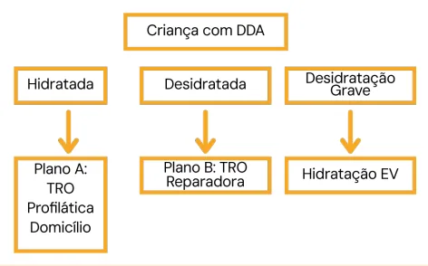

# Diarreia Aguda

<!-- page:1 -->

Diarreia Aguda (PED)

## AVALIAÇÃO DO ESTADO DE HIDRATAÇÃO

Tabela 1: Avaliação do estado de hidratação do paciente com diar Etapas A Estado geral Ativo, al Olhos Norma Observe Sede Sem se Lágrimas Presen Boca/Língua Úmid Sinal de prega Desapa abdominal imediatam Explore Pulso Chei Perda de Peso Sem pe Decida Sem desidr Trate Plano Plano A P

- Alta!

- Soro de reidratação oral (SRO) + líquidos, alimentação habitual, sinais de alarme, zinco

≤5 anos. Plano B

- SRO 50-100mL/kg VO em 4-6h.

- Ondansetrona se vômitos. A Hidratou → A; Ficou igual → Gavagem; Piorou → C.

- INTRODUÇÃO E CONCEITOS D

- DOENÇA DIARREICA AGUDA (DDA)

- Já foi uma das principais causas de mortalidade infantil. Mortalidade por DDA no Brasil caiu: melhorias nas condições de vida e maior informação quanto ao tratamento adequado.

- Atualização em 2023: Ministério da Saúde (MS) e

Sociedade Brasileira de Pediatria (SBP). DIARREIA

- Redução na consistência das fezes e/ou aumento na frequência das evacuações (≥3x em 24h);

- Aguda: início abrupto e duração < 14 dias. rreia aguda.

B C Comatoso, lerta Irritado, inquieto hipotônico, letárgico* ais Fundos Fundos Sedento, bebe Não é capaz de ede avidamente beber* ntes Ausentes Ausentes da Seca Muito seca arece Desaparece Desaparece muito mente lentamente lentamente (>2seg)

io Cheio Fraco ou ausente* erda Até 10% >10% Desidratação grave ratação Com desidratação (≥2, sendo um com *)

o A Plano B Plano C Plano C

- 1ª expansão soro fisiológico (SF) ou ringer lactato

(RL) 30ml/kg (em 1h se <1ano; em 30min se >1ano);

- 2ª expansão SF/RL 70ml/kg (em 5h se <1ano; em

2h30m se >1ano);

- Manutenção com Holliday;

- Reposição: soro ao meio 50ml/kg + K.

Antibiótico

- Disenteria + acometimento sistêmico ou febre alta;

- Até 10 anos (30kg): Azitromicina;

- > 10 anos (>30kg): Ciprofloxacino.

## DISENTERIA

- Presença de sangue nas fezes, representando lesão na mucosa intestinal.

## ETIOLOGIA

- A grande maioria dos quadros de DDA têm etiologias infecciosas; Causas não infecciosas: alergia à proteína do leite de vaca (APLV), intolerância à lactose, erros alimentares, intoxicações.

- Devo pesquisar a etiologia: em surtos e em pacientes graves ou internados.

- Verificar Tabela 2 na próxima página

---

<!-- page:2 -->

Tabela 2: Etiologia da diarreia aguda.

- Solução com sódio e glicose; No enterócito, o sódio é cotransportado com glicose, carregando água junto. Também contém K, Cl, citrato.

Vírus Bactérias Parasitas Rotavírus

- SRO clássica: 90meq/L de Na.

Rotavírus Escherichia coli Entamoeba (universal) Norovírus (em surtos - água e Salmonella Giardia alimentos)

Adenovírus Campylobacter Cryptosporidium Coronavírus Clostridium Isospora

## AVALIAÇÃO

A principal avaliação a ser feita na criança com DDA é o grau de hidratação, pois define a conduta. A avaliação é feita conforme a tabela 1.

## A (HIDRATADO)

- Tem o quadro de DDA, mas está alerta, com olhos brilhantes, há produção de lágrimas normal, tem sede e bebe água normalmente;

- Sinal da prega cutânea que desaparece rápido, pulsos cheios e preenchimento capilar adequado (<3s);

- Não há perda de peso.

## B (DESIDRATADO)

- Tem quadro de DDA, se encontra agitado, com olhos fundos, sem lágrimas, ingerindo água com avidez (sedento);

- Sinal da prega cutânea lento, mas pulsos cheios (sem sinais de choque);

- Perda de até 10% do peso.

## C (DESIDRATADO GRAVE)

- Tem quadro de DDA, encontra-se em estado sonolento, com olhos muito fundos, ausência de lágrimas, incapaz de ingerir água por via oral.

- Sinal da prega muito lento, pulsos periféricos finos ou ausentes, preenchimento capilar muito lentificado

(choque hipovolêmico).

- Perda de mais de 10% do peso.

## EXAMES COMPLEMENTARES

- Evolução atípica, grave ou arrastada;

- Presença de sangue nas fezes;

- Lactentes menores de 4 meses;

- Pacientes imunodeprimidos.

## TRATAMENTO

- Verificar Figura 1

## SORO DE REIDRATAÇÃO

- Oferta de soluções hidro-polieletrolíticas por via oral ou enteral para prevenção ou tratamento da desidratação;

- Via mais fisiológica para hidratação; - SRO clássica: 90meq/L de Na. Útil na cólera (grandes perdas de sódio). Demais etiologias: aumenta o risco de hipernatremia.

- SRO com osmolaridade reduzida: 50-75meq/L. A organização mundial da saúde (OMS) recomenda o SRO com osmolaridade de 75mEq/L. O MS ainda oferece a SRO clássica em postos de saúde. No mercado: múltiplas apresentações.

Soro caseiro não é recomendado. Preparo impreciso; Aumenta a chance de distúrbios hidroeletrolíticos.

## PLANO A

- Paciente hidratado: terapia de reidratação oral (TRO) profilática → tratamento domiciliar.

Líquidos

- Oferecer mais líquido que o habitual;

- Líquidos caseiros ou SRO após cada evacuação;

- Não usar: refrigerante, chás e sucos adoçados;

- Quantidade: <1 ano: 50-100ml; 1-10 anos: 100-200ml; >10 anos: à vontade.

Alimentação

- Manter alimentação habitual para prevenir a desnutrição.

Sinais de alerta para reavaliação

- Piora na diarreia;

- Vômitos repetidos;

- Muita sede;

- Recusa de alimentos;

- Sangue nas fezes;

- Redução da diurese;

- Sem melhora em dois dias.

Zinco

- Evita futuros quadros recorrentes de diarreias;

- Quantidade: Até 6 meses: 10mg/dia por 10 a 14 dias; Maiores de 6 meses até 5 anos: 20mg/dia por 10 a segundo o grau de desidratação.

14 dias. Figura 1: Fluxograma de tratamento da doença diarreica aguda

---

<!-- page:3 -->

PLANO B Reavaliar Líquidos

- Reavaliar hidratação.

- Paciente desidratado: TRO reparadora sob supervisão. | Melhorou a desidratação? → Plano A;

- Administrar SRO na unidade de saúde: | Continua igualmente desidratado? → Gastróclise; Volume 50-100ml/kg em 4-6h. | Piorou a desidratação? → Plano C. Continuamente até não haver sinais de desidratação. PLANO C

Alimentação Líquidos

- Manter somente aleitamento materno.

- Paciente desidratado grave: hidratação parenteral, Jejum na fase de reparação; tratamento em unidade de saúde. Alimentos irão retornar após a fase inicial da

- O plano C se divide em uma fase de expansão, uma reidratação, após no máximo 4 a 6 horas. fase de reposição e fase de manutenção.

- Sem indicação de restrições dietéticas (sem lactose

- A fase de expansão é feita com soluções cristaloides apenas se paciente hospitalizado). e se destina a repor rapidamente o volume perdido, revertendo o comprometimento cardiovascular.

Se vômitos persistentes, ondansetrona (0,15mg/kg até 8mg). Tabela 3: Tratamento do paciente com DDA do grupo C

## FASE DE EXPANSÃO - MENORES DE 1 ANO¹

Solução Volume Tempo de Administração 1º Soro Fisiológico a 0,9% ou Ringer Lactato 30 ml/kg 1 hora 2º Soro Fisiológico a 0,9% ou Ringer Lactato 70 ml/kg 5 horas

## FASE DE EXPANSÃO - A PARTIR DE 1 ANO¹

Solução Volume Tempo de Administração 1º Soro Fisiológico a 0,9% ou Ringer Lactato 30 ml/kg 30 minutos 2º Soro Fisiológico a 0,9% ou Ringer Lactato 70 ml/kg 2 horas e 30 minutos ¹ Para recém nascidos ou menores de 5 anos com cardiopatias graves, começar com 10 ml/kg de peso Tabela 4: Fase de manutenção do paciente com DDA do grupo C

## FASE DE MANUTENÇÃO E REPOSIÇÃO PARA TODAS AS FAIXAS ETÁRIAS

Solução Volume em 24 horas Peso até 10kg 100mL/kg SG a 5% + SF a 0,9% na proporção 1000mL + 50mL/kg de peso que exceder Peso de 10 a 20kg de 4:1 (manutenção) 10kg + 1500mL + 20mL/kg de peso que exceder Peso acima de 20kg 20kg SG a 5% + SF a 0,9% na proporção de 1:1 Iniciar com 50mL/kg/dia. Reavaliar essa quantidade de acordo com as (reposição)

perdas do paciente + KCl a 10% 2mL para cada 100mL de solução da fase de manutenção

---

<!-- page:4 -->

## ANTIBIÓTICOS

Alimentação

- Inicialmente manter em jejum;

- SRO concomitante assim que possível;

- Exceção. Maioria autolimitada e causada por vírus.

- Suspender hidratação parenteral quando ingesta de

- Indicações de antibióticos na DDA:

SRO for suficiente; | Shigella;

- Aleitamento e alimentação voltam quando | Cólera;

melhorar a desidratação; | Infecção por giárdia ou ameba; Reavaliar | Imunossuprimidos;

- Observar por pelo menos 6 horas. | Infecção grave/sepse.

- Critérios para alta:

- Disenteria: Presença de sangue nas fezes. Se Hidratado; apresentar disenteria e um dos seguintes, presumir Sem necessidade de fluidos EV; infecção por Shigella e iniciar antibioticoterapia: Aporte oral iguala ou excede as perdas; | Comprometimento do estado geral Garantir seguimento. | Febre alta persistente Dor abdominal ou tenesmo

SITUAÇÕES ESPECIAIS | Comprometimento sistêmico

- Febre >39 ºC: investigar outros focos; Opções terapêuticas

- Desnutridos graves: difícil avaliação; z < 3 meses ou imunodeficientes: Ceftriaxona Checar estado geral, pulso, FC e enchimento capilar; EV 50mg/kg; Utilizar SRO diferente, com menos Na, mais K e

- Até 10 anos (30kg): Azitromicina 10mg/kg/dia 1x, e mais glicose; 5mg/kg/dia por mais 4 dias; Hidratação EV 10ml/kg e reavaliação cautelosa; | Alternativa: Ceftriaxona 50mg/kg IM por 3-5 dias. Repor vitamina A e zinco. z > 10 anos (>30kg): Ciprofloxacino 500mg 12/12h por 3 dias;

ALIMENTAÇÃO | Alternativa: Ceftriaxona IM 50mg/kg por 3-5 dias.

- Manter aleitamento materno sempre.

- Metronidazol para:

- Jejum na fase de reparação do plano B. | Amebíase confirmada ou quando o tratamento de Alimentar após no máximo 4-6 horas. disenteria por Shigella sp fracassar;

- Sem indicação de restrições dietéticas. | Giardíase confirmada quando a diarreia durar Sem lactose apenas se hospitalizado. ≥14 dias. Se o paciente estiver hidratado em domicílio, manter a alimentação saudável e habitual, para que não tenha desnutrição como agravo da diarreia.
