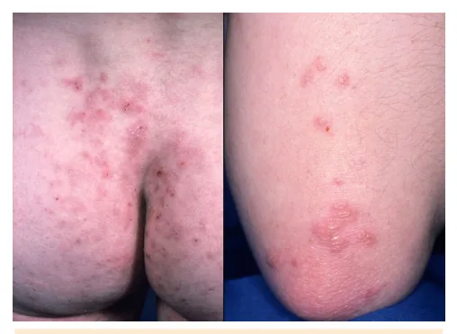
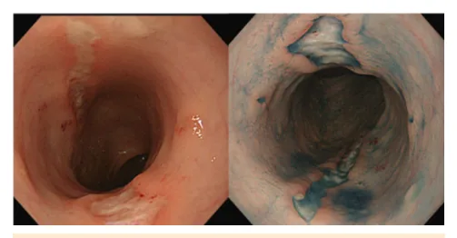
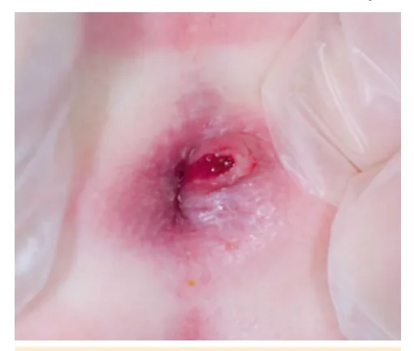
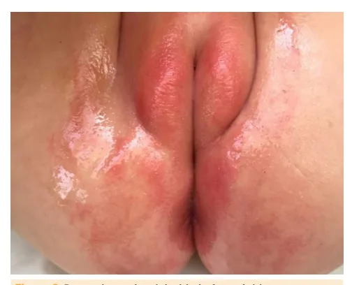

# Diarreia Crônica e Doenças Funcionais

<!-- page:1 -->

## DIARREIA CRÔNICA E

## DOENÇAS FUNCIONAIS

DOENÇAS FUNCION Diarreia crônica, Doenças Infl amatórias Intestinais e Doenças Funcionais ; DOENÇA CELÍACA I

- Diagnóstico: exame inicial: Antitransglutaminase IgA cada 100 enterócitos)

+ IgA total; biópsia endoscópica duodenal (padrãoouro): infiltrado linfocitário intraepitelial (>25 para

- Tratamento: exclusão definitiva do glúten da dieta.

DOENÇA INFLAMATÓRIA INTESTINAL Doença de Retocolite Crohn (DCr) UIcerativa (RU) Localização Todo TGI Reto ± colo Massa (QID), Sangramento Quadro dor, parada de retal, tenesmo, clínico crescimento urgência Saltatório e Mucosa e Endoscopia transmural submucosa, e AP Granuloma não ascendentecaseoso contínua Abscessos, Megacólon Complicações fístulas, fissuras, tóxico, neoplasia estenose intestinal Tratamento:

- DCr - indução: Nutrição enteral exclusiva (NEE) → parcial + imunomodulador ou anti TNF.

Corticosteroide (CS) → Anti TNF; manutenção: NE

- RCU: indução: derivados de 5-ASA → CS → anti TNF. Manutenção: derivados de 5-ASA → tiopurina → anti TNF.

## DIARREIA CRÔNICA

## CONCEITOS

Perda fecal

- > 10 g/kg/dia em lactentes;

- > 200 g/dia em crianças; I

- Duração > 14 dias;

- Frequência > 3x/dia - exceto bebês em aleitamento materno exclusivo (AME);

- Fator mais importante na anamnese durante investigação clínica é a mudança na consistência das fezes.

## MECANISMOS

Osmótico: C

- Substâncias não absorvidas no lúmen, aumentando a I osmolaridade luminal ↓ superfície absortiva (celíaca); ↓ enzima digestiva (lactase); I

- Melhora com jejum

- GAP osmolar fecal alto.

- NAIS

; Doença Celíaca INTOLERÂNCIA À LACTOSE

- Quadro clínico: diarreia líquida, explosiva, ácida;

borborigmo, flatulência, dermatite perineal

- Diagnóstico: clínico!

- Tratamento: redução da lactose da dieta;

repositores de lactase; avaliar repor cálcio e vitamina D.

## DISTÚRBIOS GI FUNCIONAIS

## SÍNDROME DO

## DIARREIA FUNCIONAL

## INTESTINO IRRITÁVEL

- Início entre 6 meses e

- Dor abdominal ≥ 4 dias/

5 anos mês por 2 meses +

- ≥ 4 semanas e ≥ 4 vezes z relação com a por dia evacuação ou alteração

- Evacuação diária, na frequência das fezes indolor e recorrente, de ou na forma das fezes fezes malformadas e

- A dor não resolve volumosas com a resolução da constipação

## DISQUESIA DO LACTENTE CÓLICA DO LACTENTE

- <9 meses z < 5 meses no início e

- ≥ 10 minutos de esforço término dos sintomas ou choro antes da

- Períodos prolongados eliminação, com ou sem e recorrentes de sucesso, de fezes choro, desconforto ou irritabilidade.

- Sem causa evidente e incapacidade de solucionar ou prevenir

Secretor:

- Fluxo ativo de eletrólitos e água para o lúmen; Toxinas (cólera);

- Se mantém no jejum

- GAP osmolar fecal baixo;

Inflamatório:

- Citocinas; ↑ Permeabilidade >> Extravasamento de proteínas; ↑ Motilidade.

- Principal causa: doenças inflamatórias intestinais (DII)

- Sangue; Leucócitos; ↑ calprotectina fecal.

GAP osmolar fecal = 290 - 2x (Na + K fecal)

## CAUSAS

Infecciosas:

- Enteroparasitoses, Giardia, E. coli;

- Síndrome pós-enterite.

Imunomediadas:

- Doença celíaca e Doença inflamatória intestinal;

- Enteropatias e proctocolites alérgicas - Alergia à

Proteína do Leite de Vaca (APLV) é a principal.

---

<!-- page:2 -->

- Má absorção de carboidratos GRUPOS DE RISCOS

- Quadro Clínico: Fezes ácidas, explosivas, assadura na

- Parentes de 1º grau com DC;

região de fraldas no lactente

- Doenças autoimunes (Diabetes tipo 1,

- Intolerância à lactose, ingestão excessiva de Sjogren, Tireoidite);

carboidratos osmoticamente ativos.

- Síndrome Genética (Síndrome de Down,

Má absorção de proteínas: Turner, Williams);

- Quadro Clínico: Hipoalbuminemia e redução de

- Deficiência de IgA.

imunoglobulinas (Ig);

- Enteropatias perdedoras de proteínas: QUADRO CLÍNICO Doença Celíaca (DC); Clássico Doença inflamatória intestinal (DII);

- Síndrome de má absorção: desnutrição, atrofia Enteropatia alérgica; subcutânea (glútea) Linfangiectasia

- Menos frequente

Má absorção de gorduras:

- Quadro Clínico: fezes volumosas, brilhantes e odor fétido (esteatorreia);

- Insuficiência pancreática exócrina (fibrose cística).

## INVESTIGAÇÃO INICIAL

Idade:

- Lactente e pré-escolar: doença celíaca e APLV;

- Adolescente: DII.

Estado nutricional:

- Perda de peso: inflamação/má absorção;

- Preservado: intolerância a carboidratos, funcional.

Características das evacuações:

- Sangue/muco → causa inflamatória;

- Oleosa (esteatorreia) → insuficiência pancreática;

- Ácidas → intolerância aos carboidratos.

Manifestações associadas:

- Febre; Articular; Cutâneo → pensar em doenças inflamatórias e sistêmicas.

- Assadura → fezes ácidas na intolerância a carboidratos. Figura 1: Distensão abdominal e atrofia subcutânea em região glútea

## INVESTIGAÇÃO INICIAL DE ACORDO COM A

SUSPEITA CLÍNICA Intestinal

## Doença celíaca

- Diarreia crônica, dor, distensão abdominal

- Anti-Transglutaminase IgA;

- Sintomas iniciam após introdução alimentar

- IgA total. Extraintestinal

DII:

- Baixa estatura

- Calprotectina fecal;

- Anemia ferropriva refratária

- Sangue oculto nas fezes.

- Atraso puberal/ irregularidade menstrual

Má absorção de carboidratos:

- Irritabilidade/fadiga

- Substâncias redutoras nas fezes aumentadas.

- Dermatite herpetiforme.

Má absorção das proteínas:

- Alfa-1-antitripsina fecal aumentada.

Má absorção de gorduras:

- Esteatócrito.

Diarreia infecciosa:

- Coprocultura;

- Parasitológico de fezes (PF).

- Enteropatia crônica imunomediada desencadeada pela ingestão de glúten;

- Predisposição genética;

- Manifestações sistêmicas diversas.

Figura 2: Dermatite herpetiforme.

---

<!-- page:3 -->

## DIAGNÓSTICO QUADRO CLÍNICO

Marcadores sorológicos:

- Diarreia crônica inflamatória (sangue, muco);

- Antitransglutaminase IgA;

- Dor abdominal crônica;

- Antiendomísio IgA e IgG;

- Antigliadina IgA e IgG.

Exame inicial:

- Antitransglutaminase IgA + IgA total Solicitar frente à suspeita clínica ou como rastreio de grupos de risco.

Biópsia endoscópica duodenal (padrão ouro): I

- ≥4 amostras do duodeno distal, com pelo menos ≥ 1 de E bulbo, enquanto consome dieta com glúten;

- Mucosa plana, atrofia vilositária, criptas alongadas

- Infiltrado linfocitário intraepitelial (>25 linfócitos para cada 100 enterócitos).

- Abordagem sem biópsia (2020):

- IgA total normal e TGA >10x limite superior: Solicitar antiendomísio IgA: Reagente:

confirma diagnóstico. P

- IgA total normal e TGA aumentado, porém <10x limite superior: Necessário realizar biópsia de delgado.

- Situações especiais:

- Deficiência de IgA: Utilizar Antiendomísio

IgG e Antigliadina IgG.

- Lactentes: Antitransglutaminase IgA negativa + persistência de suspeita clínica → solicitar Antigliadina IgG.

- HLA DQ2 e DQ8: Alto valor preditivo negativo (exclusão).

Positivo indica apenas predisposição genética.

## TRATAMENTO

Exclusão definitiva do glúten da dieta:

- Trigo, centeio, cevada e malte. Aveia - evitar por ser frequentemente contaminada. Somente após avaliação completa.

## PROGNÓSTICO

- Se dieta adequada - normalização da mucosa intestinal, normalização dos anticorpos, resolução dos sintomas.

- Transgressões: Risco aumentado para neoplasias do trato gastrointestinal (TGI).

## DOENÇA INFLAMATÓRIA

## INTESTINAL

- Processo inflamatório crônico do TGI, com períodos de exacerbação e remissão.

Epidemiologia:

- Pico de incidência aos 15-30 anos.

- Pode ter início precoce (<6 anos), associada a história familiar, normalmente mais grave.

Etiologia - Desregulação do sistema imune:

- Meio ambiente (Dieta ocidental, alimentos ultraprocessados, exposição ao tabaco);

- Aleitamento materno como fator de proteção;

- Microbioma intestinal;

- Fatores genéticos.

- Perda de peso/baixa curva de crescimento/ atraso puberal;

- Sintomas sistêmicos (febre, artralgia, uveíte);

- Tenesmo, abscesso, fissura ou fístula perianal, úlceras orais.

## INVESTIGAÇÃO

Exames iniciais:

- Hemograma: anemia, leucocitose, plaquetose;

- ↑ VHS, PCR, alfa-1-glicoproteína ácida;

- Hipoalbuminemia;

- Sangue oculto positivo e leucócitos nas fezes;

- ↑ Calprotectina fecal;

- Diagnóstico diferencial: Coprocultura e protoparasitológico de fezes.

Proceder a investigação:

- Endoscopia alta (EDA) + Colonoscopia com biópsia;

- Enteroressonância ou enterotomografia;

- Sorologia (p-ANCA, ASCA).

- Confira a Tabela 1 e Retocolite Ulcerativa.

Tabela 1: Comparativo entre Doença de Crohn Doença de Retocolite Crohn (DCr) UIcerativa (RU) Localização Todo TGI Reto ± colo Saltatório e Acomete mucosa transmural (todas e submucosa.

Endoscopia as camadas); Característica e AP BX: Granuloma ascendentenão caseoso; contínua Massa palpável, Sangramento retal, Quadro clínico dor, parada de tenesmo, urgência.

crescimento. Abscesso, Megacólon Complicações fístula, fissuras, tóxico, neoplasia estenose. intestinal Sorologia ASCA P-ANCA Hepatobiliar Articular, eritema Manifestações (colangite nodoso, úlceras extraintestinais esclerosante, aftosas.

colelitíase). Figura 3: Doença de Crohn - Aspecto saltatório de acometimento à endoscopia

---

<!-- page:4 -->

Perianal - associar:

- Drenagem de coleções e antibióticos.

Retocolite Ulcerativa: Figura 4: Doença perianal na doença de Crohn Figura 5: Úlceras orais na Doença de Crohn

- Avaliar atividade da doença (considera scores, calprotectina fecal e risco de complicações).

- Objetivos: limitar corticoesteroides

- Dividido em duas fases: indução de remissão e manutenção.

Arsenal terapêutico:

- Nutrição enteral exclusiva (NEE);

- Aminossalicilatos (D. 5-ASA):

mesalazina, sulfassalazina;

- Corticosteroides (CS);

- Imunomoduladores: azatioprina

(tiopurinas), metotrexato;

- Imunobiológicos (anti TNF): infliximabe, adalimumabe.

Doença de Crohn:

- Indução: Nutrição enteral exclusiva → CS → anti TNF

- Manutenção: Nutrição enteral parcial + Imunomoduladores ou anti TNF

Iniciar com imunobiológicos (tratamento “topdown”) se:

- Pan-entérica

- Estenosante ou penetrante

- Perianal grave

- Atraso do crescimento.

- Indução: D. 5-ASA → CS → anti TNF

- Manutenção: D. 5-ASA → tiopurina → anti TNF.

- A colectomia pode ser necessária, com possibilidade de ser curativa.

## INTOLERÂNCIA À LACTOSE

Definição:

- Incapacidade de digerir ou de absorver lactose;

- Dissacaridase lactase: Transforma lactose em glicose + galactose (absorvíveis).

Primárias:

- Ontogenética ou “Hipolactasia primária do adulto” Mais comum, sintomas iniciam a partir de 3 anos de idade

- Alactasia congênita → rara, ausência completa da lactase

Secundárias:

- Pós gastroenterite (rotavírus)

- Doença celíaca

- Intolerância do prematuro.

## QUADRO CLÍNICO

- Relação com quantidade de lactose ingerida;

- Diarreia líquida, explosiva, ácida;

- Borborigmo, flatulência;

- Dor abdominal, dermatite perineal.

- Lactose não digerida acumula no delgado - gera gradiente osmótico No cólon: a lactose íntegra irá sofrer fermentação diarreia explosiva e ácida.

(formação de ácidos e gases), resultando em Figura 6: Dermatite perineal devido às fezes ácidas na

---

<!-- page:5 -->

## DIAGNÓSTICO DISQUESIA DO LACTENTE

- Diagnóstico clínico! Critérios Diagnósticos: Exames complementares não são necessários de z < 9 meses forma geral.

- Na dúvida diagnóstica: Fezes: pH baixo (<6,0), substâncias redutoras positivo C Teste de hidrogênio expirado: ↑ > 20 ppm; Teste de tolerância oral: ↑ glicemia < 20 mg/dL; Dosagem das dissacaridases em mucosa intestinal C

(biópsia), raramente necessário.

- Redução da lactose da dieta; C

- Repositores de lactase; C

- Avaliar repor cálcio e vitamina D.

## DISTÚRBIOS GASTROINTESTINAIS

## FUNCIONAIS

- Sintomas crônicos ou recorrentes do TGI C

- Não explicados por anormalidades estruturais ou bioquímicas

- Postula-se imaturidade do sistema nervoso e aspectos biopsicossociais.

Critérios Diagnósticos:

- Evacuação indolor de fezes volumosas e não formadas,

≥ 4 vezes por dia por ≥ 4 semanas;

- Início entre 6 e 60 meses de vida;

- Bom desenvolvimento ponderoestatural.

Conduta: D

- Adequar a dieta: pode piorar com excesso de sucos açucarados (sorbitol, frutose) ou outros carboidratos não digeríveis. h

- Orientação dos pais: benigno e não precisa de medicação;

- Se resolve espontaneamente entre 4 - 5 anos.

h

## SÍNDROME DO INTESTINO IRRITÁVEL

Critérios Diagnósticos:

- Dor abdominal ≥ 4 dias/mês por 2 meses + 1: h Relação com a evacuação; Alteração na frequência das fezes; Alteração na forma das fezes; h A dor não resolve com a resolução da constipação; Os sintomas não podem ser explicados por outra condição médica. A

- ≥ 10 minutos de esforço ou choro antes da eliminação, com ou sem sucesso de fezes;

- Ausência de outros problemas de saúde.

Causas:

- Incoordenação entre a contração da musculatura abdominal e o relaxamento do assoalho pélvico.

Conduta:

- Tranquilizar os pais;

- Não é necessário supositório ou laxantes.

## CÓLICA DO LACTENTE

Critérios Diagnósticos:

- < 5 meses no início e término;

- Períodos prolongados e recorrentes de choro, desconforto ou irritabilidade; segundo os cuidadores:

sem causa evidente e incapacidade de solucionar ou prevenir sintomatologia.

- Ganho de peso normal, sem febre ou outras doenças.

Conduta:

- Tranquilização dos pais

- Não medicamentoso → medidas comportamentais.

- Probiótico (L. reuteri DSM 17938) → reduz duração do choro;

- Muito intenso: pode ser feita prova terapêutica para

APLV seguida de teste de provocação oral.

## REFERÊNCIAS

Figura 1: Distensão abdominal e atrofia subcutânea em região glútea Dig Liver Dis. 2020 Oct; 52(10): 1092–1093.

Figura 2: Dermatite herpetiforme. https://doi.org/10.1136/bmj.g2557 Figura 3: Doença de Crohn - Aspecto saltatório de acometimento à endoscopia https://doi.org/10.1155/2020/8832856 Figura 4: Doença perianal na doença de Crohn https://doi.org/10.1155/2020/8832856 Figura 5: Úlceras orais na Doença de Crohn.

https://doi.org/10.1155/2015/830472 Figura 6: Dermatite perineal devido às fezes ácidas Arquivo pessoal da professora.
