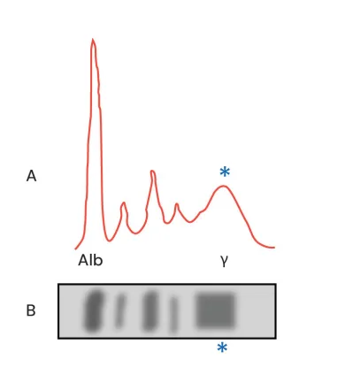
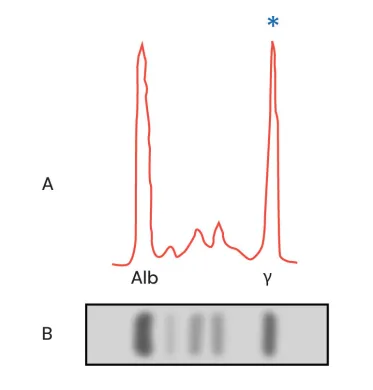
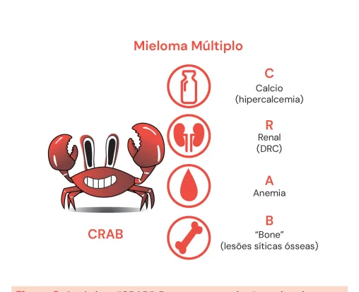
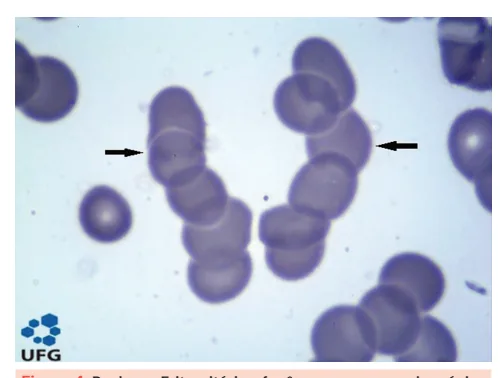
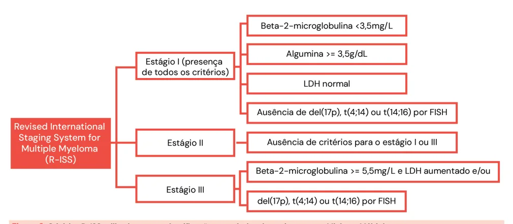
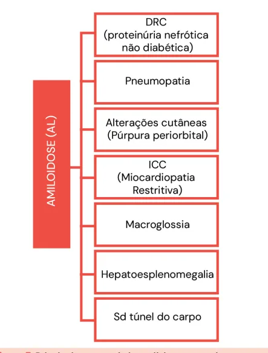
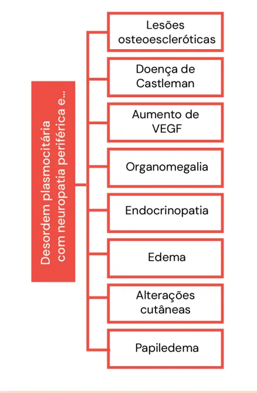
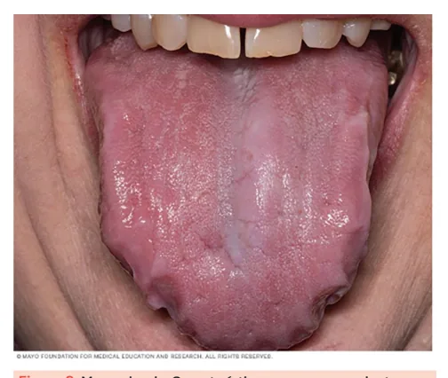

# Discrasias Plasmocitárias

<!-- page:1 -->

## Mieloma Múltiplo e Outras Discrasias Plasmocitárias

> ⚠️ Página reconstruída a partir de OCR de duas colunas intercaladas — confira contra a fonte original.

### Resumo Comparativo

- **Mieloma Múltiplo (MM)**: proliferação clonal de plasmócitos, levando à presença de pico monoclonal, IRC, hipercalcemia (IC), macroglossia, hepatoesplenomegalia, alterações neurológicas. Mais comum em idosos. Diagnóstico com eletroforese de proteínas (mais comum IgG). Anemia, hipercalcemia, lesões ósseas, injúria renal. Diagnóstico: pico monoclonal + CRAB + avaliação medular > 10% de plasmócitos clonais. Principal causa de óbitos: infecção.

- **MGUS ou GMSI (Gamopatia Monoclonal de Significado Indeterminado)**: assintomática e extremamente comum. Pico monoclonal < 3 g/dL; < 10% plasmócitos na MO; ausência de lesão de órgão-alvo.

- **Amiloidose de cadeias leves**: depósito de cadeias amiloides, mais comum com a cadeia LAMBDA. IRC, pneumopatia, alterações cutâneas, macroglossia, hepatoesplenomegalia, alterações neurológicas. Diagnóstico pode ser feito com biópsia de gordura abdominal.

- **Síndrome POEMS**: polineuropatia, organomegalia, endocrinopatia, monoclonal protein, skin changes.

- **Macroglobulinemia de Waldenström ou Linfoma Linfoplasmocítico IgM**: doença linfoproliferativa produtora de IgM monoclonal. Alto risco de síndrome de hiperviscosidade.

### Gamopatias Monoclonais (Paraproteinemias ou Disproteinemias)

- Grupo de distúrbios caracterizados pela proliferação clonal de plasmócitos → células B ultraespecializadas;
- Produção de proteína imunologicamente homogênea → disfuncional (**proteína M**): Ig secretada por um clone anormalmente expandido de células plasmáticas;
- A análise do soro é realizada por meio de técnicas eletroforéticas;
- Eletroforese de proteínas séricas → método de triagem;
- A prevalência de MGUS aumenta com a idade: > 50 anos — 3%; > 70 anos — 5%; > 85 anos — 7%.
- O aumento **policlonal** das imunoglobulinas é observado com um pico/banda de base larga;
- A **proteína M** se mostra como um pico de base estreita.

Figura 1: Eletroforese de proteínas demonstrando presença de pico monoclonal na região de gamaglobulinas. Observe que se trata de um pico de base estreita.

Figura 2: Eletroforese de proteínas com presença de aumento policlonal — pico ou banda de base ampla — em região de gamaglobulinas, sugestiva de proteína POLIclonal.

---

<!-- page:2 -->

## Gamopatias Policlonais

> ⚠️ Trecho reconstruído a partir de OCR (texto de duas colunas intercalado) — confira contra a fonte original.

- São frequentemente vistas em: infecções; processos inflamatórios reacionais; doenças autoimunes; hepatopatas.

## Gamopatia Monoclonal de Significado Incerto (GMSI)

- Discrasia plasmocitária pré-maligna;
- Composta por: pico monoclonal < 3 g/dL, < 10% de plasmócitos clonais da MO, ausência de sinais de lesões de órgão-alvo;
- É assintomática (por definição);
- O subtipo de cadeia envolvida mais comum é a IgG;
- Geralmente ocorre como "achado de exame";
- É considerada condição precursora de: mieloma múltiplo, amiloidose AL, doença linfoproliferativa (Macroglobulinemia de Waldenström);
- **Baixo risco de evolução**, podendo ser detectada muitos anos antes dessas condições; deve ser seguida pelo hematologista.

## Mieloma Múltiplo (MM)

- Neoplasia hematológica;
- Proliferação clonal de plasmócitos anômalos;
- Imunoglobulinas monoclonais disfuncionais;
- 1% de todos os cânceres e 10% dos hematológicos;
- Mais comum em homens e idosos, média de idade ao diagnóstico de 65–70 anos;
- 50% dos casos são da classe IgG;
- Aumenta risco de infecções, pelos clones disfuncionantes.

## Lesão de Órgão-Alvo (CRAB)

Figura 3: Acrônimo "CRAB". Representa os órgãos-alvo do Mieloma Múltiplo: **C**: cálcio (hipercalcemia → 28%); **R**: renal; **A**: anemia (→ 74%); **B**: "bone" — dor óssea (→ 58%), lesões líticas ósseas; injúria renal (→ 48%); perda ponderal (→ 25%). A presença de lesões que envolvem os órgãos-alvo no MM faz parte dos critérios diagnósticos da doença.

Figura 4: Rouleaux Eritrocitário — fenômeno em que as hemácias se aglutinam e perdem a capacidade de se repelirem.

**Por que as hemácias não se aglutinam em situações não patológicas?**

- Elas possuem uma carga negativa na membrana plasmática, chamada de **potencial ZETA**, que, com a deposição de imunoglobulinas, é perdida, fazendo com que as hemácias se aglutinem umas nas outras.

Figura 5: O potencial ZETA — presença e manutenção da carga negativa na superfície das hemácias, de forma que elas se repelem entre si e não se aglutinam em situações normais. Porém, a presença de imunoglobulinas na superfície da hemácia pode fazer com que ela perca a eletronegatividade, aproximando as hemácias umas das outras.

## Diagnóstico — Critérios Clínicos, Laboratoriais e de Imagem

> 10% de plasmócitos na biópsia de medula óssea ou plasmocitoma + um dos seguintes eventos:

**Lesão de Órgão-Alvo**

- Hipercalcemia (Ca total > 11 mg/dL);
- Injúria renal (Cr > 2 mg/dL ou ClCr < 40 mL/min);
- Anemia (Hb < 10 ou < 2 g/dL do LIN);
- Lesões ósseas (uma ou mais lesões osteolíticas em exame de imagem).

---

<!-- page:3 -->

Figura 6: Critérios R-ISS utilizados para a classificação prognóstica de pacientes com Mieloma Múltiplo.

## Um ou Mais dos Seguintes Marcadores

- Infiltração plasmocitária > 60% de plasmócitos clonais na MO;
- Relação cadeia leve acometida/não acometida > 100;
- Mais de 1 lesão focal > 5 mm na RMN.

## Estadiamento (R-ISS)

- **Estágio I**: β2-microglobulina < 3,5 mg/L; albumina > 3,5 g/dL; LDH normal; ausência de del(17p), t(4;14) ou t(14;16) por FISH.
- **Estágio II**: ausência de critérios para I ou III.
- **Estágio III**: β2-microglobulina ≥ 5,5 mg/L e LDH aumentado, OU del(17p), t(4;14) ou t(14;16) por FISH.

Confira na página anterior a Figura 6.

## Amiloidose de Cadeias Leves (AL)

> ⚠️ Trecho reconstruído a partir de OCR (texto de duas colunas intercalado) — confira contra a fonte original.

- Discrasia de células plasmocitárias;
- Envolvimento sistêmico, rápido e agressivo, ocorre em pacientes com MM;
- Geralmente homens (65%) e > 40 anos;
- A gravidade depende da deposição das cadeias amiloides em órgãos-alvo.

**Apresenta-se com**:

- DRC (proteinúria nefrótica não diabética);
- Pneumopatia;
- Alterações cutâneas (púrpura periorbital — "olhos de guaxinim");
- ICC (miocardiopatia restritiva);
- Macroglossia.

**Órgãos acometidos**

- **Rins**: proteinúria nefrótica (1/3 dos pacientes), DRC;
- **Coração**: 1/4 dos pacientes apresentam miocardiopatia restritiva, baixa voltagem no ECG, responsável por 50% dos óbitos dos pacientes com amiloidose;
- **Pulmão**: depósito de fibrilas amiloides ocorre em 90%, com dispneia progressiva;
- **Neurológico**: polineuropatia sensitiva e motora, disautonomia;
- **Hepatoesplenomegalia**;
- Síndrome do túnel do carpo;
- Gordura abdominal;
- Medula óssea;
- Outro órgão acometido.

Figura 7: Principais características clínicas em pacientes com Amiloidose AL.

- Diante da suspeita de amiloidose, devemos partir para a biópsia tecidual;
- As fibrilas amiloides são compostas de cadeia leve monoclonal, sendo a cadeia lambda muito mais comum.

Verificar Figuras 6 e 7.

---

<!-- page:4 -->

Figura 8: Macroglossia. Característica comum em pacientes com amiloidose AL.

## Diagnóstico (Critérios IMWG)

- Sinais e sintomas de depósito amiloide;
- Coloração amiloide positiva por **Vermelho do Congo** em qualquer tecido;
- Evidência de que o amiloide está relacionado à cadeia leve;
- Evidência de um distúrbio de células plasmocitárias monoclonais.

## Síndrome POEMS

- **POEMS**: polineuropatia, organomegalia, endocrinopatia, monoclonal protein, skin changes;
- Doença rara;
- Mais frequente após os 50 anos;
- Desordem plasmocitária;
- Deve ser especialmente suspeitada em pacientes que apresentam: neuropatia periférica, ascite refratária ou edema periférico, ginecomastia, organomegalia;
- Superprodução de citocinas pró-inflamatórias, em especial do **VEGF**.

Verificar Figura 9.

## Macroglobulinemia de Waldenström (MW)

- Desordem linfoproliferativa; acúmulo de imunoglobulina **IgM** monoclonal;
- Doença rara; idosos (média de 70 anos);
- Mais comum em homens;
- IgM monoclonal → pentâmero;
- **Síndrome de hiperviscosidade** → principal e mais temida complicação.

Figura 9: Alterações frequentemente encontradas em pacientes com Síndrome POEMS.

### Altos Níveis de IgM

- Ocorre em 30% dos pacientes;
- Emergência médica.

### Manifestações Clínicas

- Alterações visuais, cefaleia;
- Vertigem, nistagmo, zumbido, tontura, diplopia, ataxia;
- Descompensação de IC.

### Tratamento

- Se hiperviscosidade: plasmaférese; não iniciar o tratamento para Waldenström, pois o Rituximabe pode aumentar a quantidade de IgM (Flare);
- Tratamento da causa: Rituximabe com Bendamustina.

## Referências

Figura 4: Rouleaux Eritrocitário — fenômeno em que as hemácias se aglutinam e perdem a capacidade de se repelirem.

ATLAS EM HEMATOLOGIA. Rouleaux e o potencial zeta dos eritrócitos. **Atlas em Hematologia**, 2025. Disponível em: https://atlasemhematologia.com.br/celulas/rouleaux/. Acesso em: 28 jul. 2025.

Figura 8: Macroglossia. Característica comum em pacientes com amiloidose AL.

MAYO CLINIC. Enlarged tongue. **Mayo Clinic**, 2025. Disponível em: https://www.mayoclinic.org/diseases-conditions/amyloidosis/multimedia/enlarged-tongue/img-20008056. Acesso em: 28 jul. 2025.

