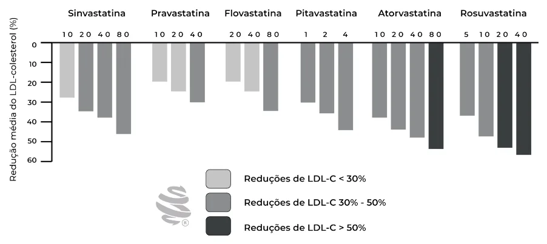
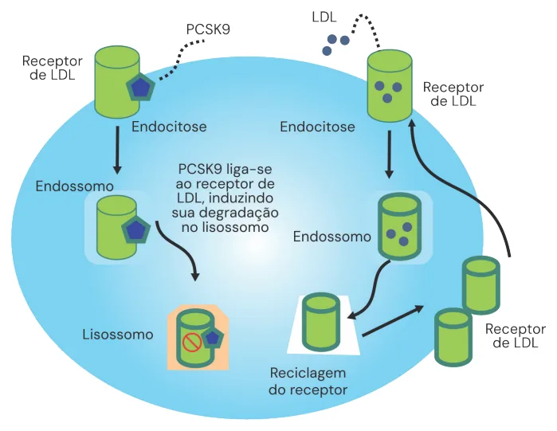
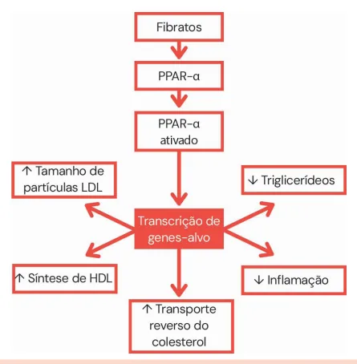

# Dislipidemias - Tratamento

<!-- page:1 -->

## Tratamento das Dislipidemias

### Tratamento Não Medicamentoso da Hipercolesterolemia

- Substituir ácidos graxos (AG) saturados por monoinsaturados.
- Excluir AG trans.
- Redução do consumo de colesterol (impacto pequeno).
- Redução ponderal.
- Exercícios aeróbicos 3 a 6 vezes/semana, com duração de 30 a 60 minutos (aumenta HDL, com pouco impacto no LDL).

### Estatinas

- Mecanismo: inibem a **HMG-CoA redutase**, reduzindo a conversão de Acetil-CoA em mevalonato e, consequentemente, a síntese de colesterol no hepatócito. Isso aumenta a atividade do receptor de LDL, elevando a captação de colesterol plasmático.
- **Primeira escolha no tratamento da hipercolesterolemia.**
- Redução de mortalidade por todas as causas, eventos isquêmicos coronarianos e AVC.

**Alta potência:**

- Sinvastatina 40mg + Ezetimibe 10mg.
- Rosuvastatina 20 ou 40mg.
- Atorvastatina 40 ou 80mg.

### Tratamento Medicamentoso da Hipercolesterolemia — Resumo por Classe

> ⚠️ Tabela reconstruída a partir de OCR — confira contra a fonte original.

| Classe | Mecanismo de ação | Efeito sobre LDL-c | Outros efeitos lipídicos | Efeitos adversos |
|---|---|---|---|---|
| Estatinas | Inibe HMG-CoA redutase; ↑ atividade do receptor de LDL | ↓ 30 a 55% | Redução mínima de VLDL-c; efeito mínimo no HDL-c | Mialgia, disfunção cognitiva, elevação da glicemia (efeito diabetogênico) |
| Ezetimibe | ↓ absorção de colesterol; ↑ atividade do receptor de LDL | ↓ 15 a 25% | Efeito mínimo no HDL-c | Raros |
| Inibidores da PCSK9 | Bloqueio dos efeitos da PCSK9 na destruição de receptores de LDL | ↓ 45 a 60% | — | Raros (reações no local de aplicação) |

### Estatinas — Eventos Adversos e Contraindicações

**Sintomas musculares associados às estatinas (SAMS):**

- Suspender estatina se: rabdomiólise; intolerância por dor muscular significante, independentemente do valor da CPK; elevação da CK >10 vezes o limite superior da normalidade (LSN).
- Reintrodução gradual após a reversão dos sintomas, com doses mais baixas de estatina associadas a ezetimibe.

**Hepatotoxicidade:**

- Suspender estatina se: icterícia, aumento de bilirrubina direta (BD) e tempo de protrombina (TP); indivíduos assintomáticos com transaminases >3x LSN.

**Efeito diabetogênico:** sob investigação.

**Contraindicações:**

- Gestantes/lactantes.
- Hepatopatias agudas.

---

<!-- page:2 -->

## Tratamento da Hipertrigliceridemia

### Medidas Não Farmacológicas

- Redução do consumo de bebidas alcoólicas.
- Redução do consumo de açúcar simples.
- Redução da ingesta de carboidrato.
- Substituir ácidos graxos saturados por mono e poli-insaturados.
- Exercícios aeróbicos.
- Redução do peso.

### Tratamento Medicamentoso da Hipertrigliceridemia

**Escolha: fibratos.**

- TGL ≥500 mg/dL → redução do risco de pancreatite.
- Demais indicações sem evidências robustas.

**Ômega 3:**

- 4g/dia.
- Ômega 3 + ácido nicotínico → terapia alternativa.
- Indicado quando: DCV estabelecida/DM + uso de estatina + TGL ≥150mg/dL + >2 fatores de risco para DCV.

**Ácido nicotínico:**

- Não reduz eventos CV.
- Muitos efeitos adversos.

> Obs.: a mudança de estilo de vida demonstra maior impacto em cenários de hipertrigliceridemia, visto que 80% da produção de colesterol é endógena, e somente 20% é dada através da dieta.

## Metas de Tratamento Baseadas na Estratificação de Risco

### Tabela 1: Meta de Tratamento da Hipercolesterolemia

> ⚠️ Tabela reconstruída a partir de OCR — confira contra a fonte original.

| Risco | Meta primária (redução %) | Meta primária (LDL-c) | Meta coprimária (não-HDL) |
|---|---|---|---|
| Extremo | — | <40 mg/dL | <70 mg/dL |
| Muito alto | ≥50% | <50 mg/dL | <80 mg/dL |
| Alto | — | <70 mg/dL | <100 mg/dL |
| Intermediário | ≥30% | <100 mg/dL | <130 mg/dL |
| Baixo | — | <115 mg/dL | <145 mg/dL |

## Tratamento das Hipercolesterolemias

### Tratamento Não Farmacológico (Mudanças de Estilo de Vida — MEV)

**Dieta:**

- Abordagem qualitativa, e não quantitativa, de macronutrientes.
- Mínimo de alimentos processados, ricos em fibras.
- Redução do consumo de açúcares adicionados e carboidratos refinados.
- Substituir ácidos graxos saturados por insaturados: azeite de oliva e abacate; peixes gordurosos e sementes de linhaça.
- Excluir ácidos graxos trans.
- Redução alimentar de consumo de colesterol: tem impacto pequeno.

**Outras medidas:**

- Cessação do tabagismo.
- Perda ponderal.
- Pelo menos 150 min/semana de atividade física aeróbica de intensidade moderada, ou 75 min de atividade vigorosa, podendo se beneficiar de períodos de atividade moderada/intensa.

> **ATENÇÃO:** tais medidas favorecem o aumento dos níveis de HDL, contudo têm pouco impacto no LDL.

### Tratamento Farmacológico — Recomendações

Em 2025 tivemos uma importante atualização na diretriz brasileira de dislipidemias, tendo como principais recomendações:

- **Estatina:** primeira opção de tratamento. Meta de redução de LDL-c ≥50% (risco alto, muito alto e extremo).
- **Estatina + ezetimiba:** alternativa à estatina de alta potência.
- **Metas não atingidas:** associar ezetimiba à estatina, ou terapia anti-PCSK9.
  - Alternativa à terapia anti-PCSK9: inclisirana.
- **Intolerantes a estatinas** que não atingem o alvo mesmo com ezetimiba: associar ácido bempedoico.

## Estatinas

### Visão Geral

- São as medicações de escolha para tratar dislipidemia.
- Demonstram redução de mortalidade por todas as causas, eventos isquêmicos coronarianos e AVC.

---

<!-- page:3 -->

- Atuam pela inibição da enzima **HMG-CoA redutase** (enzima que participa da síntese do colesterol intracelular), gerando redução da produção do colesterol endógeno e diminuindo seus níveis na corrente sanguínea, o que favorece maior expressão do receptor de LDL pelo hepatócito, contribuindo também para redução do colesterol sérico.

- Verificar Figura 1.

*Figura 1: Potência das Estatinas (alta potência = cinza escuro; média potência = cinza; baixa potência = cinza claro).*

### Efeitos Adversos das Estatinas

**Efeito diabetogênico:**

- Estudos inconclusivos.
- Em geral, relacionado a indivíduos com risco elevado para diabetes ou pré-diabetes, com uso de doses elevadas de estatinas.

**Sintomas musculares associados às estatinas (SAMS):**

- Mialgias, fraqueza e cãibras (mais comuns); miosite, hepatite e rabdomiólise (graves e raros).
- Há menor risco com rosuvastatina, pitavastatina, fluvastatina e pravastatina.
- **Fatores de risco para SAMS:** disfunção hepática ou renal; hipotireoidismo; diabetes mellitus; deficiência de vitamina D; idade avançada; alcoolismo; doses elevadas de estatina; uso de medicamentos que inibem o CYP3A4 ou CYP2C9*; uso concomitante de ácido nicotínico e fibratos (genfibrozila).

*\*Medicações que inibem CYP3A4 ou CYP2C9: claritromicina, ciclosporina, inibidores de protease (IPs), fluconazol, fluoxetina, verapamil, tacrolimo.*

- **Suspender** se: rabdomiólise; intolerância por dor muscular significante, independentemente do valor da CPK; elevação da CPK >10x LSN.
- A reintrodução deve ser gradual, em doses baixas e associadas a outros fármacos (ezetimibe ou fitosteróis), quando o paciente estiver assintomático e com CPK normal.
- **Quando solicitar CPK:** início de tratamento; ao elevar a dose da estatina; na presença de sintomas musculares; na introdução de fármacos que interagem.

**Hepatotoxicidade:**

- Suspender estatinas se: icterícia; aumento da bilirrubina direta (BD) e tempo de protrombina; indivíduos assintomáticos com níveis de transaminases >3x LSN (limite superior da normalidade).
- **Quando solicitar transaminases:** início da terapia; na presença de sintomas ou sinais sugestivos de hepatotoxicidade.

### Contraindicações

- Mulheres grávidas ou em amamentação.
- Hepatopatias agudas (entretanto, podem ser manejadas na doença hepática crônica ou DHGNA).

## Ezetimibe

### Visão Geral

- Atua inibindo a proteína de Niemann-Pick C1-like 1: tal enzima favorece a absorção intestinal de cerca de 50% do colesterol entérico.
- Há redução da reabsorção intestinal de colesterol: aumento da expressão do receptor LDLr e redução do LDL-c circulante.

### Indicações

- Estatina + ezetimiba como alternativa à estatina de alta potência nos pacientes com meta de LDL-c ≥50% (extremo, muito alto e alto risco).
- Quando a meta não é atingida somente pela estatina.

## Terapia Anti-PCSK9

### Visão Geral

- PCSK9 é uma proteína que se liga ao receptor de LDL e bloqueia sua expressão efetiva na membrana do hepatócito. Assim, ao inibir tal proteína, tem-se mais receptores livres e, consequentemente, é favorecida uma maior captação do LDL circulante.
- **Efeitos adversos:** hepatotoxicidade.

- Verificar Figura 2 na próxima página.

---

<!-- page:4 -->

*Figura 2: Mecanismo de ação dos inibidores da PCSK9.*

- Os anticorpos monoclonais foram a primeira classe de fármacos a reduzir drasticamente os níveis de LDL-c em usuários de estatinas, aplicados de forma subcutânea a cada 2 a 4 semanas: **evolocumabe** e **alirocumabe**.
- A **inclisirana**, um siRNA (RNA interferente pequeno de fita dupla) que inibe a produção da PCSK9, é uma opção de melhor facilidade posológica, com administração a cada 6 meses, de forma subcutânea.

### Indicações

- Pacientes com risco cardiovascular elevado, em uso de estatinas (em dose otimizada), com ou sem associação com ezetimiba, que ainda assim não atingem o alvo terapêutico.
- Intolerantes às estatinas.

## Ácido Bempedoico

### Visão Geral

- Medicamento oral da categoria dos inibidores da ATP-citrato liase hepática (ACL).
- Inibe a biossíntese do colesterol, atuando de maneira semelhante às estatinas, mas em uma etapa metabólica anterior no processo.

### Indicações

- Intolerância às estatinas, ou pacientes que não atingem o alvo mesmo com a associação das estatinas com ezetimiba.

### Tabela 2: Resumo das Medicações para Tratamento da Hipercolesterolemia

> ⚠️ Tabela reconstruída a partir de OCR — confira contra a fonte original.

| Classe | Mecanismo | Efeitos sobre os lipídios plasmáticos | Redução de LDL-c | Efeitos adversos |
|---|---|---|---|---|
| Estatinas | Inibe HMG-CoA redutase; ↑ atividade do receptor de LDL | ↓ LDL-c e VLDL-c; efeito mínimo sob HDL-c | 30-55% | Mialgia, disfunção cognitiva, elevação glicêmica (efeito dose-dependente) |
| Ezetimibe | ↓ absorção do colesterol; ↑ atividade do receptor de LDL | ↓ LDL-c e VLDL-c; efeito mínimo sob HDL-c | 15-25% | Raros |
| Inibidores da PCSK9 | Bloqueio dos efeitos da PCSK9 na destruição dos receptores de LDL | ↓ LDL-c | 45-60% | Raros (reações de hipersensibilidade na aplicação) |
| Ácido Bempedoico | Inibição da ATP-citrato liase hepática (ACL) | ↓ LDL-c | 30-55% | Hiperuricemia, ruptura tendínea |

---

<!-- page:5 -->

## Tratamento das Hipertrigliceridemias

### Fibratos — Ação

Ver mecanismo na Figura 3.

### Tratamento Não Farmacológico

#### Tabela 3: Impacto do Tratamento Não Farmacológico na Hipertrigliceridemia

> ⚠️ Tabela reconstruída a partir de OCR — confira contra a fonte original.

| Intervenção | Magnitude de impacto |
|---|---|
| Redução do peso | +++ |
| Redução do consumo de bebidas alcoólicas | +++ |
| Redução do consumo de açúcar simples | +++ |
| Redução da ingestão de carboidrato | ++ |
| Substituição dos ácidos graxos saturados por mono e poli-insaturados | ++ |
| Aumento da atividade física (aeróbios) | ++ |

### Tratamento Farmacológico — Recomendações

- Em indivíduos com hipertrigliceridemia (≥150 mg/dL) em que a terapia hipolipemiante é indicada para redução de risco cardiovascular, recomenda-se a favor das estatinas como terapia de escolha.
- Em indivíduos com triglicérides ≥500 mg/dL de forma persistente, a despeito de medidas de estilo de vida, recomenda-se a favor do uso de fibrato para reduzir o risco de pancreatite.
- Em indivíduos com triglicérides entre 150 e 499 mg/dL que possuem DCVA ou alto risco cardiovascular, recomenda-se a favor de icosapenta etila (Ômega 3, 3-4 g/dia) para reduzir a incidência de eventos cardiovasculares maiores, embora não esteja disponível no Brasil.

**Resumindo:**

- Medicação de escolha: fibratos.
- Indicação para iniciar medicação: TG ≥500 mg/dL.
- Objetivo: reduzir risco de pancreatite.

> Obs.: em outros contextos clínicos, o uso de fibrato não reduziu eventos cardiovasculares a despeito da redução dos triglicérides.

*Figura 3: Mecanismo de ação dos fibratos.*

**Efeitos adversos:** náuseas, diarreia, redução da libido, dores musculares, astenia, erupção cutânea, prurido, cefaleia e insônia (geralmente transitórios e leves).

**Outros efeitos:** colestase e elevação discreta das transaminases; hepatite tóxica; rabdomiólise.

## Ômega-3

- Derivado dos ácidos eicosapentaenoico (EPA) e docosahexaenoico (DHA).
- Atua na redução da síntese hepática de VLDL, reduzindo assim os TG.
- Terapia adjunta para redução do risco cardiovascular: TG ≥150 mg/dL + uso de estatina + DCV estabelecida/DM + mais de 2 fatores de risco para DCV.
- Estudos com dose de 4 g/dia mostram redução de 20-30% nos valores de TG; começar com dose inicial de 1 g/dia.

## Referências

Tabela 2: Resumo das medicações utilizadas para tratamento da hipercolesterolemia. Adaptado de Vilar, Lucio [et al]. Endocrinologia Clínica. 6ª edição. Rio de Janeiro: Guanabara Koogan, 2016.

