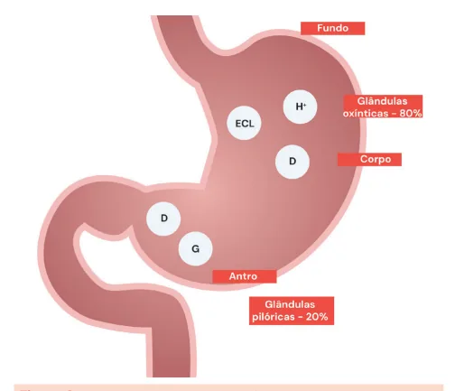
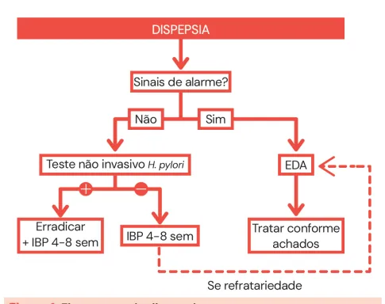
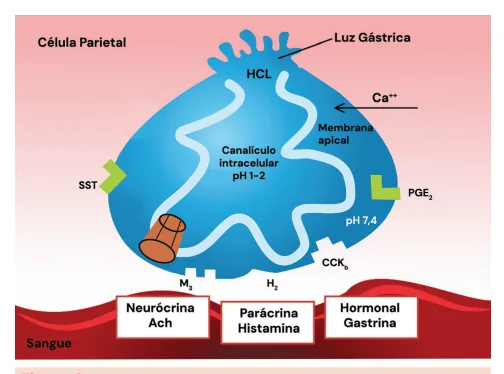
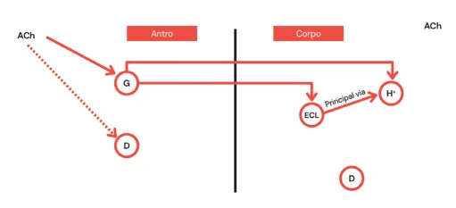
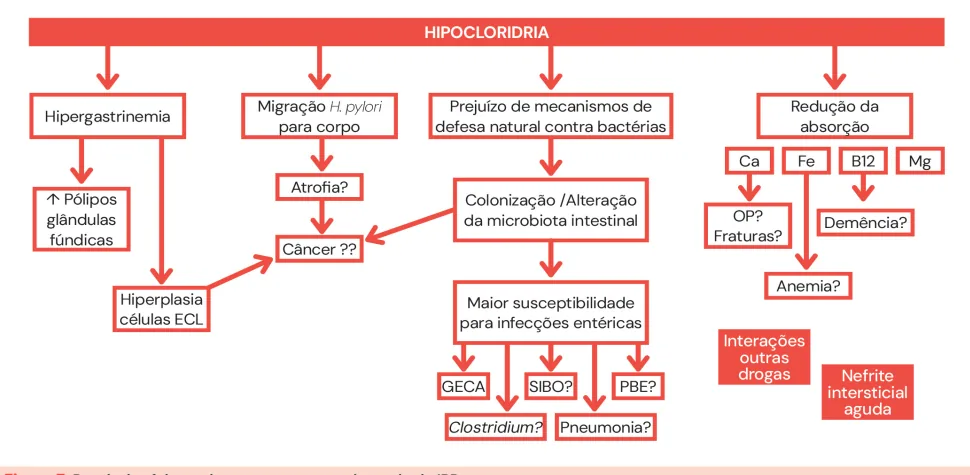

# Dispepsia

<!-- page:1 -->

## Resumo

**Dispepsia (Clínica Médica) / IBPs (Clínica Médica)**

**Sinais de alarme:**

- Idade > 40-60 anos [50];
- História familiar de câncer gástrico (parente de 1º grau);
- Disfagia;
- Vômitos recorrentes;
- Massa abdominal;
- Anemia;
- Sangramento;
- Perda ponderal.

**Fluxograma:** Sinais de alarme? Não → teste não invasivo para H. pylori → se positivo, erradicar + IBP por 4-8 semanas; se negativo, IBP por 4-8 semanas → se refratariedade, EDA. Sim → EDA → tratar conforme achados.

**Fisiologia gástrica (resumo):**

- Antro: células G (produzem gastrina); células D (produzem somatostatina);
- Corpo: células parietais (secretoras de ácido); ECL (produzem histamina); células D;
- Produção de ácido pelas células parietais: gastrina, histamina e ACh estimulam; somatostatina inibe.

**Antiácidos:**

- Anti-H2: bloqueiam receptores de histamina;
- IBP: bloqueiam a bomba de prótons (troca H+ por K+);
- PCAB (vonoprazan): competição com K+ luminal (não troca K por H+).

**Uso prolongado de IBP (> 1 ano):**

- Aumenta pólipos de glândulas fúndicas;
- Possível redução da absorção de: cálcio (osteoporose?); ferro (anemia?); vitamina B12 (demência?); magnésio;
- Aumento do risco de GECA, SIBO, clostridium, PBE, pneumonia/NIA;
- Interações medicamentosas (citocromo P450);
- Associação controversa com câncer gástrico.

## Conceitos Gerais

- Vários sintomas associados à má digestão: dor epigástrica; plenitude pós-prandial; náuseas e vômitos; pirose.

## Etiologias

- As etiologias são múltiplas, sendo a **dispepsia funcional** uma das mais importantes. Com uma boa anamnese, é possível identificar um possível agente causal.

Tabela 1: Etiologias de dispepsia.

> ⚠️ Tabela reconstruída a partir de OCR — confira contra a fonte original.

- H. pylori;
- Funcional;
- Úlcera;
- Biliar;
- Parasitoses;
- Intolerâncias;
- Gastroparesia;
- Neoplasias;
- Pancreatite (crônica);
- Medicamentosos;
- Doença do Refluxo Gastroesofágico (DRGE).

---

<!-- page:2 -->

## Abordagem

- O primeiro passo é identificar se há **sinais de alarme**:
  - Idade > 40-60 anos [50] (na maior parte das referências, > 50 anos; Consenso Brasileiro de H. pylori 2018: > 40 anos);
  - História familiar de câncer gástrico (parente de 1º grau);
  - Disfagia;
  - Vômitos recorrentes;
  - Massa abdominal;
  - Anemia;
  - Sangramento;
  - Perda ponderal.
- Se positivo(s), há indicação de **endoscopia digestiva alta (EDA)**;
- Se negativos, há indicação de teste não invasivo para **H. pylori**: teste respiratório ou antígeno fecal (exames pouco disponíveis):
  - Se H. pylori positivo: erradicar e iniciar inibidor de bomba de prótons (IBP) por 4-8 semanas;
  - Se H. pylori negativo: iniciar IBP por 4 a 8 semanas;
  - Se refratário ao IBP, avaliar com EDA.

Figura 1: Fluxograma de dispepsia.

> **Atenção**: os IBPs são os medicamentos de escolha, pois a maior parte das queixas dispépticas resulta do desbalanço entre ↓ fatores protetores da mucosa e ↑ acidez.

## Fisiologia Gástrica

- Dividimos o estômago em: fundo; corpo; antro;
- Em cada uma dessas regiões, há predominância de células especializadas.

**Corpo e fundo gástrico:**

- Presença das glândulas oxínticas (70% das glândulas do estômago);
- Responsáveis pela produção de suco gástrico (cerca de 2,5-3,0 L/dia): dos quais 70 a 80% são de ácido clorídrico;
- Células parietais: secretoras de ácido (H+);
- Células enterocromafins-like (ECL): produtoras, principalmente, de histamina.

**Antro:**

- Presença das glândulas pilóricas (30% das glândulas do estômago);
- Células D: produtoras de somatostatina (feedback negativo para a secreção gástrica);
- Células G: produtoras de gastrina.

Figura 2: Topografia das principais células envolvidas na secreção.

## Etapas da Digestão

**Fase Cefálica**

- Ocorre desde o desejo por determinado alimento (80% por via vagal);
- O estímulo à atividade da célula G ocorre pelo neuroestímulo via acetilcolina (ACh);
- Nesse sentido, também há inibição das células D.

Figura 3: Fase cefálica da digestão.

**Fase Gástrica**

- Ocorre distensão do antro e elevação do pH;
- Também ocorrem o estímulo das células G para a produção de gastrina e a inibição das células D:
  - A produção de gastrina tem efeito direto na célula parietal, favorecendo a hipertrofia e a produção ácida;
  - Além disso, a gastrina estimula as ECL a produzirem histamina — principal via de estimulação das células parietais.

---

<!-- page:3 -->

- Por fim, também há uma via vagal com ação direta da acetilcolina sobre as células parietais.

Figura 4: Fase gástrica da digestão.

- A partir do momento em que o alimento sai do estômago:
  - Menor distensão do antro;
  - Queda do pH: menor estímulo das células G; cessação do feedback negativo para as células D → leva à maior produção de somatostatina no antro e no corpo gástrico;
  - A somatostatina inibe as células G, as células parietais e as ECL;
  - Observa-se uma redução da produção gástrica.

**Fase Intestinal**

- O ácido estomacal favorece o estímulo às enterogastronas: secretina, CCK, GIP, VIP, PYY;
- Tais neuropeptídeos afetam a secreção gástrica e a motilidade;
- É uma fase de feedback negativo.

Figura 5: Fase intestinal da digestão, com feedback negativo.

## Célula Parietal

- Canais que trocam cloreto e HCO3-: favorecem a manutenção da homeostase do pH;
- Canais de K+;
- Bombas de prótons, dependentes de ATP: H+ entra para o lúmen e K+ entra para o intracelular;
- Canais de íon cloreto: trocam Cl- para formar o HCl no lúmen.

Figura 6: Célula parietal e principais vias de estímulo.

## Farmacologia e Fisiologia (Antiácidos)

- Podemos bloquear a secreção ácida farmacologicamente:
  - A bomba de prótons: inibidores da bomba de prótons (IBPs);
  - Os receptores de histamina: anti-histamínicos, não tão potentes quanto os IBPs e sujeitos a taquifilaxia;
  - O transporte de K+: bloqueadores ácidos competitivos de potássio (PCABs) — vonoprazana 10 e 20 mg. Em teoria, apresenta maior duração do bloqueio ácido; não sofre metabolização pelo citocromo P450; não depende da manutenção do jejum para melhor ação terapêutica.

## Inibidores da Bomba de Prótons

- Existem diversas opções de IBPs, que diferem em: biodisponibilidade; pico plasmático; rota de excreção;
- A relevância clínica destas diferenças não está estabelecida.

Tabela 2: Principais opções de IBPs e doses.

> ⚠️ Tabela reconstruída a partir de OCR — confira contra a fonte original.

| Medicação | Dose padrão (plena) |
|---|---|
| Omeprazol | 20-40 mg/dia |
| Pantoprazol | 40 mg/dia |
| Rabeprazol | 20 mg/dia |
| Esomeprazol | 20-40 mg/dia |
| Lansoprazol | 30 mg/dia |
| Dexlansoprazol | 30-60 mg/dia |

---

<!-- page:4 -->

## Malefícios dos IBPs

- Uso contínuo de IBP: uso diário por tempo > 1 ano (efeitos de longo prazo);
- O IBP é metabolizado pelo citocromo P450, o que pode alterar a ação de outras medicações que são metabolizadas pela mesma via;
- Apesar de haver risco teórico para alguns potenciais efeitos adversos associados, muitas condições clínicas relatadas são controversas e não apresentam correlação prática significativa.
- Na teoria, é resultante da hipocloridria crônica:
  - Hipergastrinemia;
  - Colonização/alteração da microbiota intestinal;
  - Redução da absorção de: cálcio; ferro; B12; magnésio.

Figura 7: Possíveis efeitos adversos com uso prolongado de IBP.

