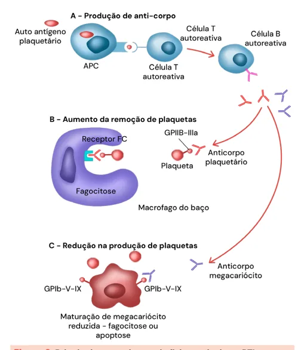

# Distúrbios da Hemostasia

<!-- page:1 -->

Distúrbios de Hemostasia (CM) Púrpura Trombocitopênica Imune (PTI) (CM) Coagulação Intravascular Disseminada (CIVD) (CM)

## ABORDAGEM DA PLAQUETOPENIA

- Doença de Von Willebrand

- Há sangramento ou história familiar? | Distúrbio de coagulação mais comum Se não: Suspeitar de Pseudoplaquetopenia e na população solicitar contagem em citrato | Sangramentos mucocutâneos, hipermenorréia, Se sim: Provável plaquetopenia verdadeira sangramentos aumentados em procedimentos

- Principais causas de plaquetopenia verdadeira | História familiar importante na população

- Suspeita laboratorial

1. Aumento da destruição (causas imunes x | Alteração discreta do TTPa (Diminuição do

não imunes) Fator VIII)

2. Diminuição da produção (problemas

- Tratamento medulares primários) | Transamin e DDAVP

3. Sequestro e hemodiluição (esplenomegalia, | Reposição de FvW em vigência de sangramentos

gravidez, politraumas) ou periprocedimentos

- Púrpura Trombocitopênica Imune

- Hemofilias Diagnóstico é de exclusão | Deficiência congênita de Fator VIII (A) ou Primária x Secundária Fator IX (B) Tratamento em primeira linha: Corticoterapia

- Suspeita clínico-laboratorial Tratamento na urgência: Imunoglobulina | Sangramentos de hemostasia secundária associado ou não a transfusão de plaquetas (articulações), História Familiar positiva e Tratamento em segunda linha: Eltrombopag, TTPa alterado que se corrige com teste da

Esplenectomia e Rituximabe mistura a 50% DISTÚRBIOS DA HEMOSTASIA SECUNDÁRIA

- Diagnóstico

- Como abordar as alterações de TP e TTPa? | Dosagem de fator de coagulação (VIII ou IX) Teste da mistura a 50%!

- Tratamento A correção implica em suspeita de deficiência | Reposição de fatores em sangramentos de fatores da coagulação ou periprocedimentos A não correção implica em suspeita de | Reposição de fator profilático em pacientes anticorpos contra os fatores de coagulação de fenótipo grave

## PLAQUETOPENIA

- Dilucional: edema; gestação.

- Diante de um paciente com plaquetopenia, é

- Cerca de 33% das consultas com o hematologista são importante pesquisar passado de sangramento ou por tal quadro; história familiar positiva;

- Entre 5–10% de todos os pacientes hospitalizados | Sim? Provável plaquetopenia verdadeira; Em cenário de terapia intensiva, a taxa hematoscopia; solicitar novo com anticoagulante pode alcançar 35%. não-EDTA → citrato.

desenvolverão plaquetopenia. | Não? Suspeitar de pseudoplaquetopenia:

- Pseudoplaquetopenia:

MEDIANTE TAL QUADRO, É PRECISO | Responsável por 15% das plaquetopenias → ocorre

- Excluir emergências; em decorrência da formação dos agregados

- Avaliar o grau da plaquetopenia; plaquetários; Figura 1

- Considerar exposições e contexto clínico do paciente;

- Assim, há formação do anticorpo anti-EDTA → induzem

- Determinar o tempo de evolução; a agregação plaquetária. De tal modo, deve haver

- Avaliar sintomas associados; recoleta no citrato.

- Hematoscopia → avaliar grumos plaquetários.

## ETIOLOGIAS

## MECANISMOS ETIOLÓGICOS

- Induzida por drogas: heparina; quininas; paracetamol;

- Deficiência na produção: insuficiência medular; cimetidina, ranitidina; AINE → ibuprofeno, neoplasias; medicamentos; infecções virais; naproxenol; ampicilina, piperacilina; ceftriaxona;

doença hepática; vancomicina; inibidores de calcineurina – Tacrolimo;

- Aumento na destruição; PTI; HIT; CIVD; PTT; anticonvulsivantes – carbamazepina, fenitoína,

Síndrome HELLP; ácido valpróico.

- Sequestro esplênico: esplenomegalia;

- Infecções: hepatites; H. pylori; síndrome mono-like; HIV;

- Pseudoplaquetopenia: pela formação de anticorpos

- Doenças autoimunes.

anti-EDTA;

---

<!-- page:2 -->

- É uma doença de exclusão; Avaliação medular não é necessária → apenas se houver outras suspeitas melhores.

- Investigação para HCV e HIV são recomendadas para todos os pacientes;

- Figura 1: Hematoscopia demonstrando presença de grumo plaquetário. Característico de pseudoplaquetopenia.

## PÚRPURA TROMBOCITOPÊNICA

## IMUNOLÓGICA (PTI)

- É uma doença que se caracteriza pela presença de sangramentos mucocutâneos; Gengivorragia; Epistaxe; Equimoses; Petéquias.

- É um diagnóstico de exclusão;

- Não há alteração de hemácias e leucócitos;

- Epidemiologia: Incidência: 1,6–3,9/100.000 pessoas/ano; Acomete indivíduos de todas as idades. Em adultos jovens, é 2 vezes mais comum entre as mulheres.

Na população idosa e em crianças, o acometimento é similar. Nas crianças, 80% dos casos são autolimitados. Nos adultos, 80% dos casos se tornam uma doença crônica.

- Fisiopatologia:

- - - Figura 2: Principais mecanismos de fisiopatologia na PTI todos os pacientes;

A. pylori se sintomas do TGI ou área endêmica.

- Classificação do PTI; Primária ou secundária; Por temporalidade: duração ≤ 3 meses; recém diagnosticada, é mais comum em crianças; Duração: entre 3–12 meses; forma persistente; Duração > 12 meses; forma crônica; é a forma mais comum no adulto; Remissão/recaída; é a segunda forma mais comum no adulto.

autolimitada; anticorpo com ação cruzada.

## TRATAMENTO

- Verificar Figura 3 na próxima página

- 1ª linha: Indicado em cenários com plaquetas < 30 mil ou na presença de sangramentos; Corticoide: prednisona 0,5 – 2 mg/kg/dia OU dexametasona 40 mg/dia, por 4 dias. A resposta ocorre em 3-4 dias; Imunoglobulina humana: IVIG 0,8 – 1 mg/kg/ dia, EV, em dose única; demonstra resposta dm IVIG → reservado, de modo geral, para pacientes com sangramentos extensos e ameaçadores à vida.

24-48 horas;

- 2ª linha; Composto por: Eltrombopag, rituximab ou esplenectomia. São terapias equivalentes entre si.

## DOENÇA DE VON WILLEBRAND

- É a desordem hemorrágica hereditária mais comum;

- Decorre da redução da quantidade ou da qualidade do O FvW apresenta funções de: proteção do FVIII – mantém os níveis adequados; ativação plaquetária; Assim, é evidenciado pela manifestação de sangramentos mucocutâneos.

Fator de Von Willebrand (FvW). adesão plaquetária

- Observa-se o rTTPa discretamente prolongado (pela alteração do FVIII);

- Classificação: Tipo 1: deficiência parcial mais comum – cerca de 60-80%; Tipo 2: deficiência qualitativa; Tipo 3: deficiência total.

OBS.: os tipos 1 e 3 são defeitos quantitativos, enquanto o tipo 2 é qualitativo.

---

<!-- page:3 -->

PTI com sangramento

1. Avaliar local de sangramento e gravidade

2. Plaquetometria

3. Outros FR para sangramentos envolvidos

3. Outros FR para sangramentos envolvidos

Sangramento Crítico Sangrame (geralmente plaquetas (geralmen < 20 mil/mm3) < 20 m Tratamento Trata imediato urg Transfusão de plaquetas + imunoglobulina + Corticoide Figura 3: Manejo de pacientes com PTI e sangramento MANIFESTAÇÕES CLÍNICAS:

- Sangramentos mucocutâneos

- Hipermenorreia em mulheres;

- Exacerbação de sangramentos em procedimentos;

- Apresenta relação com história familiar.

## EXAMES LABORATORIAIS

- Plaquetas normais, ou pouco diminuídas;

- TP normal;

- TTPA discretamente prolongado;

- Redução do FvW.

- Desmopressina;

- Reposição do FvW.

## TROMBOCITOPENIA INDUZIDA

## POR HEPARINA - HIT

- Costuma ocorrer mais frequentemente entre 5-14 dias após o início da exposição à heparina; Ocorre no 1° dia se o paciente já tiver sido exposto nos últimos 30 dias. A exposição pode ser, inclusive, por heparina profilática, ainda que de cateteres.

- A plaquetopenia associada ao uso da heparina é desencadeada pela formação de anticorpo contra o complexo PF4-heparina; Tem um efeito adverso pró-trombótico relacionado ao uso de heparina → eventos tromboembólicos; Trombose; ativação plaquetária, endotelial, partículas pró-coagulantes, estado inflamatório; Plaquetopenia; consumo e remoção SRE.

- 50% dos pacientes têm apresentação com eventos trombóticos; Os eventos venosos são mais frequentes; É indicado o screening com Doppler dos membros e de catéteres; ento Severo Sangramento Menor nte plaquetas (geralmente plaquetas mil/mm3) < 20 mil/mm3) amento gente Deve-se manter a anticoagulação plena sem derivados de heparinas: DOACs; Fondaparinux;

Tratamento Imunoglobulina + Corticoide ou Corticoide imunoglobulina argatroban; bivalirudina.

- Tem alta incidência em pacientes com exposição frequente a heparina; Especialmente, em doses baixas e do tipo HNF.

- Apesar da plaquetopenia, os episódios de trombose são mais frequentes do que os de sangramentos;

- Escore 4T: 0-3 pontos → probabilidade baixa; 4-5 pontos → probabilidade intermediária; 6-8 pontos → probabilidade alta. Verificar Tabela 1 na próxima página

## DISTÚRBIOS DA

## HEMOSTASIA SECUNDÁRIA

## HEMOFILIAS

Considerações importantes

- Deficiência ou anormalidade da atividade coagulante do fator VIII (tipo A), fator IX (tipo B) e fator XI (tipo C);

- Doença hemorrágica hereditária ligada ao cromossomo X; hemofilias A e B; hemofilia C: herança

, autossômica recessiva;

- Deficiências adquiridas dos fatores → mais comumente FVIII;

- Presença de inibidores → auto-anticorpos.

Epidemiologia

- Mais de 1,2 milhões de pessoas no mundo (H > M);

- Hemofilia A representa cerca de 80% dos casos. Mais comum e mais severa!

- Prevalência: Hemofilia A: 1 a cada 40.000-50.000/nascimentos. Hemofilia B: 1 a cada 15.000-30.000/nascimentos.

Cerca de metade dos pacientes terão a forma severa da doença; Cerca de 1/3 terão a forma severa.

- Mutação nova: hemofilia A → 55% dos casos; hemofilia

B → 43% dos casos.

---

<!-- page:4 -->

Tabela 1: Tabela demonstrando escore 4T’s para aplicar em pacientes com suspeita de HIT 4 T’s 2 pontos 1 ponto 0 ponto Queda de plaquetas > 50% Queda de plaquetas entre 30 – Queda de plaquetas de < Trombocitopenia e nadir ≥ 22.000 50% ou Nadir entre 10.000-19.000 30.000 ou Nadir < 10.000 Trombocitopenia e nadir ≥ 22.000 50% ou Consiste Claro início entre 5-14 dias dias d após início da heparina não clar Tempo para queda ou queda ≤ 1 dia naqueles plaquet das plaquetas pacientes com exposição ou ≤ 1 di nos últimos 30 dias expos Nova trombose Trom (confirmada); necrose recorre Trombose ou outra ou cutânea em sítio de necroti sequela injeção de heparina; reação sítios anafilactoide após bolus IV tro de heparina Outras causas de Nenhuma outra causa Possiv trombocitopenia Gravidade

- Leve: > 5-40% da atividade do fator;

- Moderada: ≥ 1-5% da atividade do fator;

- Severa: < 1% de atividade do fator; ocorrem sangramentos espontâneos e mais precoces.

Diagnóstico Hemofilia adquirida

- É uma condição rara, mais comum em idosos;

- Decorre da formação de autoanticorpos – FVIII é o mais comum;

- A suspeita ocorre mediante TTPa prolongado, que não se corrige no teste de mistura. Além disso, observamse hematomas espontâneos.

- Os sangramentos podem ser graves e com alta mortalidade;

- Epidemiologia: 40-50% dos casos são idiopáticos;

20% - neoplasias; 15% doenças autoimunes.

- Tratamento: imunossupressão.

## CIVD – COAGULAÇÃO INTRAVASCULAR

DISSEMINADA Considerações

- É uma coagulopatia extremamente grave; Pode cursar com: sepse; tromboses; hemorragias

- O manejo se dá através da correção do fator causal; se necessário, é possível a transfusão de PFC;

F Nadir entre 10.000-19.000 30.000 ou Nadir < 10.000 ente com queda entre 5-14 do início da heparina, mas ro (ex.: faltam dosagens de Queda de plaquetas ≤ tas), ou início após 14 dias 4 dias, em exposição ia naqueles pacientes com recente a heparina sição nos últimos 30-100 dias mbose progressiva ou ente; lesões cutâneas não izantes (eritematosas) em Nenhuma alteração s de injeção de heparina;

ombose suspeita (não confirmada) Definitivamente há outra velmente há outra causa causa

- Observam-se: aumento de: TP; TTPa; TT; Dímero-d.

Redução de: plaquetas; fibrinogênio; fator V e fator VIII. Sangramento fácil Confirmação pela após pequenos dosagem do fator traumas ou espontâneo HF (~30% dos Alargamento pacientes não do TTPa têm antecedente familiar)

Figura 4: Pontos principais relacionados com o diagnóstico de hemofilia

## REFERÊNCIAS

Figura 1: Hematoscopia demonstrando presença de grumo plaquetário. Característico de pseudoplaquetopenia.

Fonte: https://hematologia.farmacia.ufg.br/p/7065-agregacao-plaquetaria
