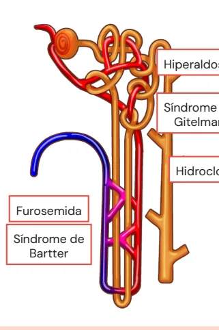
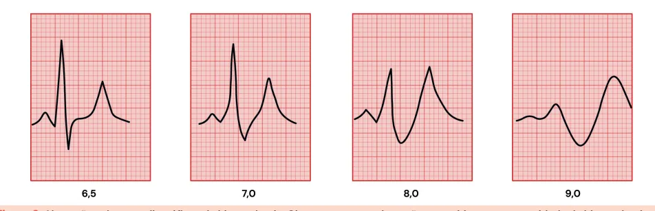

# Distúrbios do Potássio

<!-- page:1 -->

## Distúrbios Hidroeletrolíticos

### Hipocalemia

- **Leve**: K+ 3,1 a 3,5 mEq/L;
- **Moderada**: K+ 2,5 a 3,0 mEq/L;
- **Grave**: K+ < 2,5 mEq/L.

**Manifestações da hipocalemia**

- A onda T acompanha o K+!
- Achatamento da onda T, surgimento da onda U, depressão do segmento ST, alargamento do QRS;
- Fraqueza muscular, paralisia hipocalêmica periódica, íleo paralítico.

**Diagnóstico da hipocalemia**

- Potássio/creatinina urinária < 13 mEq/g: perda gastrointestinal; síndrome de realimentação; baixa ingesta;
- Potássio/creatinina urinária > 13 mEq/g: diuréticos tiazídicos e de alça; tubulopatias (Bartter, Gitelman, acidose tubular renal 1 e 2); hiperaldosteronismo/Liddle.

**Tratamento da hipocalemia**

- Hipocalemia grave (< 2,5 mEq/L): cloreto de potássio intravenoso; infusão lenta devido a risco de arritmia e PCR;
- Hipocalemia leve (> 2,5 mEq/L): reposição oral com sal de potássio.

## Hipercalemia

- **Leve**: K+ > 5,0 a 6,0 mEq/L;
- **Moderada**: K+ > 6,0 a < 6,5 mEq/L;
- **Grave**: K+ ≥ 6,5 mEq/L.

## Introdução

- O potássio é o íon mais importante do meio intracelular, responsável pela manutenção do potencial elétrico da membrana celular;
- Seu nível normal é entre 3,5 e 5 mEq/L no meio extracelular.

## Eletrofisiologia

- **Despolarização celular**: ocorre fluxo de K+ (saída da célula); modifica a carga da membrana e dispara o potencial de ação;
- **Repolarização**: depende da bomba Na+/K+-ATPase (transporte ativo: 2 K+ entram/3 Na+ saem, consumindo ATP); restabelece os gradientes iônicos e o potencial de repouso da célula.

**Manifestações da hipercalemia**

- A onda T acompanha o K+!
- Onda T apiculada, P achatada, PR prolongado, supradesnivelamento de ST, QRS alargado;
- Infusão de gluconato de cálcio 10% para estabilizar a membrana!

**Diagnóstico da hipercalemia**

- Insuficiência renal aguda e crônica;
- Acidose tubular renal tipo 4;
- Rabdomiólise, lise tumoral, hemólise;
- iECA/BRA;
- Espironolactona, amilorida;
- Hipoaldosteronismo;
- Insuficiência adrenal;
- Sulfametoxazol/trimetoprim;
- Acidose metabólica;
- Heparina, betabloqueador.

**Tratamento da hipercalemia**

- Gluconato de cálcio 10%;
- Influxo celular de potássio: insulina + glicose; beta-2 agonista;
- Retirada de potássio do corpo: furosemida; zircônio; diálise.

## Excreção Renal de Potássio

- A excreção de potássio ocorre principalmente no túbulo distal, regulada pela aldosterona:
  - Aldosterona estimula reabsorção de Na+ e secreção de K+/H+;
  - Aumento de sódio no túbulo distal (por uso de diuréticos) leva a mais secreção de potássio;
  - Alcalose também favorece perda de K+ (troca com H+).

---

<!-- page:2 -->

*Figura 1: Alterações eletrocardiográficas da hipocalemia. Observe como as alterações progridem com a gravidade da hipocalemia.*

## Hipocalemia

- **Leve**: K+ 3,1 a 3,5 mEq/L;
- **Moderada**: K+ 2,5 a 3,0 mEq/L;
- **Grave**: K+ < 2,5 mEq/L.

## Manifestações

Dependem do grau de hipocalemia e da velocidade de instalação!

- K+ > 3,0 mEq/L geralmente é assintomático;
- As principais manifestações da hipocalemia são as eletrocardiográficas:
  - K+ 2,8 mEq/L: diminuição de amplitude de onda T;
  - K+ 2,5 mEq/L: achatamento de onda T + surgimento da onda U;
  - K+ < 2 mEq/L: depressão do segmento ST, onda U superposta à onda T, alargamento do QRS;
  - Pode evoluir com taquicardia ventricular sem pulso, fibrilação ventricular e torsades de pointes.
- Verificar Figura 1;
- Fraqueza muscular e cãibras;
- Pode haver paralisia periódica hipocalêmica em pacientes com predisposição genética ou hipertireoidismo;
- Rabdomiólise, se hipocalemia grave;
- Diminuição da motilidade gastrointestinal (íleo paralítico).

## Determinando a Causa

**Avaliar a história clínica**

- Avaliar se há relato de:
  - Perdas gastrointestinais: vômitos, diarreia;
  - Baixa ingesta, síndrome de realimentação;
  - Perdas renais: diuréticos (furosemida, tiazídicos); anfotericina B, aminoglicosídeos (pode cursar com insuficiência renal aguda e hipocalemia); leptospirose (pode cursar com insuficiência renal aguda e hipocalemia); tubulopatias hereditárias (Bartter, Gitelman); acidose tubular renal do tipo 1 e 2; hiperaldosteronismo, síndrome de Liddle.

**Confirmar a perda renal**

- A perda renal de potássio é confirmada pela relação K+/creatinina urinária > 13 mEq/g. Se o diurético foi suspenso recentemente, a relação pode normalizar, mesmo que o distúrbio tenha sido induzido pela medicação!

**Explorando as causas de perda renal**

*Figura 2: Localização da ação dos diuréticos e defeitos tubulares no néfron (hiperaldosteronismo; furosemida — síndrome de Bartter; hidroclorotiazida — síndrome de Gitelman).*

- **Furosemida (diurético de alça)**: atua na alça de Henle, inibindo o cotransportador Na+/K+/2Cl-; maior quantidade de sódio chega ao túbulo distal e estimula a aldosterona, que promove excreção de K+ e H+; aumenta a excreção urinária de cálcio;
- **Síndrome de Bartter**: defeito genético que simula o efeito da furosemida; cursa com hipocalemia, alcalose metabólica, normotensão e calciúria normal ou aumentada;
- **Hidroclorotiazida (tiazídicos)**: atua no túbulo contorcido distal, inibindo o cotransportador Na+/Cl-; isso aumenta a entrega de sódio ao túbulo coletor, com maior troca por K+ e H+; diminui a excreção urinária de cálcio;
- **Síndrome de Gitelman**: defeito hereditário semelhante ao efeito dos tiazídicos; caracteriza-se por hipocalemia, alcalose metabólica, normotensão e calciúria diminuída.

Para diferenciar síndrome de Bartter e Gitelman, dosa-se o cálcio urinário. A calciúria no Bartter é normal ou aumentada e no Gitelman, diminuída (< 100 mg/dia, às vezes < 50 mg/dia).

---

<!-- page:3 -->

- **Hiperaldosteronismo primário**: aumenta reabsorção de sódio no túbulo coletor e secreção de K+ e H+; quadro de hipertensão + hipocalemia + alcalose metabólica; tratamento com espironolactona (antagonista da aldosterona);
- **Síndrome de Liddle**: "pseudoaldosteronismo"; mutação em canais epiteliais de sódio sensíveis à amilorida (ENaC); reabsorção exagerada de Na+, perda de K+ e H+; quadro de hipertensão + hipocalemia + alcalose, mas com aldosterona e renina baixas; tratamento com amilorida (bloqueia ENaC).

### Tratamento

A reposição de potássio deve ser individualizada conforme a gravidade do caso, via de acesso disponível e condições clínicas do paciente (como função renal e risco de sobrecarga volêmica). A reposição excessiva ou rápida pode causar parada cardíaca em assistolia, devido à incapacidade de transportar o potássio para o meio intracelular.

**Hipocalemia grave (K+ < 2,5 mEq/L)**

- Reposição venosa de cloreto de potássio 19,1% (2,5 mEq/mL);
- Infundir sempre em bomba de infusão;
- Dose habitual de 1-2 ampolas (10-20 mL) diluídas: acesso central: diluir 2 ampolas (20 mL) em 100 mL de SF 0,9%; acesso periférico: diluir 2 ampolas (20 mEq) em 500 mL de SF 0,9%, para evitar flebite;
- Velocidade máxima rotineiramente recomendada é de até 10 mEq/hora. Como "regra geral", o tempo de infusão para cada ampola é de 1,5 hora;
- No entanto, em casos graves, com monitoramento contínuo (UTI) e acesso central, a velocidade de infusão pode ser de até 20 mEq/hora;
- Em pacientes com insuficiência cardíaca, insuficiência renal ou anúria, priorizar acesso central e volumes menores!

**Hipocalemia moderada a leve (K+ entre 2,5 e 3,5 mEq/L)**

- Preferir reposição via oral: cloreto de potássio xarope 6% (6 g/100 mL = 60 mg/mL ≈ 0,8 mEq/mL); comprimido de 600 mg = 8 mEq de K+;
- Ajustar a dose conforme sintomas, com monitoramento eletrolítico frequente.

**E o fosfato de potássio?**

- Usado quando há hipocalemia + hipofosfatemia;
- Deve ser administrado com cautela, especialmente se risco de hiperfosfatemia (ex.: doença renal crônica), pois contém fósforo em sua composição.

## Hipercalemia

- **Leve**: K+ > 5,0 a 6,0 mEq/L;
- **Moderada**: K+ > 6,0 a < 6,5 mEq/L;
- **Grave**: K+ ≥ 6,5 mEq/L.

### Manifestações

- As mais comuns também são as eletrocardiográficas e dependem da gravidade da hipercalemia:
  - K+ 6,5: onda T apiculada (torna-se simétrica e pontiaguda);
  - K+ 7,0: T apiculada, onda P começa a achatar, PR prolongado;
  - K+ 8,0: onda T mais alta que QRS, QRS alargado, supradesnivelamento do ST;
  - K+ 9,0: onda P ausente, ritmo sinusoidal/sinoventricular;
  - Pode evoluir com taquicardia ventricular sem pulso e fibrilação ventricular.
- Verificar Figura 3;
- Fraqueza muscular ascendente (paralisia periódica hipercalêmica genética ou secundária).

## Determinando a Causa

- **Déficit na excreção de potássio**: lesão renal aguda e crônica; hipoaldosteronismo; acidose tubular renal tipo 4;
- **Liberação celular de potássio**: síndrome de lise tumoral; hemólise; rabdomiólise.

*Figura 3: Alterações eletrocardiográficas da hipercalemia. Observe como as alterações progridem com a gravidade da hipercalemia.*

---

<!-- page:4 -->

- **Redistribuição celular de potássio**: acidose metabólica; insuficiência de insulina;
- **Medicamentos**: iECA/BRA; heparina (inibe secreção de aldosterona); betabloqueador não seletivo (inibem entrada de K+ na célula); poupadores de potássio (espironolactona, amilorida); sulfametoxazol-trimetoprim (atua como poupador de K+ pelo efeito da amilorida).

**Lembrar das causas de pseudo-hipercalemia**, como hemólise da amostra, leucocitose extrema (> 100.000/mm³) e trombocitose (> 1.000.000/mm³)!

### Tratamento

**Gluconato de cálcio 10%**

- Administrar imediatamente se houver alterações eletrocardiográficas;
- Estabiliza a membrana miocárdica e pode levar à melhora do padrão eletrocardiográfico;
- Se não houver resposta no ECG após 5 a 10 minutos, repetir a dose.

O gluconato de cálcio não reduz o potássio sérico, apenas previne arritmias.

**Medidas para influxo intracelular de potássio**

Após estabilização, realizar medidas que promovam o influxo de potássio para o intracelular:

- **Solução polarizante**: insulina regular 10 UI + glicose 10% 500 mL em 60 minutos; a insulina ativa o transportador GLUT4, promovendo a entrada de potássio e glicose nas células; caso o paciente não possa receber grande volume, usar glicose 50% 100 mL + 10 UI de insulina em acesso central;
- **Beta-2 agonista (salbutamol)**: estimula a entrada de potássio nas células por ativação da Na+/K+-ATPase; 3 jatos via inalatória;
- **Bicarbonato de sódio (NaHCO3 8,4%)**: 1 mL/kg intravenoso; promove o deslocamento do potássio para o intracelular somente se houver acidose metabólica associada.

**Medidas para eliminação do potássio do organismo**

- **Diurético de alça (furosemida)**: fazer intravenoso (início de ação rápido); se o paciente já fazia uso crônico, pode-se dobrar a dose; eficaz apenas se houver diurese preservada;
- **Resinas trocadoras de potássio**: preferência pelo silicato de zircônio (Lokelma®), mais eficaz e rápido do que o Sorcal®, e com melhor perfil de segurança; pode ser usado em situações de emergência;
- **Diálise**: se hipercalemia refratária, falência renal ou instabilidade hemodinâmica.

Em pacientes desidratados ou hipovolêmicos, é fundamental repor volume antes ou junto às intervenções, para evitar piora da função renal e facilitar a resposta às terapias de eliminação de potássio.
