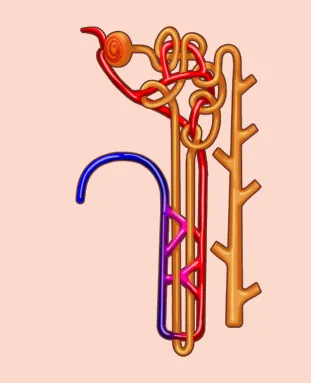
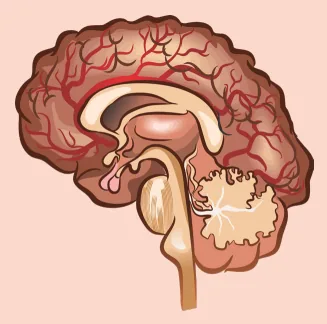

# Distúrbios do Sódio

<!-- page:1 -->

## Distúrbios Hidroeletrolíticos

### Osmolaridade Sérica

- Osmolaridade plasmática total = (2 x Sódio) + (Glicose/18) + (Ureia/6);
- Osmolaridade efetiva = (2 x Sódio) + (Glicose/18);
- Osmolaridade normal = 280-320 mOsm/L;
- Distúrbios do sódio são também distúrbios da água corporal!

Produção de ADH pelo hipotálamo → retenção de água livre nos rins → queda do sódio plasmático e da osmolaridade plasmática.

## O Sódio no Organismo

### Considerações Gerais

- O sódio é o principal determinante da osmolaridade plasmática;
- Por isso, é também a principal força osmótica que atrai água para o espaço extracelular;
- Assim, os distúrbios da natremia são, em última análise, distúrbios no equilíbrio da água corporal total — e não necessariamente reflexo do conteúdo absoluto de sódio.

**Osmolaridade plasmática total e efetiva**

- A osmolaridade plasmática total inclui todas as partículas osmoticamente ativas, inclusive as que atravessam livremente membranas, como a ureia;
- Já a osmolaridade plasmática efetiva inclui apenas as partículas que não atravessam livremente as membranas;
- Osmolaridade plasmática total = 2 x Sódio + (Glicose/18) + (Ureia/6);
- Osmolaridade plasmática efetiva = 2 x Sódio + (Glicose/18);
- Valores normais: 280 – 320 mOsm/L.

## Hiponatremia

**1º passo** é avaliar a osmolaridade plasmática:

- **Hipertônica**: diabetes descompensado;
- **Isotônica**: pseudo-hiponatremia;
- **Hipotônica**.

**2º passo**, se hipotônica, é definir a volemia:

- **Hipervolêmica**: insuficiência cardíaca, cirrose, síndrome nefrótica;
- **Hipovolêmica**: desidratação hipotônica;
- **Normovolêmica**: síndrome da secreção inapropriada de ADH.

**Síndrome da secreção inapropriada de ADH**

- Hiponatremia normovolêmica com osmolaridade urinária > 100 mOsm/L;
- Tiazídicos, ISRS, haldol, carbamazepina, valproato, tricíclicos;
- Câncer de pulmão, cabeça e pescoço.

## Hipernatremia

Avaliar osmolaridade urinária:

- Osmolaridade urinária > 600 mOsm/kg: diarreia, vômito, febre, sudorese;
- Osmolaridade urinária < 600 mOsm/kg: diabetes insipidus:
  - Responde ao DDAVP: central (deficiência de ADH);
  - Resistente ao DDAVP: nefrogênico (resistência ao ADH).

## Tratamento das Disnatremias

- Evitar variações de sódio de mais de 10 mEq/L em 24h;
- Utilizar a fórmula de Adrogué-Madias: variação do sódio após infusão da solução = (Na+ da solução – Na+ sérico) / (água corporal total + 1);
- Hiponatremia euvolêmica: NaCl 3% (513 mEq/L);
- Hiponatremia hipovolêmica: repor volemia com NaCl 0,9% (154 mEq/L);
- Hipernatremia: SG 5% (sem sódio) ou NaCl 0,45% (77 mEq/L).

---

<!-- page:2 -->

### Regulação do Sódio

- Osmorreceptores hipotalâmicos detectam variações na osmolaridade plasmática;
- Aumento da osmolaridade, secundário ao aumento de sódio, estimula liberação de ADH;
- ADH atua nos receptores V2 no túbulo coletor renal;
- Estimula inserção de aquaporinas-2, reabsorvendo água livre.

Como resultado, a retenção de água livre dilui o sódio plasmático e reduz a osmolaridade!

## Hiponatremia

- Na+ < 135 mEq/L;
- O primeiro passo na hiponatremia é determinar a osmolaridade plasmática total para diferenciá-la em três subtipos;

Lembrando, osmolaridade plasmática total = 2 x Sódio + (Glicose/18) + (Ureia/6).

**Subtipos**:

- Hiponatremia hipertônica (osmolaridade aumentada);
- Hiponatremia hipotônica (osmolaridade diminuída);
- Hiponatremia isotônica (osmolaridade normal).

### Hiponatremia Hipertônica

- Ocorre quando há sódio plasmático baixo, mas a osmolaridade está aumentada (hipertônica);
- Causa mais comum: hiperglicemia importante, especialmente em síndromes hiperosmolares (ex.: diabetes mellitus descompensado);
- A ureia não é considerada nesse mecanismo, pois não exerce força osmótica efetiva;
- A glicose elevada atrai água para o extracelular, diluindo o sódio e gerando hiponatremia dilucional;
- Nesses casos, é fundamental corrigir o valor do sódio com base na glicemia: a cada aumento de 100 mg/dL na glicemia, o sódio reduz em 1,6 – 2,2 mEq/L!
- A conduta é controlar o diabetes descompensado!

### Hiponatremia Isotônica

- Ocorre em métodos laboratoriais que dosam sódio por volume total de plasma, sem separar o conteúdo aquoso;
- Em casos com excesso de lipídios ou paraproteínas (ex.: mieloma múltiplo), o espaço aquoso do plasma é reduzido artificialmente;
- Isso leva a uma subestimação da concentração de sódio real e, portanto, a uma "pseudo-hiponatremia";

Como se trata de "pseudo-hiponatremia", a osmolaridade plasmática é normal. A conduta é tratar a dislipidemia, o mieloma múltiplo, etc.!

### Hiponatremia Hipotônica

- Chama-se de hiponatremia verdadeira;
- Dá-se quando há um volume de água maior que o de sódio;
- **Subtipos**:
  - Hiponatremia hipotônica hipovolêmica;
  - Hiponatremia hipotônica normovolêmica;
  - Hiponatremia hipotônica hipervolêmica.

**Hiponatremia hipotônica hipovolêmica**

Ocorre por perda combinada de água e sódio, com predomínio da perda de sódio, como em:

- Perdas gastrointestinais: vômitos, diarreia;
- Sudorese intensa;
- Natriurese (perda renal de sódio): diuréticos tiazídicos, insuficiência adrenal e síndrome cerebral perdedora de sal.

Apresenta os seguintes achados laboratoriais:

- Sódio urinário < 20 mEq/L: sugere perda extrarrenal (vômitos, diarreia, sudorese);
- Sódio urinário > 20 mEq/L: natriurese (diuréticos, insuficiência adrenal, síndrome cerebral perdedora de sal);
- Osmolalidade urinária > 300 mOsm/kg: urina concentrada pela ação do ADH.

A conduta é repor volume e restabelecer o status volêmico! Isso pode ser feito com solução fisiológica isotônica (NaCl 0,9%).

**Hiponatremia hipotônica hipervolêmica**

Ocorre por retenção excessiva de água, associada à doença sistêmica crônica com hipoperfusão efetiva:

- Apesar do aumento do volume corporal total, há hipovolemia efetiva (baixa perfusão tecidual);
- Isso ativa o sistema renina-angiotensina-aldosterona, levando à retenção de sódio e água.

As etiologias incluem:

- Cirrose hepática;
- Insuficiência cardíaca congestiva;
- Síndrome nefrótica.

Apresenta os seguintes achados laboratoriais:

- Sódio urinário < 20 mEq/L: o rim está retendo sódio para compensar a hipoperfusão circulatória;
- Osmolalidade urinária > 300 mOsm/kg: ação do ADH, que é liberado em resposta à hipovolemia relativa.

A conduta é corrigir a hipervolemia! Isso pode ser feito com diuréticos (ex.: furosemida).

**Hiponatremia hipotônica normovolêmica**

Ocorre por retenção hídrica, sem quadro de hipoperfusão, nas situações de:

- Excesso de ADH (síndrome da secreção inapropriada de ADH);
- Polidipsia primária (excesso de ingestão de água).

Para diferenciar as duas etiologias, precisamos avaliar a osmolaridade urinária:

---

<!-- page:3 -->

- Osmolaridade urinária < 100 mOsm/kg: urina muito diluída, baixa ação do ADH → polidipsia primária;
- Osmolaridade urinária > 100 mOsm/kg: urina concentrada, ação persistente e inapropriada do ADH → síndrome da secreção inapropriada de ADH.

**E a síndrome da secreção inapropriada de ADH?**

- Decorre da secreção excessiva de ADH ou da ação renal inapropriada deste hormônio;
- Pode ser secundária a:
  - **Drogas**: diuréticos tiazídicos, ISRS (ex.: fluoxetina, sertralina), haldol, carbamazepina, valproato e antidepressivos tricíclicos;
  - **Neoplasias**: pulmão, cabeça e pescoço;
  - **Distúrbios endócrinos**: insuficiência adrenal e coma mixedematoso.

### Manifestações Clínicas da Hiponatremia

- Dependem da velocidade de instalação da hiponatremia;
- Quanto mais aguda a instalação, mais sintomática;
- Incluem: cefaleia; convulsões; sonolência; coma.

### Tratamento da Hiponatremia

A velocidade de correção depende da velocidade de instalação da hiponatremia!

- Corrigir hiponatremia de forma lenta e segura para evitar mielinólise pontina (síndrome da desmielinização osmótica);
- Em geral, a mielinólise pontina ocorre 2 a 6 dias após a "hiper" correção da hiponatremia;
- Evitar aumento do sódio > 10 mEq/L em 24h e > 6 mEq/L nas primeiras 6h!

**Hiponatremia aguda sintomática**

- Paciente com convulsões, rebaixamento do nível de consciência, vômitos incoercíveis etc.;
- A conduta imediata deve ser 100 mL de solução salina hipertônica (NaCl 3%), em bolus intravenoso rápido;
- Como preparar NaCl 3% (513 mEq/L)? NaCl 0,9%, 890 mL (154 mEq/L) + NaCl 20%, 110 mL (3420 mEq/L).

**Atingindo o sódio desejado**

- Usamos a fórmula de Adrogué-Madias abaixo para estimar o aumento esperado do Na+ após infusão de 1 litro da solução escolhida:

  Variação do Na+ = (Na+ da solução – Na+ do paciente) / (água corporal total + 1)

- A água corporal total varia conforme idade e sexo:
  - Homens adultos = peso × 0,6
  - Mulheres adultas = peso × 0,5
  - Homens idosos = peso × 0,5
  - Mulheres idosas = peso × 0,4

- Após o bolus inicial, nos casos de hiponatremia aguda sintomática; ou inicialmente, nos casos de hiponatremia crônica, utilizamos:
  - Soluções hipertônicas (NaCl 3%), se hiponatremia hipotônica normovolêmica;
  - Solução fisiológica isotônica (NaCl 0,9%), se hiponatremia hipotônica hipovolêmica.

## Hipernatremia

- Na+ > 145 mEq/L;
- Decorre da perda de fluido hipotônico (mais água do que sódio) ou ingesta hídrica insuficiente;
- Resposta fisiológica inicial à perda de fluido hipotônico: estímulo da sede; aumento da ingesta de água (mecanismo compensatório primário);
- Em indivíduos com sistema de sede íntegro e acesso à água, a hipernatremia é rara.

Lactentes, idosos, pacientes com rebaixamento do nível de consciência estão sob risco aumentado de hipernatremia!

### Diagnóstico Diferencial

**Osmolaridade urinária > 600 mOsm/kg**

- Os rins estão concentrando bem a urina (função preservada);
- A causa provável da hipernatremia é, então, a perda extrarrenal de fluido hipotônico:
  - Perdas gastrointestinais: diarreia, vômitos;
  - Perdas insensíveis aumentadas: febre, respiração acelerada, queimaduras.
- Além disso, possivelmente há outros fatores contribuintes:
  - Aporte excessivo de sódio: grandes volumes de soluções salinas hipertônicas ou bicarbonato de sódio;
  - Restrição hídrica: falta de acesso à água.

**Osmolaridade urinária < 600 mOsm/kg**

- Incapacidade dos rins em concentrar a urina adequadamente;
- Sugere perda renal de água livre, com urina diluída, apesar da hipernatremia;
- Principais causas:
  - Diabetes insipidus central: deficiência da secreção de ADH;
  - Diabetes insipidus nefrogênico: resistência à ação do ADH nos túbulos renais.

**Diabetes insipidus**

- Sintomas típicos: poliúria (> 3 L/dia de urina diluída); polidipsia intensa;

---

<!-- page:4 -->

- Sede preservada (exceto em quadros neurológicos);
- Hipernatremia com osmolaridade urinária < 300-600 mOsm/kg (varia com gravidade).

Verificar Tabela 1.

- A água corporal total varia conforme idade e sexo: homens adultos = peso × 0,6; mulheres adultas = peso × 0,5; homens idosos = peso × 0,5; mulheres idosas = peso × 0,4.

## Manifestações Clínicas da Hipernatremia

- Dependem da velocidade de instalação da hipernatremia;
- Quanto mais aguda a instalação, mais sintomática;
- Incluem: cefaleia; convulsões; sonolência; coma.

Os sintomas neurológicos podem ser semelhantes tanto na hiponatremia quanto na hipernatremia!

## Tratamento da Hipernatremia

**Atingindo o sódio desejado**

- Usamos a fórmula de Adrogué-Madias abaixo para estimar o aumento esperado do Na+ após infusão de 1 litro da solução escolhida:

  Variação do Na+ = (Na+ da solução – Na+ do paciente) / (água corporal total + 1)

> ⚠️ Tabela reconstruída a partir de OCR — confira contra a fonte original.

**Tabela 1: Diabetes insipidus central e nefrogênico**

| Tipo | Mecanismo | Causas | Resposta a DDAVP |
|---|---|---|---|
| Central | Deficiência de ADH | Idiopático, trauma, neurocirurgia, tumor de SNC | Responde a DDAVP (desmopressina) |
| Nefrogênico | Resistência à ação do ADH | Lítio, hipercalcemia, doença renal crônica, anomalias congênitas | Não responde ao teste com DDAVP |

- Para a correção, usamos:
  - Soluções hipotônicas (solução glicose 5% ou solução NaCl 0,45%);
  - Em casos assintomáticos, podemos apenas aumentar o aporte de água enteral.
- Como preparar NaCl 0,45% (77 mEq/L)? NaCl 0,9%, 500 mL (154 mEq/L) + solução glicose 5%, 500 mL (0 mEq/L); ou NaCl 0,9%, 500 mL (154 mEq/L) + água destilada, 500 mL (0 mEq/L);
- Se diabetes insipidus central, administrar ADH recombinante (DDAVP);
- Se diabetes insipidus nefrogênico, pode ser tentado diurético tiazídico, restrição salina e AINEs.
