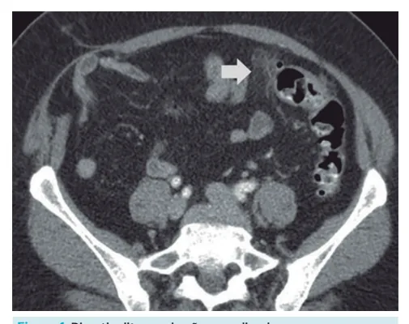
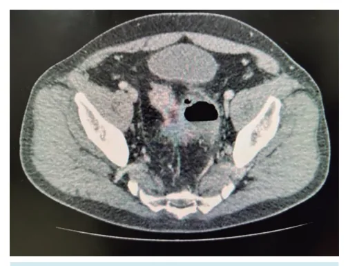

# Diverticulite Aguda

<!-- page:1 -->

## Resumo Rápido

- **Divertículo** = protrusão de algum órgão oco.
  - Do cólon → pseudodivertículo (só a mucosa);
  - **Doença diverticular** → presença de divertículos no cólon;
  - **Diverticulite** → inflamação do divertículo: mais comum em idosos constipados.

**Classificação de Hinchey (resumo):**

- Estádio 1: abscesso paracólico pequeno, confinado ao mesentério do cólon;
- Estádio 2: abscesso grande, distante, localizado na pelve ou retroperitônio;
- Estádio 3: peritonite purulenta decorrente da ruptura de um abscesso;
- Estádio 4: peritonite fecal decorrente de perfuração livre de um divertículo não inflamado.

**Tratamento**: ceftriaxona e metronidazol.

- Não complicada = antibiótico e observação;
- Hinchey I = antibiótico e observação;
- Hinchey II = antibiótico e drenagem;
- Hinchey III = antibiótico e cirurgia;
- Hinchey IV = antibiótico e cirurgia de Hartmann.

## Conceitos Iniciais

- Diverticulite aguda é uma complicação da doença diverticular;
- Divertículo é a protrusão de algum órgão oco:
  - Do cólon → pseudodivertículo (só a mucosa);
  - Doença diverticular → presença de divertículos no cólon;
  - Diverticulite → inflamação do divertículo.

## Fatores de Risco para Doença Diverticular

- Dieta pobre em fibra e rica em carne (mais presente no ocidente);
- Idade (quanto mais velho, maiores são as chances de desenvolver a patologia);
- Fatores de risco para diverticulite:
  - Tabagismo;
  - Uso abusivo de AINEs;
  - Sedentarismo;
  - Obesidade.

## Complicações da Doença Diverticular

- Principal complicação: diverticulite (mais à esquerda — porção hipertônica);
- Segunda mais comum: sangramento (mais à direita — porção hipotônica).

## Diverticulite

### Definição

- Inflamação do divertículo;
- Na verdade, há uma microperfuração da base do divertículo com reação inflamatória/infecciosa local.

### Quadro Clínico

- Dor abdominal em fossa ilíaca esquerda;
- Febre, inapetência, náuseas.

**Diagnóstico padrão-ouro**: tomografia de abdome e pelve com contraste.

### Classificação

- Diverticulite aguda complicada → classificação de Hinchey.

**Estádios**

- Estádio 1: abscesso pericólico pequeno, confinado ao mesentério do cólon;
- Estádio 2: abscesso grande, distante, localizado na pelve ou retroperitônio;
- Estádio 3: peritonite purulenta decorrente da ruptura de um abscesso;
- Estádio 4: peritonite fecal decorrente da perfuração livre de um divertículo não inflamado.

**Tratamento**

- Hinchey I = antibiótico e observação;
- Hinchey II = antibiótico e drenagem;
- Hinchey III = antibiótico e cirurgia;
- Hinchey IV = antibiótico e cirurgia de Hartmann.

### Quadro Clínico

- Abdome agudo inflamatório à esquerda;
- Dor abdominal de evolução progressiva;
- Febre, náuseas;
- Leucocitose;
- Disúria.

### Diverticulite em Ceco

- Paciente idosa, oriental, com quadro agudo inflamatório à direita → pode ser diverticulite em ceco (asiáticos)!

### Formas Complicadas

- Massa palpável;
- Peritonite;
- Sepse.

### Diagnóstico

- Quadro clínico e anamnese levantam a suspeita;
- Exame padrão-ouro: tomografia de abdome e pelve com contraste.

**Diverticulite aguda não complicada**

- Apresenta tomografia normal, ou só com o borramento;
- Inflamação local, espessamento, borramento de gordura, divertículos.

**Diverticulite aguda complicada**

- Deve-se categorizar de acordo com a classificação de Hinchey.

---

<!-- page:2 -->

## Classificação de Hinchey

- Estádio 1: abscesso pericólico pequeno, confinado ao mesentério do cólon;
- Estádio 2: abscesso grande (> 4 cm), distante, localizado na pelve ou retroperitônio;
- Estádio 3: peritonite purulenta decorrente de ruptura de abscesso;
- Estádio 4: peritonite fecal decorrente de perfuração livre de um divertículo não inflamatório.

**Classificação de Hinchey-Wasvary**

- 0 – Sem complicações;
- 1A – Inflamação/flegmão confinado;
- 1B – Abscesso pericólico;
- 2 – Abscesso pélvico ou a distância;
- 3 – Peritonite purulenta;
- 4 – Peritonite fecal.

**Classificação de WSES**

- 0 – Sem complicações;
- 1A – Inflamação/flegmão confinado;
- 1B – Abscesso < 4 cm;
- 2A – Abscesso > 4 cm;
- 2B – Gás a distância;
- 3 – Líquido livre sem gás;
- 4 – Líquido livre com gás.

*Figura 1: Diverticulite aguda não complicada.*

*Figura 2: Diverticulite aguda complicada — Hinchey II, abscesso pélvico.*

### Tratamento

**Diverticulite não complicada**

- AINEs, sintomáticos, dieta, orientações, com ou sem ATB;
- Tratamento ambulatorial (maioria dos casos).

**Diverticulite complicada**

- Hinchey I = ATB e observação;
- Hinchey II = ATB + drenagem percutânea;
- Hinchey III = ATB + cirurgia;
- Hinchey IV = ATB + cirurgia de Hartmann;
- ATB = ceftriaxona + metronidazol.

## Principais Dúvidas

**Quando internar pacientes com diverticulite?**

- Diverticulite complicada;
- Dor abdominal intensa;
- Não tolera ATB VO;
- Idosos;
- Diabéticos;
- Sinais de sepse;
- Condição social;
- Comorbidades;
- Refratários.

**Como operar Hinchey III?**

- Laparoscopia e lavagem da cavidade: paciente estável clinicamente, com bom status de performance;
- Reconstrução com anastomose: paciente em boas condições clínicas + abdome e cólon com pouca inflamação;
- Na dúvida: cirurgia de Hartmann.

**Diverticulite de repetição**

- Principal complicação: fístula colovesical:
  - Dor abdominal + pneumatúria/fecalúria;
  - Tratamento agudo: ATB + suporte e investigação;
  - Colonoscopia, com ou sem cistoscopia, e correção eletiva;
  - Técnica cirúrgica: colectomia, anastomose primária, rafia de bexiga, *patch* de omento.

**Quando operar um paciente eletivamente após diverticulite aguda leve?**

- Atualmente, a abordagem é mais conservadora, pois os primeiros surtos são piores. Geralmente, os surtos subsequentes são mais brandos e tratáveis clinicamente;
- Operar os seguintes pacientes: recidiva (2 ou mais episódios); imunocomprometidos; jovens; pacientes com sintomas crônicos refratários; Hinchey III e IV → operar na urgência!

**No ambulatório**

- Dieta rica em fibras;
- Evitar constipação;
- Colonoscopia eletiva (3-6 semanas após o surto agudo).

## Referências

Figura 1: Diverticulite aguda não complicada. Fonte: www.radiopaedia.org

Figura 2: Diverticulite aguda complicada — Hinchey II, abscesso pélvico. Fonte: www.radiopaedia.org

