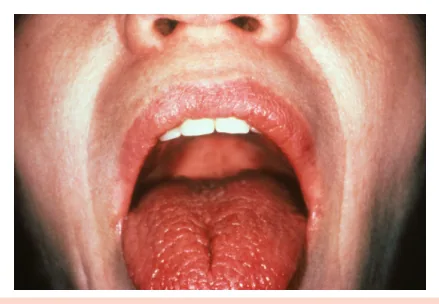
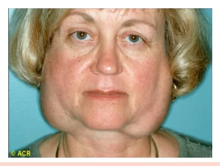
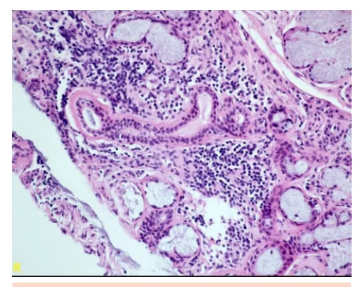
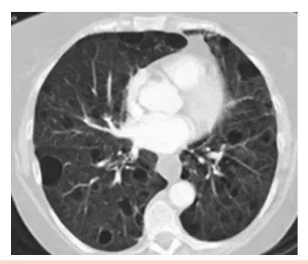
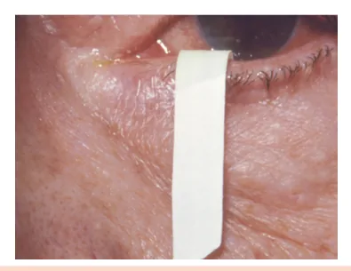

# Doença de Sjögren

<!-- page:1 -->

Sjogren (CM)

- Infiltração linfocítica de glândulas exócrinas; CRITÉRIOS DE CLASSIFICAÇÃO

- Mulheres (10:1) de meia-idade (> 45 anos).

- Critérios ACR/EULAR (2016), necessitando

## MANIFESTAÇÕES CLÍNICAS ≥ 4 pontos

- Exócrina (60%):

- Biópsia de glândula salivar com sialoadenite Xeroftalmia: ardor, prurido, turvação; linfocítica focal (3 pontos); Xerostomia: disgeusia, cáries, boca seca;

- Anti-Ro positivo (3 pontos); Parotidite, secura vaginal, xerose

- Teste de Schirmer positivo (≤5 mm/5 min), cutânea, xerotraqueia. fluxo salivar reduzido (≤0,1 ml/min), teste ocular

- Extraglandular (40%): com fluoresceína ou verde-lissamina positivo (1 Articular: poliartrite não erosiva; ponto cada). Pulmonar: PINE (padrão intersticial mais comum), TRATAMENTO

PIL (mais específica), bronquiolite;

- Não farmacológico: óculos, chiclete, umidificador, Hemato: anemia crônica, linfopenia; evitar tricíclicos, exercício físico para fadiga; Neurológico: neuropatias periféricas;

- Farmacológico: lágrima/saliva artificial, pilocarpina, Cutâneo: púrpura (vasculite); hidroxicloroquina (articular), corticoide (fase Renal: acidose tubular renal distal; aguda), rituximabe (grave/refratário). Fadiga crônica. COMPLICAÇÕES

## EXAMES LABORATORIAIS

- Linfoma não Hodgkin MALT. Maior risco: aumento

- Anti-Ro/SSA em 30–60% e anti-La/SSB persistente de parótidas, linfadenopatia, púrpura e em 15–40%; consumo de complemento.

- FAN: nuclear pontilhado fino;

- FR em altos títulos e consumo de C4 podem indicar crioglobulinemia.

## INTRODUÇÃO

- Predomínio em mulheres (10:1);

- Meia-idade (> 45 anos);

- Fisiopatologia: infiltração linfocitária de glândulas exócrinas;

- Pode ser isolado ou estar associado a outras doenças reumatológicas (ex.: doença de Sjögren associada à artrite reumatoide).

## MANIFESTAÇÕES CLÍNICAS

Figura 1: Xerostomia.

## EXOCRINOPATIA

- Presente isoladamente em até 60% dos casos;

- Pode cursar com: Xeroftalmia (olhos secos): Ardor, dor e prurido ocular; Turvação visual. Xerostomia (boca seca): Alteração do paladar (disgeusia); Dificuldade para mastigar e deglutir; Cáries recorrentes e perda dentária.

- Verificar Figura 1 Xerotraqueia (secura traqueal); Figura 2: Paciente com doença de Sjögren e parotidite bilateral. Xerose cutânea (pele seca); Secura vaginal (desconforto genital, especialmente EXTRAGLANDULAR em mulheres pós-menopáusicas);

- Presente em cerca de 40% dos casos; Parotidites de repetição:

- Articular: Aumento doloroso e recorrente das parótidas. | Artrite e artralgia semelhante ao LES; Poliartrite simétrica;

---

<!-- page:2 -->

| Predomínio de pequenas articulações;

- FAN: padrão nuclear pontilhado fino (NPF), positivo Em geral, não erosiva. em até 80%;

- Pulmonar:

- Fator reumatoide: positivo em cerca de 30% (pode Doença intersticial pulmonar: sugerir presença de crioglobulinemia); PINE (pneumonia intersticial não específica): é o

- Consumo de C4: podem ser sugestivos da presença PINE (pneumonia intersticial não específica): é o padrão mais prevalente; PIL (pneumonia intersticial linfocítica): é o padrão mais específico; Doença obstrutiva das vias aéreas (bronquiolite).

- Figura 3: Pneumonia intersticial linfocítica (PIL).

Observe a formação de múltiplos cistos no parênquima pulmonar.

- Hematológico: Linfopenia, leucopenia, plaquetopenia; Anemia hemolítica autoimune e anemia de doença crônica.

- Cutâneo: Vasculite leucocitoclástica; Púrpuras palpáveis, especialmente em membros inferiores.

- Neurológico: Predomínio de acometimento periférico; Mononeuropatia, polineuropatia sensitiva e/ ou motora; Neuropatia de fibras finas; Padrão desmielinizante central em alguns casos.

- Sistêmico geral: A fadiga é muito prevalente e de difícil manejo nos pacientes com Sjögren.

- Renal: Nefrite tubulointersticial com infiltrado linfocítico é o mais comum; E a acidose tubular renal distal (tipo 1) é a principal manifestação clínica: Hipocalemia, nefrolitíase e nefrocalcinose.

- Anti-Ro/SSA: positivo em 30–60%, associa-se às manifestações clássicas da doença e ao lúpus neonatal e bloqueio atrioventricular congênito em bebês de pacientes com Sjögren;

- Anti-La/SSB: presente em 15–40%, geralmente associado ao anti-Ro; - Consumo de C4: podem ser sugestivos da presença de crioglobulinemia;

- Crioglobulina: podem ser positiva em 10% dos pacientes, é marcadora de pior prognóstico.

A doença de Sjögren é uma das etiologias associadas à crioglobulinemia. Elevados títulos de fator reumatoide, consumo de complemento (principalmente de C4) e presença de púrpura palpável devem motivar a pesquisa de crioglobulina.

## CRITÉRIOS DE CLASSIFICAÇÃO

- Critérios ACR (Colégio Americano de Reumatologia)/

EULAR (Liga Europeia contra o Reumatismo de 2016);

- Os critérios devem ser aplicados em pacientes com sintomas de xeroftalmia, xerostomia ou acometimento extraglandular compatível com a doença de Sjögren.

Tabela 1: Critérios de classificação para o Sjögren ACR/EULAR 2016. Critério Pontos Biópsia de glândula salivar com infiltrado linfocítico focal 3 (focus score ≥1)

Anti-Ro positivo 3 Testes de coloração ocular positivos (fluoresceína/verde-lissamina) Teste de Schirmer ≤ 5 mm/5 min 1 Fluxo salivar não estimulado ≤ 0,1 mL/min 1 ≥4 pontos classificam como doença de Sjögren!

Figura 4: Biópsia de glândula salivar menor.

---

<!-- page:3 -->

Observam-se infiltrados linfocitários focais ao redor de

- Rituximabe: reservado para formas graves ou ductos, característicos de sialoadenite linfocítica, achado refratárias, como acometimento neurológico, típico da síndrome de Sjögren. pulmonar, vasculites sistêmicas extensas, ou em casos associados à crioglobulinemia.

Figura 5: Teste de Schirmer. É considerado positivo quando a umidificação da tira de papel filtro posicionada no fórnice inferior é ≤ 5 mm após 5 minutos, indicando redução da produção de lágrima.

## TRATAMENTO

## NÃO FARMACOLÓGICO

- Óculos de proteção lateral;

- Chicletes/pastilhas sem açúcar;

- Hidratantes para a pele;

- Umidificadores de ambiente;

- Suspender fármacos que agravam a secura (ex.:

antidepressivos tricíclicos);

- Exercício físico para a fadiga.

## FARMACOLÓGICO

- Colírios lubrificantes e saliva artificial: para alívio sintomático da secura ocular e oral;

- Pilocarpina: secretagogo que estimula a secreção das glândulas exócrinas, indicada em casos com resquício funcional glandular;

- Corticosteroides: utilizados em fases agudas, para controle de parotidite recorrente e manifestações extraglandulares;

- Hidroxicloroquina: com efeito imunomodulador, é especialmente útil em manifestações articulares; COMPLICAÇÕES

- A principal complicação do Sjögren é a transformação linfomatosa, especialmente para linfoma não Hodgkin tipo MALT (tecido linfoide associado à mucosa);

- Fatores de risco para transformação linfomatosa: Parotidite persistente (aumento endurecido, assimétrico ou unilateral da parótida); Linfadenopatia generalizada; Púrpura cutânea (sugere crioglobulinemia); Hipocomplementemia (também sugere crioglobulinemia).

Crioglobulinemia é um marcador de maior risco para complicações graves e para linfoma na doença de Sjögren!

## REFERÊNCIAS

Figura 1: Xerostomia. AMERICAN COLLEGE OF RHEUMATOLOGY. Biblioteca de Imagens da Reumatologia. Atlanta, GA: ACR, c2025. Disponível em: https:// rheumatology.org/image-library. Acesso em: 17 junho 2025.

Figura 2: Paciente com doença de Sjögren e parotidite bilateral. AMERICAN COLLEGE OF RHEUMATOLOGY. Biblioteca de Imagens da Reumatologia. Atlanta, GA: ACR, c2025. Disponível em: https:// rheumatology.org/image-library. Acesso em: 17 junho 2025.

Figura 3: Pneumonia intersticial linfocítica (PIL). LYMPHOID interstitial pneumonia. Last revised by Yuranga Weerakkody on 11 Jun. 2025. Radiopaedia. Disponível em: https://radiopaedia.org/articles/ lymphoid-interstitial-pneumonia. Acesso em: 17 jun. 2025.

Figura 4: Biópsia de glândula salivar menor. AMERICAN COLLEGE OF RHEUMATOLOGY. Biblioteca de Imagens da Reumatologia. Atlanta, GA: ACR, c2025. Disponível em: https:// rheumatology.org/image-library. Acesso em: 17 junho 2025.

Figura 5: Teste de Schirmer. AMERICAN COLLEGE OF RHEUMATOLOGY. Biblioteca de Imagens da Reumatologia. Atlanta, GA: ACR, c2025. Disponível em: https:// rheumatology.org/image-library. Acesso em: 17 junho 2025.

