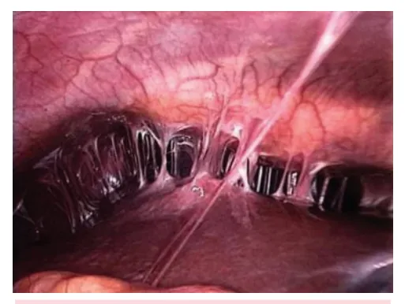
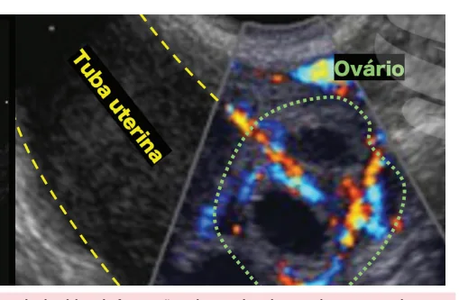
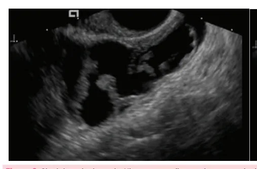
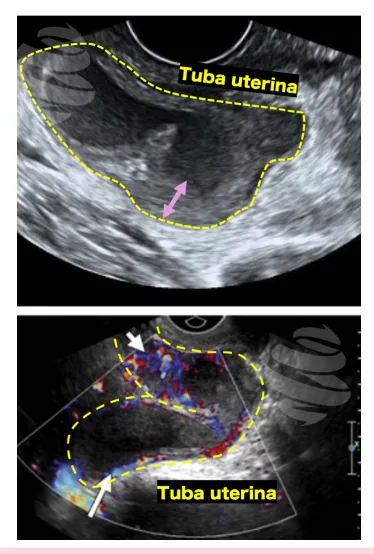
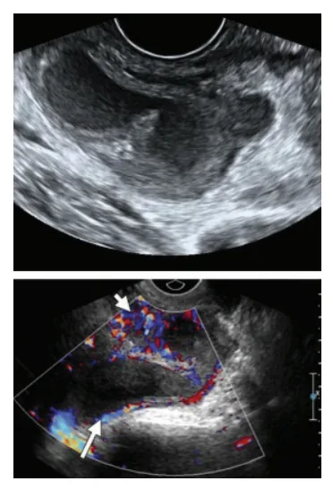

# Doença Inflamatória Pélvica Aguda

<!-- page:1 -->

## DOENÇA INFLAMATÓRIA

## PÉLVICA AGUDA

Doença inflamatória pélvica aguda DEFINIÇÃO imunossupressão, falha de antibioticoterapia por

- Infecção sexualmente transmissível (IST) de via oral após 72h, gestação ou dúvida diagnóstica caráter ascendente: (apendicite? gravidez ectópica?). Cervicite → endometrite → salpingite → ooforite Tratamento

→ peritonite;

- Ambulatorial:

- Complicações: sepse (aguda), dor pélvica crônica e | Ceftriaxone 500 mg IM dose única OU infertilidade (tardias); Cefotaxima 500 mg IM dose única

- Patógenos: Chlamydia trachomatis e Neisseria | + Doxiciclina 100 mg 12/12h por 14 dias ou gonorrhoeae (Gonococo); Azitromicina 1g dose única

Diagnóstico | +- Metronidazol 500 mg VO 12/12h por 14 dias.

- É clínico, baseado em:

- Hospitalar: Critérios maiores (dor pélvica/ região anexial, | Ceftriaxone 1g 12/12h EV + Doxiciclina 100 mg dor a mobilização do colo uterino) + critérios 12/12h por 14 dias + Metronidazol 500 mg EV menores (presunção de infecção); 8/8h ou Clindamicina 900 mg EV 8/8h Critérios elaborados: (1) Exame de imagem | Clindamicina 900 mg EV 8/8h por 14 dias + sugerindo a presença de abscesso tubo- Gentamicina IM ou EV: dose de ataque 2 mg/kg e ovariano, (2) Biópsia endometrial com dose de manutenção 3-5 mg/kg/dia por 14 dias.

endometrite, (3) Laparoscopia com sinais de | Ampicilina + Sulbactam 3g EV 6/6h por 14 dias + infecção pélvica. Doxiciclina 100 mg 12/12h por 14 dias.

- Quando internar:

- Abscesso tubo ovariano: drenar se não melhorar DIPA complicada - Sepse, instabilidade com antibioticoterapia.

hemodinâmica, comprometimento do estado geral, abscesso tubo-ovariano ou peritonite,

## DOENÇA INFLAMATÓRIA PÉLVICA

- Dor pélvica crônica por aderências pélvicas;

## AGUDA

- Síndrome de Fitz-Hugh-Curtis (aderências peri-hepáticas).

- Infecção sexualmente transmissível de caráter ascendente; OBS.: Na dúvida diagnóstica para DIPA: TRATAR!

- Fisiopatologia: Cervicite → endometrite → salpingite → ooforite → peritonite.

## AGENTES ETIOLÓGICOS

- Chlamydia trachomatis;

- Neisseria gonorrhoeae – gonococo;

- Outros agentes: Anaeróbios pélvicos; BGN;

Mycoplasma hominis; S. agalactiae; G. vaginalis; Haemophilus influenzae; Ureaplasma urealyticum; Bacteroides spp.; E. coli.

## REPERCUSSÕES

Complicações

- Abscesso tubo-ovariano;

- Infertilidade, principalmente pela redução da motilidade tubária e pelo processo aderencial; Figura 1: Síndrome de Fitz-Hugh-Curtis com aderências periz Maior risco de gestação ectópica; hepáticas.

---

<!-- page:2 -->

## CRITÉRIOS MENORES (ADICIONAIS)

- Febre;

- Secreção vaginal patológica;

- Marcadores inflamatórios aumentados ou leucocitose;

- Agentes etiológicos (gonococo, clamídia ou

- O

- - C

- Figura 2: Abscesso tubo-ovariano em tuba uterina esquerda

(setas vermelhas).

## DIAGNÓSTICO

- - O diagnóstico é clínico;

- É definido por critérios clínicos, sendo necessário:

todos os critérios maiores + 1 critério menor ou 1 E critério elaborado. I

- CRITÉRIOS MAIORES (OBRIGATÓRIOS)

- Dor em baixo ventre espontânea;

- Dor à palpação anexial;

- Dor à mobilização do colo uterino.

Figura 3: Sinal da roda dentada. Ultrassonografia por via transvaginal espessamento parietal e ecos internos (setas verdes - sinal da roda d

- Septos intra-tubáreos;

- Figura 4: Abscesso tubo-ovariano. Ultrassonografia por via transvagin ecos internos e conteúdo hipoecogênico (espesso), adjacente a um o micoplasma) isolados em secreção endocervical.

Doppler colorido. Os achados são sugestivos de abscesso tubo-ovaria - Agentes etiológicos (gonococo, clamídia ou Outros sintomas relacionados:

- Dispareunia, sangramento intermenstrual;

- Alteração do padrão e fluxo menstrual → endometrite;

- Disúria → uretrite.

## CRITÉRIOS ELABORADOS

- A presença de qualquer um estabelece diagnóstico;

- Exame de imagem (ultrassonografia transvaginal ou ressonância magnética de pelve) sugerindo a presença de abscesso tubo-ovariano;

- Biópsia endometrial com endometrite;

- Laparoscopia com sinais de infecção pélvica ou abscesso tubo-ovariano.

EXAMES COMPLEMENTARES Imagens

- Típicas: Espessamento da parede tubária > 5 mm; Acúmulo de líquido nas tubas; Sinal da roda dentada: tubas dilatadas visualizadas através de um corte transversal.

evidenciando distensão líquida da tuba uterina com dentada), sugerindo salpingite.

- Abscesso tubo-ovariano;

nal evidencia formação tuba uterina de paredes espessadas, com ovário de dimensões normais e aumento da vascularização ao ano.

---

<!-- page:3 -->

## CRITÉRIOS DE GRAVIDADE

- Imagens de ultrassonografia por via transvaginal evidenciam tubas uterinas de paredes espessadas

AVALIAÇÃO INICIAL (seta rosa) e distendidas por conteúdo hipoecogênico

- Avaliar sinais vitais e estado geral; com debris (espesso), compatível com abscesso

- Pesquisar sinais de sepse; tubário. A imagem inferior demonstra aumento da

- Pesquisar sinais de sepse;

- Abdome → investigar sinais de peritonite;

## EXAME FÍSICO GINECOLÓGICO

- Exame especular: presença de corrimento vaginal purulento ou turvo, com odor desagradável e colo friável;

- Toque vaginal: dor à mobilização do colo, dor à palpação do útero e anexos, uni ou bilateralmente e massa pélvica palpável.

Figura 5: Abscesso tubo-ovariano no USG. tubário. A imagem inferior demonstra aumento da vascularização parietal ao Doppler, favorecendo o aspecto inflamatório / infeccioso.

## DIP LEVE

- Ausência de sinais de infecção sistêmica ou sepse;

- Ausência de sinais de peritonite ou massa anexial.

## DIP COMPLICADA

- Hemograma completo → avaliar leucocitose;

- Provas inflamatórias (PCR e VHS) → avaliar inflamação;

- Urina tipo 1 e urocultura → para diagnóstico diferencial com ITU;

- Identificação do agente etiológico por biologia molecular (Clamídia ou Gonococo, se disponível);

- Ultrassonografia transvaginal e ressonância de pelve;

- Laparoscopia.

## QUANDO INTERNAR?

- Se DIP complicada: Abscesso tubo-ovariano; Imunossupressão; Falha de antibioticoterapia por via oral, após Instabilidade hemodinâmica ou sepse; Gestação; Dúvida diagnóstica → apendicite? Associação com uso de DIU.

48-72 horas; Gravidez ectópica?;

## TRATAMENTO

- Geralmente marcada pela infecção por

Gonococo e Clamídia;

- Tratar ambulatorialmente, se: Ausência de sinais de infecção sistêmica ou sepse; Ausência de sinais de peritonite ou massa anexial.

- Reavaliar em 48-72 horas;

- Antibioticoterapia: Ceftriaxona 500 mg intravenoso dose única + 500 mg/dia por 7 dias (1 g/semana por dias com ou sem Metronidazol 500 mg VO, 12/12h, por

(IV) dose única + Azitromicina 1g por via oral (VO) 2 semanas) OU Doxiciclina 100 mg VO 12/12h por 14 14 dias.

- Verificar Tabela 1 na próxima página

---

<!-- page:4 -->

Tabela 1: Tratamento recomendado para clamídia e gonococo. Gonococo ou Clamídia Tratamento Infecção gonocócica NÃO Infecção gonocócica NÃO C complicada (uretra, colo do útero, reto e Azitromic faringe)

Ceftriaxona 1g IM ou I Infecção gonocócica disseminada Azitromic Conjutivite gonocócica no adulto Azitromic Infecção por clamídia Doxiciclina 10

- Tratamento hospitalar;

- Esquemas possíveis: Ceftriaxona 1g 12/12h IV + metronidazol 500 mg IV G Clindamicina 900 mg IV 8/8h por 14 dias + gentamicina IM ou IV (dose de ataque: 2mg/kg; dose de manutenção: 3-5 mg/kg/dia por 14 dias); N Ampicilina + sulbactam 3g IV 6/6h por 14 dias + | doxiciclina 100 mg12/12h por 14 dias.

8/8h OU clindamicina 900 mg IV 8/8h; o & OBS.: Caso paciente com melhora clínica e afebril há E 48 horas, podemos descalonar o antibiótico por via T oral e continuar o tratamento de maneira ambulatorial c Abscesso tubo-ovariano E

- Promover cobertura de anaeróbios; T

- Se ausência de melhora em 48 horas → drenar! h

- DIU: Considerar retirar apenas se falha do tratamento clínico ou inserção recente do DIU. R u o

## OUTROS DETALHES 7

- Lembrar de outras infecções sexualmente transmissíveis (ISTs) associadas: HIV, sífilis, hepatite B e C;

- Orientar o rastreamento adequado das alterações cervicais relacionadas ao HPV → colpocitologia oncótica;

- Orientar a avaliação e tratamento das parcerias sexuais;

- DIU → caso haja indicação da retirada, proceder somente após 6 horas do início da antibioticoterapia intravenosa.

REFERÊNCIAS Ceftriaxona 500mg, IM, dose única Mais cina 500mg, 2 comprimidos, VO, dose única IV ao dia, completando ao menos 7 dias de tratamento Mais cina 500mg, 2 comprimidos, VO, dose única Ceftriaxona 1g, IM, dose única cina 500mg, 2 comprimidos, VO, dose única OU 00mg, VO, 2x/dia, por 7 dias (exceto gestantes)

Figura 1: Síndrome de Fitz-Hugh-Curtis com aderências peri-hepáticas. GUERRA, F.; COLETTA, D. Fitz-Hugh–Curtis Syndrome. New England Journal of Medicine, v. 381, n. 22, 28 nov. 2019.

Figura 2: Abscesso tubo-ovariano em tuba uterina esquerda (setas vermelhas). NAJEEB LAYYOUS. Laparoscopy Photos Ovarian Cyst Ovarian Cystectomy | Dr N Layyous. Disponível em: <https://www.layyous.com/en/laparoscopy- &-hysteroscopy/laparoscopy-photos/laparoscopy-photos-4>.

Figura 3: Sinal da roda dentada. ECTÓPICA, F.; WILLIAMS, Hugh-Curtis. Perihepatite, Hugh-Curtis, Tromboflebite V. ovariana, Linfadenopatia, Endometrite, Piométrio, Falópio, Salpingite. Doença Inflamatória Pélvica. Disponível em: https://slideplayer.

com.br/slide/12231585/. Figura 4: Abscesso tubo-ovariano. ECTÓPICA, F., Williams, Hugh-Curtis Perihepatite, Hugh- Curtis Tromboflebite V. ovariana, Linfadenopatia, Endometrite, Piométrio, Falópio, Salpingite. Doença Inflamatória pélvica - ppt carregar. Disponível em:

https://slideplayer.com.br/slide/12231585/ Figura 5: Abscesso tubo-ovariano no USG. ROMOSAN, G.; VALENTIN, L. The sensitivity and specificity of transvaginal ultrasound with regard to acute pelvic inflammatory disease: a review of the literature. Archives of Gynecology and Obstetrics, v. 289, n. 4, p.

705–714, 28 nov. 2013.
