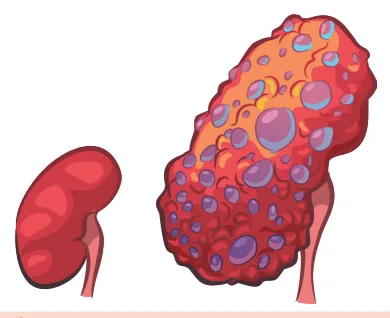

# Doença Renal Crônica

<!-- page:1 -->

## DOENÇA RENAL CRÔNICA I

Doença Renal Crônica (CM) CONCEITO “Anormalidade estrutural ou funcional do rim, com duração superior a 3 meses”

- Estrutural: rim único, rim em ferradura, hipoplasia renal;

- Funcional: proteinúria ou albuminúria; queda da filtração glomerular.

## ESTRATIFICAÇÃO

CATEGORIAS D Risco baixo: VERDE Risco intermediário: AMARELO Risco alto: LARANJA Risco muito alto: VERMELHO G1 Normal ou alta > 90 Levemente

## G2 60 – 90

diminuída Leve G3a Moderadamente 45 – 59 TFGe diminuída (ml/ min/1,73m²) Moderadamente G3b 30 - 44 diminuída G4 Muito diminuída 15 - 29 G5 Falência renal < 15 ETIOLOGIAS

- Hipertensão Arterial Sistêmica (HAS) É a principal causa de DRC dialítica no Brasil; Maior risco em pacientes afrodescedentes ( gene APOL1). Piora lenta e progressiva da função renal com pouca proteinúria Biópsia renal: hipertrofia muscular + fibrose da camada íntima

- Diabetes mellitus (DM) - Doença renal do diabetes (DRD) É a principal causa de DRC dialítica em países desenvolvidos; Apresenta progressão mais rápida TAXA DE FILTRAÇÃO GLOMERULAR ESTIMADA

## (TFGE)

- Cockroft-Gault:

- MDRD: mais utilizada em pacientes idosos

- CKD-EPI (2021): fórmula preferencial, maior correlação com ClCr Idade (anos), sexo, creatinina (mg/dL)

## DE ALBUMINÚRIA

## A1 A2 A3

Moderadamente Muito aumentada Normal aumentada (macroalbuminúria) (microalbuminúria) < 30 mg/g 30 – 300 mg/g > 300 mg/g | Rastreio com albuminúria | DM tipo 1: iniciar o rastreio após 5 anos do diagnóstico;

| DM tipo 2: rastreio ao diagnóstico. | Tratamento: controle pressórico + glicêmico + iECA/BRA + iSGLT2 + finerenone ± semaglutida

- Doença renal policística (DRPAD) Substituição do parênquima renal por cistos com perda de função progressiva e irreversível; Aneurismas intracranianos e cistos hepáticos; Cerca de 80% dos casos são autossômicos dominantes (DRPAD); Genes PKD1 e PKD2.

- Além da DRD e da DRPAD, amiloidose e anemia falciforme são outras etiologias que cursam com rins de tamanho normal/aumentado

---

<!-- page:2 -->

## CONCEITO

CKD-EPI (Chronic Kidney Disease Epidemiology Collaboration) “Anormalidade estrutural ou funcional do rim, com

- Variáveis utilizadas: idade (anos), sexo, duração superior a 3 meses” creatinina (mg/dL)

- Estrutural

- Desde 2021 não necessita de correção por

- Estrutural Rim único, rim em ferradura, hipoplasia renal;

- Funcional Proteinúria ou albuminúria; Queda da filtração glomerular.

## TAXA DE FILTRAÇÃO GLOMERULAR ESTIMADA C

- O cálculo mais simplificado é a partir da E creatinina sérica (Cr) Através deles estimamos o clearance de creatinina (ClCr) Em casos de baixa ou alta massa muscular podemos utilizar a cistatina C

- Na prática clínica temos basicamente Cockroft-Gault: menos utilizada, as fórmulas abaixo possuem melhor correlação com o ClCr MDRD: mais utilizada (idosos) CKD-EPI: mais utilizada

Cockroft-Gault E

- Variáveis utilizadas: idade (anos), peso (kg), creatinina (mg/dL)

- TFGe = (140 - idade) x peso (kg) / creat x 72 Em mulheres, o valor é multiplicado por 0,85

- Por ser mais simples, é a mais passível de ser cobrado cálculo em provas

MDRD (Modification of Diet in Renal Disease)

- Variáveis utilizadas: idade (anos), sexo, raça/etnia, creatinina (mg/dL)

- Mais utilizada em pacientes idosos

- TFGe = 175 × Cr-1.154 × idade-0.203 × 1.212 (se paciente negro*) × 0.742 (se feminino)

Tabela 1: Classificação KDIGO (Kidney Disease: Improving Global Outc CATEGORIAS DE A A1 Risco baixo: VERDE Risco intermediário: AMARELO Norm Risco alto: LARANJA Risco muito alto: VERMELHO < 30 m G1 Normal ou alta > 90 Levemente

diminuída Leve G3a Moderadamente 45 – 59

diminuída (ml/ min/1,73m²) Moderadamente G3b 30 - 44 diminuída G4 Muito diminuída 15 - 29 G5 Falência renal < 15 - Desde 2021 não necessita de correção por raça/etnia.

| A e B são variáveis fixas que se alteram de acordo com sexo e a creatinina

## CLASSIFICAÇÃO

ESTRATIFICAÇÃO POR TFGE | Estádio G1: > 90 ml/min/1,73m². | Estádio G2: 60 – 89 ml/min/1,73m². | Estádio G3a: 45 – 59 ml/min/1,73m².

| Estádio G3b: 30 - 44 ml/min/1,73m². | Encaminhar ao nefrologista | Aumento de complicações da DRC e risco de evoluir para G5.

| Estádio G4: 15 – 29 ml/min/1,73m². | Estádio G5: TFG < 15 ml/min/1,73m². ESTRATIFICAÇÃO POR ALBUMINÚRIA

- A albumina pode ser dosada em urina de 24 horas, ou em urina isolada; Na amostra de urina isolada, a albumina requer correção pelos níveis de creatinina da urina.

- A albuminúria é um preditor independente de mortalidade cardiovascular e progressão da DRC

- Estágios: A1: < 30 mg/g; A2: 30 – 300 mg/g; A3: > 300 mg/g.

- Verificar Tabela 1 comes) de DRC mal aumentada mg/g 30 – 300 mg/g > 300 mg/g

ALBUMINÚRIA 1 A2 A3 Moderadamente Muito aumentada (macroalbuminúria) (microalbuminúria)

---

<!-- page:3 -->

DOENÇA RENAL DO DIABETES Doença Renal do Diabetes no DM2 TFG> 60 com RAC >30 TFG 59-45 TFG 44-30 TFG 29-20 TFG <20 IECA ou BRA são recomendados. IECA ou BRA são recomendados, se IECA ou BRA são recomendados se IECA ou BRA devem ser considerados IECA ou BRA devem ser considerados RAC ≥30, I RAC ≥ 30. Monitorar K e TFG. se RAC ≥ 30. Monitorar K e TFG. se RAC ≥ 30 para proteção CV, até TFG ISGLT2 estão recomendados RAC ≥30, I Suspe R n A d C e r ≥ s 3 e 0 H . i M p independentemente da HbA1c. SGLT2 estão recomendados independentemente da HbA1c. ISGLT2 estã Finerenona deve ser considerada independent em associação com IECA, na Finerenona deve ser considerada em vigência de ISGLT2, se RAC ≥ 30, associação com IECA/BRA, na Finerenona deve e K<=4,8. vigência de ISGLT2, associação com se RAC ≥ 30, e K<=4,8. de ISGLT2, se Semaglutida deve ser considerada em associação com ISGLT2 se RAC Semaglutida deve ser considerada Semaglutida de ≥100, independentemente da HbA1c. em associação com ISGLT2 se após ISGLT RAC ≥ 100, independentemente independent Para controle da HbA1c, é recomendado da HbA1c.

METFORMINA. Meta HbA1c 6,5-7%. Metformina de para reduzir Albuminuria. Para controle da HbA1c, é < recomendado METFORMINA. Meta H insulina, IDPP4, Gliclazida MR, Meta HbA1c 7-7,9%. Insulina, IDPP4, G Glipizida, Glimepirida, Glibenclamida, Pioglitazona, pod Pioglitazona podem ser consideradas insulina, IDPP4, Gliclazida MR, para controle para controle adicional da HbA1c. Glipizida, Pioglitazona podem ser consideradas para controle adicional da HbA1c.

OBSERVAÇÕES: SIGLAS: RAC= Razão albumina/creatinina urinária em mg/g; IECA: Inibidor da Enzima Co Glomerular em ml/min/1,73m²; SU: sulfoniluréias; ISGLT2: Inibidores do SGLT2; IDPP4: Inibidores da DPP4; K

- Se IECA/BRA, monitorizar o K e a creatinina em 2-4 semanas. Se normocalemia e TFG cair <30% dose

- ISGLT2 têm diferentes limites de TFG para iniciar: empagliflozina TFG>20; dapagliflozina TFG>25 e can

- Evitar associar um agonista do GLP-1 com inibidor da DPP-4. A gliclazida MR e a glipizida devem ser u

Figura 1: Tratamento da DRD pela Sociedade Brasileira de Diabete

## CRONICIDADE

## ULTRASSONOGRAFIA

- Perda de diferenciação corticomedular;

- Tamanho reduzido (< 10 cm); DRC com rins de tamanho normal ou aumentado: Diabetes mellitus; Amiloidose; Doença renal policística; Anemia falciforme.

- Hiperecogenicidade do parênquima.

## ETIOLOGIAS

## NEFROESCLEROSE HIPERTENSIVA

- É a principal causa de DRC dialítica no Brasil;

- Há maior risco em pacientes afrodescedentes, por mutação do gene APOL1.

- Causada por mecanismo de lesão vascular decorrente de hipertensão mal controlada de longa data;

- Outras lesões de órgãos-alvo: Retinopatia hipertensiva Hipertrofia de ventrículo esquerdo (VE);

Quadro clínico

- Piora lenta e progressiva da função renal;

- Proteinúria – geralmente < 1g/g.

Biópsia renal

- Hipertrofia muscular associada com fibrose da camada íntima.

## NEFROPATIA DIABÉTICA (DRD)

- É a principal causa de DRC dialítica em países desenvolvidos;

- Também denominada como DRD (doença renal do diabetes);

- Apresenta progressão mais rápida que hipertensão; Há perda de 6 – 8 ml/min ClCr ao ano. Monitorar K e TFG. se RAC ≥ 30. Monitorar K e TFG. se RAC ≥ 30 para proteção CV, até TFG per K ou TFG cair >30%. Suspender se Hiper K ou TFG cair >30%. >15. Monitorar K e TFG. Suspender se hiper K ou TFG cair >30%.

ão recomendados ISGLT2 estão recomendados temente da HbA1c. independentemente da HbA1c. ISGLT2 não devem ser iniciados, mas podem ser mantidos.

e ser considerada em Finerenona deve ser considerada em IECA/BRA, na vigência associação com IECA/BRA, na vigência Finerenona não está recomendada.

RAC ≥30, e K<=4,8. de ISGLT2, se RAC ≥ 30, TFG ≥ 25 e K<4,8. A semaglutida não está recomendada eve ser considerada Semaglutida deve ser considerada em com TFG<15 T2 se RAC>=100, associação com ISGLT2 se TFG>25 e temente da HbA1c. RAC>=100 para proteção renal, Insulina e/ou IDPP-4 estão independentemente da HbA1c. recomendados para controle glicêmico.

eve ser reduzida para Meta HbA1c 7-7,9%. <1g/dia. Meta HbA1c 7-7,9% HbA1c 7-7,9%. Para controle adicional da HbA1c, Gliclazida MR, Glipizida, insulina, IDPP4, outros GLP-1 RA (se Metformina, Pioglitazona e SU não dem ser consideradas não usar semaglutida). estão recomendados.

adicional da HbA1c. Gliclazida MR, Glipizida podem ser consideradas com cautela. onversora da Angiotensina; BRA: Bloqueador do Receptor da Angiotensina II. TFG: Taxa de Filtração K: Potássio.

e pode ser aumentada. Se TFG cair > 30%, retirar e investigar estenose de artéria renal. nagliflozina TFG>35ml/min/1.73m². Ajustes de dose são necessários para os IDPP4, exceto linagliptina.

usadas em doses menores quando a TFG estiver <30ml/min/1.73m². es (2024)

- 80% dos pacientes evoluem com progressão da albuminúria, por isso utilizamos para o rastreio.

Rastreio

- Rastreio com albuminúria

- DM tipo 1: iniciar o rastreio após 5 anos do diagnóstico;

- DM tipo 2: rastreio ao diagnóstico.

Tratamento

- Controle pressórico (meta < 130/80 mmHg | KDIGO:

PAS <120 mmHg)

- Controle glicêmico (HbA1c < 7%) TFGe > 60 mL/min: HbA1c 6,5-7% TFGe < 60 mL/min ou diálise: HbA1c 7-7,9%

- Farmacológico específico: se microalbuminúria (A2)

OU macroalbuminúria (A3)

- iECA (Inibidor da Enzima Conversora de Angiotensina) ou BRA (Bloqueadores do Receptor de Angiotensina). Além de diminuírem proteinúria, retardam progressão da DRC

- Inibidores da SGLT2 (iSGLT2) Evitar nos pacientes DM1: risco aumentado de cetoacidose euglicêmica Empagliflozina (TFGe > 20mL/min/1,73m²) Dapagliflozina (TFGe > 25mL/min/1,73m²)

- Finerenone (antagonista do receptor mineralocorticoide - ARM) Redução da progressão da DRC em associação com iECA/BRA e mais recentemente também em associação com iSGLT2 (jun/2025 - estudo feito com empagliflozina: CONFIDENCE trial) Atentar para o potássio Iniciar se K < 4,8 Suspender se K > 5,5

- Semaglutida (análogo GLP1) Deve ser considerada se albuminúria ≥ 100 apesar de iECA/BRA + iSGLT2

- Verificar Figura 1

---

<!-- page:4 -->

DOENÇA RENAL POLICÍSTICA (DRP) Diagnóstico

- É a 4° causa mais comum de DRC dialítica;

- Com história familiar positiva de DRC

- Substituição do parênquima renal por cistos com | < 40 anos: 3 ou mais cistos/rim perda de função progressiva e irreversível; | 40 – 60 anos: 2 ou mais cistos por rim;

- Demonstram associação com formação de aneurismas | > 60 anos: 4 ou mais cistos por rim.

- Demonstram associação com formação de aneurismas intracranianos e cistos hepáticos;

- Cerca de 80% dos casos são autossômicos dominantes (DRPAD); Genes PKD1 e PKD2.

e Figura 2: Ilustração sugerindo doença renal policística | > 60 anos: 4 ou mais cistos por rim.

## REFERÊNCIAS

Figura 1: Fluxograma de tratamento da DRD pela Sociedade Brasileira de Diabetes (2024) João Roberto Sá, Luis Henrique Canani, Érika Bevilaqua Rangel, Andrea Carla Bauer, Gustavo Monteiro Escott, Themis Zelmanovitz, Sandra Pinho Silveiro, Carolina de Castro Rocha Betônico, Márcio Weissheimer Lauria, Rodrigo Nunes Lamounier, Thyago Proença de Moraes. Avaliação e tratamento da doença renal do diabetes tipo 2. Diretriz Oficial da Sociedade Brasileira de Diabetes (2024). DOI: 10.29327/5412848.2024-6, ISBN: 978-65-272-0704-7.

