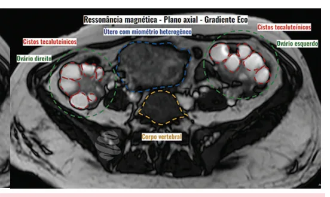
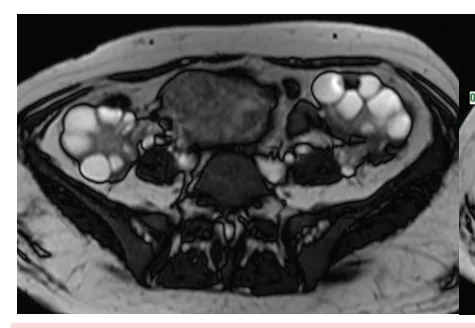
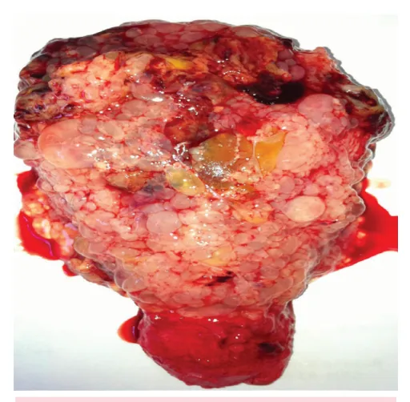
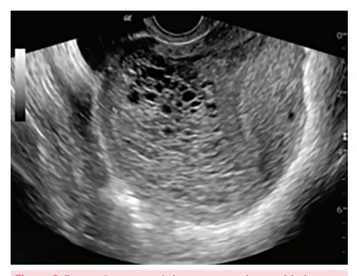

# Doença Trofoblástica Gestacional

<!-- page:1 -->

## Doença Trofoblástica Gestacional

## Resumo

**Doença Trofoblástica Gestacional / Neoplasia Trofoblástica Gestacional**

- Marcador tumoral biológico e específico: **beta-hCG**.

**Mola hidatiforme**: potencial de malignização de 10-20% na completa e 4-8% na incompleta.

- **Mola Hidatiforme Completa**:
  - Potencial de malignização de 10 a 20%;
  - Cariótipo diploide: óvulo vazio + 1 espermatozoide (spz) duplicado ou 2 spz;
  - Origem paterna (46XX em 90% dos casos);
  - Sem óvulo = sem embrião.
- **Mola Hidatiforme Parcial**:
  - Potencial de malignização de 4 a 8%;
  - Cariótipo triploide: óvulo haploide + 1 spz duplicado ou 2 spz (69XXX, 69XXY, 69XYY) e expressa gene p57.

**Diagnóstico de Neoplasia Trofoblástica Gestacional (NTG):**

- Elevação de beta-hCG (≥ 10%) em ≥ 3 dosagens consecutivas: D1, D7, D14;
- Platô (variação < 10%) em ≥ 4 aferições, por pelo menos 3 semanas: D1, D7, D14 e D21;
- Diagnóstico histológico de coriocarcinoma;
- Evidência de metástases.
- No diagnóstico de coriocarcinoma ou de metástase pulmonar, indica-se a realização de RNM de SNC e de abdome.

**Tratamento:**

- Esvaziamento uterino com dilatação mecânica + imunoglobulina se necessário + contracepção e seguimento pós-molar;
- Histerectomia total, se prole constituída.

**Seguimento:**

- Beta-hCG semanal/quinzenal; após 3 valores normais → mensal por 6 meses;
- Contracepção por 12 meses após negativação do beta-hCG.

## Definição

- Anomalia proliferativa que acomete as células que compõem o tecido trofoblástico placentário;
- Apresenta um marcador tumoral biológico muito específico: beta-hCG.

## Fatores de Risco

- Idade avançada;
- DTG prévia.

## Quadro Clínico

- Útero aumentado para a idade gestacional (IG);
- Cistos tecaluteínicos: em resposta ao hiperestímulo ovariano do hCG (efeito LH-like);
- Náuseas e vômitos;
- Hipertireoidismo (efeito TSH-like);
- Pré-eclâmpsia com IG < 20 semanas;
- Vesículas hidrópicas vaginais.

Figura 1: Cistos tecaluteínicos vistos à ressonância magnética - sequência gradiente eco, em que podemos observar o útero (azul) com miométrio heterogêneo, associado a ovários (verde) de dimensões aumentadas às custas de cistos tecaluteínicos (vermelho).

---

<!-- page:2 -->

## Formas Clínicas

- Mola Hidatiforme: parcial ou completa;
- Mola Invasora;
- Coriocarcinoma;
- Tumor trofoblástico do sítio placentário;
- Tumor trofoblástico epitelioide.

## Mola Hidatiforme

- Potencial de malignização: 10-20% na completa e 4-8% na incompleta.

**Mola Completa**

- Cariótipo diploide: óvulo vazio + 1 espermatozoide duplicado ou 2 espermatozoides;
- Tumor de origem paterna: cariótipo diploide (46XX em 90% dos casos);
- Sem óvulo = sem embrião.

Figura 2: Formações anecogênicas permeando a cavidade endometrial, sinal sugestivo de "flocos de neve" da mola completa.

Figura 3: Macroscopia de mola hidatiforme completa após aspiração intrauterina.

**Mola Parcial**

- Cariótipo triploide: óvulo haploide + 1 espermatozoide duplicado ou 2 espermatozoides (69XXX, 69XXY, 69XYY) e expressa gene p57;
- Feto presente;
- Menos vesículas;
- Diagnóstico mais tardio.

Figura 4: Macroscopia de mola parcial após esvaziamento uterino.

## Tratamento

- Esvaziamento intrauterino com seguimento pós-molar.

**Fluxo de Tratamento da Mola Hidatiforme**

- Anamnese, exame físico completo, incluindo exame ginecológico;
- Exames complementares: hemograma, tipagem sanguínea e fator Rh, beta-hCG quantitativo, TSH, T4L, HIV, sífilis, radiografia de tórax (especialmente se altura uterina for > 16 cm);
- Para o esvaziamento uterino, pode-se realizar dilatação mecânica e evitar misoprostol; esvaziamento por aspiração e não por curetagem;
- Usar ocitocina após o esvaziamento;
- Histerectomia profilática: para pacientes > 40 anos, com prole constituída e sem desejo reprodutivo futuro.

Figura 5: Seguimento da Mola Hidatiforme.

- Durante o seguimento pós-molar, é imprescindível a contracepção; anticoncepcionais orais hormonais são os ideais;
- Paciente estará liberada para nova gestação após 6 meses de beta-hCG negativo.

---

<!-- page:3 -->

## Estadiamento

Tabela 1: Estadiamento de Neoplasia Trofoblástica Gestacional (FIGO).

> ⚠️ Tabela reconstruída a partir de OCR — confira contra a fonte original.

**Estadiamento anatômico (FIGO):**

- **Estádio I**: doença restrita ao corpo do útero;
- **Estádio II**: NTG que se estende à pelve, vagina, anexos, ligamento largo (envolvimento genital);
- **Estádio III**: NTG com extensão para os pulmões, com ou sem envolvimento genital;
- **Estádio IV**: todos os outros locais de metástases.

**Escore de risco:**

| Fator | Score 0 | Score 1 | Score 2 | Score 4 |
|---|---|---|---|---|
| Idade (anos) | < 40 | ≥ 40 | – | – |
| Gestação anterior | Mola | Aborto | Termo | – |
| Intervalo (meses) entre gestação antecedente e NTG | < 4 | 4-6 | 7-12 | > 12 |
| Beta-hCG (UI/L) pré-tratamento | < 10³ | 10³-10⁴ | > 10⁴-10⁵ | > 10⁵ |
| Maior tumor (cm), incluindo útero | – | 3-4 cm | ≥ 5 cm | – |
| Sítio de metástases | – | Baço, rim | Gastrintestinal | Cérebro, fígado |
| Número de metástases | – | 1-4 | 5-8 | > 8 |
| Falha da QT | – | Agente único | Dois ou mais | – |

NTG: neoplasia trofoblástica gestacional; QT: quimioterapia. Adaptado de: FIGO Oncology Committee. FIGO staging for gestational trophoblastic neoplasia 2000. Int J Gynaecol Obstet. 2002;77(3):285-7.

## Neoplasia Trofoblástica Gestacional (NTG)

- **15% a 40%** das pacientes desenvolvem NTG pós-molar.

## Definição

- Elevação beta-hCG (≥ 10%) em ≥ 3 dosagens consecutivas: D1, D7, D14;
- Platô (variação < 10%) em ≥ 4 aferições, por pelo menos 3 semanas: D1, D7, D14 e D21;
- Diagnóstico histológico de coriocarcinoma;
- Evidência de metástases.
- Se for feito o diagnóstico de coriocarcinoma ou for identificada metástase pulmonar, estão indicadas ressonâncias de sistema nervoso central e de abdome.

## Tratamento

- **NTG não metastática**: quimioterapia (QT) ou histerectomia total. Devem-se pesar os riscos e benefícios, dando-se preferência ao tratamento cirúrgico para pacientes mais velhas e com prole constituída;
- **NTG metastática**: QT +/- radioterapia (RT);
- **Coriocarcinoma**: pode ser necessária histerectomia total + QT (QT = metotrexato ou actinomicina D);
- Gestação somente 12 meses após beta-hCG negativo.

## Referências

Figura 1: Cistos tecaluteínicos vistos à ressonância magnética. Fonte: WEERAKKODY, Y.; LAZIC, S.; YAP, J.; et al. Theca lutein cyst. Radiopaedia.org. Disponível em: https://doi.org/10.53347/rID-13181. Acesso em: 23 jun. 2025.

Figura 2: Formações anecogênicas permeando a cavidade endometrial, sinal sugestivo de "flocos de neve" da mola completa. Fonte: BRAGA, Antônio et al. Doença trofoblástica gestacional - atualização. Revista Hospital Universitário Pedro Ernesto (HUPE), v. 13, n. 3, 2014.

Figura 3: Macroscopia de mola hidatiforme completa após aspiração intrauterina. Fonte: BRAGA, Antônio et al. Doença trofoblástica gestacional - atualização. Revista Hospital Universitário Pedro Ernesto (HUPE), v. 13, n. 3, 2014.

Figura 4: Macroscopia de mola parcial após esvaziamento uterino. Fonte: BRAGA, Antônio et al. Doença trofoblástica gestacional - atualização. Revista Hospital Universitário Pedro Ernesto (HUPE), v. 13, n. 3, 2014.
