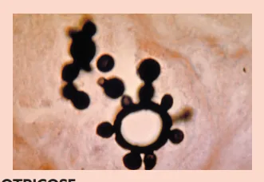
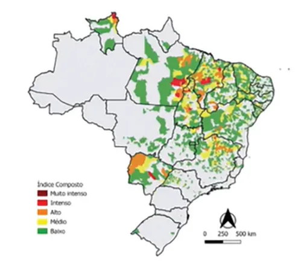
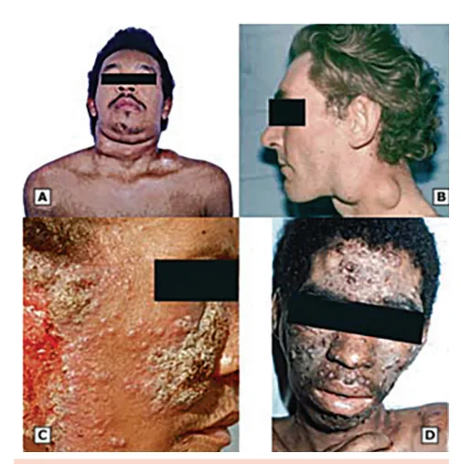
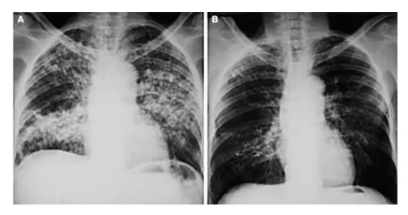
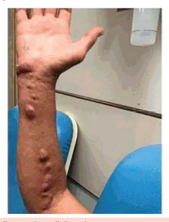
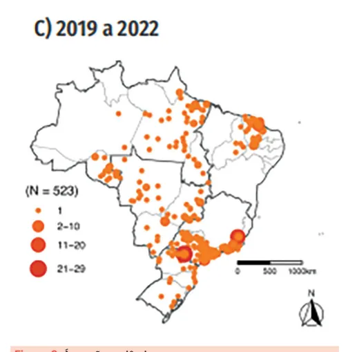
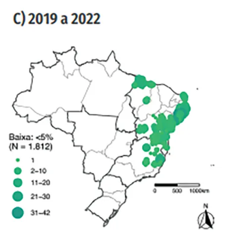

# Doenças Negligenciadas

<!-- page:1 -->

> ⚠️ Conteúdo desta página reconstruído a partir de OCR de duas colunas — confira contra a fonte original.

## Leishmaniose

- 2 formas (visceral e cutânea);
- **Visceral**: FOI + esplenomegalia + desnutrição, interior do NE e CE;
- **Cutânea**: úlcera crônica - nasofaringe, tronco ou membros – arredondada e indolor;
- **Diagnóstico**:
  - Padrão-ouro: visualização de formas amastigotas (ovalares) intramacrofágicas em mielograma / biópsia da lesão;
  - Visceral: rK-39;
  - Cutânea: reação de Montenegro;
- **Tratamento**: glucantime, anfotericina B, miltefosina;
  - Glucantime é 1ª opção por farmacoeconomia;
  - Anfotericina B é 1ª opção em imunossuprimidos;
  - Miltefosina é a única opção via oral: forma cutânea contida (até 3 lesões); não pode ser gestante, nem ter ClCr < 30, nem ser cirrótico; em imunocomprometidos: apenas se falha com outro tratamento prévio.

## Paracoccidioidomicose

- Atividades agrícolas, homens, doença espectral.

**Forma aguda**

- Acometimento mais sistêmico, pacientes mais jovens;
- Linfonodomegalia em cadeias profundas e superficiais, podem fistulizar - diagnóstico diferencial com linfoma;
- Hipertrofia do sistema retículo-endotelial (hepatoesplenomegalia);
- Úlceras periorais, tronco e MMSS dolorosas (diferente da leishmaniose);
- Suprarrenal (síndrome de Addison);
- Óssea (diferenciar de espondilodiscite por TB);
- **Dx**: leveduras com brotamento por gemulação múltipla, birrefringentes, "roda de leme" — aspirado de linfonodo, biópsia, escarro;
- **Tratamento**: itraconazol (doença localizada), anfotericina B (doença sistêmica).

**Forma crônica**

- Maior prevalência;
- Pulmonar; diferencial com FPI / DPOC.

## Esporotricose

- Jardinagem ou veterinários, MMSS, linfangite ascendente;
- Itraconazol por tempo muito prolongado.

## Esquistossomose

- Região litorânea do NE;
- Dermatite por cercária (forma infectante): urticariforme (MMII) + eosinofilia na fase aguda;
- Cirrose pré-sinusoidal com aumento do lobo esquerdo, complicações de hepatopata;
- Dx por exame de fezes - Kato-Katz;
- Complicações: mielopatia (cauda equina), salmonelose recorrente, síndrome nefrótica e hipertensão pulmonar (embolização);
- **Tratamento**: praziquantel; tratar toda a população empiricamente se prevalência local > 25%.

---

<!-- page:2 -->

> ⚠️ Conteúdo desta página reconstruído a partir de OCR de duas colunas — confira contra a fonte original.

## Leishmaniose

### Epidemiologia

- Atenção para nordeste, centro-oeste, interior do sudeste e região amazônica → doença de regiões mais centrais, não ocorrendo com frequência em faixa litorânea;
- Urbanização da leishmaniose, principalmente no interior da região sudeste.

> Figura 1: Incidência de leishmaniose.

### Visão Geral

- **Vetor**: flebotomíneo (mosquito palha ou birigui);
- **Reservatório**: cão;
- Existem mais de 20 espécies de *Leishmania*:
  - Leishmaniose visceral: *L. chagasi* e *L. donovani*;
  - Leishmaniose cutânea: *L. amazonensis* e *L. brasiliensis*.

### Fisiopatogenia

- O tipo de resposta CD4 é outro fator que influencia no desenvolvimento ou não de doença visceral:
  - **Th2** (resposta predominantemente humoral): pólo anérgico, porque faz uma resposta humoral, mas, como se trata de um parasita intracelular (intramacrofágico), não é uma resposta efetiva; resulta na doença disseminada, seja cutânea disseminada (> 3 lesões) ou visceral;
  - **Th1** (resposta imune celular): a resposta imune celular produz ativação de macrófagos e secreção de citocinas inflamatórias protetoras; resolve/contém a infecção → faz no máximo a doença cutânea localizada.

### Clínica

- **Febre de origem indeterminada (FOI)**: é um parasita do sistema retículo-endotelial:
  - Baço – esplenomegalia;
  - Medula óssea – pancitopenia;
  - Fígado – desnutrição/hepatomegalia.
- **Cutânea**: inicia como um eritema local, que evolui para pápula e depois um nódulo que ulcera;
- **Acometimento mucocutâneo** atinge orofaringe, nasofaringe, palato, face, extremidades. Úlcera de desenvolvimento crônico, com evolução em 3 meses a 2 anos;
- Lesão infiltrativa de bordas elevadas com fundo granulomatoso/purulento. Indolor, bem ovalada.

> **OBS.**: Toda e qualquer úlcera em qualquer lugar com tempo > 4 semanas deverá ser biopsiada, preferencialmente na borda da lesão (região mais ativa). A região central é mais necrótica.

### Diagnóstico

- Biópsia de lesão / aspirado de medula: visualização de formas amastigotas intramacrofágicas — padrão-ouro;
- Reação intradérmica de Montenegro: avalia hipersensibilidade tardia (avalia imunidade celular, tipo IV), igual ao PPD da tuberculose; é o tipo de resposta efetiva para conter a infecção: quem faz resposta imune celular não faz forma visceral e, se fizer forma cutânea, faz poucas lesões;
- Sorologia: avalia presença de anticorpos, contato prévio; não diferencia doença ativa ou passada; por ser um parasita intracelular, a presença de anticorpos não é efetiva para conter a infecção; quem faz apenas resposta imune humoral pode fazer forma visceral e, se fizer forma cutânea, pode evoluir com diversas lesões.

> ⚠️ Tabela reconstruída a partir de OCR — confira contra a fonte original.

| Forma clínica | Reação de Montenegro | Sorologia (ELISA rK-39) |
|---|---|---|
| Cutânea contida | Positiva | Negativa |
| Visceral ou cutânea disseminada | Negativa | Positiva (paciente imunossuprimido/linfopênico pode ter rK-39 falso negativo) |
| Mucosa | Fortemente positiva | Biópsia frequentemente negativa |

No geral, o diagnóstico é firmado com parasitológico, identificando formas amastigotas intramacrofágicas, por meio de: mielograma; aspirado esplênico; biópsia da borda da lesão.

### Tratamento

**Antimonial pentavalente**: N-metil glucamina (glucantime), durante 20 dias.

- Preconizado pelo Ministério da Saúde por questão de farmacoeconomia;
- Realizado intralesional, se houver até 3 lesões, de até 3 cm;
- Contraindicações:

---

<!-- page:3 -->

> ⚠️ Conteúdo desta página reconstruído a partir de OCR de duas colunas — confira contra a fonte original.

- Gestantes;
- Insuficiência renal;
- Insuficiência cardíaca (miotóxica - alarga QRS);
- Insuficiência hepática.

> **OBS.**: glucantime pode se acumular em tecidos (causa miosite, pancreatite aguda e hepatite) e tem maiores chances de falha clínica em imunossuprimidos.

**Alternativa: Anfotericina B lipossomal e pentamidina (EV)**

- Preferencial em casos de PVHIV. Está ganhando destaque como tratamento preferencial de forma geral: respostas individuais variáveis à glucantime — em PVHIV tratados com glucantime, temos quase 30% de reincidivas em 6 meses;
- Lembrar que é cardiotóxica (ECG), nefrotóxica (como a leptospirose - não oligúrica, com hipocalemia) e hepatotóxica.

**Miltefosina**

- VO, por 28 dias para casos de leishmaniose cutânea;
- Contraindicada se gestante, DRC com ClCr < 30, cirróticos;
- Imunocomprometidos: após falha; a miltefosina somente poderá ser utilizada por pacientes imunocomprometidos após falha terapêutica caracterizada do tratamento convencional, já que a experiência do uso terapêutico desse medicamento nessa população é limitada.

**Seguimento**

- Avaliação clínica em 3-6-12 meses, e a cura é presuntiva (por melhora dos sintomas).

## PLECT — Introdução

- Acrônimo PLECT para diagnóstico diferencial de "úlcera nojenta e crônica": **P**aracoccidioidomicose, **L**eishmaniose, **E**sporotricose, **C**romoblastomicose e **T**uberculose.

> Figura 2: Paracoccidioidomicose.
> Figura 3: Forma crônica.

## PLECT — Paracoccidioidomicose

- *Paracoccidioides lutzii* (P. lutzii) e o complexo *Paracoccidioides brasiliensis*;
- Doença ocupacional → atividades do solo/agrícolas;
- Ocorre por inalação dos conídios, que viram leveduras e se reproduzem por brotamento múltiplo.

### Clínica — Doença Espectral

**Forma aguda**

- Indivíduos de 20-30 anos: doença mais sistêmica;
- Linfonodomegalias intratorácicas, cervicais: diferencial com linfoma;
- Quadros abdominais obstrutivos (linfonodomegalia intra-abdominal), disabsortivos;
- Insuficiência adrenal: muitas vezes cobrada em provas;
- Espondilodiscite: diferenciar de tuberculose, muito raro.

**Forma crônica** (indivíduos > 40 anos)

- Acometimento pulmonar, fibrosante, intersticial.

### Diagnóstico

- Micológico direto: diversas amostras são válidas (o que der está valendo): cultura de escarro fresco; raspado de lesão; aspirado de linfonodos ou abscessos;
- Leveduras birrefringentes com brotamento por gemulação múltipla (roda de leme, "orelha de Mickey"). Lesões múltiplas, circulares, úlcero-crostosas, em face e MMSS, bordas elevadas e fundo granulomatoso, mas não tão secretivo; muitas vezes dolorosas.

### Tratamento

- Anfotericina B (doença generalizada) ou itraconazol (doença localizada).

## PLECT — Esporotricose

- *Sporothrix schenckii*.

---

<!-- page:4 -->

> ⚠️ Conteúdo desta página reconstruído a partir de OCR de duas colunas — confira contra a fonte original.

- Fungo associado a atividades de jardinagem e veterinária;
- Pápula no lugar da inoculação que pode ou não ulcerar, com secreção purulenta. Surge linfangite ascendente, com diversas pápulas no trajeto linfático. Raspado da borda da lesão costuma ser incaracterístico, assim, o diagnóstico deve ser feito com cultura;
- Itraconazol ou anfotericina B por até 4 semanas após resolução das lesões.

**Complicações**

- Superinfecção bacteriana (salmonela) - doença febril aguda/subaguda, artralgia, mialgia e rash.

> Figura 4: Esporotricose linfocutânea.

## Esquistossomose

- Área endêmica e área não endêmica.
- Verificar Figura 5 e Figura 6 na próxima página.

### Agente Etiológico

- *Schistosoma mansoni* – caramujo *Biomphalaria* – lagoas de coceira (águas paradas);
- Presente mais em região litorânea do nordeste e no norte do sudeste.

### Quadro Clínico

- Penetração → dermatite urticariforme em membros inferiores (MMII). Tratamento sintomático;
- Fase aguda → > 80% assintomática: astenia; cefaleia; anorexia; náuseas; púrpuras pruriginosas em MMII; eosinofilia;
- **Forma hepatoesplênica**: fibrose pré-sinusoidal com predomínio no lobo esquerdo (hipertensão portal, circulação colateral, varizes de esôfago e hemorragia digestiva alta, ascite/encefalopatia);
- Métodos diretos de parasitológico de fezes: métodos de Kato-Katz, Lutz ou Hoffman; sorologia por ELISA: bom VPN (valor preditivo negativo);
- Síndrome nefrótica - hipoproteinemia sem compensação lipídica por acometimento hepático;
- Complicações de cirrose;
- Mielite transversa (cauda equina) - dor lombar, perda de força, disfunção vesical e desmotilidade intestinal.

### Tratamento

- Praziquantel (preferível): menos efeitos adversos e melhor custo-benefício do que oxamniquine;
- Estratégia de tratamento conforme o percentual de soropositividade na população:
  - < 15% → tratar somente os indivíduos com exame parasitológico de fezes positivo;
  - 15-25% → tratar os indivíduos com exame parasitológico de fezes positivo e os conviventes;
  - > 25% → tratar todos os indivíduos da localidade.

## Doença de Chagas

- **Agente etiológico**: *Trypanosoma cruzi*;
- Chagoma de inoculação → sinal de Romanã;
- **Forma aguda**: miopericardite, encefalite, hepatoesplenomegalia, alterações em ECG (BRD + BDAS); alta parasitemia;
- **Forma crônica** = diagnóstico por sorologia:
  - Forma cardíaca;
  - Forma intestinal (megaesôfago e megacólon);
  - Forma indeterminada (só sorologia positiva, sem qualquer manifestação clínica).

> ⚠️ Tabela reconstruída a partir de OCR — confira contra a fonte original.

| Conduta | Recomendação |
|---|---|
| Forma aguda | Sempre tratar com benznidazol |
| Forma cardíaca crônica inicial | Ponderar tratamento |
| Forma indeterminada ou digestiva | Tratar pacientes com menos de 50 anos |
| Forma cardíaca crônica avançada / indeterminada ou digestiva com mais de 50 anos | Não tratar |

## Notificação

- Monitorar nível endêmico: semanal;
- Esquistossomose (notificação semanal);
- Leishmaniose tegumentar americana (notificação semanal);
- Leishmaniose visceral (notificação semanal);
- Paracoccidioidomicose (notificação semanal).

---

<!-- page:5 -->

> Figura 5: Área endêmica.

## Referências

Figura 1: Incidência de Leishmaniose. Ministério da Saúde.

Figura 2: Paracoccidioidomicose. Consenso Brasileiro de Paracoccidioidomicose, 2017.

Figura 3: Forma crônica. Clin Infect Dis 2003; 37:898.

Figura 4: Esporotricose linfocutânea. Prova USP-RP 2021.

Figura 5: Área endêmica. Sistema de Informação do Programa de Vigilância e Controle da Esquistossomose - SISPCE/SVS/MS.

Figura 6: Área não endêmica. Sistema de Informação do Programa de Vigilância e Controle da Esquistossomose - SISPCE/SVS/MS.

Figuras CofExpress. Imagens agrupadas: MEDSCAPE. Tropical Splenomegaly Syndrome. 2021. Disponível em: https://www.medscape.com. Acesso em: 28 jul. 2025.

Imagem CofExpress: Paracoccidioidomicose: aspecto de "timão de navio" ou "roda de leme". WIKIMEDIA COMMONS. Paracoccidioides brasiliensis. 2021. Disponível em: https://upload.wikimedia.org/wikipedia/commons/4/49/Paracoccidioides_brasiliensis_01.jpg. Acesso em: 28 jul. 2025.

