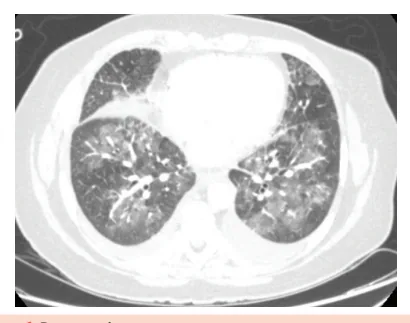
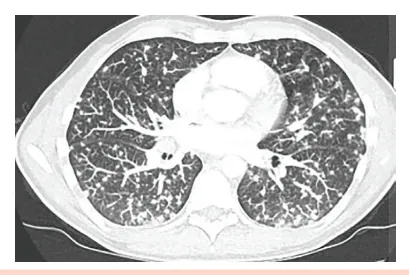
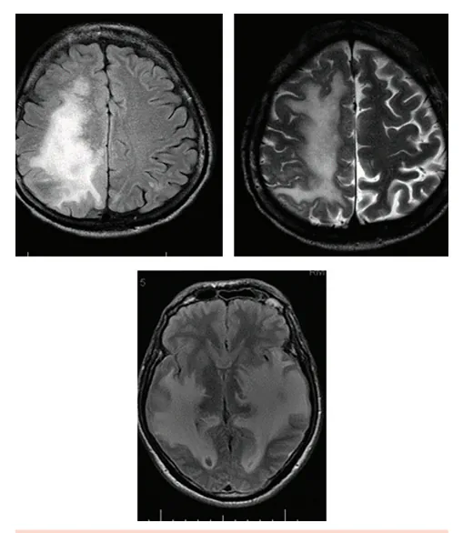
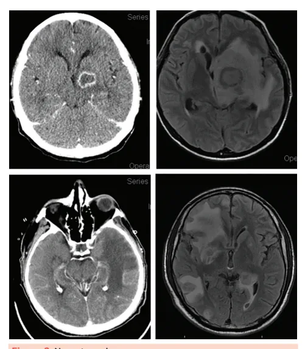
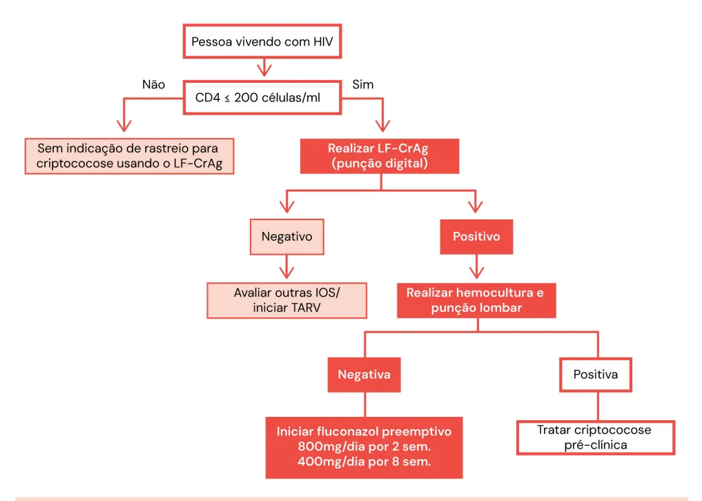
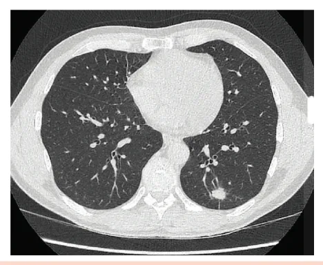

# Doenças Oportunistas HIV

<!-- page:1 -->

Doenças Oportunistas no HIV (CM) PULMÃO

- Se LF +, indicar punção

- Pneumocistose (PCP) = febre baixa subaguda + | cultura + tinta da china dispneia dessaturação com Rx de tx normal + DHL: | Se algum positivo(leveduras encapsuladas) - Dx: clínico-radiológico = TC com asa de tto com anfotericina B lipossomal + fluconazol borboleta (vidro-fosco central); LBA possível / 5-flucitosina Tratamento: bactrim (sulfametoxazol- | Aguardar de 4-6 semanas para iniciar TARV trimetropina) + corticoide (pO2 < 70) 5 dias / | cultura em LCR negativa + melhora alternativo : clinda + primaquina: neurológica de HIC Possível piora no 3º-5º dia, melhora após.

(PCR pneumocysti); | Se LCR negativo: fluconazol preemptivo

- LEMP: déficits neurológicos progressivos e

- Histoplasmose: quadro clínico semelhante, com cumulativos. Acometimento substância branca, T2 pancitopenia / pápulas / esplenomegalia: e FLAIR. Vírus JC. Tratamento = TARV Parasita do sistema retículo-endotelial -

- Linfoma 1ºrio SNC: igual NTX. Lesão única esplenomegalia - aumento de ferritina, DHL; subcortical. Sem edema. EBV (anti-VCA). TC com mcironódulos difusos, pode SIRI:

formar cavitações

- Piora inflamatória de 4-8 semanas após início de diferencial com TB miliar TARV, principalmente se CD4 < 100. Corticoide! Dx: aspirado de medula óssea com leveduras; Suspender TARV apenas se neurocripto ou neuroTB. Tratamento : anfotericina B lipossomal TGI:

(itraconazol casos leves).

- Principal causa de disfagia : candidíase (fluconazol

- Lembrar ainda: empírico 14 dias – CMV (CD4 < 50 , infiltrado em em micronódulos EDA se refratariedade);

/ vidro fosco localizado) - ganciclovir, avaliar

- Principal causa de úlceras : CMV fundo de olho; | Mas úlceras em TGI podem ser herpes simples

NeuroAIDS: (ou o próprio HIV)

- Neurotoxo: sinal neurológico focal / crise | bx sempre - ganciclo / aciclovir / TARV convulsiva - lesão em núcleos da base com | CMV : viremia não é doença! Pode ter lesão realce anelar, edema que desvia linha média - por CMV com CV em sangue negativa associar corticoide: Profilaxias oportunistas: Dx clínico-radiológico: PCR em LCR é ruim (<

- Pulmão: PCP : sulfametoxazol-trimetropina se refratariedade (diferenciar de linfoma SNC); cels : itraconazol; Tratamento: sulfadiazina + pirimetamina + ac.

60%) - prova terapêutica por 2-3 semanas - bx (bactrim) 3x/ semana / Histoplasmose se CD4 < 150

- NeuroAIDS: neurotoxo : bactrim 1-2x/dia / folínico / bactrim / clindamicina + pirimetamina. Neurocritpto : fluconazol ad. eternum;

- Neurocritpo: principal causa de meningismo

- CMV: sempre pesquisa ativa de retinite se Pesquisar fase pré-clínica para evitar de inicar

(cefaléia, HIC) CD4 < 50 cels

- ILTB se CD4 < 350 LF-Crag se CD4 < 200:

TARV e ter SIRI (reconstituição imune) TB pulm. RIPE TARV Localidades CD4<50cels Ideal remotas NEURO TB RIPE TARV TARV TARV CRIPTO Fluco+anfo TARV PCP Bactrim TARV NTX Bactrim/sulfa TARV Em até 7 dias 14 dias 4-6 sem 8 sem

---

<!-- page:2 -->

## PULMÃO

| Úlceras orais; | Esplenomegalia. PNEUMOCISTOSE

- Radiologia:

- Agente etiológico: fungo, pneumocystis jirovecii; | Infiltrado micronodular difuso;

- História clínica: | Em alguns casos há nódulos confluentes;

- História clínica: Dispnéia + emagrecimento + tosse seca + febre; Subagudo (1-3 semanas).

- No exame físico: Nada em ausculta (é padrão intersticial); Atentar para taquidispneia e dessaturação; Comumente vemos candidíase oral.

- Na radiologia: Dissociação clínico-radiológica: o paciente em si está mal, está fraco/consumido, dispneico, dessaturando com Rx de Tx normal; TC com infiltrado bilateral central em vidro fosco

(asa de borboleta).

- Laboratório inespecífico: Aumento de DHL; CD4 < 200; PaO2 baixa.

- Diagnóstico: clínico-radiológico: Confirmatório (pouco realizado, mas altamente sensível): PCR em LBA.

- I

Figura 1: Pneumocistose

- Tratamento: Bactrim - sulfametoxazol-trimetropina por 21 dias Bactrim é sulfa, e, como efeito colateral, causa muita alergia cutânea, nefrite intersticial aguda, intolerância gástrica e flebite; alternativa: clindamicina + primaquina. Associar prednisona 40mg de 12/12h por 5 dias se PaO2 ≤ 70mmHg.

IRA, síndrome de steven-johnson, hipercalemia, Atenção. O paciente pode piorar no 3°- 5° dia de tratamento! Espera-se melhora a partir do 7o dia.

## HISTOPLASMOSE

- História clínica: semelhante à PCP: Emagrecido + tosse seca subaguda + febre diária + dispnéia.

- Exame físico: mais florido - pneumocystis é exclusivo pulmonar, histoplasma é sistêmico! MV + com roncos / estertores difusamente; Pele: Pápulas / placas eritematosas; | Em alguns casos há nódulos confluentes; Diagnóstico diferencial: TB, criptococose,

CMV, paracocco. Figura 2: infiltrado micronodular difuso

- Laboratório geral: CD4 < 100 - 150; Pancitopenia pronunciada; DHL aumentado; Ferritina aumentada.

- Diagnóstico: Aspirado de medula com pesquisa e cultura de fungos; LBA – pesquisa e cultura de fungos; Sorologia – imuno e contraimuno (positivo em 60% dos casos).

- Tratamento: Geral: Itraconazol; Casos mais graves: Anfotericina B lipossomal.

## INFECÇÕES OPORTUNISTAS NO

## SNC

## NEUROTOXOPLASMOSE

- Agente etiológico: protozoário, Toxoplasma gondii;

- História clínica: Alteração motora / fala / convulsão; Duração >1 semana; Confusão mental; Febre.

- Exame físico: Sinal neurológico focal; Ausência de meningismo; Altíssima soroprevalência (IgG +).

- Laboratório geral: IgG positivo para toxoplasmose; CD4 < 100.

- Radiologia: Lesão focal, única / múltipla, centro hipodenso e realce anelar, com muito edema perilesional; Atinge preferencialmente gânglios da base; Antes de analisar LCR de qualquer paciente soropositivo, deve-se solicitar uma TC de crânio.

---

<!-- page:3 -->

Figura 4: Linfoma primário de SNC. Figura 3: Neurotoxoplasmose

- Laboratório confirmatório é raramente feito na prática, PCR positivo em LCR só em 60%. Diagnóstico é clínico-radiológico;

- Tratamento empírico: Prova terapêutica por 2-3 semanas com clindamicina + pirimetamina; Diagnóstico por melhora clínica; Se não houver melhora, é necessário fazer Figura 5: LEMP. Associar corticoide devido ao edema perilesional.

Sulfadiazina + pirimetamina + ácido folínico OU bactrim (sulfametoxazol-trimetropina) OU biópsia estereotáxica para pesquisar diagnóstico diferencial; NEUROCRIPTOCOCOSE

- Agente etiológico: fungo, cryptococcus;

(principalmente neoformans) LINFOMA PRIMÁRIO DE SNC E LEMP (CD4 < 50

- Pensar quando há neuro-AIDS sem lesão focal e

CELS) com meningismo;

- Linfoma de SNC:

- História Clínica: Sem febre; | Marcada hipertensão intracraniana (cefaléia Sempre associado ao EBV (avaliar o antiVCA+) intensa e refratária, progressiva, com RNC); Lesão idêntica à da neurotoxo, mas aqui | Sem febre;

costuma ser única, subcortical, sem muito | Sem alteração focal. edema perilesional;

- Exame físico: Diagnóstico é por biópsia. | Sem sinal neurológico focal;

- LEMP (leucoencefalopatia multifocal progressiva): | Presença de meningismo. Déficits neurológicos focais,

- Laboratório geral: Causada pelo vírus JC (poliomavírus);

progressivos e cumulativos; | CD4 < 200.

- Radiologia: Sem febre; | Sem lesão focal (apagamento de sulcos); Doença desmielinizante (história de | Herniação;

semanas-meses); | Sem desvio de linha média.

- RM com lesão em dedo-de-luva em

- Diagnóstico:

substância branca; | Fase pré-clínica: por ser uma das principais

- Diagnóstico é por clínica + PCR de vírus JC no LCR.; causas de sind. da reconstituição imune com

- Tratamento é otimizar a TARV. subdiagnóstico, é preconizado o LF-Crag em CD4 Se LF-Crag positivo: LCR:

<200 cels, em quem nunca teve cripto prévia.

---

<!-- page:4 -->

Figura 6: Uso do LF-Crag para detecção pré-clínica de neurocripto pelo PCDT HIV 2023

- Se cultura ou tinta da china +: tratamento;

- Se ambos negativas: fluconazol preemptivo. Fase clínica: TC + LCR com pressão de abertura muito elevada+ antigenemia positiva (>1:128) + cultura da china;

(5-7 dias) + microbiológico direto com tinta

- Pior prognóstico se leucócitos < 20 em LCR ou título

> 1:1024.

- Verificar Figura 6

- Tratamento muito prolongado: Fase intensiva: Indução com anfotericina B lipossomal + 5-flucitosina (ou fluconazol) = pelo menos 2 até 4 semanas (até negativação de cultura Figura 7: Criptococose pulmonar. Fase de consolidação e fase de manutenção: ambas realizadas com fluconazol, variando a dose. Somam

em LCR);

- A criptococose também pode se manifestar de um período > 1 ano; forma generalizada: Não associar corticoide: menor taxa de | Acometimento cutâneo: pápulas umbilicadas; TARV: 4-6 semanas depois. Melhora clínica, micronódulos subpleurais.

cura microbiológica; | Acometimento pulmonar: nódulos/ resolução da HIC. Cultura de LCR negativa.

---

<!-- page:5 -->

## SISTEMATIZANDO A NEURO-AIDS

- Ocorre, principalmente, quando CD4 < 50;

- Quadro mais comum, mas CMV é sistêmico, podendo causar também: Encefalite;

História subaguda de sinal História cefaleia e | Neurorretinite; neurológico focal meningismo, com RNC neurológico focal meningismo, com RNC Neurotoxo Neurocripto ° Fala/parte Neuro TB Muita HIC motora ° Pares cranianos ° Sem ° Sem lesão focal meningismo ° Meningismo + ° Lesão focal com ° Vasos da base edema s ° u ° L C b i L D n c e f e 4 o s o d ã r m < t e o + ic 5 m a ú a 0 S n a l , , i N E s c e B C a m V , d s e c u s u c ° m b ° m r D L a ô L i é E e u g n e fi M l l u i s i a c n c d ã t P o i i i o o z t v s a s s o , n s - t e ° Dis D fu e n m ç ê ã ° n o T c d t ° i o a e e C : ( x a a T V H e s A t A c e n s R u N n o o V t ç c D i L v ã ( i ) C a D a o d R R + a N c a ) o o g H ni I t V iv a + Figura 8: Sistematizando a Neuro-AIDS

## SIRI (IRIS) - SÍNDROME DA

## RECONSTITUIÇÃO IMUNE

- Piora inflamatória, de início 2-4 semanas após TARV, em vigência de outra infecção grave, com piora dos sintomas e lesões, adenopatia generalizada e febre, podendo levar ao óbito;

- Tratamento com corticoide;

- Quanto tempo eu espero, de tratamento da doença oportunista, para iniciar a TARV? Neuro TB: 4-6 semanas; 2 semanas se CD4 < 50 cels. Neurocriptococose: 4-6 semanas; LCR com cultura negativa; HIC controlada;

## DISFAGIA E ACOMETIMENTO

## CUTÂNEO NA AIDS CANDIDÍASE

- Principal causa de disfagia em AIDS;

- Agente etiológico: Candida albicans;

- Característica: Exsudato branco de base eritematosa;

- Ocorre principalmente quando CD4 < 200;

- Diagnóstico é feito por EDA, mas no geral não precisa, e se faz o tratamento empírico. Se não houver melhora clínica, aí fazemos EDA;

- Tratamento: fluconazol 200 mg/dia - 14 dias

CMV

- Principal causa de úlcera em trato gastrintestinal;

- São poucas úlceras, pequenas, não confluentes mas profundas, que podem até perfurar; | Encefalite; Polirradiculopatia; Pneumonite; Diarreia / AAP; Nefrite.

- Diagnóstico é por clínica (disfagia e dor retroesternal) + biópsia: Viremia não se correlaciona com doença!

- Avaliar retinite por CMV com fundo de olho (risco de cegueira aguda e permanente) se CD4 < 50 cels: Fundo de Olho: exsudatos algodonosos e hemorragias perivasculares.

- Tratamento com ganciclovir. Se falha, Foscarnet ou Cidofovir.

## HERPES

- Múltiplas lesões, rasas, confluentes e base eritematosa;

- Tratamento com aciclovir.

## SARCOMA DE KAPOSI

- Agente: Herpesvirus tipo 8 (em geral em latência clínica, o sarcoma é uma doença de reativação);

- Clínica: angioproliferação cutânea (lesões violáceas) e visceral (TGI e pulmão);

- Ocorre principalmente quando CD4 < 100;

- Tratamento: Quimioterapia + Radioterapia para lesões locais + TARV.

## HIV E DOENÇAS NEGLIGENCIADAS

## LEISHMANIOSE

- Investigar em hepatoesplenomegalia a/e

- Primeira escolha: anfotericina B lipossomal ou deoxicolato

- Cutânea com falha terapêutica prévia: miltefosina

- Profilaxia secundária se CD4 < 350: anfoBlip./

2-4 semanas PARACOCOCCIDIODOMICOSE

- Infiltrado reticulo-nodular + linfonodomegalias + hepatoesplenomegalia + úlceras periorais dolorosas

- Diferencial com TB, Histoplasmose e linfoma

- HIV+: não necessariamente espera associação com atividade agrícola

- CD4 < 200

- Micológico direto: pele, escarro, aspirado de linfonodo

- Profilaxia secundária: CD4 - 200 - itraconazol/ bactrim/12hs até CD4 > 200 por 3 meses

---

<!-- page:6 -->

## PROFILAXIA PARA DOENÇAS OPORTUNISTAS

Tabela 1: Profilaxia para doenças oportunistas Secundária (quem já tratou, Primária (quem nunca teve a Primária Doença Faixa de CD4 doença, Tuberculose CD4< 350 trate Pneumocistose CD4 < 200 CD4 < 200 e LFA + e Flucona Cripto cultura e tinta da china antígeno n em LCR negativos n Histoplasmose (no BR quase não é CD4< 150/3m feita)

Neurotoxo CD4 < 100 80 CD Azitromicin MAC i CD4 < 50 Não se fa CMV

## REFERÊNCIAS

Figura 1: Pneumocistose Arquivo pessoal Figura 2: infiltrado micronodular difuso Arquivo pessoal Figura 3: neurotoxoplasmose Arquivo pessoal Figura 4: Linfoma primário de SNC.

Arquivo pessoal Figura 5: LEMP Arquivo pessoal Figura 7: Criptococose pulmonar. radiopedia a (quem nunca teve a Secundária (quem já tratou, mas ainda precisa recuperar , mas está em faixa de CD4 para não ter risco de risco de ter)

recorrer) e ILTB : rifapentina + isoniazida 1x/sem 12 semanas. Bactrim 800/160mg / 3x/semana azol 10 semanas (tem no sangue mas não teve neuroinvasão)

Itraconazol 200mg/dia CD4> 150 e CV indetectável / 6 m Bactrim Sulfa + pirimeta + ac.folínico 00/160mg / dia Bactrim /12hs - CD4 > 200 / 6 D4> 200/3 meses meses na 1500mg/semana Até início da TARV az - Pesquisa ativa de Ganciclovir retinite CD4 > 100 3-6m
