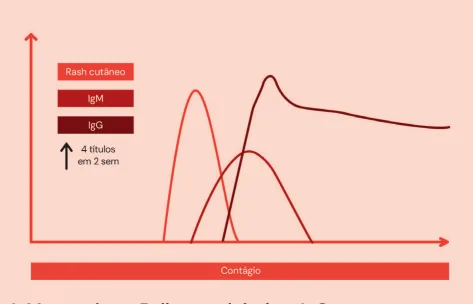
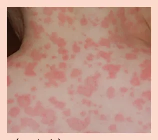
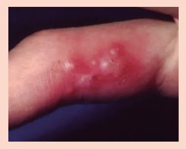
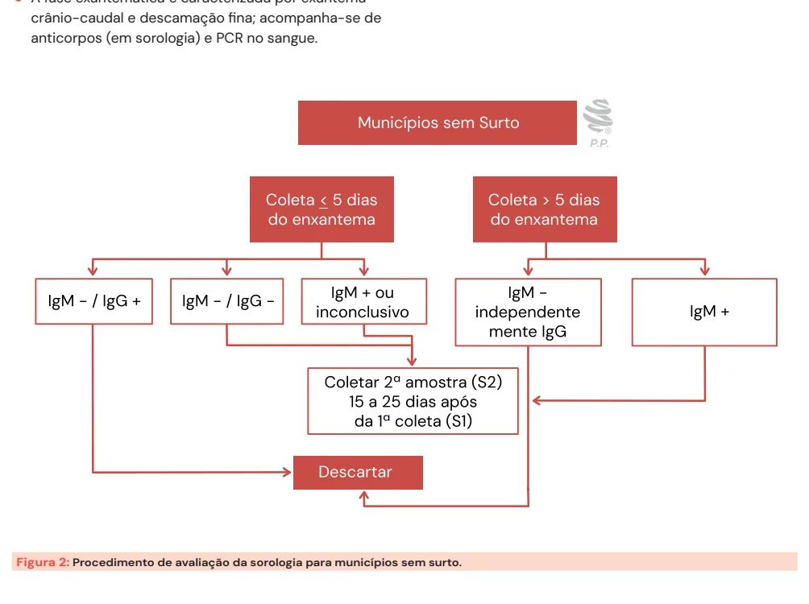
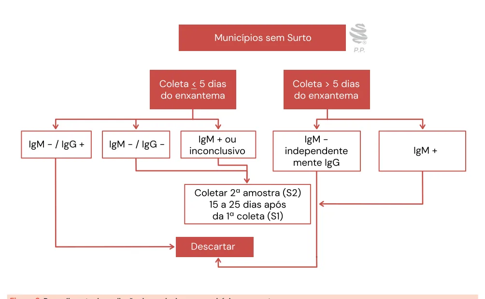
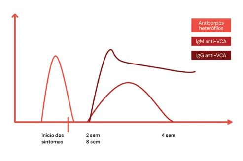

# Doenças Virais e Pandêmicas

<!-- page:1 -->

Doenças Virais Pândemicas (CM) SARAMPO Aerossol: de 6 dias antes até 4 dias após o rash → Incubação: 10-14 dias Manchas de Koplic (esbranquiçadas, em mucosa jugal)

Paciente tá mal!!! IVAS + conjuntivite Notificar caso suspeito em até 24hs Febre + exantema máculo-papular com:

- Tosse

- Coriza

- Conjuntivite

Viremia → 2-4 dias → Fase exantemática Anticorpos (sorologia) PCR no sangue IgM negativo < 5 dias: exclui só se IgG+ IgM negativo > 5 dias: exclui Demais casos, confirmar com segunda sorologia Complicações

- Mais comum: OMA

- Maior mortalidade: pneumonia Pode ser só viral (suporte) ou bacteriana

- Mais temida: encefalite Forma tardia: PESS – anos após Panencefalite esclerosante subaguda Vacina vírus vivo atenuado

72hs

- Gestante

- CD4 < 350 (<200)

- Imunossuprimidos

- Nessas populações, fazer Ig em até 6 dias

Tratamento suporte Ribavirina e vit.A se criança não vacinada

## MONONUCLEOSE

- Subaguda, > 1 semana

- Asteniiiiiaa

- Febre baixa, diária

- Linfadenopatia generalizada

- Hepatoesplenomegalia dolorosa

- Faringite com exudato algodonoso

Não dar amoxicilina!!! Streptococo

- Quadro agudo, 2-3 dias

- Febre alta > 38,5ºC

- Leucocitose, desvio à esquerda

- Sem hepatoespleno, sem linfonodos generalizados

Definitivo

- Sorologia Anti-VCA (monotest)

- Anticorpos heterófilos

- Achado sugestivo: linfócitos atípicos ruptura esplênica

Complicações: orquite e parotidite; miocardite / É um vírus sabidamente oncogênico

## VARICELA-ZOSTER

Incubação: 10-21 dias Contato aerossol paciente com varicela ou zoster disseminado → Varicela

- Suporte / vala ou aciclovir em até 24hs do rash

Vacina vírus vivo atenuado 120hs

---

<!-- page:2 -->

- Gestante

- CD4 < 350 (<200)

- Imunossuprimidos

- Ig também em até 96hs disseminado → Varicela → Latência em gânglios sensitivos da raiz dorsal → Imunossupressão Idade avançada → Zoster e r

Contato aerossol paciente com varicela ou zoster Contato aerossol paciente com varicela ou zoster Neuralgia pós-herpética: persistência da dor C

> 3 meses

- Inflamação hemorrágica com fibrose e hiperexcitabilidade

- Corticóide não tem benefício!

- Gabapentina

- Pregabalina

- Tricíclicos

- Duais, carbamazepina...

MPOX Incubação: 5 – 21 dias

- Contato com pele com lesões, pele a pele, sêmen, saliva → Precaução de contato e gotículas.

- Aerossol, superfícies contaminadas, gotículas respiratórias.

1ª viremia : replicação linfonodos regionais → 2ª viremia : replicação no SRE → Manifestações clínicas Erupções cutâneas – polimorfismo no corpo, mas uniformes na região;

Linfadenopatia; Proctite.

- Tempo de doença: 21-28 dias;

- Dx: PCR em raspado das lesões

- Isolamento enquanto tiver lesões não re-epitelizadas;

- Tecovirimat;

- Vacina é profilaxia pré e pós exposição;

- Se vacina como profilaxia pós-exposição - 4 a 14 dias após exposição .

## SARAMPO T

- Exantema morbiliforme (ou seja, é permeado C por pele sã) l

Outras doenças que apresentam tal exantema 7

- Rubéola;

- Mononucleose → após uso de amoxicilina;

- Dengue;

- Eritema súbito;

- Sífilis. HERPES SIMPLES E COVID eritematosa. Tratamento supressivo se > 6 recorrências / ano

Herpes simples : vesículas agrupadas de base COVID

- TC não indicada se ausência de sinais de SRAG

- D-dímero é fator de pior prognóstico mas não altera indicação de anticoagulação

- Não se faz antibiótico empírico dosar procalcitonina

- Corticoterapia se uso de oxigênio

- Diagnóstico: PCR : momento incerto e pode persistir positivo / Antígeno: indicação precoce, pode ser falso negativo

- Antivirais sempre até D5

## TRANSMISSÃO

Aerossol Cerca de 6 dias antes até 4 dias após o rash; viajam longas distâncias; permanecem em suspensão por até 72 horas.

OBS.: Outras doenças com transmissão por aerossol: sarampo, tuberculose , varicela, zoster disseminado ou no paciente imunocomprometido.

---

<!-- page:3 -->

- Apresenta alta infectividade → erradicação: cobertura vacinal > 90% é um dos maiores R0s (potencial de infectividade)

R0 - Influenza: 1/7; R0 - Sarampo: 1/13 / R0 COVID: 1/ 2,5;

- Deve-se notificar já na suspeita clínica, em até

24 horas, se:

## CASO SUSPEITO

Febre + exantema maculo-papular com 1 de: tosse; coriza; conjuntivite bilateral com fotofobia. CURSO CLÍNICO Figura 1: Gráfico representativo do fator de contágio.

- Período de incubação entre 10 a 14 dias.

- Acometimento de mucosas; AVALIAÇÃO DA SOROLOGIA Manchas de Koplik – patognomônicas;

- Sorologia coletada com menos de 5 dias de exantema: Em geral, ocorre o surgimento na 1° viremia. | Pode ser que apenas não tenha dado tempo de ter Após, surgimento de sintomas clássicos de IVAS tido resposta imune. Avaliar a ascensão do título.

intensas, com muito mal estar, conjuntivite bilateral | Paciente somente IgG+ : contato antigo - exclui com intensa fotofobia doença atual:

| Se teve tempo de fazer IgG neste episódio, o OBS.: O curso clínico do sarampo é marcado por IgM já deveria ser positivo. Logo, se tem IgG e uma intensa depleção linfocitária. Sendo assim, não tem IgM, é porque este IgG veio de uma há chances para desenvolvimento de outros infecção prévia.

quadros concomitantes.

- Sorologia coletada com mais de 5 dias do exantema: IgM negativo: descarta;

- Paciente não “tá bem, não” (febre, conjuntivite bilateral | 5 dias é tempo suficiente, se não fez IgM é com fotofobia intensa, tosse seca, coriza) porque não é sarampo. Mas, dada a baixa especificidade do IgM em doenças respiratórias

DIAGNÓSTICO de forma geral, se ele vem positivo, ele precisa

- Swab da orofaringe, para cultura e PCR de urina. ser confirmado com ascensão do título.

- A fase exantemática é caracterizada por exantema crânio-caudal e descamação fina; acompanha-se de anticorpos (em sorologia) e PCR no sangue.

Figura 2: Procedimento de avaliação da sorologia para municípios sem surto.

---

<!-- page:4 -->

COMPLICAÇÕES E TRATAMENTO linfadenopatia generalizada; hepatoesplenomegalia

- Mais comum? Otite média aguda (OMA); dolorosa - por replicação viral no sistema retículo- Principais agentes: Pneumococo, endotelial-; faringite com exsudato algodonoso – Tratamento: clavulin (amoxicilinaclavulanato), axetilcefuroxima. DOENÇAS MONO-LIKE

Haemophilus, Moraxella; discretamente acinzentado.

- O que mais mata? Pneumonia

- Citomegalovirose; Pode ser apenas viral (seguir com tratamento

- Hepatites virais;

de suporte) ou por sobreposição bacteriana

- HIV;

(geralmente, por pneumococo, MSSA).

- Toxoplasmose;

- A mais temida? Encefalite;

- Sarampo, caxumba, rubéola; Forma tardia: PESS – surgimento anos após;

- Arboviroses;

PESS = Panencefalite esclerosante subaguda;

- Sífilis.

curso inexorável; manifesta-se 10 – 15 anos Tratamento: sintomático; após a infecção. Não administrar amoxicilina → o paciente pode evoluir Tratamento: medidas de suporte. com surgimento de exantema morbiliforme; É uma

- 1. Ribavirina e vitamina A, se a criança estiver em vasculite!!! E não alergia! estado grave e não foi vacinada.

- Diferenciação com quadro de faringite estreptocócica;

Vacinação | Quadro agudo, em geral de 2 – 3 dias;

- É uma vacina de vírus vivo atenuado; esquema de | Febre alta - > 38,5 °C; < 30 anos: 2 doses; entre 30 – 59 anos: 1 dose; > 60 desvio à esquerda;

vacinação em adultos: | Laboratorialmente, há leucocitose, com anos: não se vacina. | Não cursa com hepatoesplenomegalia, sem Recomendações linfonodos generalizados.

- Bloqueio – até 72 horas;

- Contraindicação: nesses casos, deve-se manejar com DIAGNÓSTICO E COMPLICAÇÕES uso de imunoglobulina em até 6 dias;

- Definitivo: sorologia (anti-VCA) ou por anticorpos Idade ≤ 6 meses; heterófilos (surgem antes do início dos sintomas até Gestantes; 48h após); Imunocomprometidos (CD4 < 350 céls). Achado sugestivo: linfócitos atípicos;

Outros achados possíveis: trombocitopenia discreta;

## COQUELUCHE

hepatite “transinfecciosa” (< 300 UI); linfocitose relativa (> 35%).

- “Tosse comprida”; quadro respiratório, comum em lactentes jovens (<6 meses) COMPLICAÇÕES

- Etiologia: Bordetella pertussis

- Mais comum: orquite e parotidite;

- Quadro clínico: dividido em 3 fases

- Mais graves: miocardite, ruptura esplênica; Catarral = síndrome gripal, 1-2 semanas

- Desencadeia LES, AR. Paroxística = tosse de início súbito, incontrolável

- Lembrar que é um vírus sabidamente oncogênico;

e sem pausa, levando a apneia, cianose, vômitos e | Linfoma de sistema nervoso central em som específico a inspiração (guincho), 2-6 semanas AIDS (100%);

| Convalescente = tosse mais branda, 2-6 semanas | Carcinoma nasofaringe (100%);

- Diagnóstico: clínico. | Linfoma de Burkitt (40%); HMG: linfocitose // RX tórax: coração felpudo | Linfoma de Hodgkin (50%).

- Tratamento: Azitromicina ou claritromicina, idealmente nas primeiras 3 semanas do início da tosse

- Prevenção: vacinação com tríplice bacteriana (DTP) ou

DTPa na gestante

## MONONUCLEOSE INFECCIOSA

- Etiologia: EBV (Epstein-Barr virus);

- Período de incubação: 7-50 dias;

- Transmissão: gotículas.

- É uma doença de adolescente;

## MANIFESTAÇÕES CLÍNICAS

Evolução subaguda, com duração > 1 semana; Figura 3: Gráfico representativo da sorologia/tempo. Sinais e sintomas: astenia; mal estar; febre baixa diária;

---

<!-- page:5 -->

## VARICELA-ZÓSTER

| Neuralgia pós-herpética: cursa com inflamação hemorrágica com fibrose e hiperexcitabilidade; São a mesma doença, se manifestando em 2 corticóide não apresenta benefício; esquemas momentos distintos; terapêuticos: gabapentina; pregabalina; tricíclicos;

duais, carbamazepina. INFÂNCIA

- Contato via aerossol com outro indivíduo com varicela ou com zóster disseminado;

- Apresenta período de incubação entre 10 – 14 dias;

- Vesículas disseminadas, altamente pruriginosas e com polimorfismo regional;

- A abertura do quadro é abrupta (sem pródromo);

- Entre as fases, o vírus permanece no organismo em estado de latência, nos gânglios sensitivos da raiz dorsal.

## FASE ADULTA

- Geralmente, o quadro é desencadeado mediante imunossupressão ou idade avançada;

- Cursa com muita dor em período de pródromo, intensa e neuropática, em choque, fisgada, com alodinia (por ganglionite).

OBS.: A dor precede o surgimento das lesões de pele. Acometimento

- Localizado: até 2 dermátomos contíguos.

- Disseminado: dermátomos não contíguos ou se ultrapassar linha média.

## DIAGNÓSTICO: CLÍNICO

- Observa-se localização, aparência das lesões e clínica de ganglionite;

- Exames laboratoriais: cultura: positiva em 14 – 46% dos casos; PCR: positivo em 46 – 92% dos casos; IgM:

somente alterado em primoinfecção. TRATAMENTO

- Varicela: suporte (atenção para infecção bacteriana secundária em lesões). Adultos podem ser tratados com aciclovir / valaciclovir por frequentemente terem quadros mais floridos. Vacina – também vírus vivo atenuado Esquema: administrar 2 doses < 30 anos; Bloqueio: até 120 horas; Imunoglobulina, se grávida, imunocomprometido e indivíduos < 9 meses de idade: em até

administrar 1 dose > 30 - 59 anos; 96 horas.

- Zóster: Localizado: aciclovir 800mg VO de 8/8h por 7 a 10 dias; Se acometer face, manifestação disseminada ou em paciente imunocomprometido: aciclovir 10 mg/ kg EV de 8/8 horas por 14 dias. Síndrome de Ramsay-Hunt: acometimento auricular por zóster. Ocorre reativação no gânglio geniculado – acometimento de facial + eritema vesciular em canal auditivo. Mais severa que a de Bell (HSV). Tratamento com valaciclovir + prednisona 1mg/kg por 10 dias. duais, carbamazepina. Vacina de zóster: vacina recombinante;

administrada em 2 doses, com 2 meses de intervalo; recomendada para: imunocomprometidos

> 18 anos; indivíduos > 50 anos. Não inclusa (ainda) no PNI - perspectiva de entrar;

Não existe de forma concisa em literatura tempo bem determinado para aguardar entre o episódio de zóster e a aplicação da vacina; em geral, recomenda-se que haja um intervalo de 6 meses.

## HERPES SIMPLES

MANIFESTAÇÃO Presença de vesículas agrupadas, de base eritematosa, com pródromo de queimação local;

## SÍTIOS DE REATIVAÇÃO

Labial; Genital. DIAGNÓSTICO:

- Clínico;

- Teste Tzanck: não é específico; avalia efeito citopático viral – “Olhos de coruja” → distensão citoplasmática.

## TRATAMENTO

- É subdivido mediante o paciente acometido e a forma de acometimento;

- Forma esporádica: até 6 episódios/ano - tratamento indicado apenas do episódio: aciclovir 400mg 8/8h

(200mg 5x/dia) ou valaciclovir 1g 12/12h por 7 a 10 dias;

- Forma recorrente: mais de 6 episódios/ano - indicado tratamento supressivo: aciclovir 400mg 12/12h ou valaciclovir 500mg/dia (0,5 a 1g de 12/12h em imunocomprometidos) por 6 a 12 meses.

## REFERÊNCIAS

Figuras do CofExpress. Wikipedia UpToDate a
